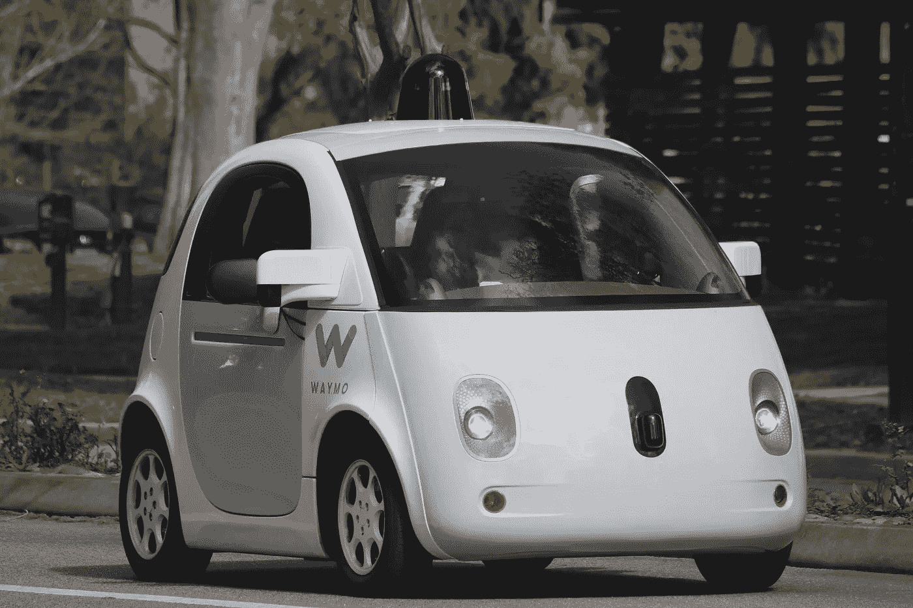
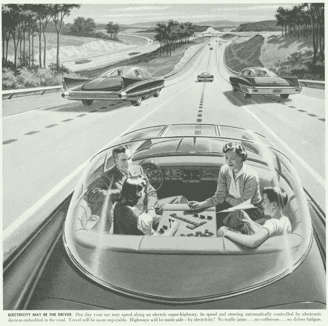

# 如果一个人在(优步/特斯拉/Waymo)自动驾驶汽车中丧生，谁该负责？

> 原文：<https://medium.com/hackernoon/whos-to-blame-if-one-gets-killed-in-an-uber-tesla-waymo-self-driving-car-5fe6457b7015>

[https://upload.wikimedia.org/wikipedia/commons/c/cf/Waymo_self-driving_car_front_view.gk.jpg](https://upload.wikimedia.org/wikipedia/commons/c/cf/Waymo_self-driving_car_front_view.gk.jpg)

最近一集 [Invisibilia(一个奇妙的播客，我鼓励你订阅)](http://www.npr.org/programs/invisibilia)，围绕一个四口之家(一个母亲、父亲和两个女孩)和一个卡车司机之间的汽车/卡车事故展开。突如其来的暴雨，失去控制，一个人被杀(我不会破坏故事)，这导致了一个无形的团队深深陷入情绪之中。在听这一集的时候，我想起了在一堂 MBA 伦理课上，我们谈论的话题是“[电车问题](https://www.theatlantic.com/technology/archive/2015/10/trolley-problem-history-psychology-morality-driverless-cars/409732/)”。问题是，*如果你是一辆刹车失灵的电车的司机，你会选择直接撞上五个毫无防备的工人中的谁，或者你可以调转电车撞上一个毫无防备的工人？*你必须*主动*决定救人一命的两难境地是一个道德灰色地带，没有对错答案。当我们在课堂上进行对话时，我并没有深入思考这个问题；这是一次抽象的谈话，关于一个我真的不认为我会发现自己身处其中的情况。对我来说，这与其说是一次真正的锻炼，不如说是一次智力锻炼。

但出于某种原因，在去接我儿子的路上，听了那集《隐形人》后，这个问题对我来说变得真实了。因为我们正在进入一个世界，虽然我们可能不必做出那些电车问题的决定，但我们的技术可能…

## 自动驾驶汽车技术

自第一辆汽车问世以来，无人驾驶汽车的梦想就一直伴随着我们。在 1939 年的世界博览会上，[通用汽车推出了无人驾驶汽车的概念。与我们在加州和奥斯汀的街道上看到的车型不同，这些车型使用了更为原始的技术。](http://amzn.to/2sxmonW)

*1956 advertisement by America’s Independent Electric Light And Power Companies*

和大多数人一样，我认为我们距离机器学习技术足够强大以实现完全自主还有一段路要走，即使专家们认为[无人驾驶电动汽车将是大石油](/@sethmiller_59231/this-is-how-big-oil-will-die-38b843bd4fe0)的死亡。但如果这一切比我们想象的要近得多呢？如果我完全错了，我们将在 2018 年完全自治呢？随着通用汽车、Waymo、优步和特斯拉等公司的工作[，这可能在未来并不遥远。那么，在生存能力- >可行性- >合意性(来自](http://(https://mobile.nytimes.com/2017/06/04/business/general-motors-self-driving-cars-mary-barra.html?))[创意信心](http://amzn.to/2r4do9w))的创新道路上，我们该何去何从呢

*   当我们在城市中看到无人驾驶汽车时(我在奥斯汀见过一些)，无人驾驶汽车技术已经接近**可行性**(技术性)
*   对于某些用例，我们正在接近**可行性**，尤其是基于[物流的实例](https://www.wired.com/2016/10/ubers-self-driving-truck-makes-first-delivery-50000-beers/)。
*   我们失败的地方在于无法让这些技术变得**令人满意**，因为我们没有进行必要的大规模对话。与其争论**人工智能在未来会取代哪些工作**，我们应该花更多的时间来讨论今天部署的人工智能的伦理和**决策模型**。说另一种方式；*我们这些将要坐在这些自动驾驶汽车里的人，是否足够信任这些公司，相信他们的技术会在我们移交控制权时为我们做出正确的选择？*

## 自动驾驶汽车/机器人引发的伦理问题

对于像优步这样的公司来说，开发自动驾驶汽车是核心，坦率地说，是生死存亡。支撑优步的商业模式现在依赖于优步取代方向盘后面的司机。正如[在](https://hackernoon.com/why-companies-like-lyft-uber-postmates-instacart-etc-will-never-be-profitable-ecdfde647175)一文中所说，该公司必须转向无人驾驶汽车，以降低经营成本。这是一个关键的商业决策。我们[是否完全相信](https://www.nytimes.com/2017/05/30/technology/uber-anthony-levandowski.html?rref=collection%2Fsectioncollection%2Ftechnology&action=click&contentCollection=technology&region=stream&module=stream_unit&version=latest&contentPlacement=24&pgtype=sectionfront)尽管优步存在道德和文化问题，但当它面临“手推车问题”时，它会制造出以客户为中心的决策的自动驾驶汽车？因为你知道它会发生，不是吗？当该公司在道路上部署数百万辆自动驾驶汽车时，你知道会发生事故，并需要做出道德决定。没有一个技术系统是 100%完美的，出错的可能性多了，就会出现错误。

对于像谷歌和通用汽车这样的公司来说，当涉及到可能关系到生死的非二元决策时，我们会放心让他们的机器将我们的最佳利益放在心上吗？一辆 Waymo 汽车能够决定是突然转向撞上一辆载有 4 只可爱小狗的汽车，还是冒着你家人的生命危险？这种决策模型是如何被编程到自动驾驶汽车中的？我们知道嵌入在我们机器中的默认值[并不总是像我们想象的那样清晰和公正](https://www.linkedin.com/pulse/why-you-shouldnt-just-accept-tech-defaults-seyi-fabode)。

这些问题不仅仅涉及自动驾驶汽车；Robina(下图)是一个机器人，它应该在家里帮助老年居民。Robina 拥有所需的机器智能，可以从其他*robina 的性能和行为中学习，从集中式云数据库中检索实时信息。但是如果 Robina 出了什么问题，她伤害/致残了，就像她对待我的父母一样，谁该负责呢？Robina、Humanoid 和 ASIMO(所有机器人都旨在为老年家庭护理居民服务)中嵌入的默认心理模型是什么，以确保它们为我们做出最佳决策？*

## 技术总是超越监管

技术进步总是战胜政策和法规。**永远**。因此，嵌入这些技术的默认值将不得不来自程序员和技术专家的道德准则，他们将把决策软件嵌入这些[车辆。](https://www.technologyreview.com/s/539731/how-to-help-self-driving-cars-make-ethical-decisions/)我们正处于风口浪尖，在某些情况下，我们正经历着[科技进步，这些进步在短短几年前看起来就像魔法一样](https://futurism.com/new-instantly-rechargeable-battery-deals-a-fatal-blow-to-fossil-fuels/)，这些科技将极大地改善我们的生活。作为知情的消费者，我们现在必须向我们领先的科技公司询问和要求这些问题的答案。我们的生活可能就靠它了。

我将引用这段话留给你

> 如果你走错了方向，速度就无关紧要了。甘地

我们进展太快了吗？

*请分享、点赞、推文。* [*使用我们的 WYOP 工具(它让你进入写作流程)和*](http://harperjacobs.com/writeyourownpost/) s *ign 撰写你自己的博客文章，点击* [*这里*](http://www.getrevue.co/profile/seyifabo?utm_campaign=Issue&utm_content=forwarded&utm_medium=email&utm_source=Seyi+Fabode) *，你会喜欢的。*

> 黑客中午是黑客如何开始他们的下午。我们是这个家庭的一员。我们现在[接受投稿](http://bit.ly/hackernoonsubmission)并乐意[讨论广告&赞助](mailto:partners@amipublications.com)机会。
> 
> 如果你喜欢这个故事，我们推荐你阅读我们的[最新科技故事](http://bit.ly/hackernoonlatestt)和[趋势科技故事](https://hackernoon.com/trending)。直到下一次，不要把世界的现实想当然！

