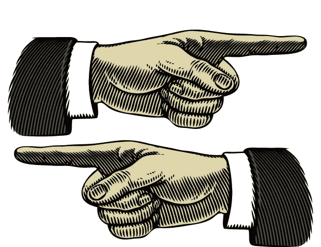
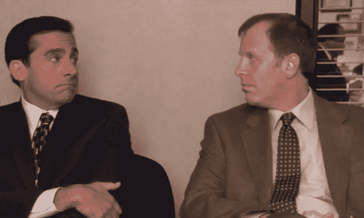

# 该怪谁呢？(0.1 版)

> 原文：<https://medium.com/hackernoon/whos-to-blame-v0-1-456403c2bc52>

几周前，我拿下了制作。我运行了一个旨在融合我们的沙盒环境的脚本，却意外地融合了我们的生产环境。生产下降了，暂时停止了对所有顾客的服务。当时，我咨询的客户正在监控我们平台的生产流量，注意到了中断，然后联系我的团队说:“嘿，发生了什么事？”

我的心怦怦直跳，我变得紧张，我的伴侣站在我旁边大声说“你做了什么？!"我努力整理我的思绪，把作品集中回来，就这样，一切都结束了。自从我开始这个庞大的项目以来，我犯了一个我一直害怕的错误。

现在你最初的本能可能是说，“我不想让那个人加入我的团队。”你可能会认为我很粗心，我还年轻，我没有考虑我在做什么。这是人为错误的结果，也许最好的解决办法是将这个人(也就是我)从[未来](https://hackernoon.com/tagged/future)的情况中移除，或者给我灌输某种程度的恐惧来给我一个教训。如果你阅读了关于 [AWS S3 停机](https://aws.amazon.com/message/41926/)的报道，这些想法可能不会偏离你的想法太远。公开发布的消息称“一名授权的 S3 团队成员使用已建立的剧本执行了一项命令……不幸的是，该命令的一个输入不正确，并且移除了比预期更多的服务器。”尽管那次 S3 停电的影响比我的大得多，但错误的性质是相似的。事实上，当我听说 S3 的中断导致大部分互联网瘫痪了一天的大部分时间时，老实说，我认为那个人很可能被解雇了。

关于我的事故，我没有告诉你的是，在事故发生前的整整一周，我们工作了 60 多个小时，为我们的客户制作了一个紧急功能。我们被迫跳过传统的自动化流程，而是手动完成大部分工作。我们能一起废弃的最好的东西是一些 bash 和 python 脚本，我们甚至不能从我们自己的机器上运行，由于 AWS 安全组、SSL 证书问题和其他限制，我们不得不进入其他机器来完成它，我们稍后将修复这些限制，但目前没有时间。我们在一个严格的期限内将这个功能投入生产，我们已经到了生产线的尽头。现在你在想什么？当然，我本可以更好地处理这种紧张的情况，但有许多人可以提高这种品质。众所周知，压力会削弱我们的认知能力，模糊我们的决策能力，模糊我们的记忆。但是我刚才提出的关于我引发的事件的背景是否改变了这个故事，你可能从中得出什么结论？

## 事实是，指责很容易做到，而且令人满意。

我在系统可靠性领域工作，事故时有发生。当一个事件发生在软件中时，特别是在复杂的团队和系统中，要找出哪里出了问题是困难的，也是势不可挡的。但是问“谁最后接触了代码”、“什么时候某个东西最后被部署到产品中”或者“你按了什么按钮”总是很容易的。多亏了版本控制和用户跟踪，现在我们可以非常准确地找出这些问题的答案，比我们诊断真正复杂的问题还要快。所以我们这样做:我们找到一个名字，我们指出一个手指，我们说这是别人的责任。它免除了我们作为个体的内疚、尴尬或解决问题所需的工作。责怪别人是一种**自然的**反应，帮助我们避免我们不想承担责任的情况。但是这对我们的组织和团队有什么影响呢？

## 人为错误永远不会是唯一的原因。

人为错误只是我们认为个人应该做但没有做的事情的一个标签。当我们将一个事件分解为应该发生和没有发生的事情时，我们经常会忽略一些细节，这些细节可以帮助我们对这些事件进行推理。大卫·伍兹(David Woods)在他的书《人类错误的背后》(Behind Human Error)中，将研究导致个人做出决策的环境和情况的想法定义为寻找第二个故事。不赘述太多细节，以下价值来自寻找第二个故事:

*   说人们应该做什么并不能回答为什么他们当时做这些有意义的问题。因此，“责备和羞耻”文化并没有给我们留下比事件发生前更多的信息。
*   人为错误被视为组织内部深层漏洞的影响，确定这些漏洞让我们为明天做好更充分的准备。

## 当我们停止责备工程师时，我们改进了我们的技术。

Esty 是迄今为止最好的例子。值得注意的是，Etsy 是创建公正、无可指责的文化的最佳示范，它为支持犯错误的工程师铺平了道路，以便他们能够支持组织的其他部分。他们的目标是更深入地挖掘事件，以了解导致这些事件的情景环境，或者是什么样的情景导致工程师做了他们认为在当时合适的事情。他们把错误视为学习的源泉。

> 有趣的事情发生了，当工程师犯了错误，并在给出相关细节时感到安全:他们不仅愿意承担责任，还热衷于帮助公司其他人避免未来犯同样的错误。人类会犯错。允许它，鼓励它，拥抱它。(2)

## 人类会犯错。允许它，鼓励它，拥抱它。

自动化不会完全拯救你(虽然它可以帮助避免重大事故)。解除个人职务也不会。这些是对大事故的常见反应。但是有了自动化，人们可以在错误的时间按下错误的按钮。如果你把一些人从团队中移除，很可能其他人会犯同样或其他的错误。这将会发生，当它发生的时候你想在那里支持它，因为团队将**从中学习和成长**。

现在，在始终不小心地点击按钮和在运行脚本或意外收敛到生产环境时小心谨慎之间，有一条微妙的界线要走。我不是在为我停止生产时所做的事情辩护，我应该更加小心，但是自动化会帮助我们。有一条界限，当它被划定时，整个组织都应该理解。

最后，只有当我们意识到失败的根源和我们对失败的反应时，我们才能理解失败。

## **v 0.2 有什么新内容？**

当我有更多的时间，我会发表一篇关于人们可以用来促进“公正”文化的方法和实践的文章。我们都知道说起来容易做起来难。

1.  [https://en . Wikipedia . org/wiki/Effects _ of _ stress _ on _ memory # cite _ note-Nature-1](https://en.wikipedia.org/wiki/Effects_of_stress_on_memory#cite_note-Nature-1)
2.  [https://codeascraft.com/2012/05/22/blameless-postmortems/](https://codeascraft.com/2012/05/22/blameless-postmortems/)