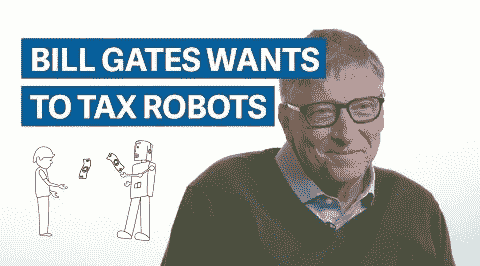

# 为什么机器人税行不通！

> 原文：<https://medium.com/hackernoon/why-a-robot-tax-wont-work-be74ce8914ce>

以及为什么我们注定要失败

比尔·盖茨是一位技术亿万富翁，后来成为慈善家，有着站在小人物一边的良好记录。他最近提出了一项 T2 机器人税，作为 T4 技术(也就是自动化)解决就业问题的潜在方案。事实上，我喜欢对机器人或人工智能征税的想法，但是这个想法似乎没有经过深思熟虑。

下面是一个正在建设中的机器人税无法实施的原因列表:

*   案例研究机器人律师:[硬币](https://www.bloomberg.com/news/articles/2017-02-28/jpmorgan-marshals-an-army-of-developers-to-automate-high-finance)可以在几秒钟内完成数千名律师的工作(取决于计算能力)。我们如何量化硬币对那些多余的法律实习生和律师的负外部性？我们如何对一个生产率比其可怜的人类竞争对手高 100 倍的人工智能或机器人征税？你可能会说*基于一个非增强人完成同样任务所需的同等时间/努力！对于那些要计算工作时间的政府雇员来说，这是唯一的好消息。).*
*   德国税法中有一个漏洞(针对人工智能而非人类，稍后会详细说明)规定收入低于 450 欧元的个人可以免缴所得税！如果……(你猜对了！)公司决定向守法纳税的机器人员工支付最高 450 欧元(或一个国家当地的等值金额)？
*   我们已经通过量化人工智能或机器人完成的工作来解决这个问题，并随后对其进行估价。这里还有一个更大的问题。在处理人工智能时，什么才算个人，而人工智能肯定是相互关联和分布的？全自动化工厂算不算一个大 X 制造机器人？
*   假设我们确实设法在单个机器人/人工智能周围画了一条线。在他们开始算作真正的社会成员之前，他们需要被赋予某种法律地位，迫使他们纳税(或暂时成为他们的所有者)。除了他们的义务之外，他们还有什么权利吗？万一发生涉及机器人的事故，谁来承担责任？所有者(很可能是一家公司)是否免受机器人的惩罚？
*   [发展中]

这个清单还在继续。另一种选择，公司纳税的旧制度，看起来也不怎么样！如果事情不发生巨大的变化，我们将会有一大堆价值万亿美元的大公司在小小的避税天堂里，依靠大量超高效的机器人奴隶来运营他们超高效的业务。

解决方案:**把人工智能当成石油**，一种自然资源。将其国有化，与所有人分享利益。虽然我不相信这一切会和平地发生*！*

*吴恩达正确地认为，人工智能就像电一样，它将/应该赋予每个人权力并使每个人受益。问题是，大多数人没有办法利用人工智能来获得它的好处。相反，人工智能将使我们大多数人变得多余和无用。这已经在我们周围发生了，只是规模较小。智能手机比几十年前的大型机要快上无数倍，也更便宜。诚然，我们口袋里都有微型超级计算机，但这些超级计算机只让我们中的极少数人变得超级富有。只有那些挖掘到这个**超级**机会的人！我们其余的人得到面包屑… *好的，谷歌贪睡闹钟*！*

# ***故事并未就此结束，使计算能力“平民化”的同一股力量也使它商品化了。我们离脑力像肌肉力量一样成为商品只有几步之遥。***

*今天的普通出租车司机(与 20 年前相比)可以通过优步等平台更容易、更直接地接触到客户，但解放了出租车司机的革命也扰乱了出租车行业，使司机面临更低工资的竞争。这个令人沮丧的故事并没有就此结束，让计算能力“民主化”的同一股力量也让它商品化了。我们离脑力像肌肉力量一样成为商品只有几步之遥。也许我们并不打算保持主导生命形式那么久。智人的故事对于比我们大得多的东西来说可能只是一个卑微的开始。*

******

> *[黑客中午](http://bit.ly/Hackernoon)是黑客如何开始他们的下午。我们是 T21 家庭的一员。我们现在[接受投稿](http://bit.ly/hackernoonsubmission)并乐意[讨论广告&赞助](mailto:partners@amipublications.com)机会。*
> 
> *如果你喜欢这个故事，我们推荐你阅读我们的[最新科技故事](http://bit.ly/hackernoonlatestt)和[趋势科技故事](https://hackernoon.com/trending)。直到下一次，不要把世界的现实想当然！*

**