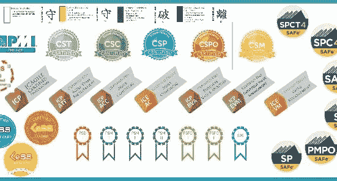

# 为什么要敏捷认证？

> 原文：<https://medium.com/hackernoon/why-agile-certification-a7b1895af294>

Plethora of Agile Certifications

培训师通过研讨会、会议等方式强行推销敏捷认证是可以理解的。

候选人追逐这个认证的东西是可以理解的，因为它给了他们成为敏捷之类的东西的快速入门通行证。

但是为什么公司会在候选人的简历中寻找敏捷认证呢？

> 作为一个企业，
> 
> 我需要经过认证的敏捷候选人，
> 
> 以便 ________。

作为一家招聘“认证”人员的公司，你对上述要求有什么看法？换句话说，作为决策者或领导者，您将如何填补上述需求中的空白，使其为您的企业增加商业价值？

迄今为止，这仍然是一个令人困惑的要求。我这类人心中挥之不去的一些问题是:

*   难道公司没有一个有经验的人来雇佣下一个合适的人才吗？
*   公司是否相信认证等于精通？
*   公司是否知道获得他们所要求的敏捷认证的过程？

如果你在你公司的决策层要求你要雇佣的候选人具备敏捷认证要求，我很想听听你的想法。甚至像“嗯，我们盲目地复制了我们的竞争对手所做的”这样坦率的坦白也是可以接受的:)

期待听到你的想法..