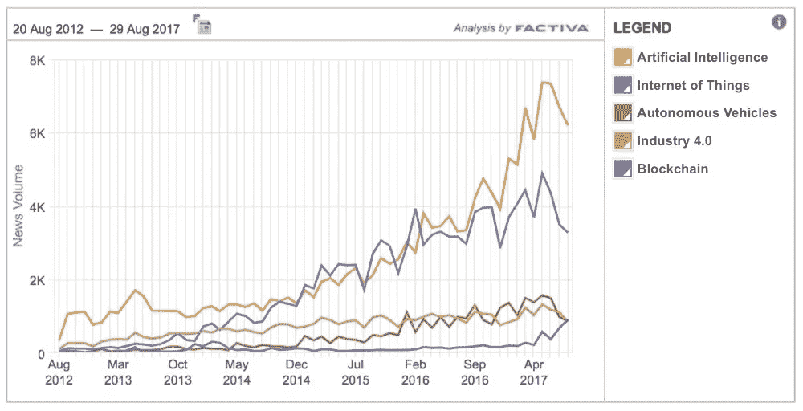
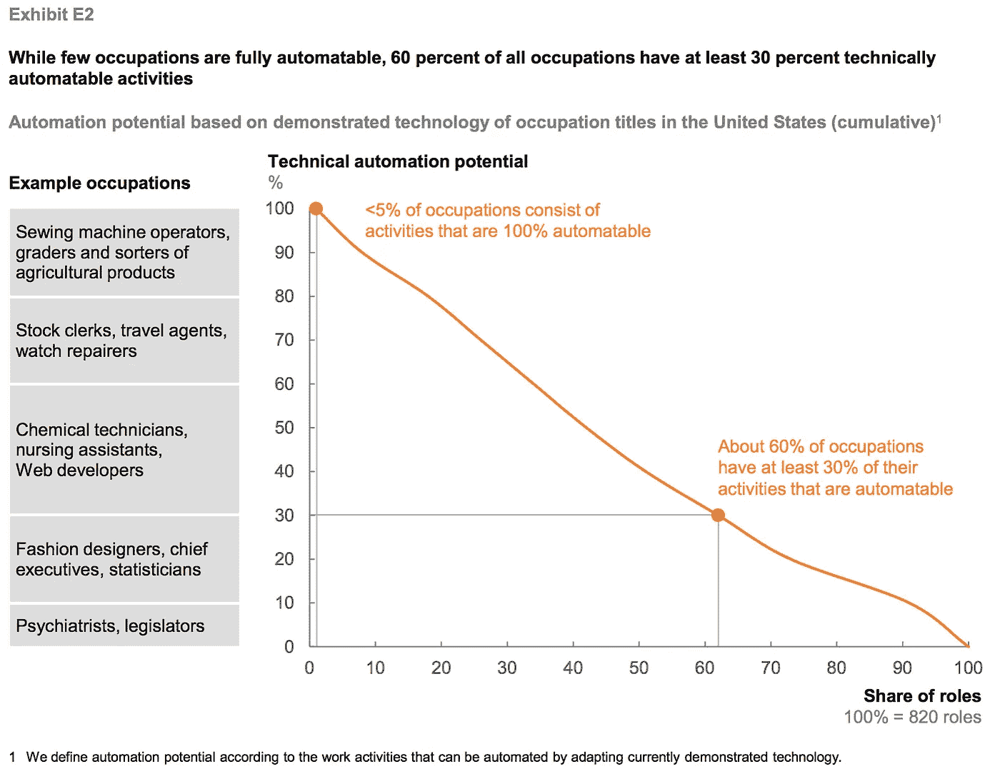
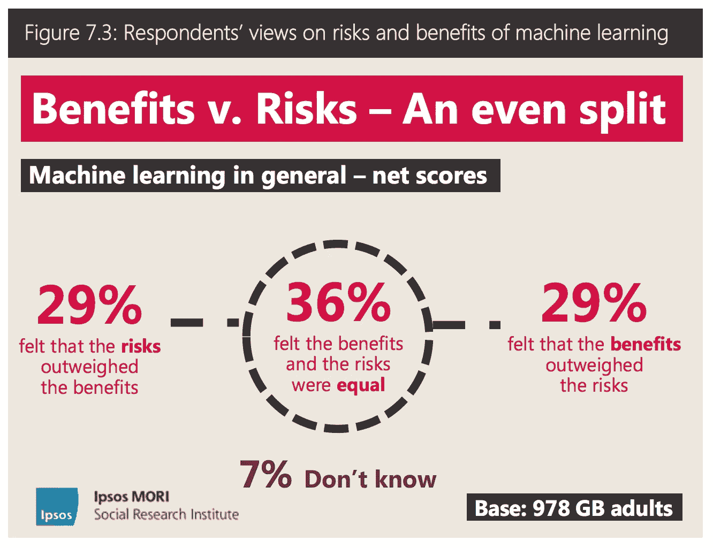
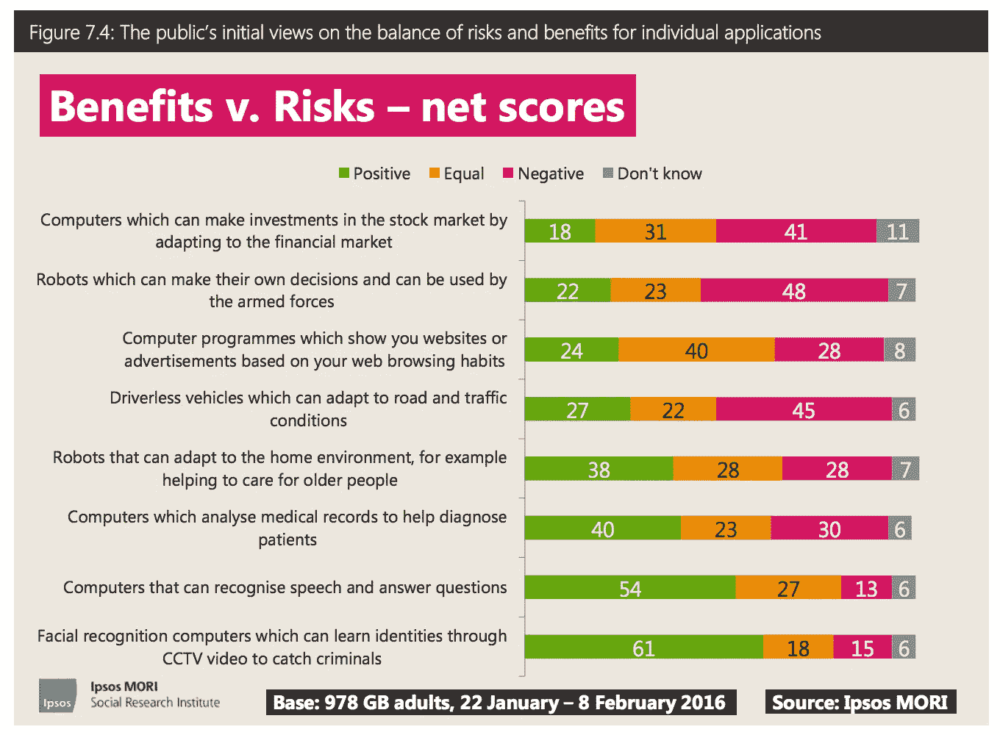

# 为什么 AI 现在出现在晚餐的菜单上，甚至是和我的非科技朋友

> 原文：<https://medium.com/hackernoon/why-ai-is-now-on-the-menu-at-dinner-even-with-my-non-tech-friends-44c666348de4>

几周前，我请了一些朋友过来吃饭，事后我突然想起，我们花了很长时间谈论人工智能。作为一名专注于新兴技术的风险投资者，我已经习惯了我的工作日充满了关于技术趋势和进步的对话。然而，在过去的 12 个月里，我发现自己在办公室之外也有了更多这样的对话，而且它们几乎总是围绕着 [AI](https://hackernoon.com/tagged/ai) 展开。

看看在一系列一般新闻来源中提到的关键技术，你会发现人工智能比其他创新更能引起公众的兴趣。自 2016 年初人工智能超越物联网以来，人们对该话题的兴趣迅速增长，**的新闻量现在超过物联网 50%，超过其他关键技术 6 倍。**

Source: Factiva; Methodology: Searches for key terms in Factiva classified “Top News Sources” in English Language. ‘Artificial Intelligence’ search also includes OR’d terms ‘AI’ and ‘Machine Learning’, ‘Internet of Things’ includes ‘IoT’, ‘Autonomous Vehicles’ includes ‘Driverless Car’ and ‘Self Driving Car’, ‘Industry 4.0’ includes ‘3D Printing’ and ‘Advanced Manufacturing’, ‘Blockchain’ includes ‘Bitcoin’.

# 人工智能的哪些方面让它的同行黯然失色？

自动驾驶汽车和工业 4.0 等技术被视为定义明确，并对一系列明确的问题有明显的好处。然而，由于对其更广泛的意义和潜在影响的认识，艾在另一个层面上抓住了公众的想象力，包括积极和消极的影响。我认为这是由四个重要因素驱动的:

*   **流行文化:**人工智能、智能机器人和其他类似的概念多年来一直是科幻小说的一个重要主题，直到最近，对大多数人来说，这种描绘是他们接触的极限。在很大程度上，今天的人工智能进步看起来一点也不像 HAL 9000、天网或复制人。然而，诸如“人工智能是反乌托邦未来的原因”和“人工智能做其创造者没有预料到的事情”等概念仍然影响着人们的基线印象，影响着他们与现代人工智能形式的关系。在 [Mona Lalwani](https://medium.com/u/bcb6c25a23c7?source=post_page-----44c666348de4--------------------------------) 对人类学家和英特尔高级研究员 Genevieve Bell 、[的](https://twitter.com/feraldata)[采访中，Genevieve](https://www.engadget.com/2016/08/16/the-next-wave-of-ai-is-rooted-in-human-culture-and-history/) 分享了一个有趣的观点，即利用流行文化中的知识来改善现实世界中的人工智能。

> 我们经常忽视恐惧，却不承认它们是基于一点点事实。人类已经建立了很长时间的技术系统，它们经常会产生意想不到的后果…如果我们足够认真地对待这些恐惧，而不只是忽视它们，说“你看了太多终结者电影”，会发生什么？但实际上很认真地对待它们，并说，“这是我们正在实现的护栏；这一次，我们将采取不同的方式来解决这些问题，还有一些悬而未决的问题。”

*   虽然提到的所有技术都是公众辩论和讨论的主题，但很少有人像 AI 一样被描绘成耸人听闻的人物。无论是大众媒体经常将人工智能描述为对人类生存的威胁，还是高调人物的权威声音，如弗拉基米尔·普京[被引述说](https://www.theverge.com/2017/9/4/16251226/russia-ai-putin-rule-the-world)“无论谁成为(人工智能)的领导者，都将成为世界的统治者”[然后暗示](http://fortune.com/2017/09/04/elon-musk-ai-world-war-three/)人工智能军备竞赛可能会导致第三次世界大战，围绕人工智能的许多叙事都带有某种令人恐惧的信息。

*   虽然像马斯克这样见多识广、积极参与的个人的印象应该在正确的论坛上听取和讨论，但我同意谷歌人工智能研究员 Franç ois Chollet 最近在推特上发布的关于在主流中耸人听闻的叙事的负面影响的观点:

*   **人工智能作为一个黑盒:**在我的[上一篇文章《我们可以建立这些模型，但我们不知道它们是如何工作的》](https://machinelearnings.co/we-can-build-these-models-but-we-dont-know-how-they-work-ec1e2e295739)中，我写道黑盒感知是采用人工智能系统的一个障碍，这是由对[机器学习](https://hackernoon.com/tagged/machine-learning)系统如何工作的有限理解所驱动的。在这方面，这既有积极的影响，也有消极的影响。积极地说，这种复杂性推动了部分魅力，即计算机可以“思考”并执行超出其特定编程范围的行为，真正抓住了公众的想象力。更消极的是，缺乏理解会导致缺乏信任，这又会加剧之前讨论过的恐惧。
*   对日常生活的影响:人工智能争论的最重要的角度之一是随着更多的活动可以使用人工智能自动化，就业机会可能会减少。在 2017 年 1 月[的报告《工作的未来》(T3)中，麦肯锡估计，美国 60%的工作岗位将有至少 30%的活动基于当前技术实现自动化。一种思路认为，这些员工将有 30%的时间更好地完成其他任务，而同样符合逻辑的相反观点认为，这将减少 30%的劳动力需求，从而产生对日常生活产生重大负面影响的高度相关的担忧。最近，这里的辩论已经从假设转移到真实的例子，如广为报道的福国互惠人寿保险公司用 IBM 的沃森探索者 AI](http://www.mckinsey.com/global-themes/digital-disruption/harnessing-automation-for-a-future-that-works) 取代 34 名员工的案件，因此，这里可能即将发生影响的证据增加了。

McKinsey, January 2017

在英国皇家学会[的报告《公众对机器学习的看法》](http://@royalsociety)的一项有趣的[调查中，你可以看到，所讨论的因素的累积影响导致人们的意见分歧，**认为机器学习的风险大于、等于或小于其好处的人各占 30/35/30**。](https://royalsociety.org/~/media/policy/projects/machine-learning/publications/public-views-of-machine-learning-ipsos-mori.pdf)

Royal Society, April 2017

然而有趣的是，更深入地观察，你会发现不同的潜在用途之间有着显著的差异。虽然 61%的受访者对在闭路电视上使用计算机视觉捕捉罪犯的好处持积极态度(这种使用案例似乎没有太大的负面影响)，但 45%的受访者对无人驾驶汽车持消极态度，48%的受访者对自主军用机器人持消极态度，这两种情况下都存在潜在的安全问题以及失业的可能性。

Royal Society, April 2017

对于今天在人工智能领域和周围工作的人来说，挑战在于以积极的方式利用公众参与。我们需要帮助教育和改变那些犹豫不决的人，使他们能够更快地采用这项新技术，同时消除可能会减缓这一速度的神话和误解。然而，最重要的是，我们需要与公众合作，理解并减轻对潜在负面影响的真正担忧。虽然有些事情需要在政府和媒体中完成，但有些事情也可以在餐桌上完成。