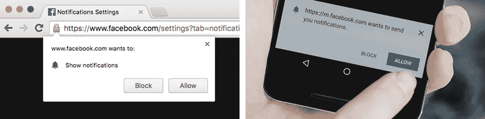
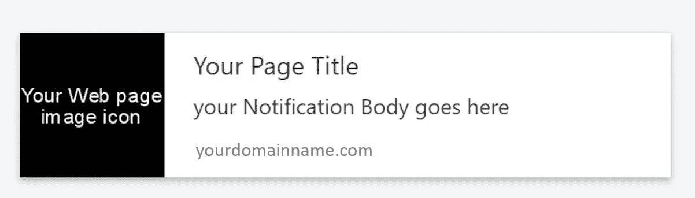

# 为什么以及如何实现 Web 通知 API。

> 原文：<https://medium.com/hackernoon/why-and-how-to-implement-web-notification-api-4eb795c5b05d>


Web Notification API in action on desktop browsers and Android devices.

现在大多数网站都使用网络通知 API，比如脸书，Twitter，Flowdock，Slack …你说吧。想过这是怎么发生的吗？想要实施它，但是困难和对学习曲线的恐惧正在驱使你离开？让我告诉你，它只有几行代码，即使初学者也能理解并开始编写。所以不要犹豫，马上和我一起实施吧。

首先，我们需要检查我们的浏览器是否支持通知。你可能想知道每个人都这样做，为什么我要检查它？这是网络，市场上有 n 种浏览器，每种平台都有。对于如此众多的浏览器，我们无法知道谁支持谁不支持。所以预防胜于治疗，因此，我建议我们在你的用户在不同的浏览器上发疯之前检查一下。此外，测试这些代码的最好方法是立即在浏览器控制台上输入所有内容。

```
if (‘Notification’ in window) {
 alert(“Congrats you are using a modern browser and it supports Notification”);
}
```

*注意:目前对于移动设备来说，只有 Android 支持这一功能，Android 也不是核心的 Web 通知 API，而是 WebKit 的混合版本。点击* [*我可以使用 Web 通知*](http://caniuse.com/#search=Web%20Notifications) *了解支持的平台和浏览器。*

接下来，我们需要请求允许在我们网站的浏览器上通知。还记得脸书手机和桌面上的弹出窗口吗？



Facebook Web Notification for Chrome for Desktop and Chrome for Android

是的，这正是这部分代码要做的。请记住，如果用户阻止来自您的域的通知，您将无法再次要求他/她允许通知访问，除非他/她非常需要您的通知，并且他/她决定转到设置并手动允许来自浏览器的通知。如果你想对你之前屏蔽的一些域名进行手动操作，这里有一些链接，供 [Chrome](https://support.google.com/chrome/answer/3220216?co=GENIE.Platform=Desktop&hl=en) 和 [Firefox](https://support.mozilla.org/en-US/kb/push-notifications-firefox) 使用。现在让我们看看代码

```
requestDesktopNotificationPermission(){
 if(Notification && Notification.permission === 'default') {
   Notification.requestPermission(function (permission) {
      if(!('permission' in Notification)) {
        Notification.permission = permission;
      }
   });
 }
}
```

这很好，但是我如何显示我的通知弹出窗口及其内容呢？这正是我们现在要看的。让我们看一些通知示例，并尝试了解它们的外观以及它们的组件。



Components of Notification API

我现在从代码开始，稍后解释每个部分

```
//1.check permission 
//we can request permission here again if its value is 'default' //using the previously discussed codedesktopNotification: function() {
    if (Notification.permission === “granted”) {
      var text = "your Notification Body goes here";
      this.sendDesktopNotification(text);
    }
  },//2\. send Notification
sendDesktopNotification: function(text) {
    let notification = new Notification(‘Your Page Title’, {
      icon: ‘https://your_domain.com/your_web_page_image_icon.png’,
      body: text,
      tag: ‘soManyNotification’
    });
    //’tag’ handles muti tab scenario i.e when multiple tabs are 
    // open then only one notification is sent//3\. handle notification events and set timeout 
notification.onclick = function() {
      parent.focus();
      window.focus(); //just in case, older browsers
      this.close();
    };
    setTimeout(notification.close.bind(notification), 5000);
  }
```

1.  **检查权限**
    在继续创建通知之前，我们需要检查我们是否拥有来自用户的通知访问权限。如果' notification . permission = = = " default " '那么我们可以使用前面讨论的代码请求权限。如果许可被阻止，我们不想继续，因为即使我们试图显示它，它也不会显示。
2.  **创建并发送通知** 现在我们需要使用通知构造函数来创建一个通知实例，它以图标、标题、正文和标签作为参数。上面的代码和代码上面的通知截图非常简单明了。
3.  **处理通知事件并设置超时** 该部分定义了当用户点击通知时会发生什么。在大多数情况下，我们希望将用户重定向到我们的网页或我们应用程序的某些特定页面。我们可以在这里通过给出动态网页 URL 或者简单地使用`parent.focus(;)`或`window.focus();`来定义(我们使用两者是因为一些浏览器与`parent.focus()`不兼容)。一旦用户点击通知，我们已经完成重定向到适当的页面，然后我们想关闭通知，所以我们使用`this.close();`我们也可以控制多长时间这个通知出现在用户面前。这可以通过使用`setTimeout()`来完成。它还在一个`[setTimeout()](https://developer.mozilla.org/en-US/docs/Web/API/WindowTimers/setTimeout)`函数中调用`close()`在 5 秒钟后关闭通知(有些浏览器会自动关闭衍生通知，有些如 Chrome 和 Opera 则不会。)还要注意使用`[bind()](https://developer.mozilla.org/en-US/docs/Web/JavaScript/Reference/Global_Objects/Function/bind)`来确保`close()`调用与通知相关联。

感谢阅读。希望它能帮助你为你的 web 应用程序创建 web 通知。