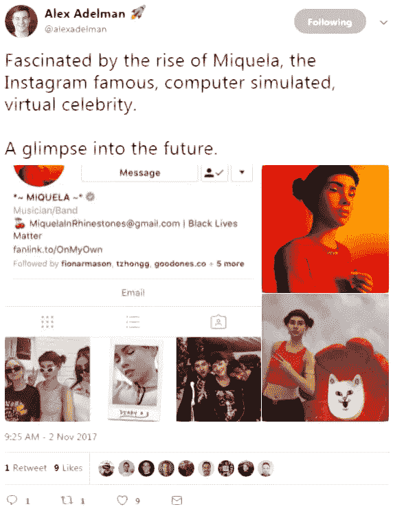

# 为什么 Animoji 是未来的愿景

> 原文：<https://medium.com/hackernoon/why-animojis-are-a-vision-of-the-future-8f91dad8e4e1>

# 我被迷住了，被迷住了

我是一个成年人——我不应该对看到一只小动物模仿我的表情或用我的声音唱歌而着迷。我应该惭愧地承认这一点——我花了周末的大部分时间探索我和我的新动画动物朋友之间的可能性——但我没有。

## 它在两个方面吸引了我

# 表达和移情

到目前为止，大部分技术发展都集中在文本通信上。无论你看脸书、短信还是网站，都是如此。第一次，当我和这个角色互动的时候，我觉得我可以解读这种感觉。我可以读懂情感，并与数字表情符号建立联系，这是我以前从未与朋友和家人在线交流过的。老实说，在很多方面，我感觉这就是我一直在等待。

也许 web 3.0 最重要的发展不会是一切的去中心化，而是在非人类的投射中对人类情感的解释。

# Animoji 怎么会这么有趣？

它们是通往另一个宇宙的大门。它们是第一个代表我们在线形象的真诚展示——以令人难以置信的真实方式捕捉我们是谁。

## 可能是一只鸡在模仿你的每一个动作，但是如果你只是这么想，那你就错过了一些东西

想想看——这是第一次，一个数字角色可以捕捉和复制你的情绪、表情，同时发出你的声音，而只使用一台相机。

在没有任何干预的情况下，这种情况发生的可能性是巨大的。iPhoneX 可能不是我们都希望的不可思议的创新产品，但它是智能手机应该有的产品。FaceID 将手机恢复到原来的样子。你拿起它并使用它。不需要摸索密码，不需要笨拙地重新放置你的拇指，因为你吃了面包屑。

# 主要的创新是 Animoji

进一步推断，颠覆整个电影和动画产业的第一个支柱已经出现。想象创造力的可能性。

想象一下，如果艾德·卡姆尔在成长过程中手边有这个产品，他会取得怎样的成就。对于个人来说，重新创作或重新想象现有的电影和电视连续剧，迪士尼所要做的就是开源他们的角色库。这样做后，他们可以坐下来，看着创造力流动。他们将有机会接触到一百万条故事线，了解什么能引起观众的共鸣，以及人们想要制作什么。

## 这仅仅是个开始

任何重大革命或创新的第一步都是模仿已经存在的东西。基于现有角色的同人小说将会发展出新的角色和故事。Animoji 实现的是一种产品的民主化，这种产品只能以高昂的价格提供给少数人。

## 参与的障碍并没有降低，而是被摧毁了

# 在这一点上，有必要认识到在线环境的变化

一个电脑生成的头像在 instagram 上有超过 45 万名粉丝。变革的种子已经播下。推动 Animoji 的面部捕捉技术将改变一切。

这不仅仅是动画的开创性时刻，也是自我表达和创造力的分水岭时刻。几代人以来，虚拟形象一直被视为一个机会，让我们在网上成为自己想成为的人。iPhoneX 的技术实现了这场革命。

我对一个角色最初的共鸣让我充满了希望。这是在期待技术可以促进人类的联系，尽一切努力孤立我们，以增加我们的注意力，给我们发送更多的广告。

# 正在出现的是实现一个在线世界所需的初始构件

## 如果失败了，做一只唱歌的熊猫会很酷