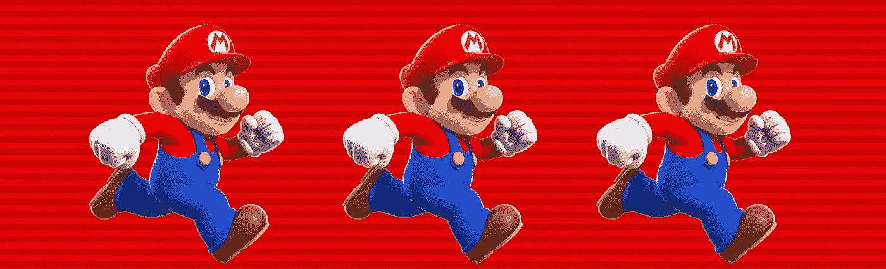
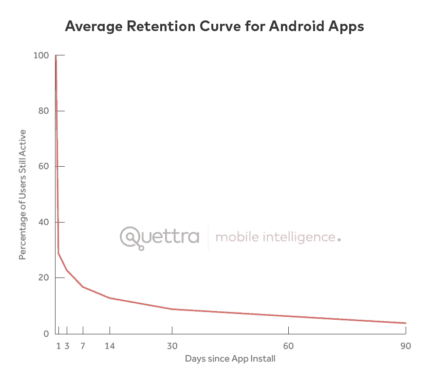

# 为什么苹果的应用商店对开发者来说是一笔糟糕的交易

> 原文：<https://medium.com/hackernoon/why-apples-app-store-is-a-bad-deal-for-developers-7ba4c56d043c>

The Verge 最近发表了一篇文章:

> 《超级马里奥快跑》在第一天就被下载了 285 万次

很好，对吧？

好吧。虽然任天堂的超级马里奥 Run 在第一天就超过了 Pokemon GO 的 90 万次下载，但它的宣传力度是有史以来最大的。这款游戏伴随着苹果公司大规模的上市前促销活动，上市当天在 150 个国家发售。

然而，对我来说，这标志着全球 1，000，000，000(是的，10 亿)台 iOS 设备一天能够下载的自然极限。

想想吧。任天堂首款 iOS 游戏。大型媒体。苹果第一个“通知我”按钮来炒作游戏。这是在苹果主题演讲的黄金时段宣布的。App Store 完全打上了 Mario Run 的烙印——在任何地方都躲不过它。而且，最重要的是，游戏是免费的(下载)，所以尝试的摩擦非常低。

然而，在 10 亿台 iOS 设备中，它只获得了不到 300 万次下载。这是一个自然的极限。

我熟悉的一家公司花了几个月时间开发一款应用，大肆宣传，并利用一些媒体和营销手段，包括自己的邮件列表，来推广这款应用。结果？大约 1 万次下载，大概有 30%的 MAU 和 10%的 DAU。考虑开发、营销的成本，你会意识到一个每日活跃用户可能花费你 100 美元左右。

陈楚翔[写得更具体](http://andrewchen.co/new-data-shows-why-losing-80-of-your-mobile-users-is-normal-and-that-the-best-apps-do-much-better/)关于这个问题:

> …平均而言，应用程序在安装后的前 3 天内会丢失 77%的 dau。30 天之内，它丢失了 90%的 dau。

*神圣的 sh*t！*

虽然这是 Android 应用的平均保留曲线，但苹果的应用商店会描绘出非常相似的画面:

短期解决方案是专注于使用[混合框架](https://www.ymedialabs.com/hybrid-vs-native-mobile-apps-the-answer-is-clear/)构建应用，特别是因为混合应用，本质上是作为独立于平台的 web 应用在本地应用包装器中构建的，现在允许[离线存储](https://hackernoon.com/so-you-want-to-develop-for-the-next-billion-9eb072c26bc8#.ri9hdn7p4)和多核处理的更快处理。

本质上，随着[原生应用放弃](https://techcrunch.com/2016/11/18/app-abandoment-is-on-the-rise-as-consumers-stick-to-the-apps-they-know/)达到新高，Google Play 和 App Store 的发现体验都被打破，制作原生应用初始版本的平均成本轻松超过 10 万美元，有一条更明智的应用开发之路。

**更新(2016 年 12 月 22 日):**我不得不将我对 App Store 限制的假设提高到每天约 1000 万次下载，因为《马里奥快跑》最近打破了 [4 天 4000 万次下载的记录](http://venturebeat.com/2016/12/21/nintendo-super-mario-run-had-40-million-downloads-in-4-days/)。尽管如此，这仍占所有 iOS 设备的 4%左右。

*Evgeny Tchebotarev 是 9m+强社区* [*这五件事帮助公司成功*](https://medium.com/u/5075e6960d1#.19b1jd5ne) *。你可以发电子邮件到 e@e15v.com 找他。*

# 如果你喜欢读这篇文章，请点击下面的心❤图标。它帮助其他像你一样的人发现好的故事。

> 黑客中午是黑客如何开始他们的下午。我们是这个家庭的一员。我们现在[接受投稿](http://bit.ly/hackernoonsubmission)并乐意[讨论广告&赞助](mailto:partners@amipublications.com)机会。
> 
> 如果你喜欢这个故事，我们推荐你阅读我们的[最新科技故事](http://bit.ly/hackernoonlatestt)和[趋势科技故事](https://hackernoon.com/trending)。直到下一次，不要把世界的现实想当然！

