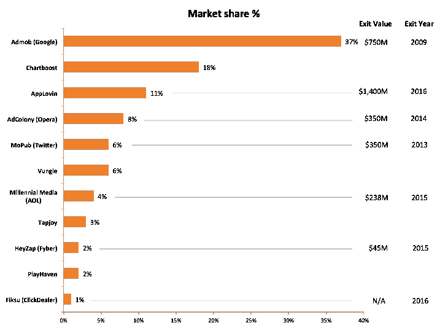

# 为什么以 14 亿美元收购 AppLovin？下一个目标是谁？

> 原文：<https://medium.com/hackernoon/why-applovin-was-acquired-for-1-4b-and-whos-next-39fccf04f51e>

本周早些时候，一家名为 AppLovin 的安静公司(至少对大多数人来说)被一家中国公司以大约 14 亿美元收购。

这家公司仅筹集了 400 万美元，去年的收入为 3 亿美元。因为它们是在“工作室系统”即风投之外构建的，所以只有在移动应用安装领域，你才会听说它们。

自然，我们想看看他们如何与其他顶级移动广告 SDK 相抗衡。我们选取了美国前 50，000 个 iOS 应用和主要/流行的移动广告 SDK，并计算出每个广告 SDK 在 50，000 个应用中的市场份额。我们将市场份额定义为“前 50，000 个 iOS 应用程序中有多少百分比拥有这个特定的 SDK”。

按安装足迹划分的前 10 大移动广告 SDK 的结果:

仅仅从安装足迹就可以清楚地看出为什么交易价值如此之大。AppLovin 拥有 11%的安装市场份额。在谷歌之外，他们和 Charboost 是独一无二的。有趣的是，这张图表显示，谷歌收购 Admob 不仅看起来有先见之明，而且最终成为一笔真正的好交易。

前十名中仅存的独立网站是 Chartboost、Vungle、Tapjoy 和 PlayHaven。因此，现在显而易见的问题是——在剩下的大公司中，Chartboost 和 Vungle 何时会被收购，价格是多少？

另一点是，MoPub 的市场份额远低于我的预期，这有点令人惊讶。也许这是由于 Twitter 人才不断流失的动力。

我应该指出，我们没有包括脸书，因为它没有专门的广告服务 SDK，所以很难梳理出他们的市场份额。

如果你喜欢这样的见解，我们将很快推出一个资源，显示哪些移动应用程序使用哪些 SDK。如果你想在我们即将发布内测版时得到通知并被包括在内，请在此 处注册 [**。我们不会向尼日利亚已故王子的亲属发送或出售你的电子邮件。保证。**](http://appsight.co/?maitre-widget-source=medium_post)

> [黑客中午](http://bit.ly/Hackernoon)是黑客如何开始他们的下午。我们是 [@AMI](http://bit.ly/atAMIatAMI) 家庭的一员。我们现在[接受投稿](http://bit.ly/hackernoonsubmission)并乐意[讨论广告&赞助](mailto:partners@amipublications.com)机会。
> 
> 如果你喜欢这个故事，我们推荐你阅读我们的[最新科技故事](http://bit.ly/hackernoonlatestt)和[趋势科技故事](https://hackernoon.com/trending)。直到下一次，不要把世界的现实想当然！

