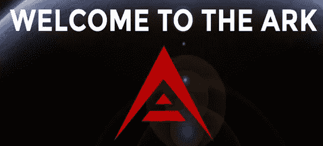
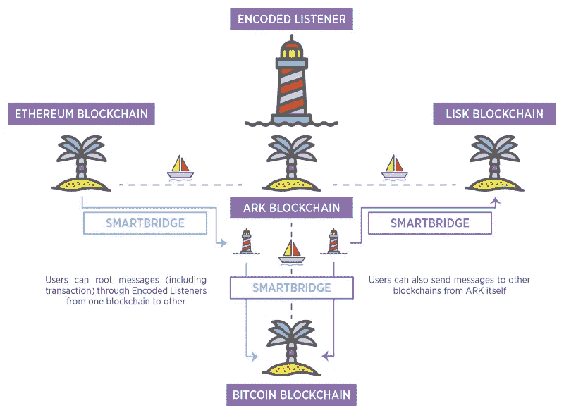

# 为什么方舟值得你关注

> 原文：<https://medium.com/hackernoon/why-ark-deserves-your-attention-c57acd51846a>

## 方舟生态系统是一个雄心勃勃的一体化区块链平台。有一天它会和 Neo 和以太坊竞争吗？也许不需要。

Ark 是加密领域最雄心勃勃的项目之一。它不是 ERC20 令牌，因此有自己开发的[区块链](https://hackernoon.com/tagged/blockchain)。人们普遍认为，方舟没有竞争对手，只有未来的合作伙伴。尽管这是超级陈词滥调和有点邪教，这里是他们为什么这么说。Ark 的愿景是成为一个一体化的区块链平台。从能够按下按钮部署新的区块链和发布 Ark smart 合同，到充当区块链之间的桥梁(这个头韵怎么样？)，Ark 可能会成为区块链平台的主要参与者。在未来，随着 Web 3.0 的愿景成为现实，可能会有数百个 DApps 和特定的实用工具。Ark 希望实现区块链互操作性——这是一个大词，意思是:拥有 Ark 并与任何区块链交互。

## 方舟的计划

让区块链与 Ark 互操作非常容易。方舟称这种能力为 T2 martBridges T3。要兼容 SmartBridge，只需在现有的区块链中嵌入一点代码。新的 DApps 可以无缝集成这种变化。目前运行的区块链需要一个叉子来完成这一任务。一旦代码被嵌入，区块链就可以与 Ark 和任何其他支持 SmartBridge 的区块链进行交互。这种潜力不能被夸大。请看 Ark 团队展示的两个用例:

> 示例 1:如果您想要触发 ETH 智能合约，但持有 ark，您可以通过 ark SmartBridge 发送指令，就在钱包中触发事件。嵌入在 ETH 链中的代码总是监听 ark SmartBridge 事务，并将收集这些信息并触发函数来发布合同。
> 
> 示例 2:您想在 Factom 中发布一个记录条目，但您只持有 ARK。因此，你可以打开你的方舟钱包，通过 SmartBridge 选项卡输入 FCT 连锁店的正确信息和说明。那就发吧。就这样，现在 FCT 连锁店收到信息并采取适当的行动。

随着区块链经济的增长，公用事业令牌的数量和智能合同的复杂性也将增加。我们可能会到达这样一个地方，一个人必须持有几十种不同的代币才能使用区块链的全部功能。或者，如果你突然需要使用一项新的服务，你需要交换代币。Ark 提供了一个解决方案。就买方舟，和他们都互动。

但是 Ark 受益的不仅仅是用户。通过实施 SmartBridge，开发人员能够将许多不同的区块链功能集成到他们自己的产品中。这允许跨平台的合作和协调——就像今天许多互联网应用程序使用来自其他站点的 API 和其他功能一样。

## 如果公司不嵌入代码会发生什么？

如果其他区块链没有嵌入 Ark 的代码，用户可以使用所谓的*编码监听器。*编码监听器是简单的节点(用户),它下载软件并作为一个中心监听从 Ark 发送的兼容命令。他们持有大量代币，并为网络自动执行转换，以换取少量费用。任何人都可以创建一个编码监听器，并从网络中获益。

让我们看看 ACES (Ark 契约执行服务)作为编码监听器的一个例子。ACES 是由社区成员开发的项目，是 SmartBridge 技术的首次实现。ACES 创建并实现了一个将 Ark 转换为 Ethereum 的编码监听器。使用 ACES，Ark 用户可以发送 Ark 到以太坊合同。ACES 监听诸如此类的事务，处理它，转换货币，并转发事务。任何人——尽管需要一些编程知识——都可以下载 ACES 软件，在其节点中持有 ether，并开始代表 ACES 执行事务。

[**消息**](/@arkaces/development-of-the-ark-and-bitcoin-listeners-completed-13494d0d95c1) **:** 截至一小时前，Ark 的团队发布消息称，ACES 团队已经开发出一款比特币-Ark 编码监听器，即将发布。

随着网络的发展和 Ark 的普及，预计将会有更多的这种编码监听器可用，允许 Ark 用户与许多不同的区块链交互，而不仅仅是以太坊。

This highlights how a user could use Ark to send ether to a bitcoin or lisk address or any combination of the tow.

## **按钮可展开区块链:**

按钮可部署区块链是方舟版本的 ERC20 令牌。它们允许用户按下按钮部署新的区块链和令牌。然而，与依赖以太坊区块链的 ERC20 代币不同，这些按钮区块链运行在它们自己独立的区块链上，而不是方舟的。这使 Ark 的主网络保持平稳运行，并允许它更有效地扩展。

想象以太坊的区块链是一条 5 车道的高速公路。每个 ERC20 代币就是高速公路上一辆车。随着越来越多的汽车上高速公路，交通开始堵塞。汽车不能快速移动。Ark 的区块链按钮就像是在高速公路上增加了一条额外的车道，一条只允许特定公司的汽车通行的车道。这使得主要的方舟公路畅通无阻。

通过 Ark 的按钮部署的所有区块链将与 SmartBridge 兼容。因此，任何按钮部署区块链将能够与网络上的所有其他人通信。这使得任何人，即使没有太多的技术背景，也可以快速轻松地部署区块链:从发展中的区块链公司和 DApps 到一群想要区块链记录他们的使命召唤分数的朋友。

## 委托股权证明(dpo)

与依赖所有硬币持有者来保护网络的传统利益证明协议不同，Ark 使用委托利益证明模型。51 个顶级令牌持有者负责维护网络。他们确认大宗交易，并以交易费和方舟奖金的形式获得奖励。但是每个方舟持有者都可以为代表投票，有效地将他们自己的方舟数量贡献给代表的数量。然后投票人根据他们的贡献从代表那里得到一笔支出。这使得每个人都能从 PoS 模式中受益。

这使得实现 51%的攻击更加困难。在标准的利益证明模型中，如果一个用户可以购买 51%的代币，他们将能够授权无效的交易。但是根据 Ark 的协议，即使一个代表设法获得了 51%的令牌，他仍然只是 51 个代表中的一个。最终，这鼓励了一个更加分散的系统。

此外，因为代理和节点必须标记它们的令牌，所以任何恶意行为都会导致它们的令牌丢失。这造成了严重的经济抑制因素。那些保护网络的人这样做是为了保护他们自己在 Ark 的股份的价值和安全。

此外，我相信[加密货币](https://hackernoon.com/tagged/cryptocurrency)去中心化的未来在于股权证明协议。与采矿相关的广泛的环境影响和能源成本将变得越来越令人望而却步，硬币将转向 PoS——已经实现功能性 PoS 协议的硬币具有很大的优势。

***选民通常可以在他们的赌注柜中获得 8-10%的年收益。*** [***该电子表格***](https://docs.google.com/spreadsheets/d/1FGo3FkC3uSWXGHatPQyny2brMWjAIJsHFCR-Lhkl_m0/edit?ts=595ea770#gid=0) ***根据您持有的代币数量，对您可以赚取的金额进行估算。***

## **钱包**

在设计和用户友好性方面，方舟的钱包是无与伦比的。所有之前讨论过的功能，从为代表投票到与 SmartBridges 和 ACES 交互，都可以直接从 Ark wallet 中获得。

## 法国的商业实体

Ark 宣布，它们将在法国注册为 SCIC，这是第一种在欧盟注册的加密货币。SCIC 是一个合作的社会，这意味着方舟生态系统的所有成员，包括员工、用户、志愿者、公共机构、公司、协会都合作管理方舟，并可以相应地投票。这为该项目提供了巨大的可信度，并允许他们与欧洲监管机构合作。

## **其他相关信息:**

Ark 支持各种不同的编码语言。想到与原子交换相关的 SmartBridge 功能也很有趣。最终，它们可以服务于几乎相同的目的，尽管 Ark 团队说这不是这项技术的首要目标。

## **技术信息与分析:**

**它解决的问题:** Ark 提供了一个平台，在可用性和可扩展性方面，解决了以太坊目前的许多问题。DPoS 协议在效率和可伸缩性方面远远超过以太坊的工作证明协议。当以太坊正在走向一个利益协议的证明时，Ark 已经完成了这一步。此外，他们的按钮区块链不在 Ark 主链上运行，这一事实将使 Ark 运行起来既便宜又流畅。Ark 在他们的路线图上的未来发展将实现 Ark 智能合约和匿名交易。我可以看到他们在 2018 年与以太坊竞争，类似于 Neo 今年早些时候的运行。

**当前市值:** $313，344，146 美元，在加密货币中市值排名第 29。如果他们能够兑现承诺，这是一个具有巨大增长潜力的稳健中型股。但在这个市场上，Ark 可能会在短期内交割之前经历大幅上涨。

**硬币供应量:**现存 129，231，284 枚代币。

**通货膨胀/通货紧缩因素:**方舟的通货膨胀率很低，随着时间的推移而降低。这是一个比以太坊低的通货膨胀率。理由是平台代币应该是通货膨胀的，以鼓励消费。当你知道通货膨胀的规律正在慢慢地使你的持有物贬值时，持有代币的动机就减少了。但这不是不投资的理由，尤其是在这么早的时候。如果该平台获得采用，方舟的指数增长将远远抵消其通货膨胀率。此外，作为一个旁注，你可以从赌注的回报超过补偿通货膨胀率。

**分配:** 1%为方舟生态系统贡献者的赏金奖励持有，16%由方舟团队持有，7%由 ArkShield 账户(一个致力于改善生态系统的专业管理账户)持有，其余 76%由公众持有。

**令牌对生态系统的内在价值:**令牌允许用户参与方舟系统内的 DPoS 治理。Ark 令牌将允许用户与所有支持 SmartBridge 的区块链进行交互。

[**路线图**](https://ark.io/roadmap) **:** 方舟的主网于今年三月初上线。路线图的下一次更新可能是:
1。与可穿戴设备和硬件钱包的集成

2.手机钱包的发布

3.18 种新编程语言的发布——其中 12 种已经完成。

**在这些更新之后，他们的路线图上排名不分先后的是:**

1.  对他们的核心协议进行全面检查——这将使 Ark 更快、更具可扩展性、更动态的费用结构、更好的稳定性、多种支付交易，并为智能合同部署做好准备。
2.  发布整个平台的技术文档
3.  方舟智能合约
4.  IPFS(行星间文件系统)——允许用户用链接标记时间戳和保护数据，然后将链接放入方舟区块链。允许保存这些数据，而不会使区块链方舟陷入困境。
5.  他们的按钮可展开区块链的测试网
6.  星际数据库——这将允许 Ark 管理和保护个人信息、名誉、许可和媒体文件等数据。

**社区存在:**Ark 的存在和社区的参与程度不断给我留下深刻印象。Ark 的团队经常发布博客更新、GitHub 新增内容和其他社交媒体帖子。开发者社区也为 Ark 生态系统做出了巨大贡献。来自团队的交流和方舟提供的赏金鼓励了这个社区的发展。ACES 团队也被证明是生态系统不可或缺的一部分。

**总结:**方舟不是一招一式的小马。在这样一个复杂的项目中完成每一件事都很困难。问题是团队能实现吗？这是不可能预测的，但我认为他们有合适的工具:一个强大的团队，活跃的社区，伟大的界面，雄心勃勃的项目，良好的沟通，和先进的协议。他们可能不会成功推翻以太坊作为一体化区块链平台的地位，但我认为市场可以容纳几个区块链平台，而 Ark 正好是其中之一。此外，SmartBridge 功能真正为 Ark 提供了独特的特性。

Ark 作为一个平台以及其他区块链之间的链接的能力给了 Ark 如此大的潜力。他们已经表现出致力于创造一个稳定增长和强劲发展的项目。我认为，随着 Ark 获得更多的功能和社区意识，Ark 可能是今年最划算的买卖之一。

在 Twitter 上关注我:@ noamlevenson

***免责声明:本人投入方舟项目。这不是投资建议，仅仅是我对这个项目的看法。自己做研究。***

*如果你喜欢内容，请按住鼓掌按钮！它帮助我获得曝光率。*

***鼓掌 50 次！***

*我喜欢获得问题或建议，所以请发表评论吧！*