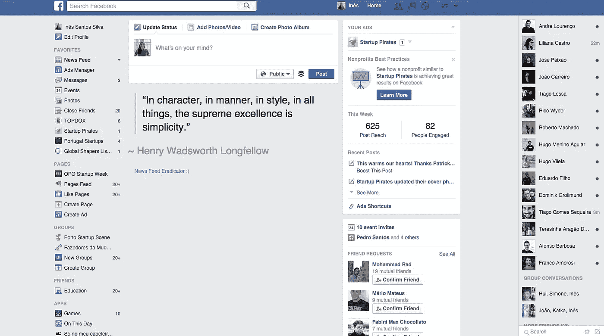
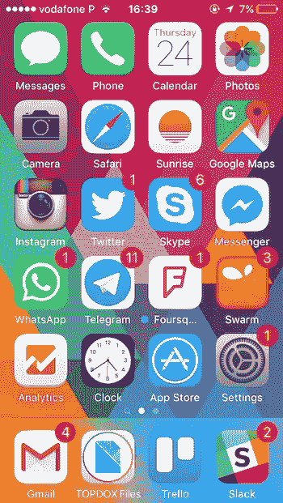

# 为什么“远离”脸书是我在 2015 年做出的最佳决定！

> 原文：<https://medium.com/hackernoon/why-being-away-from-facebook-was-the-best-decision-i-could-make-in-2015-d001b42e84c8>

2015 年 5 月，我意识到，[脸书](https://hackernoon.com/tagged/facebook)带给我的不是兴奋、知识和快乐，而是沮丧和数量惊人的无用信息。一天中，我会向下滚动我的新闻提要很多次(这让人上瘾！！)只找到八卦文章、愚蠢的视频(抱歉，我对可爱的小猫视频完全免疫)，而不是一个相关的内容。

这样过了好几个月，我开始寻找解决办法。我能做些什么来停止被这么多无用信息淹没的感觉，同时继续使用脸书与朋友保持联系，了解我感兴趣的话题，并传播我正在做的工作？

经过一些研究后，我发现了[新闻订阅根除器](https://chrome.google.com/webstore/detail/news-feed-eradicator-for/fjcldmjmjhkklehbacihaiopjklihlgg?hl=en)，这是一个 chrome 扩展，用一个鼓舞人心的引用取代了我的整个新闻订阅。这是我打开脸书时看到的:

当我发现这个扩展，我开始有第二次猜测。我该做吗？这是我真正想要的吗？这会对我的个人和职业生活产生负面影响吗？太多的怀疑，但我决定试一试。我随时都可以回到新闻提要。

为了更加有效，我决定从我的 iphone 上删除脸书应用程序。我还保留着[的 Messenger](https://hackernoon.com/tagged/messenger) app，但是脸书已经不在了。这是我手机的主屏幕，让你清楚地知道我一天的价值:

所以现在你可能会问:这一切的结果是什么？我真的觉得我的生活有了很大的改善。我感到更加兴奋，更加适应生活。我觉得我可以“控制”每天访问的信息/内容，我开始把时间集中在与家人和朋友进行在线和离线的深入交谈上。我现在可以轻松地度过一个周末或更长时间，而不用查看脸书，甚至不记得它的存在，脸书不再是我醒来或到达办公室时查看的第一件事，也不再是我入睡前查看的最后一件事。

我失去了什么吗？我知道我是。从五月开始，我不止一次地完全意识不到我的世界里正在发生的事情。这足以让我回到新闻提要了吗？没门儿！！

我个人给你的建议:试一试。也许它对你不起作用，也许它会改变你的生活，就像它改变了我的生活一样。世事难料。

查看我的时事通讯:我每月发一次时事通讯，分享 5 到 10 本我读过的你会喜欢的精彩书籍和文章。如果你想在你的收件箱里收到我每月阅读的最佳内容，请在这里订阅。

> [黑客中午](http://bit.ly/Hackernoon)是黑客如何开始他们的下午。我们是 [@AMI](http://bit.ly/atAMIatAMI) 家庭的一员。我们现在[接受投稿](http://bit.ly/hackernoonsubmission)并乐意[讨论广告&赞助](mailto:partners@amipublications.com)机会。
> 
> 如果你喜欢这个故事，我们推荐你阅读我们的[最新科技故事](http://bit.ly/hackernoonlatestt)和[趋势科技故事](https://hackernoon.com/trending)。直到下一次，不要把世界的现实想当然！

