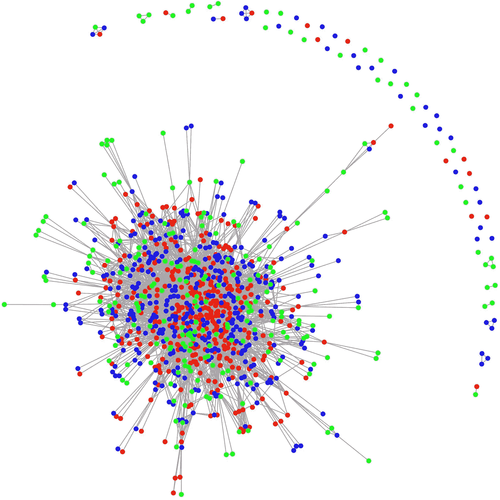
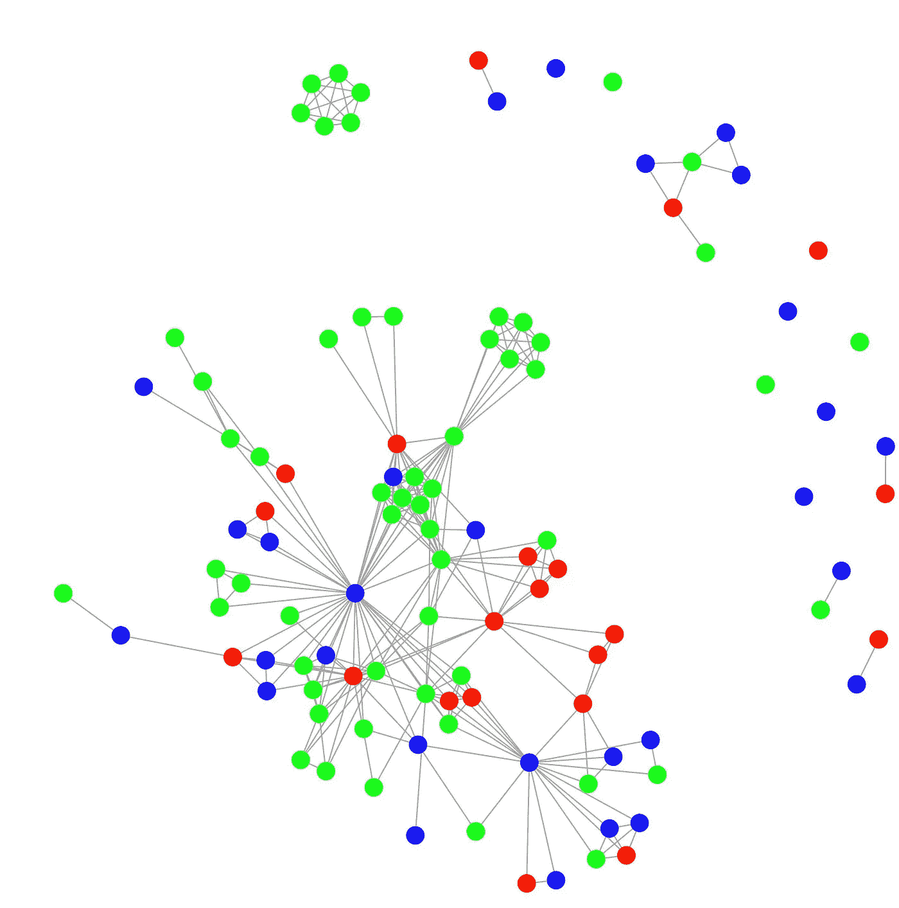
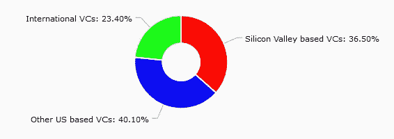
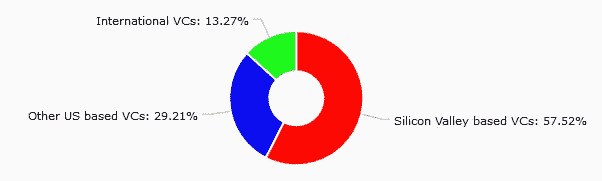
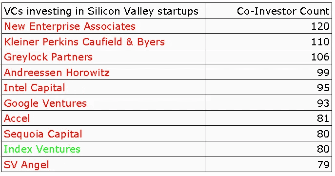
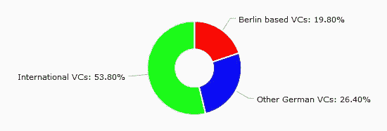
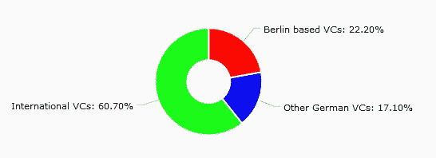
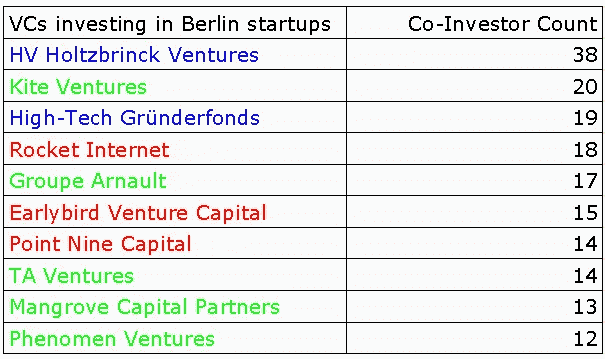
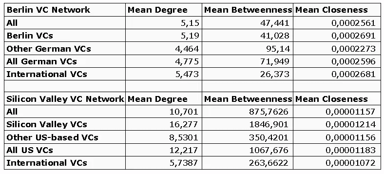

# 柏林本地风险投资——网络分析

> 原文：<https://medium.com/hackernoon/why-berlin-needs-more-local-vcs-a-network-analysis-90f903ab519a>

在过去的几年里，柏林已经成为欧洲最活跃的创业中心。根据全球创业生态系统排名(T1)，柏林从 2012 年的第 15 位上升到了 2015 年的第 9 位。全球创业生态系统排名(T1)对城市的 T2 创业吸引力进行了评级。 [EY](http://start-up-initiative.ey.com/wp-content/uploads/2016/08/EY_Start-up_Barometer_2016.pdf) 将柏林排在了伦敦的前面，因为柏林在 2014 年和 2015 年的创业资金数字上都超过了伦敦。凭借 SoundCloud 等旗舰公司和各种 Rocket Internet ventures，柏林多年来一直是国际关注的焦点。总部位于柏林的 Wunderlist 于 2015 年被微软收购，食品服务交付英雄估值 31 亿美元。2016 年，柏林的在线银行 fintech NUMBER26 从各种投资者(其中一半是非德国人)那里筹集了 4000 万美元，包括 Battery Ventures 和彼得·泰尔的梵拉风险投资公司。然而，尽管这些退出、数十亿美元的估值和大型后期融资轮是好消息，但它们仍然非常罕见。

虽然柏林有十几个孵化器和加速器，并且在种子资金方面很强大，但初创公司仍然经常难以筹集到更大的增长阶段资金。

在本文中，我们将展示柏林创业公司的过去种子资本确实经常来自非德国投资者。我们将通过社会网络分析将我们的数据与企业家的榜样硅谷进行比较。使用“榜样”一词并不意味着美国以外的每一个创业生态系统都应该复制硅谷所做或已经做的一切。像柏林、伦敦、斯德哥尔摩和其他城市有机发展并发展自己的特色是非常重要的。但毫无疑问，硅谷产生了我们今天所知的大多数最具创新性的技术公司，并且在风险投资环境方面几乎是无可匹敌的。如果我们想谈论像柏林这样一个日益成熟的生态系统中的风险投资，就不能不看看硅谷丰富的故事。
在网络分析和比较之后，将会有一个对柏林[未来](https://hackernoon.com/tagged/future)的——甚至不是那么悲观的——展望，结合一些在我们描绘的柏林-VC 画面中发挥作用的最近发展的话。

# 方法

社会网络理论是一种跨学科的方法来说明，描述和分析大型数据集。它着眼于较大群体(又称网络)内个体行为者之间的信息和资源的联系和流动。网络理论让我们总结网络中的参与者所表现出的发展、趋势和行为。我们来看两个网络:硅谷的共同投资风投网络和柏林的各自风投网络。我们将根据定量投资数字以及通过比较每个网络的中心性(一种统计测量，我们将在下面进一步介绍)值来分析数据和网络。R Studio 用于处理、分析和可视化数据。

# 数据

可从 CrunchBase 免费下载(需要入场)
分析基于 2010 年至 2015 年间硅谷和柏林
初创公司的融资数据
只有从风险投资到初创公司的每笔投资超过 50 万美元的融资
包含在数据集中(我们希望查看过去的种子期融资)
出于可比性的原因，本
分析中的硅谷初创公司被简化为位于帕洛阿尔托山门洛帕克的初创公司
视图

# 硅谷的风险投资网络

(1) Silicon Valley’s VC network (local VCs: red; Other US VCs: blue; International VCs: green), 2010–2015, Data: CrunchBase

上面的网络(1)显示了投资硅谷初创公司的风险投资公司网络。如果一家风投公司(节点)和另一家风投公司(节点)都是一家初创公司的共同投资者，那么这两家公司就是关联的。仅仅从视觉上看，硅谷本地的风投(红色节点)对网络的重要性就显而易见了。他们占据了网络的大部分中心空间，这意味着他们与硅谷的初创企业融资特别相关(与另一个参与者关系最密切的参与者位于网络的中间)。他们似乎进行了最多的创业投资，并由此与许多其他风投建立了联系。蓝色节点代表硅谷以外的美国风险企业。这些在网络上分布相当一致，但是不能渗透到网络的中心。相对于美国投资者而言，国际外部风险投资者(绿色)总体上相对较少。它们大多位于网络的外围，意味着在少数风险投资辛迪加中扮演被动的共同投资者角色。它们特别出现在右上方的镰刀状风投和小型风投网络中。简而言之:本地风投似乎主导着 SV 创业融资市场，其他美国投资者发挥着重要作用，国际投资者似乎没有那么重要。

# 柏林的风险投资网络

(2) Berlin’s VC Network (Local VCs: red; Other German VCs: blue; International VCs: green), 2010–2015, Data: CrunchBase

仅仅从视觉上比较网络(1)和(2)就可以清楚地看出，本地(红色)风投在硅谷的融资网络中扮演着比柏林更重要的角色。在柏林，投资柏林初创企业的国际风险资本投资者(绿色节点)数量超过了当地甚至其他德国风险资本。尽管一家非柏林的德国风险投资公司位于网络的中心(总部位于慕尼黑的 [HoltzBrinck Ventures](http://www.holtzbrinck-ventures.com) ),但国际投资者在网络中扮演着主导角色。他们甚至组成自己的联合投资集团。它们可以在网络的几乎每个区域找到，靠近中心以及在郊区。柏林本地风投(red)在 2010 年至 2015 年间向柏林初创公司投资 50 万美元以上的所有风投中仅占 19%。它们主要占据中心周围的区域，但不直接位于网络的中心。从他们的职位和他们与其他风投(他们通过这些风投投资初创公司)的联系来看，他们在柏林为初创公司的后期阶段提供资金的能力远远低于许多国际投资者和非柏林的德国风投，如 HoltzBrinck Ventures 或 High-Tech gründerfounds(位于中右下方)。

# 柏林 vs 硅谷:风险投资数字

(3) Share of amount of VCs investing ($500k or more) in Silicon Valley startups (2010–2015)

在 2010 年至 2015 年间投资于硅谷初创公司的 949 家风投公司中，超过 50 万美元的投资中，有 346 家(或 36.5%)是本地风投公司。

(3) Share of funding capital (in investments of $500k or more) received by Silicon Valley startups (2010–2015)

这 36.5%占了总投资资本的一半以上(710 亿美元中的 410 亿美元，或 57.5%)

(4) Top 10 VCs investing ($500k or more) in Silicon Valley startups by number of co-investors (2010–2015)

通过查看联合投资者数量排名前 10 位的风投公司名单(因此意味着投资活动速度很快)，也可以清楚地看到硅谷本地风投的主导地位。按联合投资者数量计算，硅谷本地风投在前 10 名风投中占据了 9 个席位。Index Ventures 严格来说成立于日内瓦，因此在这里被视为一家国际风险投资公司。

(3)、(4)和(5)中的数字都指向了我们在上面考察硅谷风险投资网络时提出的假设:当地的、硅谷的风险投资在硅谷的启动资金中起着主导作用。本地风投对初创公司的投资频率最高，并在 2010 年至 2015 年间为初创公司提供了超过一半的融资资本(投资额超过 50 万美元)。来自美国其他地区的风投也在硅谷的网络中发挥着重要作用，因为他们占了投资初创公司的风投的 40%，并提供了流入初创公司的资本的 29%。相反，国际投资者在网络中只有很小的影响力。

(6) Share of amount of VCs investing ($500k or more) in Berlin based startups (2010–2015)

在 2010 年至 2015 年间投资柏林初创公司 50 万美元及以上的 106 家风投公司中，只有 21 家(19.8%)是柏林本地风投。

(7) Share of funding capital (in investments of $500k or more)received by Berlin based startups (2010–2015)

在 2010 年至 2015 年期间，这 19.8%的人贡献了柏林初创公司获得的 50 万美元以上投资总额的 22%。

(8) Top 10 VCs investing ($500k or more) in Berlin based startups by number of co-investors (2010–2015)

联合投资风投的排名也描绘了一幅清晰的画面:柏林本地风投在柏林风投网络(又称生态系统)中的存在，远远落后于投资柏林初创公司(HV 和 HTGF)的领先德国风投，这两家公司的总部都在柏林以外。国际风险投资公司在数量上也超过了本地风险投资公司，在联合投资者数量方面，本地风险投资公司只占据了前十名中的三个席位。

正如网络预测的那样，从融资数据来看，柏林的本地风投在柏林的创业融资体系中远不如硅谷的本地风投重要。尽管国际风投在硅谷的初创企业融资中只扮演了很小的角色，但非德国外部投资者对柏林过去种子期的初创企业融资至关重要。国际投资者占投资 50 万美元以上的积极投资风投的一半以上，并为柏林的初创公司提供超过 60%的总投资资本(总投资 31 亿美元中的 18 亿美元)。

# 网络中心性数据

(9) Centrality values for the Berlin VC network and the Silicon Valley VC network

从网络分析的角度来看，我们现在来看看我们两个网络的中心性数据。度、介数和紧密度是最重要和最常用的网络中心性类型:

*   **度-中心性**量化参与者(节点)之间的连接(纽带)数量。高程度值传统上指示特定行动者在网络内具有高相关性。当可视化网络时，具有高度值的行动者也占据网络的中心，因为他们连接到他们周围的大量其他行动者。
*   **中间性-中心性**关注网络中的信息流。一个特定节点的介数值是网络中所有其他参与者之间通过该特定节点的最短路径数。因此，有大量的信息或资源通过一个具有高介值的节点。通过访问大量的旁路信息，具有高介值的节点在网络中获得更高的权力位置。
*   **接近度-中心度**的值是由某个节点在网络中的位置计算出来的，这个位置是基于他与网络中所有其他节点的连接纽带的数量。高紧密度值表示一个节点通过低数量的纽带与其他节点快速交互的能力。

**硅谷**硅谷本地风投在本地创业公司的平均投资是美国其他风投的两倍，是国际风投的三倍多(平均程度)。通过他们的主要中心位置，他们也获得了最高的介数分数和最高的亲密度分数。到目前为止，本地风投是硅谷初创公司的主要资本来源。

**柏林** 柏林的中央集权数字有点棘手。就程度中心性而言，本地创投公司仅次于国际创投公司，领先于其他德国创投公司。尽管网络中的非德国风投比本地风投多。这是为什么呢？如果我们回顾一下网络(2)，我们可以看到柏林当地的风险投资公司主要将自己定位在网络的中间区域。不是特别在中心，也不是在网络的最远边缘。介于两者之间。这使他们比其他德国风投更有优势。因为除了 HoltzBrinck 和 High-Tech Gründerfonds 这两个网络中心之外，其他非柏林的德国风投大多位于郊区。这意味着他们不像柏林本地风投那样定期投资，因此也不像联合投资者那样经常联系其他风投。

HoltzBrinck 和 High-Tech Gründerfonds 对非柏林的德国风投公司的高中间值(95，14)负有责任。由于它们的中心位置，大量的最短路径穿过它们。如果没有 HoltzBrinck 和高科技公司 Gründerfonds，本地风投就会处于中间位置。

但是国际投资者怎么了？在我们之前的分析中，似乎很明显，他们是柏林融资生态系统中最重要的参与者。单纯从数量和投入资本来看，他们胜过了柏林当地的风投。但就中心性数据而言，它们与本地风投几乎处于同一水平。他们被柏林当地的风险投资家中间性和接近中心性人物打败了。这是为什么呢？

答案还是在于大多数柏林本地风投的战略定位:它们大多位于网络的中间区域，不在珀利市中心，但在郊区也不多见。平均而言，柏林本地风投投资和联合投资柏林初创企业的频率高于国际投资者。这些风投通常只进行一两项投资，但不像本地风投那样与柏林的生态系统纠缠在一起。虽然国际风险资本明显多于本地风险资本，而且一半以上的投资资本来自国际风险资本，但平均而言，这些国际风险资本的投资频率低于本地风险资本。他们占据了远离中心的位置。他们获得的信息比本地风投少，与其他风投的互动也更少。事实上，如果你观察网络(2 ),你会发现它们经常是网络边缘的最后节点。换句话说，这意味着…

> 柏林活跃的本地风险投资公司比国际风险投资公司更好地融入了网络，即使这些公司对柏林的创业公司投入了更多的资本。
> 
> 柏林本地风投已经分享了硅谷本地风投的一些主要特征。在中间性和紧密中心性方面，他们击败了国际风投和大多数非柏林的德国风投。
> 
> 在风险投资的现实中，较高的中间值和接近值意味着柏林的本地风险投资已经比网络中的任何其他风险投资获得了更多的重要信息和资源(例如有趣的交易、人才知识、即将到来的技术趋势)。此外，他们能够比国际或德国非柏林风险投资公司更快地接触到网络中的其他风险投资公司(分享信息、建立关系网、寻找人才、寻找投资伙伴)。
> 
> 记住，柏林的本地风投只负责 22%的资金，这些品质是非常积极的信号。
> 
> 话虽如此，只有两件事阻止了柏林本地风投在柏林的生态系统中像硅谷本地风投在他们的生态系统中那样占据主导地位:缺乏资金和仅仅是缺乏数量。

# 光明的前景

这两个问题(a .没有足够的本地风投和 b .缺乏资本)只能从柏林的生态系统内部解决。以一种有机的方式，就像山谷里展示的那样。

一个简单但至关重要的因素将硅谷和柏林区分开来:时间。硅谷的科技产业至少有 60 年的历史。柏林的现代经济故事始于 1989 年之后。20 世纪 90 年代，硅谷正处于互联网热潮中，初创企业估值高达数百万美元，柏林的一半刚刚从社会主义政府中解放出来，刚刚开始适应资本主义市场经济的基本原则。那是相当不同的。

硅谷能够创新和繁荣背后的核心驱动力是这样一个事实，即它是一个由创意人员、相关机构和知识及资本等资源组成的庞大网络，这些资源在 20 世纪下半叶共同进化而成。

本地风险资本最初只是一个副产品，后来成为硅谷成功背后最重要的力量之一。风险投资公司大多由成功的企业家创建。然后出现了很多分拆出来的风投。人们也在学术界、企业家和投资之间来回穿梭。商业天使留在网络中，用建议和资金支持当地的创始人。

相反，柏林的生态系统很年轻。它正在成熟，在过去的几年里，也许已经进入了成熟期。除了网络时代的众多互联网公司之外，火箭互联网是第一个真正给这座城市留下巨大印记的公司。你不必把他们描绘成圣人，但萨姆维尔兄弟和他们来自扎兰多的同伴以及其他成功的企业无疑将生态系统带到了一个新的全球水平。2016 年初，他们关闭了超过 4.2 亿美元的火箭互联网资本合作伙伴基金。Zalando 的创始人现在也是德国非常活跃的商业天使。

这正是柏林此时所需要的:从内部实现有机生态系统的增长。

好消息是:柏林的融资生态系统正朝着这个方向发展。在过去的两年里，我们看到许多柏林的风投是由前企业家创办的。像[樱桃冒险](http://www.cherry.vc)，[骑兵冒险](http://cavarly.vc)，[天使俱乐部](http://theangelclub.de/)等等很多。

还出现了一波衍生风险投资，风险投资合伙人创办了自己的公司。这些包括例如[联合资本](http://join.capital)、[蓝田资本](http://BlueYard Capital)、[康普斯风险投资](http://kompass-digital.com)和 [Fly 风险投资](http://fly.vc)。

在过去 5-10 年专注于电子商务后，柏林真的开始形成自己的、多样化的、有机的生态系统特征。上面列出的新成立的风投公司就是最好的证明。就像硅谷的发展历程一样，柏林成功的前企业家将资金投入基金，并回馈网络。对于德国规避风险的机构有限合伙人来说，这也是一个积极的信号，他们可以信任有创业记录的人。

此外，新一代风投正在崛起，他们离开原来的风投公司，筹集资金，开始自己投资。个人风格和个人资料。Ciarán O'Leary 的 [BlueYard Capital](http://blueyard.com) 专注于区块链和数据去中心化和民主化的网络技术，是一个完美而有趣的例子。如上所述，还有许多其他的衍生风险投资案例，就像我们在硅谷最初几十年看到的那样。
也有风投自己开公司的例子，比如[斯蒂芬·冯·珀格](/@vonperger)和 [Zenjob](https://www.zenjob.de/) 。

因此，尽管上述网络分析的很大一部分描绘了柏林本地风投的一幅相当黑暗的画面，但柏林的融资前景看起来是光明的。即使外部投资者在 2010 年至 2015 年期间占据了柏林初创企业后期阶段投资的大部分资本，但就网络的整合度而言，本地风投(几乎)击败了其他集团。这是新成立的投资者可以从中获利的坚实基础。

成为“德国硅谷”——就像许多德国报纸喜欢的标题——并不是相信柏林能够在一夜之间大规模生产苹果这样的科技巨头的幻想。这是关于企业家的进化。这是关于建立一个多元化的网络，同时分享一个集体的身份。通过有机的内部增长。一个公司接一个公司，一个 VC 接一个 VC，一年一年。这可能不会成为典型的德国报纸上一个尖锐的柏林初创企业的标题。但这正是柏林正在走的路。这很令人兴奋。

> [黑客中午](http://bit.ly/Hackernoon)是黑客如何开始他们的下午。我们是 [@AMI](http://bit.ly/atAMIatAMI) 家庭的一员。我们现在[接受投稿](http://bit.ly/hackernoonsubmission)并乐意[讨论广告&赞助](mailto:partners@amipublications.com)机会。
> 
> 如果你喜欢这个故事，我们推荐你阅读我们的[最新科技故事](http://bit.ly/hackernoonlatestt)和[趋势科技故事](https://hackernoon.com/trending)。直到下一次，不要把世界的现实想当然！

