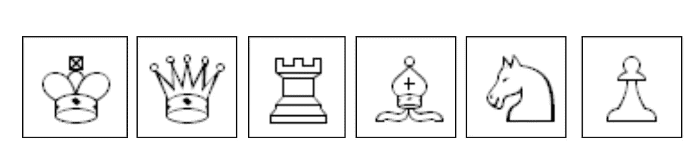
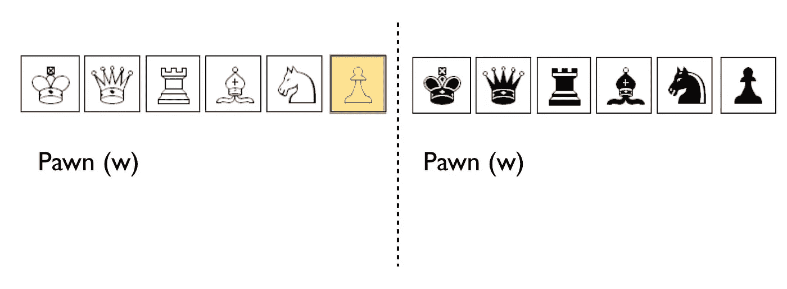
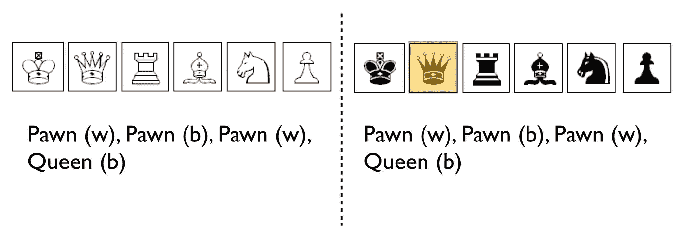
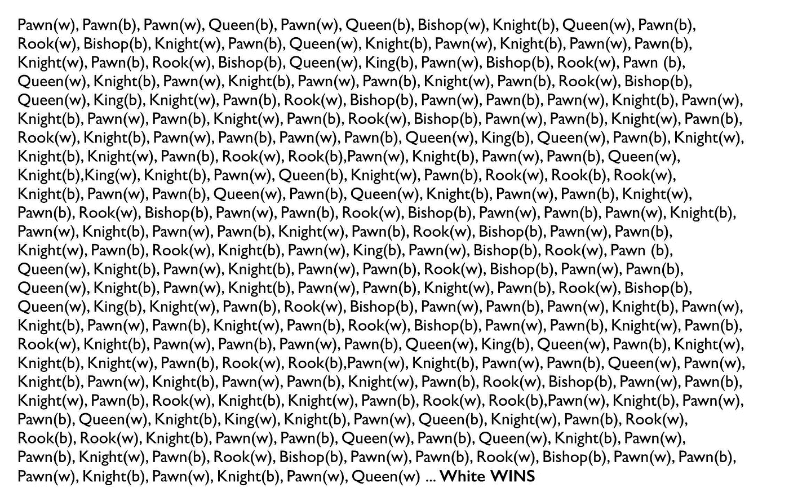
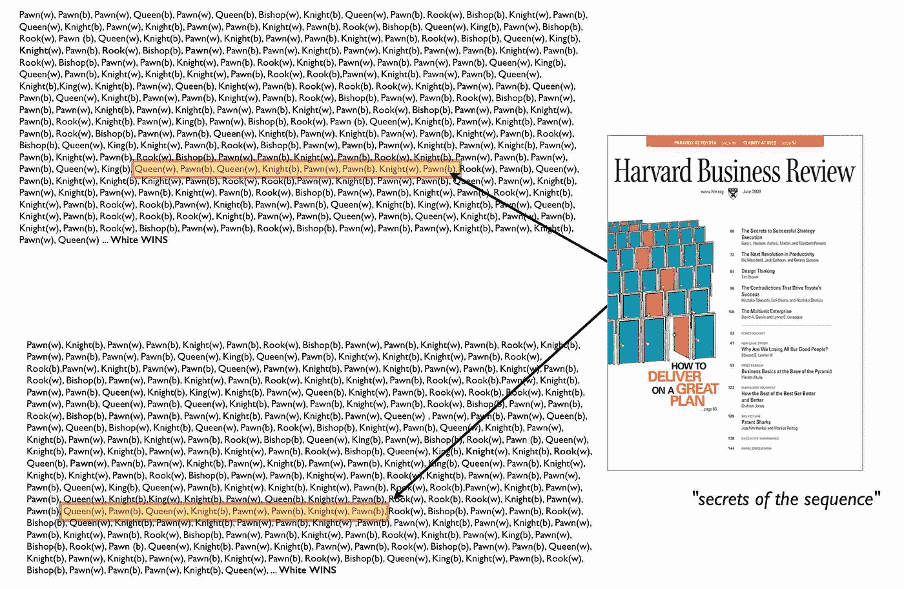
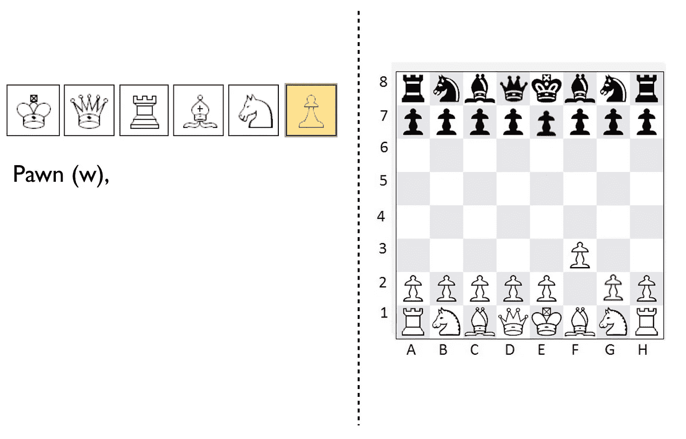
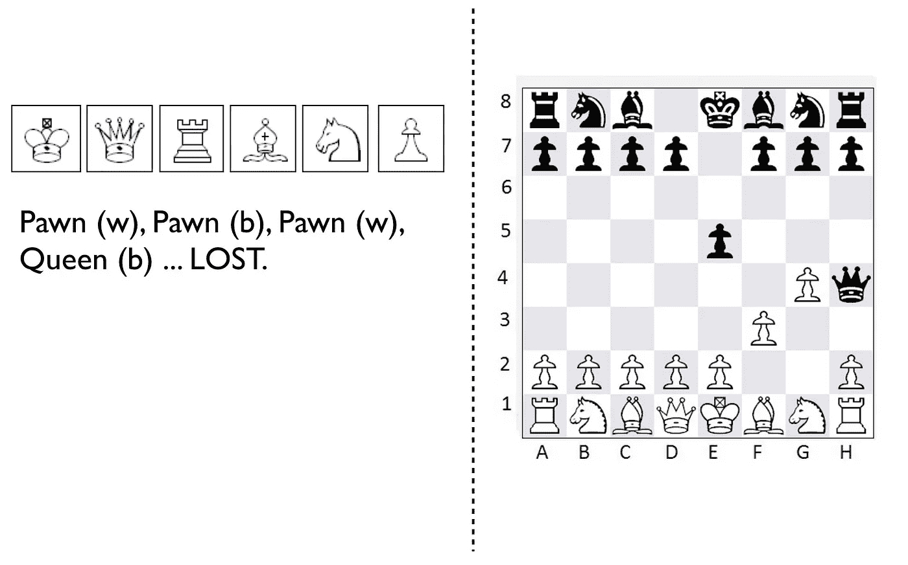
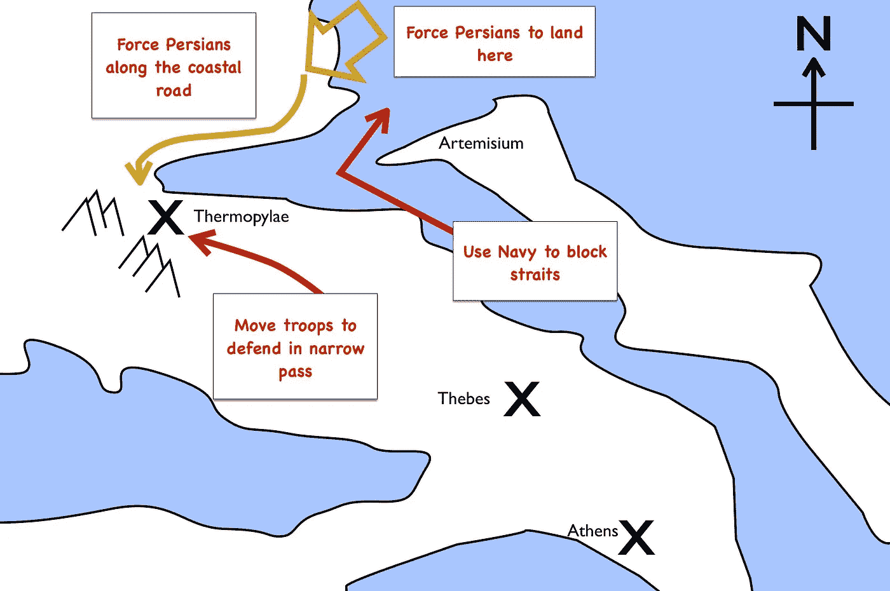
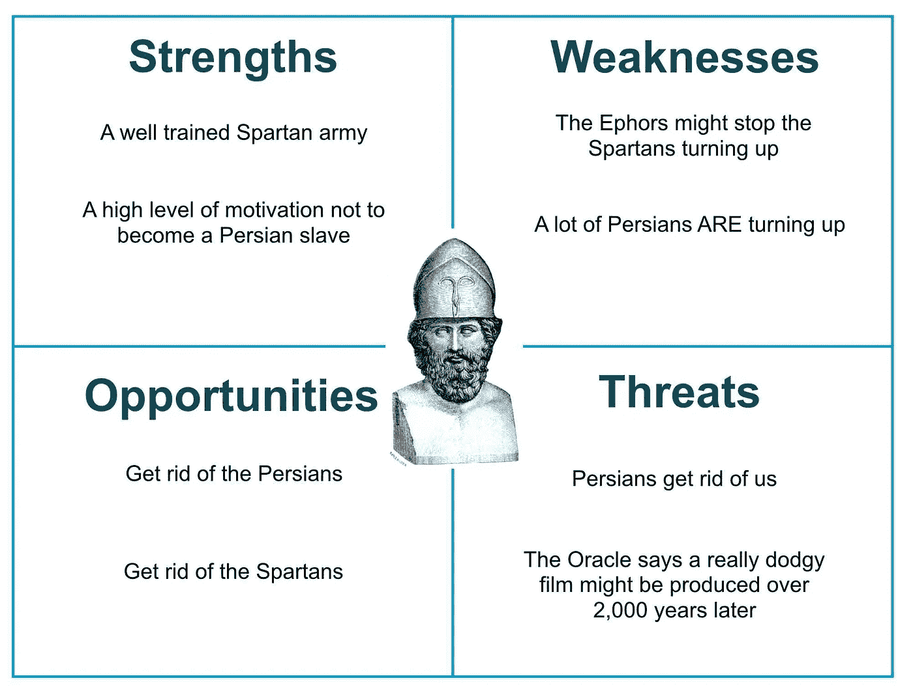

# 为什么大数据和算法不会改善商业战略

> 原文：<https://medium.com/hackernoon/why-big-data-and-algorithms-wont-improve-business-strategy-54e4ebe2398>

## …对于大多数公司来说。

这些年来，我听到很多人谈论算法业务以及大数据将如何改善商业战略。对大多数人来说，我强烈怀疑它不会。我最初是在 2015 年 2 月写这篇文章的，从那以后我观察到的情况让我觉得值得重复一遍。为了解释这个问题，我要说一些很多人会觉得不舒服的话。

## 象棋和商业

我想让你想象你生活在一个每个人都和其他人下棋的世界里。你的棋艺有多好真的很重要，它决定了你的地位和财富。每个人都通过一个大型计算机网格来扮演每个人。棋手的等级被创造出来，赢的人被庆祝。竞争非常激烈。

然而，最奇怪的是，这个世界上没有人真正见过棋盘。当你在这个世界下棋时，你通过一个**控制面板**来完成，它看起来像这样…

每个玩家轮流按一个棋子。每个玩家都知道另一个玩家按了哪个棋子。白棋先开始。

然后是黑色的指示物，然后是白色的，然后是黑色的，这样游戏继续建立按下的顺序。

游戏一直持续到某个时刻，通常是在长时间的连续按压之后，系统宣布有人赢了或者是平局。

任何一个玩家都不知道，实际上有一个棋盘，当他们按下一个棋子时，那个类型的棋子被随机选择。然后，该棋子被移动到棋盘上从所有合法移动中随机选择的位置。白棋的第一步可能是选择“卒”，然后白棋的八个卒中的一个会向前移动一两格。但是所有这些对玩家来说都是隐藏的，他们不知道这些存在，他们不知道有一个板…他们所看到的只是控制面板和按下的顺序。

但是，我们有序列！在这个序列中，人们会发现“有利”的模式，例如，最好的玩家似乎会尽可能多地压迫女王！人们会想出自己最喜欢的组合，并尝试学习其他获胜者的组合！

*“当你的对手移动骑士时，你应该用皇后、皇后、车来反击”等。*

这个世界的人会写一些关于秘密知识的书，比如*《主教的艺术》*或者*《十大最受欢迎的成功赢家序列》*。随着你在越来越大的“大数据”系统中聚集越来越多来自不同游戏的数据，人工智能被应用，那么更多的模式将被公布，更多的成功秘诀将在流行出版物中公布。你已经可以想象《哈佛商业评论》上的那篇文章收集了超过 100，000 场比赛的序列，并宣布了*女王、女王、卒、骑士*的杀手组合。

请记住，这并不是因为人们愚蠢，他们只是对这个世界上的棋盘没有概念。一些有经验的人甚至会得到一个模糊的概念，那就是有一幅风景，一个我们正在玩耍的棋盘。让我们假设这些人中的一个——幸运地，偶然地或以任何方式——认为风景确实存在，并以某种方式找到了与它互动的方法。想象一下，有一天，你扮演那个人，但是他们可以看到一些非常不寻常的东西…棋盘。你开始计划使用你最喜欢的开局组合*卒、卒、骑士。你迈出了第一步。*

他们用*卒*反击，你下一步棋，他们反击，你就输了。

“那里发生了什么怪事！”你尖叫。显然，这只是运气！但以防万一这是一个新的秘密序列，你潦草下来他们的新闻。"*卒*，*后——哇多么简单的一个序列！"*

但是你每次玩这个玩家，你都输，而且输得很快。你不断记录他们的序列，甚至试图用他们的序列来对付他们。他们在两种压力下击败你——卒(b)和皇后(b)(被称为傻瓜的伴侣)，或者他们在四种压力下击败你——卒(b)、皇后(b)、主教(b)、皇后(b)(被称为学者的伴侣)，但你不能复制他们的成功，即使你复制他们的序列，它永远不会工作，你会一直输。

人们会对这位球员令人难以置信的技巧感到惊讶，但也会对他们无法复制成功感到困惑。他们将开始寻找各种不同形式的答案来解释正在发生的事情。也许不仅仅是顺序而是玩家按下按钮的方式？也许是时机？也许是他们午餐吃的东西？也许是他们的态度，一种文化的东西？他们似乎很高兴(因为他们赢了)。快乐是胜利的秘诀吗？各种各样的关联和推测都会被提出来。

然而，这种或特殊的按键方式并不幸运。控制黑色的玩家有更强的态势感知能力。玩家控制白棋的问题是他们没有真正理解他们所玩游戏的背景。怀特的**控制面板**只是风景的一个影子，按压的顺序缺乏任何位置信息或对棋盘上运动的一致理解。当面对一个确实了解环境的玩家时，通过**控制面板**或人工智能或算法的应用程序对按压序列的组合进行大量的大规模数据分析不会对你有所帮助。

我需要强调理解地形的这一点和情境意识的重要性，所以我们现在将注意力转向另一个故事——地米斯托克利。

## 地米斯托克利 SWOT 分析

塞莫皮莱之战(三百人的故事)和希腊人与强大的薛西斯军队之间的冲突，作为景观力量倍增效应的一课，在历史上回荡。地米斯托克利设计了一个战略，雅典海军将封锁阿耳忒弥斯海峡，迫使波斯人沿着沿海道路进入狭窄的塞莫皮莱山口，在那里一支较小的部队可以用来阻挡数量大得多的波斯人。我在下面提供了一张地图。

现在，地米斯托克利有了选择。他可以保卫雅典或底比斯，但他选择封锁海峡，开发地形。地米斯托克利的每个选项都代表了地图上不同的**和**位置。同样，我们开明的棋手有许多**在哪里**移动棋盘上的棋子。通过了解情况，你可以根据**为什么**一步棋比另一步棋更好做出选择。这是需要理解的关键点。

人们经常谈论**为什么**在战略中的重要性，但是**为什么**是一个相对陈述，即**为什么**在这里在那里。要回答**为什么**的问题，你需要首先了解**在哪里**，这需要情境意识。

现在想象你在希腊军队里。地米斯托克利在战斗前夕出现了，他带着目的和目标激励着军队——“我们需要保卫希腊城邦对抗薛西斯的部落”。让我们假设希腊军队(国家军队的集合)有各种各样但总体上体面的原则，例如，作为一个团队工作，擅长你所做的，相互合作，训练有素。但是现在想象一下，希腊这边没有人有地图的概念，甚至没有人理解地图。

地米斯托克利走上前去，告诉士兵们“不要害怕，我们是世界上最伟大的战士”，他以 SWOT(优势、劣势、机会和威胁)图的形式宣布了他的伟大愿景。

你有多自信？我知道我会逃之夭夭。现在就战斗而言，我希望你会同意，一个基于对环境的理解的战略将会比一个基于 SWOT 分析的战略优越得多。同样，从交流和学习的角度来看，一张地图轻而易举地击败了一个 SWOT。

然而，你需要问自己的问题是— ***我们在商业中最常用的是什么？SWOT 还是地图？***

## 关于商业和情境意识

大多数企业存在的问题是，他们很少或根本没有情境意识。大多数高管甚至没有意识到，你可以绘制商业环境图，提高对形势的认识。他们通常就像使用控制面板的棋手一样，不知道棋盘的存在，而是依赖其他棋手的成功秘诀— *“我听说亚马逊刚刚这样做了，我们也应该这样做”*

我说不经意是因为这些人并不愚蠢，他们只是不知道风景的存在。但是我们怎么能确定这是真的呢？语言和行为通常是我们最大的线索。如果你拿我们的两个棋手(很少或没有情景意识的白棋，水平很高的黑棋)来说，你经常会看到行为和语言上的显著差异。

那些情景意识水平高的人经常谈论定位和移动。他们的策略是从哪里来的，所以他们可以清楚地表达为什么他们要做一个特定的选择。他们倾向于使用视觉表现(黑板、地图)来表达现在和过去的遭遇。他们从这些观想中学习。他们学会预测别人的行动并准备反击。他们周围的人可以从地图上清楚地表达战略。那些有情境意识的人会谈到在哪里的重要性— *“我们需要把他们赶进关口”*、*“我们需要拥有这部分市场”*。他们描述了战略是如何从理解背景、环境并利用它为你所用中衍生出来的。策略总是适应环境。

那些情景意识水平低的人经常谈论行动的方式、内容和时间(例如，压力的组合)。他们倾向于把执行作为重点。他们很少或根本不了解潜在的原因。他们很少或根本没有定位的概念，他们经常“复制”他人的行动—*“X 公司从实施数字优先战略中获得了这些好处，我们也应该这样做”*。他们拥有的任何策略通常都是直觉、讲故事、炼金术、复制、魔术数字，并且没有任何想象比赛场地的手段。当被要求用模糊的陈词滥调之外的任何精确描述策略时，他们周围的人经常表现出困惑。那些缺乏情境意识的人经常会说为什么的重要性？它们描述了战略应该如何从您的愿景(即总体目标)中产生。当你问他们*“你能给我看一张你们竞争环境的地图吗？”时，他们经常兴奋地看着你*

早在 2012 年，我采访了硅谷的 160 家不同的高科技公司，查看他们的战略水平(特别是他们的情境意识)与他们使用开放(无论是源代码、硬件、流程、API 还是数据)作为操纵环境的方式。这是[前沿论坛](https://leadingedgeforum.com/)研究的一部分，我们认为这些公司是最具竞争力的。

这项研究表明，公司之间在战略策略和情境意识方面存在显著差异。当你把过去 7 年里的行动趋势和以市值变化衡量的表现加进去，那么那些高水平战略投资者的表现远远好于那些低水平投资者。

Leading Edge Forum 2012 study on situational awareness versus action

这是硅谷和少数精英。从那以后，我进行了各种各样的采访，我得出的结论是，不到 1%的公司有任何可视化他们的环境并不断从中学习的机制。绝大多数人很少或根本没有情境意识，但他们在世界上与同样缺乏情境意识的人竞争。

这可能是为什么大多数战略文件包含了行动的暴政，以及为什么大多数公司似乎复制战略迷因，并依赖向后因果关系。我们应该以数字为先，以云为先，我们需要一个针对大数据、社交媒体、云、从数据中获得洞察力、物联网的战略……亚达亚达。毫无疑问，这也是为什么公司会被可预见的变化所扰乱，并且无法克服他们对变化的惰性。

与此同时，我看到一些公司和不同政府部门使用地图取得了显著的效果，并发现其他人也有相同的思维模式，并利用这一点来摧毁对手。现在，我不认为我们已经接近了商业情境意识的顶峰——将会发现比现在更好的方法、技术和模型。

这让我回到了标题。在上面的国际象棋比赛中，是的，你可以使用大规模数据分析、人工智能和算法来发现按压序列中的新模式，这肯定会帮助你对抗同样盲目的竞争对手。这些技术还将帮助你在业务中改善你的供应链，或了解用户行为、营销或忠诚度计划、运营绩效，或我们对环境有所了解的任何领域。

但这不会在策略上帮助你对抗有更好情境意识的玩家。大多数商业策略本身都是在情景意识的真空中运作的。对于绝大多数人来说，我还没有看到任何真正的证据表明大数据会改善这种情况。有几个罕见的例外，但总的来说，关键是首先要了解景观和景观的存在。

唉，对大多数人来说，这将成为狩猎的神奇序列…卒，卒…什么？我又输了？

如果你要去— *“那么，你如何规划一个企业？”* —相当简单。为了在你的道路上帮助你，[我正在写一本书](https://medium.com/wardleymaps)，所有知识共享[归属共享 4.0 国际](http://creativecommons.org/licenses/by-sa/4.0/) 关于如何用一种我已经用了十多年的技术做到这一点。请随意自便。

*原载于 2017 年 1 月 8 日 blog.gardeviance.org***。**

******

> *[黑客中午](http://bit.ly/Hackernoon)是黑客如何开始他们的下午。我们是 T21 家庭的一员。我们现在[接受投稿](http://bit.ly/hackernoonsubmission)并乐意[讨论广告&赞助](mailto:partners@amipublications.com)机会。*
> 
> *如果你喜欢这个故事，我们推荐你阅读我们的[最新科技故事](http://bit.ly/hackernoonlatestt)和[趋势科技故事](https://hackernoon.com/trending)。直到下一次，不要把世界的现实想当然！*

**