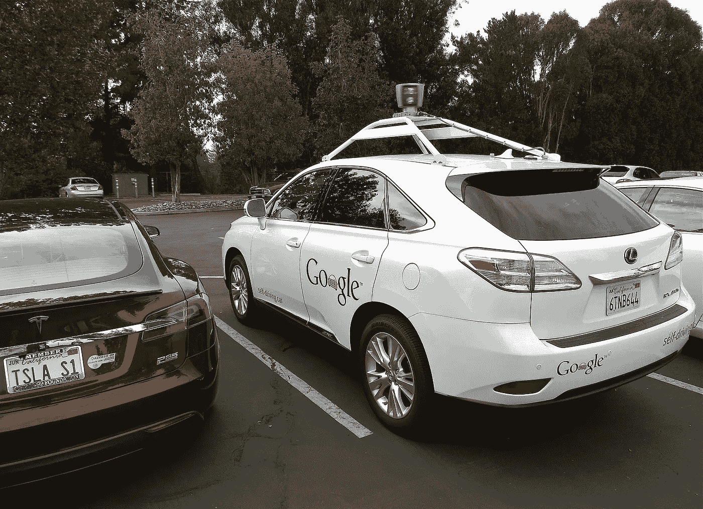
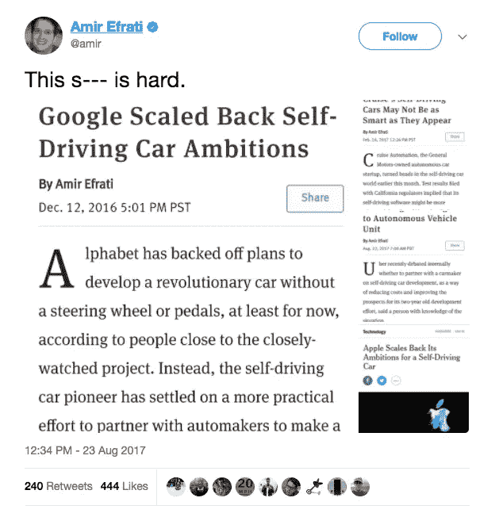
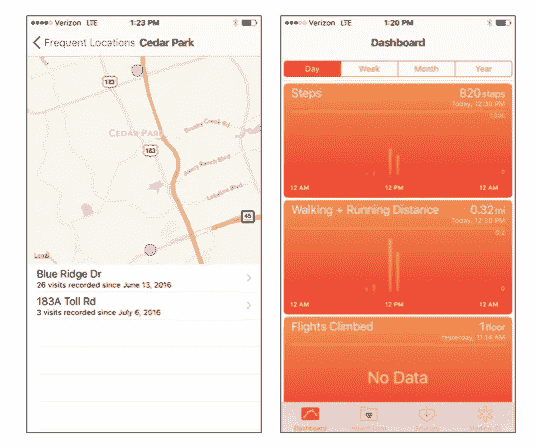

# 为什么 BigTech(苹果，谷歌)正在缩减自动驾驶汽车的规模。

> 原文：<https://medium.com/hackernoon/why-bigtech-apple-google-is-scaling-back-on-self-driving-cars-8448ec91e12a>

## …以及他们在做什么。

By Steve Jurvetson [CC BY 2.0 ([http://creativecommons.org/licenses/by/2.0](http://creativecommons.org/licenses/by/2.0))], via Wikimedia Commons

*我最初在 2016 年 6 月发表了这个帖子的一个版本。这个更新，加上最近的消息，进一步证实了我当时的一些假设。*

上面的推文证实了一些我们都很清楚的事情，那就是在我们让自动驾驶汽车上路之前，还有很多事情要做。但是为什么会这样呢？难道这些公司没有技术知识和无限的资源来实现我们的自动驾驶汽车梦想吗？事实证明，有三个技术问题使这变得困难。

除非发生一连串可怕的[自动驾驶事故](http://www.theverge.com/2016/6/30/12072408/tesla-autopilot-car-crash-death-autonomous-model-s)，无人驾驶汽车运动将继续全面展开。随着 Elon Musk 宣布“*全球监管机构的批准将需要大约 60 亿英里(100 亿公里)的时间，该技术正在不断进步。* [*当前的车队学习速度为每天 300 万英里(500 万公里)*](https://www.tesla.com/blog/master-plan-part-deux) *。”*每一家大型技术和汽车公司都在投入资金和智力，将我们带入一个乌托邦式的未来，在这个未来，将不会有任何因人为驾驶失误造成的交通事故。但事实证明，实现这一目标比这些公司预期的要困难得多。

我的第一个问题是，为什么这些软件第一公司认为他们可以转身制造汽车？为什么我们都认为这种推动中最重要的是硬件/自动驾驶汽车的实际发展？我们忘记了实现未来需要很多方面的技术。这些公司制造汽车从来都没有意义。

## 我们现在拥有的技术

制造无人驾驶汽车所需的零部件技术已经取得了一些令人震惊的进步。

1.  **实时大规模建模** : [Carcraft](https://www.theatlantic.com/technology/archive/2017/08/inside-waymos-secret-testing-and-simulation-facilities/537648/?stream=top-stories) ，是 Waymo 的类似魔兽世界的软件，可以在 Waymo/Google 目前部署自动驾驶汽车的任何城市[进行 25，000 次自动驾驶模拟](https://www.theatlantic.com/technology/archive/2017/08/inside-waymos-secret-testing-and-simulation-facilities/537648/?stream=top-stories)。这种水平的测试在以前是不可能的。数百万英里的模拟让我们达到了第 4 级(完全自主)，至少在模拟中，并且在它可以作为商业可行的汽车上路之前，越来越接近我们需要的位置。
2.  **更便宜的激光雷达:**你在大多数自动驾驶汽车上看到的那个看起来很有趣的传感器(上图)被称为激光雷达，代表光探测和测距。它确实如其名，是自动驾驶汽车的关键数据收集组件。商用激光雷达系统的价格在 1000 美元到 70000 美元之间，这对任何汽车制造商来说都是一个令人望而却步的成本。[麻省理工学院的光子微系统小组声称他们可以以低至 10 美元的价格制造激光雷达，将其缩小到硬币大小以下](http://spectrum.ieee.org/tech-talk/semiconductors/optoelectronics/mit-lidar-on-a-chip)和[威力登声称他们可以将子系统成本降低到 50 美元以下](http://spectrum.ieee.org/cars-that-think/transportation/sensors/velodyne-announces-breakthrough-in-solid-state-lidar-design)！[摩尔定律完全生效](https://www.intel.com/content/www/us/en/silicon-innovations/moores-law-technology.html)。
3.  **机器学习规模的数据收集和分析**:目前在道路上行驶数千英里的每一辆新特斯拉都在获得如何在我们*人类出没的道路上自主导航的知识*。每辆车每多行驶一英里，就会获得更多的集体知识，并将其存入一个中央数据库，在那里使用机器学习进行实时分析。特斯拉[的*汽车群*](https://hackernoon.com/swarming-the-power-of-1m-evs-teslas-on-our-roads-cab1bfa1615)正在实现对现实生活中驾驶的更多模拟。该系统可以使用 ML 根据大量训练过的数据做出决定，而不是编写规则让车辆遵循。

## 我们还需要弄清楚的是。

1.  **实际上是常态的边缘案例(大脑)** : [在美国，训练自动驾驶汽车是可能的，因为有可执行的编码规则和法规来管理道路](/self-driven/putting-the-car-in-self-driving-cars-5d0280eda99a)。虽然这些规则可能会被打破，导致事故等，但在大多数情况下，我们习惯于遵循道路规则。你可以训练你的软件遵循这些规则。但在像尼日利亚这样的地方却不是这样，那里没有规则，也没有违反现有少数规则的后果；你需要大量的模拟来迎合这种可能性。由于缺乏结构化道路，模拟要求变得更加复杂；在你有时间更新你的数据库/Carcraft 之前，路径变成了道路，又变回了路径。
2.  **技术挑战(大脑和身体)**:继续上面的观点，一个没有规则的世界的技术复杂性将考验无人驾驶汽车能力的极限。[冗余机械系统](/self-driven/putting-the-car-in-self-driving-cars-5d0280eda99a)将被内置到汽车中，以确保汽车在这些*边缘但正常*情况发生时做出充分反应。本质上，这不是汽车的问题，而是我们其他人的问题。我们真的不可预测。技术还不够先进，无法捕捉另一辆车中驾驶员的背景和精神状态。从现在到路上所有其他汽车都自动驾驶的这段时间将会很有趣。
3.  **硬件仍然很难**:特斯拉汽车的生产和推出延迟(以及许多软件支持的硬件公司的死亡)让我们忘记了推出硬件是很难的。我们忘记了组装汽车的技术难度，匆忙地认为将先进的软件与快速变化的材料硬件结合起来轻而易举。硬件还是硬的。

那么，对于一家没有传统造车经验的科技/软件公司来说，最佳策略是什么呢？

## 苹果案例研究

就像[微软/Cortana 与日产和宝马](https://www.theverge.com/ces/2017/1/5/14184140/microsoft-cortana-nissan-bmw-car-integration)以及[way mo/谷歌与本田](https://www.bloomberg.com/news/articles/2016-12-21/honda-in-talks-on-self-driving-technology-with-google-s-waymo)一样，软件 DNA 公司的最佳方法是为自动驾驶汽车构建操作系统。这也是苹果正在做的事情。**苹果正在基于 iPhone/Apple Watch 构建自动驾驶汽车操作系统(OS ),作为最初的便携式远程信息处理设备**:知道汽车在哪里，处于什么状况，并记录这些信息以做出更好的决策，这是每辆自动驾驶汽车都需要的。我们都知道我们的 iPhones 已经是个人远程信息设备(我希望你知道)。这款手机可以追踪你的位置和健康状况(见下图)。自动驾驶软件有两个要素，[地图和驾驶数据](http://ben-evans.com/benedictevans/2017/8/20/winner-takes-all)。对于苹果来说，建立一个 CarOS 将是地图和健康软件的自然延伸，这些软件目前正被你我在世界上导航所捕获。

Starbucks location…and I still need to get my steps today.

成为卡罗一家是苹果能采取的最具战略意义的相邻举措。为什么一家公司会忽略其销量最大的资产[超过上周售出的 10 亿部 iPhones】，而专注于一种资本密集型而非核心竞争力的产品？为什么苹果会进入一个被谈论最多的公司还没有交付超过 25 万辆汽车的领域？是的，](http://www.theverge.com/2016/7/27/12302542/apple-billion-iphones-sold)[特斯拉 Model 3](http://time.com/money/4279052/tesla-model-3-sales-electric-cars/) 的订单打破了电动汽车的销售记录，但真正的工作将是交付这些汽车，这将是很有意思的。

随着我们走向一个拥有汽车的人越来越少，但人们会继续购买 iPhones 的未来，我不认为苹果会放弃为之努力的东西。

> 想象一下，一个操作系统可以让任何品牌的自动驾驶汽车与乘客 iPhone 上的远程信息处理系统配合工作？天衣无缝。

无论你选择使用哪种出租车/汽车服务，iPhone 上的标准 autonomous CarOS 都将改善路线并为你提供汽车——autonomous 优步出租车应用程序很可能只适用于优步汽车——并改善客户服务，因为无论自动汽车服务提供商是谁，你都将获得最近的汽车/出租车。

苹果正在向这个新行业中最优秀的工程师学习，这样它就可以像对待 iTunes 一样对待这个行业。一个 CarOS 将会通过

*   让我们每一个拥有 iPhone 的人都可以从任何供应商那里订购任何你需要的汽车或出租车。这是一种单点模式，就像 ITunes 中的 99 美分单曲。
*   公平竞争，加速共享资源模式，任何拥有自动驾驶汽车的人都可以在没有中介的情况下将自己的汽车出租给任何人，并通过(你猜对了)Apple Pay 获得支付。
*   与 Apple HomeKit 相结合，为 Apple 客户在家中和车上提供无缝的便利体验，这是业内其他任何公司的服务孤岛所无法比拟的。

如果我们承认苹果公司关心设计，了解客户，那么自动驾驶汽车，以及其固有的[商业](https://hackernoon.com/tagged/business)风险，是错误的战略。我对苹果的另一个了解是，该公司太聪明了，不会在未来之战中继续放弃领导权。亚马逊(Amazon)、Alphabet 和脸书(Oculus 等)正在定义一个未来。对于苹果来说，汽车的自主未来和([联网家庭](https://hackernoon.com/apples-next-move-it-s-obvious-but-we-re-missing-it-838024c7bfbf))的 CarOS 意义重大。这是苹果和其他大型科技公司唯一可以采取的低投资、做自己擅长的事情的策略。Autonomy 的[技术](https://hackernoon.com/tagged/technology)将成为商品。对科技公司来说，关键问题是，谁会首先拥有汽车公司必须依赖的足够强大的操作系统？

**结论**:我相信我们最终会有 3-4 个平台/操作系统，传统汽车制造商将选择与哪个自主软件提供商合作。[这也是苹果可能收购特斯拉的另一个令人信服的原因](https://hackernoon.com/apples-next-move-it-s-obvious-but-we-re-missing-it-838024c7bfbf) …

你可能会喜欢这篇关于苹果的文章

https://hacker noon . com/apple-next-move-it-s-obvious-but-we-re-missing-it-838024 c 7 bfbf？source = link share-e 502 EDF 967 BF-1504123160

*请分享、点赞、推文。***使用我们的定制工具写你自己的博客，并注册*[*polympathy 每月简讯*](https://www.getrevue.co/profile/seyifabo?utm_campaign=Issue&utm_content=forwarded&utm_medium=email&utm_source=Seyi+Fabode)*——如果你已经读到这里，我敢打赌你会喜欢这两个。* [***你可以在亚马逊***](https://www.amazon.com/dp/B072875DFJ) *上买我的书《抗碎网格》。**