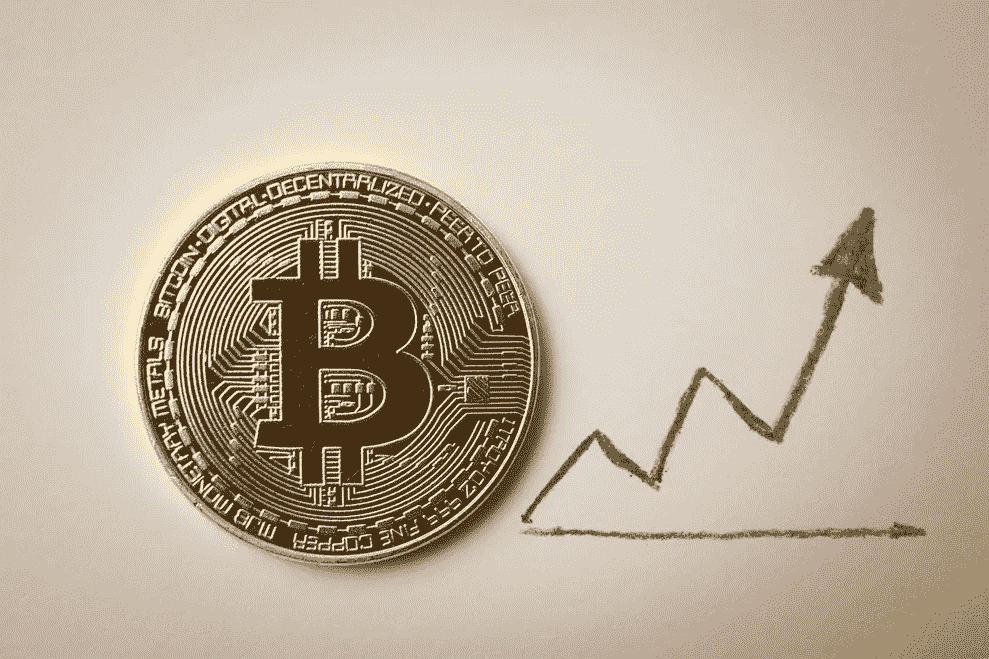

# 为什么比特币(不一定)存在泡沫

> 原文：<https://medium.com/hackernoon/why-bitcoin-is-not-necessarily-in-a-bubble-e5ea44a352a1>

Is Bitcoin in a bubble?

随着今年比特币价格的飞速上涨(超过 9000 美元/BTC)，很多人都在谈论比特币存在泡沫。

这里有一篇最近的文章采取了这种立场。[https://www . Bloomberg . com/news/articles/2017-11-27/citadel-s-ken-Griffin-says-bit coin-bubble-may-end-in-tears](https://www.bloomberg.com/news/articles/2017-11-27/citadel-s-ken-griffin-says-bitcoin-bubble-may-end-in-tears)

像这样的文章有一些共同的主题，即。

1.  比特币没有内在价值(与股票、黄金等商品货币或美元等法定货币相比)
2.  最近价格猛涨。
3.  价格上涨是基于大傻瓜理论

第 1 点是需要解决的关键点，因为它与“公允价值”的概念有关，因此隐含了第 2 点和第 3 点。

如果公允价值高于当前价格，那么最近的大幅上涨不是一个长期问题，第三点可以重新表述为价格上涨是基于“押注于尚未被说服的人”而不是“押注于更大的傻瓜”理论。

因此，这一切都取决于比特币的公平或真实价值。我反复看到的证明比特币被高估(或者根本不应该有任何价值)的一个论点是，它没有‘内在’价值。

这是基于对货币的错误理解。与黄金等商品货币相比，这一点最容易理解。

像黄金这样的货币既有内在价值(用于珠宝、工业用途等)。)以及市场价值。

适销性价值基本上是一个经济行为者的信念，即如果他们接受(比如说)黄金支付，他们很可能能够在未来用它来购买其他东西。

适销性价值也被称为网络效应价值、流动性价值或(对反对者而言)更大的傻瓜价值。

现在，事实证明，像黄金这样的商品货币，其市场价值远远超过了内在价值。因此，人们对内在价值的最好评价是，它为货币价值提供了一个**底线**。

关于内在价值的另一件事是，它是一种将交易商品转化为货币的机制。这实际上是奥地利经济学家的货币起源理论。[具有讽刺意味的是，很大一部分热衷于健全货币(比特币可能是)的奥地利经济学家断言，比特币不能(或不应该)存在，因为它不是从内在价值(商品)来源中获得的！]

因此，如果一种货币能够在没有内在价值的情况下以某种方式[提升](https://hackernoon.com/tagged/bootstrap)可销售性、流动性或网络效应，那么在这一点上*内在价值的缺乏就没那么重要了。内在价值只是为货币价值提供了一个(相当低的)底线。*

关于*比特币如何在没有内在价值的情况下产生网络效应的问题，是另一篇文章的问题。(这无疑会让奥地利人的愤怒降临到我身上)。*

回到比特币是否存在泡沫的问题。根据上面提出的论点，我们不能肯定地说，缺乏内在价值自动意味着比特币存在泡沫，这是这篇文章的主要观点。

比特币*可能*存在泡沫，但这取决于网络效应是否会继续加速，或者是否会出现信仰的丧失和网络效应的逆转。

网络效应将继续加速的论点:

*   作为领先的加密货币，比特币拥有良好的声誉和品牌认知度
*   在“储值”用例中，它似乎是赢家。如果比特币“赢得”这个用例，那么它的价值可能会比今天的高得多。
*   在相对较长的一段时间里，它表现出了持久的力量，其间出现了巨大的波动。(10 年)
*   越来越多的人开始理解比特币是潜在的可靠货币(比特币数量上限为 2100 万)，因此是一种很好的价值储存手段。
*   到另一个(潜在的更好的)网络的高切换成本。网络效应往往是强大的。

网络效应将终止甚至逆转的论点

*   一种更好的加密货币出现并取代了它。
*   货币在历史上被用作价值储存手段和交换手段。由于比特币众所周知的可扩展性问题，它可能无法作为低价值交换的交换手段。这将把它边缘化到所谓的定居层。两个因素缓解了这一问题。首先，比特币可能会解决其可扩展性问题。其次，它不能用于低价值交换并不明显，这是储值用例的丧钟。
*   一个灾难性的错误或发现了协议中的一些根本弱点。
*   政府大力打击加密货币，尤其是比特币。
*   治理问题导致比特币对市场反应迟钝。消费者中更多的硬叉子、混淆和品牌稀释。
*   内在价值的缺乏会加剧网络效应的释放(即恐慌)，这可能由其他因素触发，因为甚至缺乏低(内在)价值底线。这就是比特币没有内在价值的真实影响。一些加密货币可以也将会变得毫无价值。
*   主流采用的可用性挑战。例如，如何使您的私钥如此安全，以至于没有人能够找到、破坏或窃取它，但是您可以找到并使用它(并且安全地使用它)。
*   比特币是通货紧缩的，经济不能在通货紧缩的情况下运行。这本身就是一个有趣的话题。首先，它假设比特币成为主导货币，这在这一点上似乎有些牵强。其次，有一些看似合理的观点认为，通缩经济学会导致一种不同的经济学，这种经济学严重偏向高回报投资，而非消费。鉴于一个经济体中相互作用的变量的数量，一个经济体是否能在通缩模式下成功运行仍有待观察。
*   波动性太大，无法成为价值储存手段。显然，我们目前看到的巨大波动性反对比特币赢得“价值储存”用例。然而，比特币之所以波动，正是因为潜在的最终奖金如此之大，以至于现在假设的微小变化都会对最终奖金是否可以实现的信念产生巨大影响。在供应链中，这有时被称为牛鞭效应。如果比特币在储值使用案例中继续获得(或失去)市场份额，随着参与者对结果越来越确定，这种波动性将自动开始减弱。

以上所有这些都是比特币的主要风险，但必须与比特币在评估我们目前是否处于泡沫中的显著优势相平衡。

与大多数泡沫一样，除非回顾过去，否则很难判断一个人是否处于泡沫之中。不同的经济主体对上述因素的权衡会有所不同。

总结这篇文章，比特币可能存在泡沫，也可能不存在泡沫。但缺乏内在价值和当前的价格上涨并不能自动成为断言我们处于泡沫中的理由。