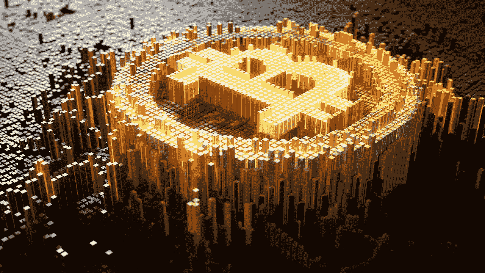
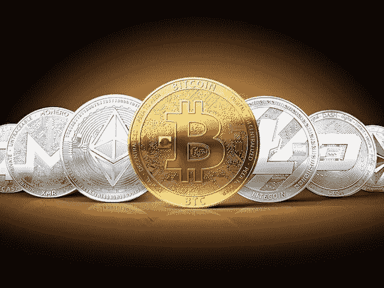

# 为什么比特币应该保持不变。

> 原文：<https://medium.com/hackernoon/why-bitcoin-should-stay-the-same-9e76d82ad5a2>

## 相同=安全=可靠=稳定

*免责声明:*

“一成不变”是夸张的说法。不要太快改变*将是对我的意思更准确的解释。*

**继续前进……**

## *比特币没有改变事物的事实&发展太快实际上可以被视为一种优势。*

*我来解释一下我的意思，用一个例子来对比:以太坊。*

*以太坊是扎克伯格格言“快速移动&打破东西”的密码领域的首要例子。*

*以太坊是一个全球性的、去中心化的开发平台，交易由天然气驱动，天然气以以太定价。*

*他们的目标是建立一个更快的网络，一个更健壮和可扩展的开发平台，并不断发展。简而言之，他们的第一要务是创新。*

*以太坊&真正的开发者社区不一定对投机感兴趣，也不一定对构建/保护网络货币的价值感兴趣。
***他们的货币(以太)的存在是为了支持网络(以太坊/ EVM)。****

*他们想让协议变得更快、更智能、更好——如果这意味着在这个过程中会出问题、出问题，那就这样吧。(显然不是那么漫不经心，但我想在这里说明一点..好的)*

***有了比特币，就反过来了。**
***该协议的存在是为了支持货币。****

*所以在这种情况下，你不希望有太多的变化。您不希望更改协议中的某些内容，这些内容可能会破坏到目前为止积累的价值。*

*变化、适应、调整等都是风险&在它们发生之前需要仔细检查。同意和做出改变的过程需要更加严格。*

*这么想吧。比特币是你想存放钱的地方，你对它拥有主权所有权。*

*这是你的钱。你拥有它。你不想让任何人碰它。*

*你昨天、去年、前年买的东西应该和明天、明年&后年一样(或者基本一样)。*

*类似黄金。它的价值很大一部分来源于这样一个事实，即它过去是什么，现在是什么，将来也是什么。是的，很无聊，但是很安全。*

*比特币与黄金的相似之处(在这个意义上)可以被视为一种优势，除非它显然具有无数其他属性，使其更有价值，即:可转让性、可移植性、可分性(你可能还会争论优越的同质性和可替代性)。*

*因此，尽管比特币可能存在“扩展”问题，尽管可能会有较慢的交易，尽管它可能不是最便宜和最快的网络，但它仍然是最安全的网络，它有最大的网络效应，最大的社区，最基础的基础设施&它仍然是整个行业的基石。*

*比特币已死的说法是愚蠢的。没用的说法也是哑的。*

*它正在演变成一种价值储存手段，同时成为这个领域的储备资产(或储备货币)。*

## *我们有选择！*

*这是新货币经济最精彩的部分。我们有选择。*

**

*Don’t mind the coins..I just needed an image that looked cool..*

*如果你想进行快速、小额、“免费”的交易，例如:1 美元到 2 美元，或者 100 美元到 200 美元，那么你可以用 Dash，Litecoin 或者 Bictoin 现金。*

*如果你想建立一个新的、去中心化的应用，你有以太坊、Ubiq、以太坊经典、EoS 等等。*

*如果你想私下交易，你有 Zcash，Monero，PivX，Sumocoin。*

*如果你想储存你的钱，并确保它的安全，你有 ***BTC。****

*加密“市场”的意义在于你有 ***的选择。****

*兑换快速、简单&几乎是免费的(尤其是与法定货币之间的兑换相比)，所以在加密世界里，你可以选择硬币(或货币)用于应用(购买食物、购买汽车、投资 ICO、给某人小费，等等)，并且你可以随时回到 BTC，那里将(或者应该)保持基本不变。而且安全。*

## *最后*

*所有这些都不是零和游戏。我们正在见证一个新的治理、货币、交换、交易和沟通领域的诞生。*

*你有更多的选择，更少的费用，更多的用例&绝对是改变未来的力量。我们能做的最重要的事情是继续了解它，支持它，使用它&鼓励其他人也这样做。*

*希望你能从这篇文章中获得一些价值。*

*享受这周剩下的时光吧！*

***如果你真的喜欢它，请给它一些爱，为它鼓掌(或几下),并把它传给任何你认为应该读一读的人。***

***我的一些东西有点粗糙，但这样做是希望能让人们更清楚/更深入地思考他们在做什么。***

***希望这篇文章对你有价值！***

***阿列克斯***

*****您也可以关注我:*****

***** [## 亚历山大·斯维特斯基|职业简介| LinkedIn

### 查看 Aleksandar Svetski 在 LinkedIn 上的职业简介。LinkedIn 是世界上最大的商业网络，帮助…

www.linkedin.com](https://www.linkedin.com/in/alekssvetski/)  [## 亚历山大·斯维茨基—中等

### 阅读亚历山大·斯韦茨基在媒介上的作品。试图“思考”的企业家。我所有东西的出口加密…

medium.com](/@AleksandarSvetski)  [## 比特币-黑客正午

### 比特币是一种世界性的加密货币和数字支付系统。这是第一种分散的数字货币。的…

hackernoon.com](https://hackernoon.com/bitcoin/home)*****