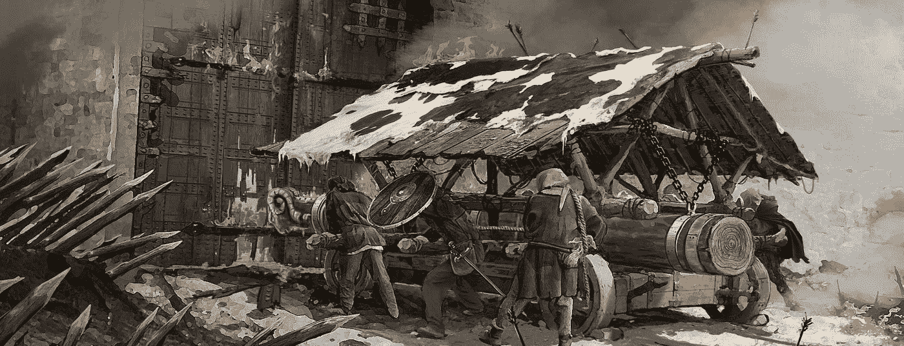

# 为什么区块链会成为其他区块链的敌意收购目标，以及他们如何实现这一目标

> 原文：<https://medium.com/hackernoon/why-blockchains-could-become-hostile-takeover-targets-for-other-blockchains-and-how-they-could-pull-76377a4f2fc7>

并购是让传统银行家们口吐白沫的事情。一想到能赚到那么多钱，他们就垂涎三尺。追逐的刺激。有机会在灯光下看到他们的名字。

当你想收购的公司不欢迎你的进展时，这就变得更加令人兴奋了。他们不是邀请诱惑，而是封闭舱口，动员他们的重锤击退不值得和鄙视的追求者。因此，敌意收购已经成为一个流行文化神话。

战线两边的成功故事变成了战争故事，预示着未来的战斗。这些先例决定了未来战斗的方式。参与者自豪地佩戴伤疤，让所有人都看到。

## M&A 交易本身就是一个迷人的话题

# 但是当它涉及到区块链的时候呢？

这可能发生吗？如果可能，又是如何发生的？区块链显然是一个公共分类账，详细记录了区块链上的历史交易，这怎么可能被获取、屏蔽或删除呢？事实上，有一个历史的痕迹，这怎么可能被静音或其中包含的价值被侵蚀？

接下来的假设可能有点科幻，但它的基础是基于当前经济模型的典型事件。我认为，假设现在适用的技巧和方法在新的经济世界中同样有效是公平的。最终，即使交易发生在不同的交易媒介上，市场的物理性质是相同的。

# 区块链收购如何发生

一个区块链将激励另一个区块链的硬币持有者以折扣价抛售他们的硬币，以换取收购方区块链的新硬币——这是一种恶意收购，可以提高收购方市场份额的价值。这将有效地让公司获得竞争的区块链用户，通过在系统中创建更多的节点来扩大区块链的规模。

这将通过消除竞争来实现，特别是对于区块链承担类似的工作证明或服务证明挖掘算法。

上述内容适用于敌意收购或合并。只有合并的条款会清楚得多。两个独立的区块链的硬币持有者将在新合并的区块链放弃他们的代币以换取新的超级硬币。这将使用智能合约，以正确的比率将正确数量的硬币分配给两组硬币固定器中的每一组。

# 另一种方法可能是特洛伊木马

其中大量用户渗透到一个硬币中，购买资产，以期对区块链进行 51%的攻击。如果这能够实现，区块链将被迫符合大多数利益相关者的期望。从那里，他们将能够与他们喜欢的任何其他区块链合并。

# 这将越来越成为现实

与传统的多数人决定的股票不同，个人可以做出最有利于他们经济利益的决定。为了参与，他们不需要整个区块链通过合并来过渡。收购区块链可以激励目标区块链的一小部分持有者转移到他们的系统中。

与福克斯不同，并购可以一个接一个地发生。每个持有者都可以选择如何处理他们的硬币。

## 把每一枚硬币想象成一个收购目标。把每个人想象成一个可以加入新企业集团的实体

一次干掉几个用户就能大大削弱区块链。这将导致个人在分配计算能力以维护区块链时不太确定。一旦发生这种情况，整个系统就会像纸牌搭的房子一样倒塌。

这就是 Cryptos 相对于传统菲亚特公司的问题。这就是 ICO 优于传统股票和股份的问题。

# 区块链战争将成为大生意

成倍提高散列能力的最简单方法是通过收购或合并。网络效应将变得巨大。区块链合并将标志着权力向个人的重新分配。你拥有硬币，区块链是价值所在，你可以用脚投票。同时，你可以通过增强自己来削弱竞争对手。

## 这是革命性的

# 这就是当前经济模式失败的地方

现在，如果你不相信区块链，而你更愿意与另一个合并，你可以——唯一的警告是你必须自己做

## 这是一个由个人组成的军队所体现的权力和影响力

这是分散控制的梦想。

# 这可能比想象的更进一步