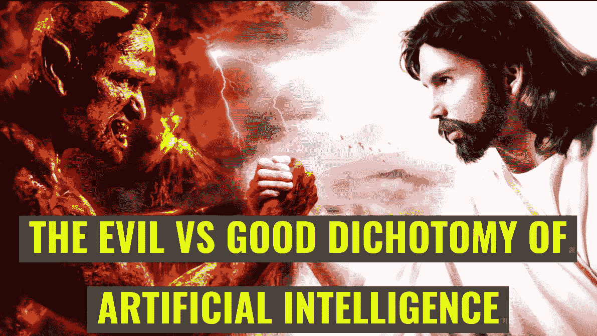
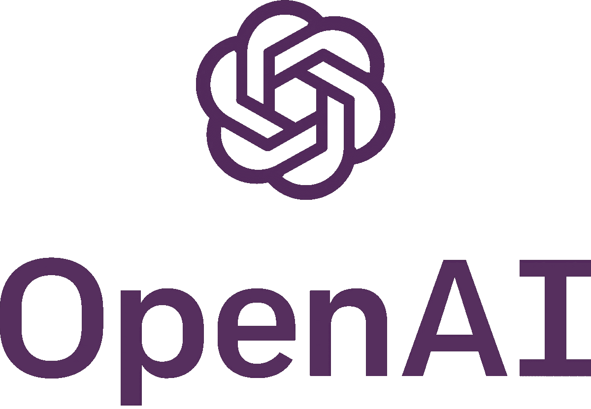
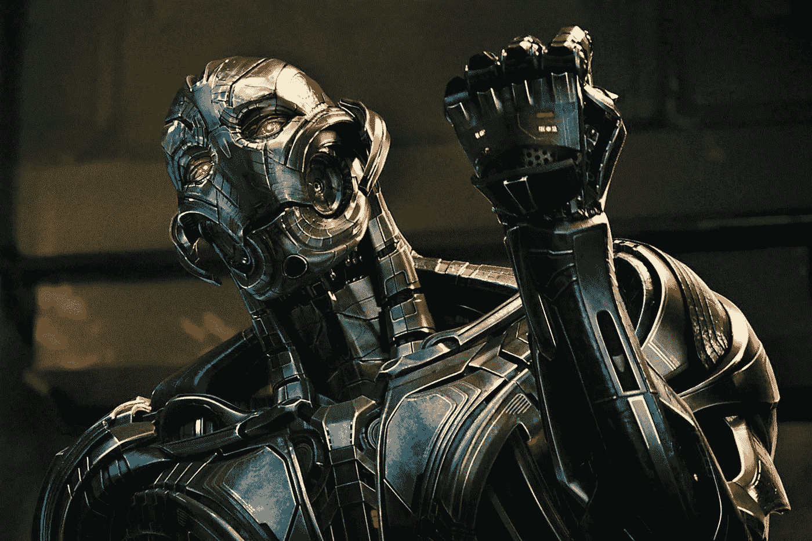

# 为什么马斯克和扎克对人工智能的看法都是正确的

> 原文：<https://medium.com/hackernoon/why-both-musk-and-zuck-are-right-about-ai-3843741078c9>

## 关于人工智能有两种截然不同的观点，依我看，他们都是对的。



谈到人工智能，我们已经目睹了两个截然不同的阵营，它们对人工智能对人类文明的意义持有截然相反的观点。一方面，我们有像马克·扎克伯格这样的人，他们坚信人工智能为人类的利益提供了无限的可能性，并一直在大力投资，以加快机器学习、深度学习和人工智能领域的进展。另一方面，我们有像埃隆·马斯克这样的人，他们对人工智能的观点持批评态度，他们在表达他们的担忧时既直言不讳又非常公开。

这一点之所以变得重要，是因为这场辩论在过去几个月里变得公开化了。

> “我认为那些唱反调、试图鼓吹这些世界末日情景的人——我只是，我不明白。这真的很消极，在某些方面，我真的认为这是非常不负责任的。”

那是扎克。然后我们有麝香。

> “人工智能是人类文明存在的一个根本性风险，而车祸、飞机失事、劣质药品或变质食品则不是。”

所以，我们有两个非常聪明的人用完全不同的方式谈论同一个话题。那么，谁对谁错呢？

## 首先，这整个辩论是关于什么的？

我们必须首先搞清楚的一件事是，这场辩论不是关于人工智能和深度学习的，而是关于它的一个非常具体的应用——自主人工智能。

什么是自主 AI？简单地说，一个人工智能系统不仅能够分析数据，而且能够根据对数据的分析采取行动。旨在交付一组特定结果的行动。

想想 Shopify 这样的电子商务平台。假设 Shopify 有一个扩展/插件，可以让你离开你的 Shopify 商店——比如一个直运商店——进入自动驾驶模式。你只需在第一次设置好，就这样——*你就大功告成了*！系统会自动决定你的产品目录中应该包含哪些产品，在主网站上进行哪些促销活动，应该向哪类消费者突出展示什么样的产品组合等等。所有这些都是在没有你的干预下发生的——*或者换句话说，在你背后*。

你喜欢使用这个系统吗？你当然会——只要它能为企业赚钱。但是，当你第一次看到它推高亏损时，你会大喊*犯规*！

简而言之，这就是问题的本质，我必须在这里指出——我把事情简单化了，举了一个我能想到的可能是最不恶毒的例子。但是，我们稍后会谈到这一点。

## 我不认为马斯克是反 AI 的

我认为，很有可能媒体一直在以一种比马斯克真正感受到的更严峻的方式描绘它。如果你读了《财富》杂志的文章，其中引用了马斯克将人工智能称为我们作为一个文明所面临的最大风险，你会发现马斯克实际上并不主张终止人工智能的研究或进步；他实际上是在强调，在这个不可避免的未来，人工智能将发挥比我们在过去几十年中看到的任何技术进步都大得多的作用，因此需要有“*法规*”。

他没有错。随着人工智能不断渗透到文明和工业化经济的越来越多的领域，与误用和错误相关的风险也将增加。*人类或其他*。那么你会让谁负责呢？你会在诉讼中指定一个超级智能计算机程序作为被告吗？

## 为什么我觉得马斯克不反 AI？



简单明了的证据——就是这样。

看看 Elon Musk 和 Sam Altman(y combinator 总裁)发起的非盈利项目 OpenAI。

"人工智能(AGI)将是人类创造的最重要的技术."阅读他们的网站。

## 为什么扎克如此亲 AI？

你不会吗？毕竟有什么不喜欢的呢？

想象一下这样一个场景，作为脸书的广告客户，你再也不用担心观众的侧写和定位了。几个基本问题(*可能连那个*都没有)，就搞定了。广告平台负责其他一切。展示什么样的广告，应该是视频广告，图片，还是简单的帖子。为了获得最大的影响力和覆盖面，应该突出哪些帖子。不再需要选择提升哪个职位。作为广告人，你唯一需要关心的是你每周/每月的广告支出限额。脸书负责其他一切。

脸书为什么要这么做？毕竟，它难道不想增加从你那里获得的收入吗？为什么 it 应该或将要关注最大化您的覆盖范围或影响？真的很简单。如果它可以帮助你提供最好的活动表现，它会增加你接触目标受众的首选方式的机会。毕竟，更少的努力和更好的表现——哪个广告商不喜欢呢？

同样，这只是深度学习智能系统可以拥有的无数现实生活应用之一——*就在脸书现有的基础设施内*。如果我们扩展一下，可能性是无穷的。

## 所以世卫组织是对的？马斯克还是扎克？

实际上他们两个都是。

我认为马斯克和扎克都同意人工智能和深度学习将在未来几十年产生令人麻木的影响，他们都在努力成为未来的一部分。在许多方面，他们正在创造未来的一部分。

但马斯克表达对人工智能的担忧也是正确的。在这里，我要引用电影《绿灯侠:第一次飞行》中的一句台词。我想我以前在某个地方用过这句话，但不确定是在哪里。)

> 武器是一种强大的力量。你的宇宙中最强大最绝对的。只有一个例外。一个…轻微的…缺陷。不完美…每个武器都有。它的用户。

人工智能就是这种情况。

我们以脸书的广告定位和 Shopify 收入最大化系统为例。现在让我们看一些其他的例子。

# 例 1。假新闻情报

俄罗斯。假新闻文章。宣传。2016 年美国总统选举。脸书，推特广告。

你明白我的意思了，是吗？

人类的思想是易受影响的。如果有一个人工智能系统能够更好地理解每一个公民的偏好，并能够根据改变他对不同问题的看法或完全改变他的政治倾向的单一意图来定制他们的整个新闻提要，那会怎么样？毫无疑问，存在着各种各样的网站，它们在特定的主题上有着截然不同的从属关系和观点。有些网站会在没有丝毫证据的情况下做出判断。然而，现在你面前会有明确的声明，证实那些相对不存在的小怀疑，甚至可能证实你最害怕的事情。你确定这不会改变你对重要事情的看法吗？

但是，让我们给这个系统一些道德纤维。教它为了人类的最大利益而行动。它应该在什么样的范式下运作？如果这个系统——*根据你在*教给它的参数和规则做出决定——决定如果它不再是一个民主机构，而是一个君主制或共产主义政权，这将符合你的国家的最大利益，那会怎么样？接下来会发生什么？

人工智能可能仍然朝着更大的利益而行动，但是它考虑过你为了达到更大的利益而需要付出的代价吗？有没有给它一套全面的参数、规则、条例和场景，让它能够最好地判断*更大的利益*应该是什么样的？即使它有所有这些信息，自由意志发生了什么？

精神食粮！

# 例 2。超级交易平台

现在让我们考虑一个自动化交易平台。基于一套规则进行交易的平台。如果你的平台能够发现一些市场趋势，帮助你获得 20%的利润，这对你来说是好事。但是，如果你的交易平台也能接触到媒体，使其能够植入虚假/错误/可疑的市场见解，以操纵市场情绪，从本质上帮助你获得最大收益，那该怎么办？这样做对吗？那你以牺牲成千上万的人的利益为代价赚了钱呢？有什么理由呢？

如果人工智能有能力给一个地区/国家带来不稳定，可以从根本上影响市场的行为方式，从而使其朝着对你有利的方向发展，那又会怎样？令人烦恼的想法，不是吗？

## 这才是真正的辩论，也是问题所在

如果你不能理解真正的危险，想想电影《复仇者联盟:奥创时代》。



奥创是一个人工智能，不是吗？一个被设计为给这个世界带来和平的组织，由于一些混乱的逻辑，它最终决定在这个世界和和平存在之间的唯一障碍是复仇者联盟，它愿意消灭世界的一部分来克服这个障碍。这就是自主人工智能的全部问题，也是为什么马斯克如此努力地宣传要带来管理人工智能的监管控制。

## 你的人工智能有多好就有多好

人工智能的问题可以用一句话来概括，引用《绿灯侠:第一次飞行》中武器制造者的话。说到底，人工智能是一种工具——由人类创造，而这种工具的健壮性和智能将决定这种工具的有效性。你在这个系统中留下的空白越多，问题就越多。考虑到很难找到一种算法来考虑人类思维能够评估的几乎所有形式的场景，自主人工智能仍然是一个很难推销的东西。无论扎克是瞄准它还是其他人，人工智能还没有到我们可以指望它为我们决定事情的阶段。为了全人类，我希望我们暂时不会到达那里。

# 今天到此为止；明天见！


```
I am Abhishek. I am here... there.... Everywhere...[**Medium**](/@abyshake) **|** [**Twitter**](http://twitter.com/@abyshake) **|** [**Facebook**](http://facebook.com/abyshake) **|** [**Quora**](http://bit.ly/abyshake) **|** [**LinkedIn**](http://in.linkedin.com/in/abyshake) **|** [**E-mail**](mailto:mail@abyshake.com)
```

[](https://upscri.be/a5ccb9/)

Click here to join the mailing list.