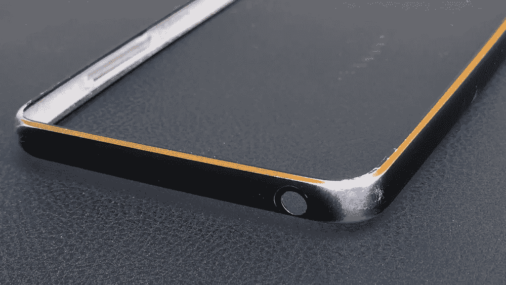
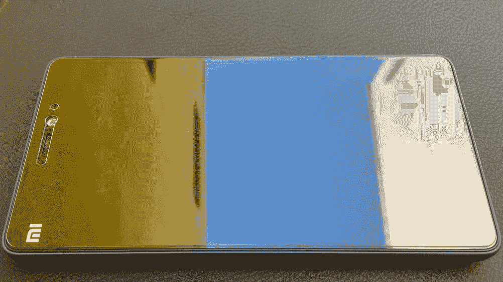

# 为什么买手机让我抓狂

> 原文：<https://medium.com/hackernoon/why-buying-a-phone-is-driving-me-nuts-83153db5efa5>

Too many choices may get us nowhere

漫长的两年过去了，我的 Mi4i 手机终于有了着落。当我以大约 35 公里/小时的速度骑着我的摩托车时，它从我的口袋里滑了出来。出于某种原因，当它在粗糙的柏油路上咔嗒咔嗒地滑行时，我一点也不担心。一位走在路上的先生拿起电话，递给我，说:“我不知道它是否工作。”

我笑了，因为我对我的手机的金属保险杠外壳和钢化玻璃屏幕保护有一种不合理的信心。只是后来当我回家检查手机时，我才注意到严重划伤的屏幕保护罩和磨损的保险杠外壳。

因此，我很高兴地发现这款手机工作正常，这证明了小米的质量。令我不高兴的是，这件事与摔倒完全无关。

The bumper case that absorbed the impact of the fall, while the phone looks as good as new with a new screen guard

我的 Mi4i 没有 VoLTE。这意味着我的 Jio SIM 卡的电话功能不太好。转接电话的 JioVoice 应用程序一直处于离线状态。

这就是我的困境的开始。我需要把手机换成 VoLTE 手机。但是我应该买什么手机呢？

委婉地说，安卓手机的选择范围如此之广，以至于令人困惑。

## 按品牌划分

就像日本曾经代表着卓越的质量，但现在它只是价格昂贵。谁还会买索尼？

“中国制造”曾经意味着质量差，直到小米和其他品牌引起了反思。毕竟，即使是以质量著称的苹果，其大部分手机也是在中国制造的。

由于税收优惠，Micromax 等印度品牌在短时间内拥有价格优势。但是中国人通过在印度开设工厂恢复了平等。

## 按价格走

你有高端的三星，价格比苹果高得离谱。谷歌的 Pixel 也加入了他们的行列，价格在 1000 美元(₹65000)左右。

中档 450 美元(₹30000)的手机像一加提供高端规格与良好的完成结盟。

小米的 Redmi Note 系列预算范围为 200 美元(₹12500)。

然后是低端或低于 150 美元(₹10000)的手机，这对我来说是一个盲点。

## 按特征走

你可以根据手机的功能选择购买什么手机，比如指纹扫描仪，或者屏幕质量，比如 AMOLED 与 LCD，或者背面有两个摄像头的手机。

## 按数字走

或者你可以根据手机规格来决定。6GB 内存的手机通常比 4GB 内存的手机快，而 4GB 内存的手机又比 2GB 内存的手机快。或者屏幕尺寸，从 6 英寸以上的超大平板到目前最受欢迎的 5.5 英寸，再到更小的 5 英寸。或者 1080 全高清(1920x1080 像素)的屏幕质量与仅高清相比。或者百万像素以上的摄像头。

## 根据电池寿命

我们中的一些人只需要一部不用充电就能度过一整天的手机。在这种情况下，我们需要看看配有 4000 毫安时超大电池的手机。不过，如果你用的是 iPhone，plus 系列相当不错，也相当贵。快速充电设备可能也很有用。

## 按用途划分

如果你喜欢游戏，你需要找一个好的显卡、音响系统和不会发热的处理器。谢天谢地，我对游戏不感兴趣，因为我已经有足够多的东西要看了。

电影爱好者需要一部大容量的手机，或者能够读取 USB 驱动器(OTG ),也许还需要一个好的音响系统。

电子产品发烧友需要一部具备红外控制功能的手机来取代电视遥控器的工作，还需要一部支持无线充电的 NFC 手机，等等。

还有一个奇怪的例子，一个矮个子朋友喜欢笨重的手机。当我问他为什么时，他从口袋里掏出一只袜子，把手机扔了进去，威胁地甩了甩。似乎他在学生时代曾经因为他的身高而被选中，这是他首选的防御方式，因为随身携带是完全合法的。接受所有类型。

## 回收利用

仅仅因为我的 Mi4i 缺少一项功能(VoLTE)就扔掉它，这似乎是犯罪行为。为了减轻我的罪恶感，我寻找一个交换计划。Flipkart 提供了一个，我检查了一下，如果我把它换成低端的 AMOLED 屏幕的三星 On8，我能得到什么。Flipkart 说₹3200.不太好。然而，三星看起来有点过时，第二天交换协议在手机上取消。稍后将详细介绍。

## 按品牌走

所有这些混乱使它成为品牌科学的理想产品。一加的粉丝通常会坚持使用这个品牌，因为他知道这款手机有很好的构造和高端规格。对于 Pixel 和 Samsung 的人来说也是如此，他们不介意支付高价，因为他们保证了质量。这就是为什么爆炸的三星手机是如此大的新闻。

我对 Mi4i 的体验使我成为小米的粉丝。我还拥有小米手环，价格是 31 美元，非常划算(₹1999).问题是，过去几个月我一直在关注的 Redmi Note 4 只在快闪销售中提供，不知何故我从未得到过它。事实上，我今天中午 12 点在线，第 n 次试图获得一个失败！

## 通过操作系统

可能正是安卓的这种混乱导致了苹果宣布它在印度表现良好。只有两种型号的 iPhones。你可以选择大屏幕或者小屏幕，然后选择你的颜色。iPhone 用户也知道，苹果的硬件和软件的完美结合是无与伦比的，并且易于使用。市场上的其他 iPhones 都是老款。价格曾经是一个因素，但苹果正在稳步推出价格更低的旧款机型，如低于 450 美元(₹30000)的 iPhone 6 和价格稍高的高规格 iPhone SE。苹果公司还计划开始在印度组装 iphone，这将消除高额税收，这使得印度的 iphone 比世界上任何其他地方都贵。

有两个因素阻止了苹果在市场上的发展。大多数印度人对价格敏感，所以 iPhone 不适合他们。其次，iOS 不允许用户定制，这会让安卓用户望而却步。Windows 等其他操作系统太边缘化，没有足够的应用程序来吸引买家。

## 面向未来

电话技术很快就过时了。我 2 岁的 Mi4i 缺乏 VoLTE 是我唯一的问题。同样，苹果也准备从 iOS 11 中禁止 32 位应用。这将使 iPhone 5S 之前的所有 iPhone 过时，因为 App Store 上将不再有适用于这些手机的应用程序。

目前的趋势似乎是手机在 2-3 年内就会过时。因此，购买 1000 美元(₹60000)的手机对我来说没有意义。相反，我宁愿花 200 美元(₹12500)买一部手机，几年后换成另一部价格差不多、功能最新的手机。

未来验证根据你钱包的大小可以上升或下降，一加粉丝每两年获得 450 美元(₹30000)的更换。

这在某种程度上简化了生活。

当然，这不适用于一个很有钱的人。像我弟弟有一部 iPhone 7，大概会换成下一部 iPhone。

## 按交易进行

印度人喜欢便宜货，所以亚马逊和 Flipkart 的大减价日获得巨大成功也就不足为奇了。想起来了，我的 Mi4i 是在亚马逊的₹9999.特卖会上买的因此，还有什么比 5 月 15 日即将到来的 Flipkart 拍卖会更好的方式来获得它的替代品呢，可能还会有一场交易。

但是万一红米 Note 4 没货我买什么手机。它在 Flipkart 和 mi.com/in 上总是缺货(我不从经销商那里溢价购买手机)。

那么我应该选择听起来不酷的酷派吗？还是听起来很搞笑的 Oppo？或者更奇怪的 SRT Smartron，由 Sachin Tendulkar 推广。现在我是板球运动员萨钦的超级粉丝，但品牌小贩萨钦多年来一直向孩子们推销含糖苏打水。我为什么要买他插的任何东西？

仔细想想，如果这是一笔好交易，为什么不呢？

## 根据外表判断

我把最好的留到了最后。设计是主观的，过了某一点就没有逻辑了。没什么好分析死的。一个人喜欢的，另一个人可能不喜欢。与苹果似乎更喜欢的 iPhone 6 相比，我更喜欢 iPhone 4 的设计。

因此，这可能是购买手机的最佳方式。如果你找到一部你喜欢的手机，而且买得起，就买吧。当然，当你发现某些关键功能缺失时，你会后悔买了它。但是当你看着手机的时候你会忘记这些。

也许吧。

PS:我必须承认，我不是一个热衷于扎根和定制的铁杆 Android 用户。事实是，我有两部手机，我的 Android 是我的第二部手机。我的主要手机是 iPhone 6S+。我知道我说过苹果的定价没有意义。但是过了一点，逻辑就不再对我起作用了。我有一种感觉，当我的 iPhone 需要更换时，我会发现自己拥有另一部 iPhone——我们都是习惯性的生物。

*如果你不想发疯的话，也许习惯是一条可行之路。*

> [黑客中午](http://bit.ly/Hackernoon)是黑客如何开始他们的下午。我们是 [@AMI](http://bit.ly/atAMIatAMI) 家庭的一员。我们现在[接受投稿](http://bit.ly/hackernoonsubmission)并乐意[讨论广告&赞助](mailto:partners@amipublications.com)机会。
> 
> 如果你喜欢这个故事，我们推荐你阅读我们的[最新科技故事](http://bit.ly/hackernoonlatestt)和[趋势科技故事](https://hackernoon.com/trending)。直到下一次，不要把世界的现实想当然！

