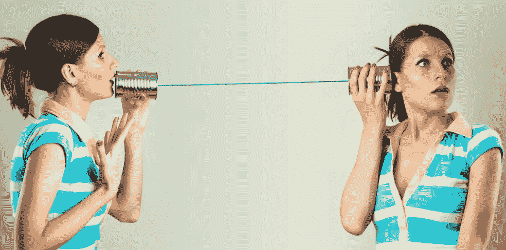
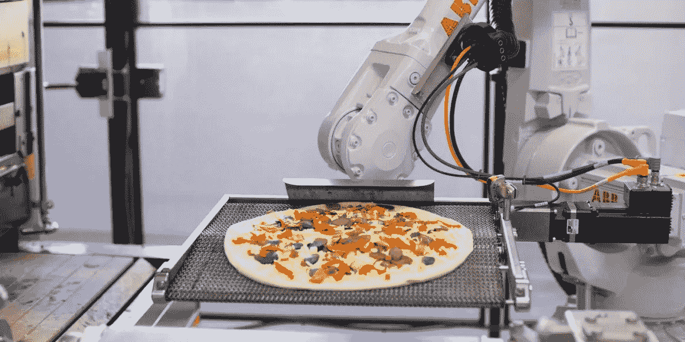

# 为什么聊天机器人应该给我们点披萨🍕

> 原文：<https://medium.com/hackernoon/why-chatbots-should-order-us-pizza-afdc2346660a>

我最近和我哥哥打赌，到 2036 年，我们与软件的关系将比与人类的关系更有意义。坦率地说，这可能会比那早得多。

# 第一部分|与计算机对话

在 20 年内，我们用软件说话的次数将超过我们与人交谈的次数。不是反对人，用软件交流只会更有效率。想想这个:

## 我们如何订购比萨饼？

*蜜雪儿饿了。她决定用谷歌搜索当地的披萨店。她在网上找到一份喜欢的菜单，然后拨打他们网站上的电话订购。接听电话的员工 Rachel 接过 Michelle 点的菜，并将其输入电脑化的订单管理系统，然后由该系统指导厨师做什么。30 分钟后，米歇尔吃了披萨。*🍕

稍微抽象一下这个场景，一个女人让软件给她晚餐的选择。她挑选了一个，并将她的选择与另一个人联系起来，而另一个人又将具体的选择告诉了另一个软件，然后这个软件给最后一个人烹饪的指导。

比萨饼信息采用的路线是:

> 人员 1 >机器 1 >人员 1 >人员 2 >机器 2 >人员 3

这是非常低效的，因此食品配送的创新寻求缩短这条路线。把它想象成一个电话游戏，涉及的转换越多，信息就越复杂。我们的目标是缩短电话游戏的时间。

photo by Florian Seroussi

# 与计算机对话 1.0

那么，如何缩短电话的游戏时间呢？最有效的方法是消除人际交流，只让软件交流。我们已经在一定程度上做到了这一点。

[UberEATS](https://www.ubereats.com) ， [Grubhub](https://www.grubhub.com/) ， [DoorDash](https://www.doordash.com/) ，[post mates](https://postmates.com/)——这些都是应用程序支持的食品交付领域的领导者。我们可以在 app 中直接点餐，而不用打电话给餐厅。应用软件将这些信息直接发送给餐厅的软件。

这个电话游戏现在是:

> 人员 1 >机器 1 >人员 1 >机器 1 >机器 2 >人员 2

太好了，我们已经摆脱了第三个人，但还是一样的步数。怎样才能消除台阶？

# 与计算机 2.0 对话

为了进一步缩短游戏，我们需要*智能*软件。当我们向手机传达我们想要泰国菜时，它需要自己点餐，而不需要我们最后确认它选择的*确切的*餐馆。算法可以检查在线评论、人口统计信息、社交媒体情绪分析，并且随着个性化的增加，还可以了解我们的独特品味。足够先进的软件会权衡所有这些因素，做出我们满意的晚餐选择。

这现在听起来很奇怪，但是在[未来](https://hackernoon.com/tagged/future)软件中，点什么*吃什么*就像父母或配偶决定今天吃什么一样正常。

所以现在我们把电话游戏缩短为:

> 人员 1 >机器 1 >机器 2 >人员 2

在我们拥有完全自动化的披萨店之前，这已经是最好的了。

[https://zumepizza.com/](https://zumepizza.com/)

就这样，我们的电话游戏处于最佳状态！玩家的数量和信息的流动告诉了我们很多关于通信的未来。把机器 1 和 2 想象成公司高管目前拥有的个人助理。就像个人助理一样，这些算法可能不是我们，但它们比几乎任何人都了解我们。

 [## 聊天机器人的承诺:个人助理不再只是富人的专利

### 一个年轻女子在路上走着，看到了一个新的早午餐地点。这正是她朋友想尝试的地方。她…

hackernoon.com](https://hackernoon.com/the-promise-of-chatbots-personal-assistants-are-no-longer-just-for-the-rich-638da4b1444f)