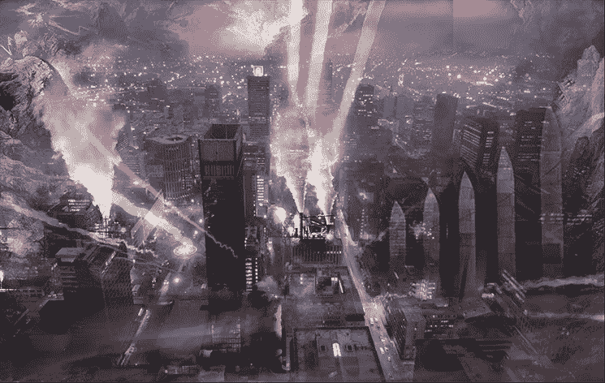

# 为什么代码赚钱，而不是内容。

> 原文：<https://medium.com/hackernoon/why-code-makes-money-not-content-887c81eed768>

## 让自由/开源软件模式为创造性职业服务

我试图说服我的一个拥有独立唱片公司的朋友，让他使用自己的网站来播放音乐，并挖掘 Monero。有了他的粉丝群，他每个月只需在自己的网站上添加几行代码，就能轻松获得几百美元的额外收入。他不感兴趣。

音乐家和艺术家对科技行业有着深深的不信任，这是有充分理由的。内容是互联网前进的动力，然而创作者几乎看不到任何收入。为什么程序员和网络上其他创造性职业的道路如此大相径庭？

Scene from [ROSECODE](https://justrose.org), an interactive, open source cyberpunk creative franchise.

传统观点认为，内容的数字化(即纸张和乙烯基材料神奇地转变为 1 和 0)摧毁了艺术家的生计。然而，程序员总是在数字领域工作，他们技能的经济价值也在不断增加。程序员比其他人更聪明或更擅长他们的工作吗？

这里有另一种解释:**通过自由软件和类似共享的许可，软件业创造了一个促进进一步创新的资本仓库。**想象一下，你可以走进一家五金店，挑选房子的框架——木材、地板、绝缘材料和油漆。你可能需要付钱给一个有执照的电工来做布线，或者雇佣一个定制的橱柜设计师来建造你梦想中的厨房，但是不用花一毛钱，你已经有了一个可以挡雨的结构。这就是开源的工作方式。

Linux 基金会保守估计 Linux Fedora 发行版的价值为[108 亿美元](https://www.developer-tech.com/news/2015/oct/14/measuring-value-open-source/)。这个数字与比特币的[954.9 亿美元市值](https://www.coindesk.com/price/)相比相形见绌，更不用说世界领先的网站平台 Wordpress 上托管的[7500 万个网站的经济价值了。脸书没有把 React Native 作为开源软件发布，因为它有一颗善良的企业心；它是在 BSD 许可下发布的，因为在一个应用程序开发者可以选择他们的工具的市场中，免费已经赢了。它别无选择。](https://www.forbes.com/sites/montymunford/2016/12/22/how-wordpress-ate-the-internet-in-2016-and-the-world-in-2017/#26afa15e199d)

这可能是最意想不到的讽刺——系统不可知论者或敌视资本主义目标的人有助于催生后千年时代有史以来最有活力、最繁荣和最持久的经济繁荣。但是，在我们为所有这些股票期权和 22 岁年轻人驾驶租赁的宝马是否是一件好事而焦虑之前，让我们后退一步。

这将是一件好事，事实上，*这可能是一件非常非常好的事情，*如果其他创造性职业能够获得一些相同的基础设施来创造财富。知识共享经常被认为是人文学科的自由软件的等价物，但这还不够。作为一种有效的资源，艺术家不能简单地把他们的作品送人。他们需要社区。而不是某种模糊的社区理想。他们需要真正的在线空间，在那里他们可以聚在一起分享、合作和交流想法。**简而言之，他们需要回购。**

[ROSECODE](https://justrose.org) 项目和 ICO 旨在建立这样一个回购——以及其赛博朋克科幻故事情节和人物的开放专营权:

> “如果创意项目像开源软件一样工作会怎样？
> 
> 每个科幻迷都熟悉“特许经营权”的概念漫威，DC，星球大战，太空堡垒卡拉狄加。你挑吧。这些是我们的现代神话——我们一遍又一遍地重温的故事。
> 
> 但它们不是我们的。一个大公司如果愿意，可以因为你选择的万圣节服装而起诉你。你可能会参加会议或写同人小说，但最终你的作品属于别人。
> 
> ROSECODE 利用知识共享许可的力量打造了一个新的范式:一个共享的神话，一个双方同意的创意世界，在这里任何人都可以自由地发明、讲述故事、制作游戏或拍摄电影——无论是为了娱乐还是为了盈利。如果你和你的合作者有一个新作品的固定观众，和一个固定的角色阵容会怎么样？

【完全披露:我是 ROSECODE[项目的几个贡献者之一。]](https://justrose.org)

客户端挖掘技术为无广告的用户体验提供了潜力，这种用户体验奖励高质量的内容并从中获利。这个时候，如果你拥有一台服务器，不依赖于广告收入，你可以通过给你的网站带来用户来赚钱。技术人员，如果你还没有和艺术家和作家交朋友，现在可能是个好时机。

我喜欢科幻小说，也喜欢我们迄今为止创作的作品，但对我来说，这个项目不仅仅是一个故事。我不得不问这个问题:

*   如果有开源的西部片呢？和神秘？还有奇幻史诗？还有战争剧，航海冒险，肥皂剧？
*   如果任何人都可以自由分享他们想象的内容，而不是希望卖给一个大公司，而是与志同道合的游戏开发者、插画师、剧本作者、朋友和粉丝分享，会怎么样？
*   如果在网上有一个地方让这样的社区聚集在一起工作会怎么样？

Github 可能并不理想，但它是一个[开始](https://github.com/BlackCatProductions/rosecode)。