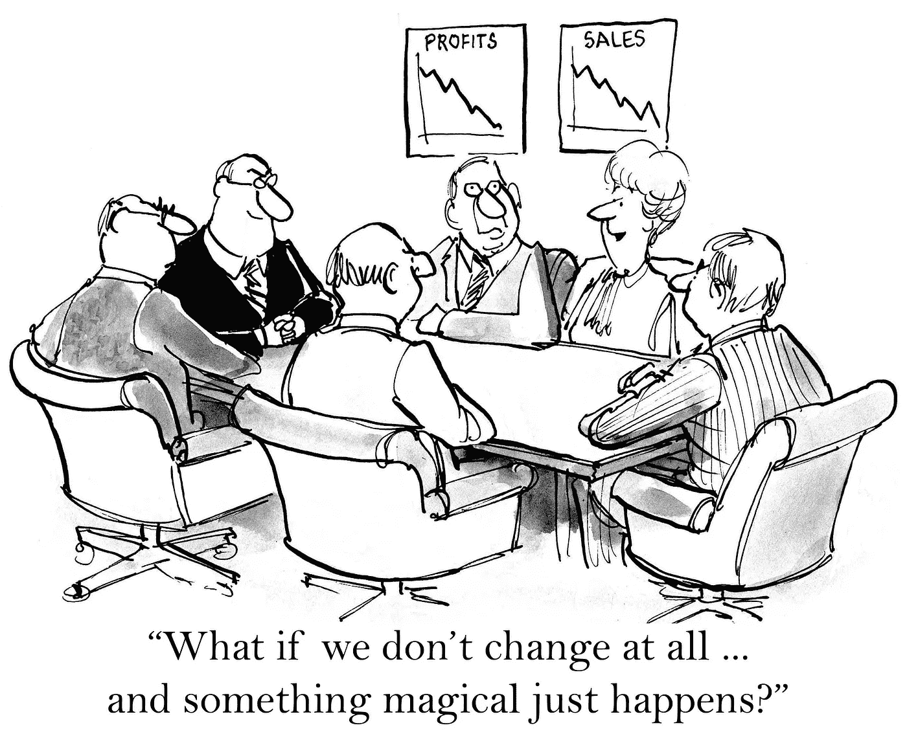

# 为什么企业文化对软件开发有害🔊

> 原文：<https://medium.com/hackernoon/why-corporate-culture-is-toxic-for-software-development-e4f0a2a203c6>

## 以及如何帮助改变它

A group of people dressed in suits, carrying a paper with the drawing of a smile in front of their faces

Listen to the audio version!

人类之所以能走到这一步，是因为我们为了生存而进行社交和利用他人技能的能力。

我认为帮助我们的一件事是我们在社会中建立有组织的等级制度的能力。

对大多数国家来说，裁决有一个模式:

*   主要统治者(独裁者或总统)
*   地区统治者(州长)
*   当地统治者(市长)
*   当地人

传统社会代表一群为了生存而一起工作的人，而公司代表一群为了一个目标而一起工作的人。

公司就像一个小社会。

随着时间的推移，这个小社会倾向于遵循我们在周围世界中看到的相同模式:

*   主要统治者(首席执行官)
*   地区统治者(经理)
*   当地统治者(团队领导)
*   当地人(团队成员)

人们无法判断传统社会是否运转良好，因为我们没有其他东西可以比较。然而，我们仍然倾向于复制它，即使有些环境对于基于等级制度的传统社会来说可能不是最佳的。

在传统社会中，有很大的控制倾向。警察和法律是因为人们互不信任而产生的。决策的集中化发生在不同的层面，是由那些不知道他们正在做出战略决策的领域的日常工作细节的政客们推动的。

> 在传统社会中，有一种控制和集权的巨大趋势

传统公司也是如此。微观管理和流程的产生是因为他们不信任自己的员工去做他们被雇佣的工作。高管在没有日常环境的情况下做出战略决策，这将对员工的工作成果产生负面影响。

多年来，软件行业已经认识到控制是邪恶的，我们应该把决定权留给那些参与日常工作的人(产品所有者、开发人员、设计人员)。他们比任何人都更了解客户。比任何传统的 CEO 都要好。

> 如果我们在工作中一直照搬传统社会的特征，我们就不会进步。

很多人讨厌政治。不幸的是，在现实社会中，我们没有更好的不同方式来做事情。我们不能逃避政治。

然而，在一家公司里，我们可能有这种选择。当我们在建设一个小社会时，我们有责任按照我们想要的方式来建设它，或者朝着某个方向一步一步地做出小小的改变，以缓慢的步伐塑造 T2 的文化。

塑造文化是每个人的工作。

这意味着如果你在[管理层](https://hackernoon.com/tagged/management)的职位上:

*   保护团队免受外部压力，让他们按照自己的节奏工作
*   让他们找出最好的工作方式
*   不要让任何人向你汇报，而是向团队汇报
*   让团队决定他们想和谁一起工作，而不是别人替他们决定

A cartoon of a group of people in suits around a table. In the wall, there are two boards showing one graph of profits and other of sales, both are declining. The caption says “What if we don’t change at all and something magical just happens?”

作为开发人员:

*   训练你的技能，尽可能提高对努力的期望值
*   开始说“我们”,而不是“我”,最好是那些功劳属于你的事情
*   当需要批评时，批评一般行为，而不是个人
*   当表扬方便时，表扬个人和团队，而不是一般的行为

通过这种方式，我们将向企业界表明，真正的问题不是公司文化，而是许多传统人士仍坚持捍卫的过时思维。

> 勇敢的人敢于与众不同，在这个千篇一律的世界里

你也有责任改变这一点。

一种除了用物竞天择来实现适者生存，而不是为了目标的生存而集体努力的文化。

如果你的团队从我关于这篇文章或我正在进行的任何其他项目的谈话和/或问答中受益，请在`contact at fagnermartins.com`给我写信。

感谢阅读。如果你有一些反馈，请通过 [Twitter](https://twitter.com/FagnerBrack) 、[脸书](https://www.facebook.com/fagner.brack)或 [Github](http://github.com/FagnerMartinsBrack) 联系我。

想当面聊聊吗？你可以在 [**悉尼软件工匠聚会**](https://www.meetup.com/Software-Crafters-Sydney/) 找到我。