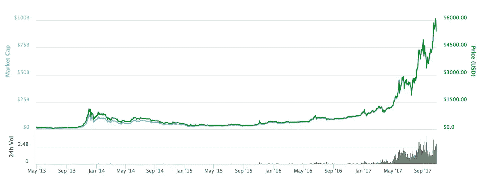
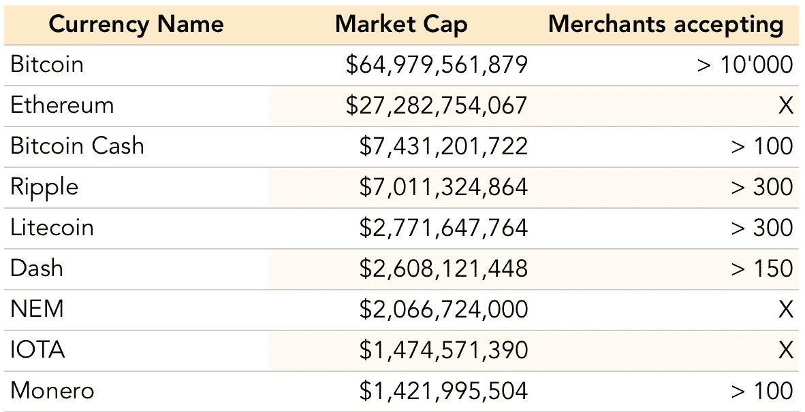
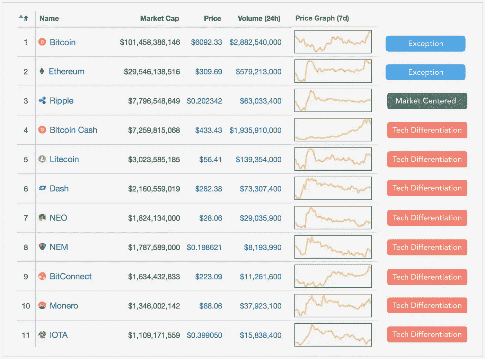

# 加密货币如何最终给市场带来价值

> 原文：<https://medium.com/hackernoon/why-cryptocurrencies-still-dont-bring-value-to-any-market-c3113f3f6056>

TL；DR:货币被使用或不被使用的原因从来都不是纯粹的技术原因，而开发者一直在用技术特征区分他们的加密货币。

比特币本月再次将创纪录的高估值推高！谁相信加密货币将取代所有现有的货币，并成为现在政府发行的货币的可行替代品？

Market Cap of bitcoin

嗯，所有的加密货币都不是生来平等的。如今加密货币令人不安的是，尽管它们的市值高得惊人，但几乎没有加密货币主要用于它应该做的事情:交易商品和服务。当他们的价值/市值飙升时，这是因为投资者希望他们最终会演变成人们用来交易商品和服务的东西，这将使他们的价值稳定在比今天更高的水平。但是让我们看看为什么今天不是这样。

## 一种货币的价值通常是衡量人们对其使用信任程度的标准

Anything is a currency if you believe it. For the Aztecs, it was Cocoa beans.

根据定义，货币是这样的东西:

(1)设定一个价格参考
(2)可以用来交换商品和服务
(3)可以用来作为价值的储存

需要注意的是，这些条件总是在某个特定的地点(市场上)和特定的时间间隔内得到满足。

即使对于政府发行的货币，这些条件也只在货币的国内市场上成立，而国内市场通常是有地理界限的，但并不总是如此。例如，*瑞士法郎*在瑞士符合这些条件，但在邻近的法、意、德、奥地区也符合这些条件。*印度卢比*和*俄罗斯卢布*也完全符合各自市场的要求。然而，今年早些时候，我在莫斯科的任何地方都无法以合适的汇率将我的印度卢比兑换成俄罗斯卢布。因为俄罗斯与印度的贸易相对不重要，在这个市场上，8 卢比与商品和服务的可交换性较低，这降低了它们的价值。因此，卢比在俄罗斯消费市场上并不代表一种货币。

## 没有货币是真空中的货币。货币存在于特定的市场上。

大多数加密货币根本没有通过任何市场上的货币测试。几乎没有一种加密货币能成功成为价格参考 **(1)** 。在交易发生之前，硬币中的所有价格总是从它们的美元价值转换而来。他们中的大多数也无法兑换商品和服务。如果我们的收入仅用于这些货币中的任何一种，我们中没有人能够在任何市场上生存或经营业务。而 **(3)** 只有满足前两个条件才能满足，在货币的情况下。

事实上，我在网上统计了愿意接受排名前 30 位的加密货币(市值从 2 亿美元到 70 亿美元以上)作为支付形式的商家数量:

*   <10'000 businesses accept Bitcoin in the world*
*   <500 businesses for each other currency than Bitcoin and Ether (more likely <<100)

For some currencies I could not even determine if there was a market at all

## Coins fight over which one has the best technical performance, not on solving any subset of users’ problem

*几年前就已经被《保罗·格拉厄姆》列为[扼杀创业](http://paulgraham.com/startupmistakes.html)的 18 个错误之一。YC 甚至有 t 恤衫，以确保他们永远不会忘记 ***【打造人们想要的东西】*** 。*

*加密货币需要像任何其他数字产品一样被采用，因此应该解决某人成功的问题。然而，大多数加密货币似乎旨在一次性解决整个世界的问题，未能在任何市场上获得货币地位。*

**

*How I perceive some cryptocurrencies have differentiated*

*回到工程学校，我们被告知，如果你把同一个问题交给三个不同的工程师去解决，比如一个电子工程师，一个机械工程师和一个软件工程师，你会得到三个不同的解决方案:一个用电子，一个用机械，一个用软件。所有的解决方案都是有效的，只要你最终解决了正确的问题:对你的客户重要的问题。*

*市值最高的前 30 名硬币几乎都在竞争它们的技术特性，如区块大小、确认时间、更安全的加密或在罕见攻击情况下的安全性。但这真的是今天阻止市场采用它们的原因吗？我会说这些硬币主要是解决写代码的工程师看到的问题。*

## *“你必须从客户体验开始，然后回溯到技术”——s·乔布斯[*s·乔布斯*](https://www.youtube.com/watch?v=FF-tKLISfPE)*

*A Steve Jobs video that deserves your time more than its title could let you think (5 min)*

*Ripple 是一种考虑到特定用户群开发的货币，这种货币将从使用加密货币中获得切实的好处。Ripple 瞄准了一个特定的市场，并使用市场语言进行营销，向其受众展示相关的好处。*

***今天流通的所有*比特币*的价值(1020 亿美元)大于流通的所有*瑞士法郎*的价值(790 亿美元)，与*瑞士法郎*货币供应(6410 亿美元的 M1)**处于同一数量级，然而*法郎*被认为是有史以来最稳定的货币之一，而*比特币*被认为是最不稳定的货币之一。比特币已经达到的规模还不足以成为一种“真正的货币”。*

## *当一个市场的大多数成员将主要通过新货币进行交易时，就达到了稳定*

*应该调整的不是技术，而是市场。有许多市场和行业将从加密货币的优势中受益，而不会受到其当前局限性的影响。当务之急是从一个足够小的市场开始，这样才有可能获得一个立足点，并迅速转变大多数人。在覆盖了这个市场上的大部分交易后，由于增加了信任，将有可能扩展到邻近或类似的行业。*

## *从什么开始着手*

*我们已经调查了很多行业，每个行业都有一些容易接触到的团体，这些团体都可以联系到并有可能转化。如果你有符合标准的行业知识，你认为应该首先瞄准哪个行业？*

*感谢 Aymard Dudok de Wit、Joy Zhang、Lynne Tye、、Varad Kishore 和 Alexandra Alimbekova 阅读本文的草稿。*

*如果你想的话， [**订阅我的博客，在那里我写下我每周学到的关于 3 种技术和 3 个主题的东西**](http://eepurl.com/cY4zHX) **📖***

*如果你想联系的话，也可以看看我的页面:[http://www.airportworker.com/](http://www.airportworker.com/)*

**日本连锁便利店除外。在我所做的比较中，比特币是一个成功的例外。—由于每天的波动，数据可能不完全准确，如果您有可能影响这一点的不同信息，请随时告诉我。*