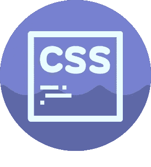
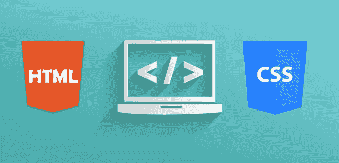
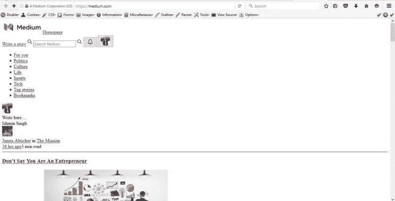
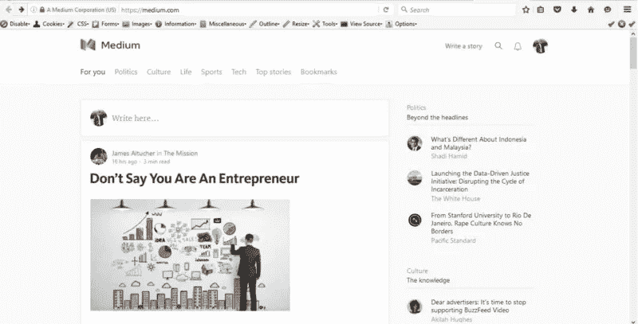
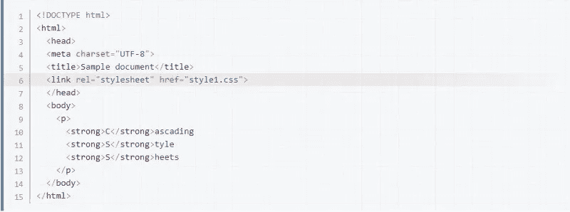

# 为什么 CSS 是你的网页不可或缺的一部分

> 原文：<https://medium.com/hackernoon/why-css-is-an-indispensable-part-of-your-webpage-b68adfee3583>



CSS 是一种用于描述以标记语言(例如 HTML)编写的文档表示的语言。你正在阅读的网页是用标记语言 HTML 构建的，并通过 CSS 呈现给你。不，他们不是我们的赞助商。



哦，等等，我有没有告诉你 CSS 的缩写代表什么？CSS 展开为*层叠样式表*。它基本上美化了你的网页。

级联样式表中的*级联*是指属性值如何应用于 Web 文档的父/子层次结构的上下文中。一个*样式表*是一个集中位置的样式规则封装，要么在 HTML 文档的头部分，要么在一个单独的链接文件中。我会

您可以使用它来定义文档的样式，包括不同设备和屏幕尺寸的设计、布局和显示变化。你可以添加颜色、标题、图片、边框、页边空白、游戏(是的，你没看错)、吸引人的效果，清单是无穷无尽的。

使用 CSS，你几乎可以对你的网页做任何事情。嗯，它仍然不能保护你免受任何剧透，只是说。

让我告诉你我在说什么，这是你喜欢(希望)这个博客的网站的前后对比



Medium without CSS

现在仔细观察这幅画。



Medium with CSS

这不是魔法。只是 CSS 在玩它的游戏。你可以看到 CSS 的加入给网页带来的巨大变化。

## 所以，让我们来看看如何在你的网页中加入 CSS。

有三种方法可以将 CSS 整合到你的网站中:

1.  您可以将您的 CSS 放在带有嵌入样式表的文档的中。

```
<style media="screen" type="text/css">

Add style rules here

</style>
```

2.您可以附加一个单独的文件，用外部样式表定义您的样式。

要将外部样式表链接到您的文档，只需在文档的中添加到样式表的链接。



To link your document to your stylesheet, edit your HTML file and add the line highlighted.

外部样式表有很多优点。将样式与 HTML 内容分开:

*   有助于避免重复
*   使维护更容易
*   允许您在一个地方进行站点范围的更改

3.或者您可以从 CSS 中导入 CSS 文件。要从 CSS 中导入新的 CSS 文件，只需使用以下规则:

```
@import "newstyles.css";
```

## CSS 对你的网页至关重要的一些好处是——

一致性:通过对你网站的 CSS 样式表进行一次修改，你可以自动地将它应用到你网站的每一页。你的网站越大，CSS 为你节省的时间越多。

**减少带宽:**当 CSS 将你的网站内容从设计语言中分离出来，你就大大减少了文件传输的大小。您的 CSS 文档将存储在外部，只有当访问者请求您的网站时才能访问一次。

**。搜索引擎:** CSS 被认为是一种干净的编码技术，这意味着搜索引擎不必费力“阅读”它的内容。此外，使用 CSS 会让你的网站内容多于代码——而内容对你的搜索引擎的成功至关重要。

**查看选项:**另一个常见的网页设计问题是，越来越多的人需要为不同的媒体提供网站。CSS 可以通过允许以不同的查看样式呈现相同的标记页面来帮助您应对这一挑战，例如，您可以为打印或移动设备创建单独的样式表。

因此，考虑到所有这些事实，我们可以说，CSS 确实不能被视为理所当然。这是任何网站最重要的部分之一，并将继续如此。

要报名参加我们即将举办的研讨会，请点击下方。

HelloMeets 即将举办的研讨会-

[**数据科学初学者| 9 月 17 日|上午 10 点到下午 4 点**](http://www.hellomeets.com/datascience/#forbeginners)

[**如何通过付费搜索增加你的网站流量| 9 月 18 日|上午 10 点到下午 2 点**](http://www.hellomeets.com/paidsearchmarketing/#websitetraffic)

[**如何成为一名自学成才的程序员？| 9 月 18 日|上午 11 点至下午 2 点**](http://www.hellomeets.com/coders/#guidetoselflearning)

[**聊天机器人初学者指南| 9 月 18 日|下午 3 点到 7 点**](http://www.hellomeets.com/chatbot/#chatbotsworkshop)

[**Wordpress for 初学者| 9 月 25 日|上午 10 点到下午 4 点**](http://www.hellomeets.com/wordpress/#beginners-guide)

博客作者——[ish min Singh](https://www.facebook.com/ishmin.singh?fref=ts)，HelloMeets 的科技内容作者

[](http://bit.ly/HackernoonFB)[](https://goo.gl/k7XYbx)[](https://goo.gl/4ofytp)

> [黑客中午](http://bit.ly/Hackernoon)是黑客如何开始他们的下午。我们是 [@AMI](http://bit.ly/atAMIatAMI) 家庭的一员。我们现在[接受投稿](http://bit.ly/hackernoonsubmission)并乐意[讨论广告&赞助](mailto:partners@amipublications.com)机会。
> 
> 如果你喜欢这个故事，我们推荐你阅读我们的[最新科技故事](http://bit.ly/hackernoonlatestt)和[趋势科技故事](https://hackernoon.com/trending)。直到下一次，不要把世界的现实想当然！

[](https://goo.gl/Ahtev1)