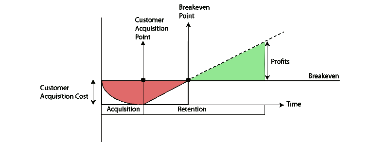

# 为什么顾客终身价值是自举企业的误导指标

> 原文：<https://medium.com/hackernoon/why-customer-lifetime-value-is-a-misleading-metric-for-bootstrapped-businesses-266c3541b5cb>

如果你是 SaaS 的企业主，你一定非常熟悉 SaaS 的“5 C”指标——现金、客户流失、每月承诺的经常性收入、客户获取成本和客户终身价值。传统观点认为，对于一个健康的 SaaS 企业来说，CLTV 是北极星指标，但对于自举企业来说，真的是这样吗？在这篇文章中，我提出了不同的观点，并展示了其他可能更适合的度量标准。

在 SaaS 指标上有很多很棒的材料。杰森·莱姆金和 T2·大卫·斯科克写的东西都很棒，但要注意的是，它们是在风险投资资助的企业背景下写的。

那么，自举企业如何管理他们的财务指标呢？

让我们来看三个传统智慧的案例，我们对它们提出了质疑，并提出了一个对自举企业的财务健康更有效的替代方案。

## 1.生命周期价值与购置成本比率是一个转移注意力的话题

**现状:**LTV/CAC 比率是 SaaS 的圣杯。经常被吹捧的基准是，这个比率需要达到 3 或更高，你的业务才有意义。

**我们的花费**:当一个客户的生命周期是几年的时候，你可能需要*年*才能开始意识到这个比例。如果你主要是销售给其他中小型企业，很多因素会超出你的控制。例如，客户可能无法满足您的解决方案，决定不再需要您的产品，不景气的经济状况可能会提高取消率，等等。

关注你的**回收期**要好得多，也就是说，收回收购成本需要多长时间。

## 2.只关注 MRR 是一个滑坡

**现状:**不惜一切代价的无差别增长。看到 MRR 每月增长是让你的投资者高兴的必要条件，也可能是后续融资的必要条件。

**我们的观点:**尽管 MRR 是一个值得关注的增长数字，但它脱离了你银行账户的现实。年度预付款、采购延迟、诉讼费& PR 等意外支出都会影响银行的现金。

我们已经包括了一个健康的，不断增长的，更重要的是自举的叫做 [Hubstaff](https://hubstaff.com/) 的企业的 MRR 图表。逐月稳定、持续的增长，相当可预测。

另一方面，由于上述原因，现金更具偶发性。相当不可预测。

在银行有足够的现金是首席执行官的责任——确保你不会花掉你实际上没有的现金。保守地使用现金需要做更多的工作:

*   尽早雇佣一个对 SaaS 金融有经验的优秀会计师。
*   开始要求你的客户每年为你的产品付费。提供折扣或专业服务，让他们觉得值得。
*   暂停招聘，解决你目前团队的问题。最近有一个由 [ConvertKit](http://nathanbarry.com/profit/) 提供的很好的例子。
*   外包一些工作，可以做得更便宜，而你是人手不足，试图维持你的现金流。

## 3.扩张收入不是免费的钱

**现状:**扩张营收是 SaaS 的妙处。你现在的顾客正在你的门前排队购买更多你的产品。扩张收入是你可以增加的最有利可图的收入，本质上是免费的。

**我们的观点:**虽然扩张收入看起来像是“免费的钱”，但它伴随着对更高服务级别的期望。

一家白手起家的 SaaS 公司需要结合人才来考虑扩张，以便随着时间的推移保持这种扩张。有两个领域需要投资:客户成功和客户支持。

1.  客户成功:如果您的扩张收入正在增长，您可能希望进一步挖掘，看看增长最快的细分市场是否有适当的客户成功分配。我们在之前已经[写过关于资源分配不当的挑战。如果你的客户感到管理不善，他们会因失望而流失。](http://www.silota.com/blog/forecasting-sales-recurring-revenue-risks-visualization/)
2.  客户支持:更多的扩展意味着更多的支持票。大多数支持交互都是事务性的，但是如果您的扩展来自正在部署您的解决方案的大型企业客户，您将希望增加额外的协调级别来管理这种增长。

## 结论

现在，银行存款、回报周期和支持你扩张收入的人才都比你的 LTV 更重要。对于这两者之间的所有职能工作来说，LTV 分散了运营一家财务稳定、负责任的 SaaS 企业的注意力。

*原贴于*[*Silota.com*](http://www.silota.com/blog/bootstrapping-saas-business-lifetime-value/)

> [黑客中午](http://bit.ly/Hackernoon)是黑客如何开始他们的下午。我们是 [@AMI](http://bit.ly/atAMIatAMI) 家庭的一员。我们现在[接受投稿](http://bit.ly/hackernoonsubmission)，并乐意[讨论广告&赞助](mailto:partners@amipublications.com)机会。
> 
> 如果你喜欢这个故事，我们推荐你阅读我们的[最新科技故事](http://bit.ly/hackernoonlatestt)和[趋势科技故事](https://hackernoon.com/trending)。直到下一次，不要把世界的现实想当然！

