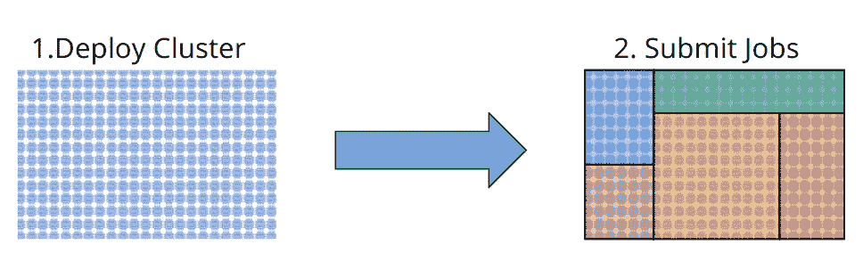
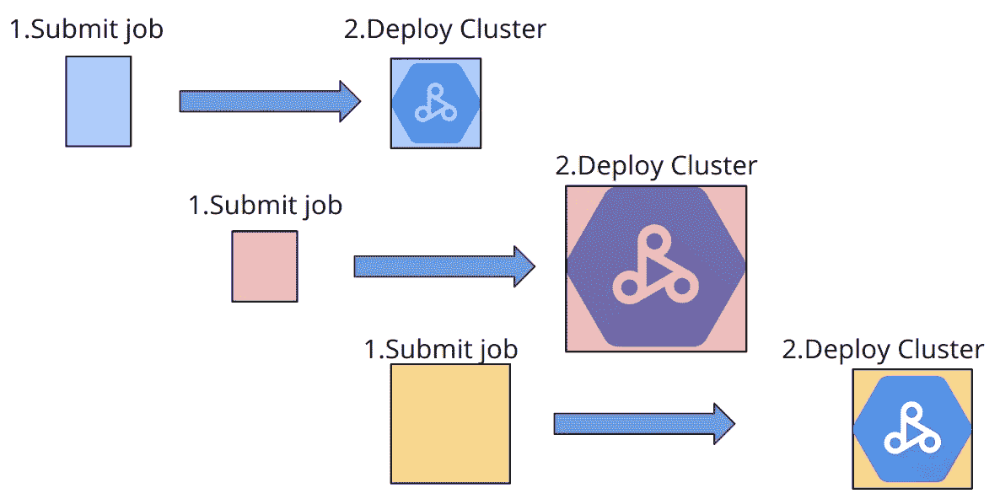
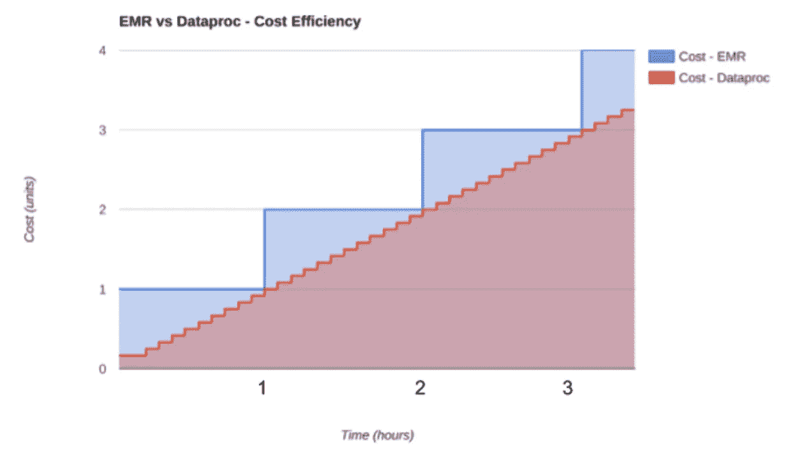
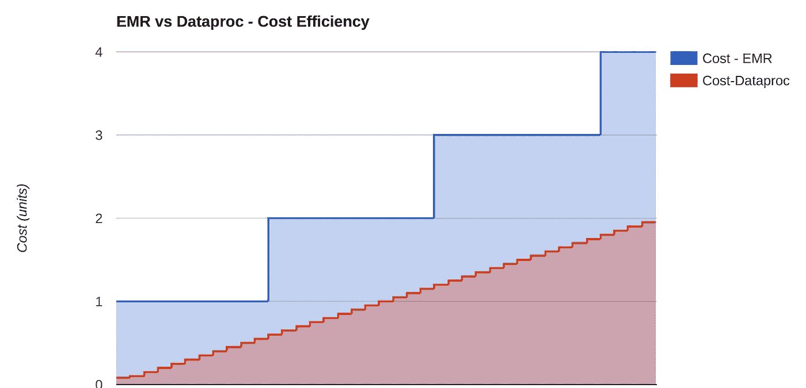

# 为什么选择 data proc——Google 的托管 Hadoop 和 Spark 产品是一个游戏改变者。

> 原文：<https://medium.com/hackernoon/why-dataproc-googles-managed-hadoop-and-spark-offering-is-a-game-changer-9f0ed183fda3>

到目前为止，我已经写了关于 [Google](https://hackernoon.com/tagged/google) BigQuery ( [1](https://cloud.google.com/blog/big-data/2016/01/anatomy-of-a-bigquery-query) 、 [2](https://cloud.google.com/blog/big-data/2016/01/bigquery-under-the-hood) 、 [3](https://cloud.google.com/blog/big-data/2016/08/google-bigquery-continues-to-define-what-it-means-to-be-fully-managed) 、 [4](/p/6654841fa2dc) 、 [5](/google-cloud/paying-it-forward-how-bigquerys-data-ingest-breaks-tech-norms-8bfe2341f5eb) )、云原生经济学( [1](https://cloud.google.com/blog/big-data/2016/02/visualizing-the-mechanics-of-on-demand-pricing-in-big-data-technologies) 、 [2](https://cloud.google.com/blog/big-data/2016/02/understanding-bigquerys-rapid-scaling-and-simple-pricing) )，甚至是关于短暂虚拟机( [1](/@thetinot/google-clouds-spot-instances-win-big-and-you-should-too-5b244ca3facf#.soec2n94i) )的文章。一个真正让我兴奋的产品是 Google Cloud[data proc](https://cloud.google.com/dataproc/)——Google 的托管 Hadoop、Spark 和 Flink 产品。在这个乍一看似乎完全商品化的市场中，Dataproc 成功创造了显著的差异化价值，这预示着人们将改变对其 [Hadoop](https://hackernoon.com/tagged/hadoop) 工作负载的看法。

**乔布斯——Hadoop+Spark 第一，不是集群——第一**

Hadoop 的典型操作模式——在本地或云中——要求您部署一个集群，然后继续用作业填充所述集群，无论是 MapReduce 作业、Hive 查询、SparkSQL 等。很简单的东西。

The standard way of running Hadoop and Spark.

像亚马逊 EMR 这样的服务更进一步，让你运行短暂的集群，通过[emrf](http://docs.aws.amazon.com/ElasticMapReduce/latest/DeveloperGuide/emr-plan-file-systems.html)和 S3 将存储和计算分开来实现。这意味着在工作负载完成后，您可以丢弃集群，同时在 S3 上保留状态。

谷歌云平台有两个关键的差异化特征:

*   按分钟计费(Azure 也有这个功能)
*   非常快的虚拟机启动时间

当您的集群在不到 90 秒的时间内启动时(不到 60 秒并不罕见)，并且当您不必担心将辛苦赚来的钱浪费在云提供商的低效定价上时，您可以颠倒一下这个集群->工作等式。**您从一个作业开始，作为作业执行的一个步骤，您获得了一个集群。**

如果您有一个 MapReduce 作业，只要您愿意支付 60 秒的初始启动税，而不是将作业提交给已经部署的集群，那么您可以将作业提交给 Dataproc，它会根据需要代表您创建一个集群。集群现在是完成作业执行的一种手段。

Demonstration of my exquisite art skills, plus illustration of the jobs before clusters concept realized with Dataproc.

同样，这只有使用 Google Dataproc 才有可能，只是因为:

*   高粒度计费(每分钟)
*   对初始启动时间征收非常低的税
*   存储和计算分离(放弃 HDFS 作为主要存储)。

运营和经济效益显而易见且易于实现:

*   资源隔离通过租用隔离避免了不明显的瓶颈和作业之间的资源争用。
*   管理简单——无需通过 YARN resource manager 等工具实际管理集群或资源分配和优先级。您的开发/阶段/生产工作负载现在本质上是独立的，在其他地方解决和管理是多么痛苦啊！
*   定价简单—无需担心四舍五入到最接近的小时。
*   集群规模调整的简单性——为了更快地完成工作，只需要求 Dataproc 为这项工作部署更多的资源。当您按分钟付费时，您可以开始考虑 VM-minutes。
*   故障排除的简单性—资源是孤立的，因此您不能将您的问题归咎于其他租户。

我肯定是忘记别人了。欢迎在这里留下评论增色。最佳回应获得一个收藏版谷歌云机器人雕像！

在整个云空间中，Dataproc 是最接近基于 VM 的架构的无服务器和云原生按作业付费的方式。在这方面，没有什么比这更好的了。

Dataproc 至少有 10 分钟的定价时间。加上不到 90 秒的集群创建计时器，您就排除了许多相对轻量级的临时工作负载。换句话说，这适用于大型的批处理作业，而不是您希望在 10 秒内运行的临时 SQL 查询。我就这个话题[写在这里](https://cloud.google.com/blog/big-data/2016/02/understanding-bigquerys-rapid-scaling-and-simple-pricing)。(如果您有一个令人信服的使用案例，让您要求少于 10 分钟的最短时间，请务必告诉我们)。

**剩下的 Dataproc 好东西**

谷歌云不止于此。Dataproc 还有一些其他的好处，可以让您的生活更加轻松，口袋更加充实:

*   [**自定义虚拟机**](https://cloud.google.com/custom-machine-types/) —如果您知道您的作业在 CPU/RAM 方面的典型资源利用率配置文件，您可以使用该 CPU/RAM 配置文件定制您自己的实例。伙计们，这真的很酷。
*   **可抢占 VMs** —我[最近就这个话题写了](/@thetinot/google-clouds-spot-instances-win-big-and-you-should-too-5b244ca3facf#.4yknmlbzx)。谷歌对 Spot 实例的替代方案非常棒。统一的 80%折扣，Dataproc 足够智能，可以在实例消失的情况下修复您的作业。我在博客文章中把这个话题打得死去活来，以我的偏见来看，它本身就值得一读。
*   **镇上最优惠的价格。**谷歌计算引擎[是同等规模虚拟机的行业价格领导者](http://fortune.com/2016/01/08/google-amazon-cloud-price-war/)。在某些情况下，比 EC2 低 40%。
*   **短暂容量的 Gobs**—是的，你可以在数千个可抢占的虚拟机上运行你的 Spark 作业，我们不会让你签署一个大的承诺，正如这位先生所发现的那样(TL；灾难恢复:运行 25，000 个可抢占的虚拟机)。
*   **GCS 很快很快**——当抛弃 HDFS 而支持对象存储时，重要的是存储和实例之间的整体管道。Jornson 先生在此详细介绍了 GCS 和类似产品的性能特点。

**用于有状态集群的 data proc**

现在，如果你正在运行一个有状态集群，比如说在 HDFS 上运行 Impala 和 Hbase，如果出于某种原因你不想运行 Bigtable + BigQuery，Dataproc 也是一个不错的选择。

如果你追求市场上最差的磁盘性能，为什么不选择性能上更像 RAM 而不是 SSD 的东西——谷歌的本地 SSD？在这里，迪内什先生很好地比较了亚马逊和谷歌的产品。克里夫指出——本地 SSD 真的真的真的真的真的很好——真的。

最后，谷歌的持续使用折扣会自动奖励那些长时间运行虚拟机的人，最高可享受 30%的折扣。没有合同也没有承诺。谢天谢地，没有管理您的保留实例账单。

如果你短时间使用谷歌的虚拟机，你就赢了；如果你长时间使用谷歌，你就赢了。

**data proc 的经济学**

我们讨论了 Google 的虚拟机如何通过可抢占的虚拟机、自定义虚拟机、持续使用折扣甚至更低的标价而变得更加便宜。[有些人发现差价要便宜 50%](https://thehftguy.com/2016/11/18/google-cloud-is-50-cheaper-than-aws/)！

学习经济学教会了我两件事(放下你的干草叉，我也学过数学)——软科学和硬科学的区别，以及用二维图表讲故事的能力。

让我们假设一个最坏的情况，EMR 和 Dataproc VM 价格相等。我们得到了这个图表，希望不需要解释:

Which line would you rather be on?

如果你相信我们的好朋友 thehftguy 的[声称](https://thehftguy.com/2016/11/18/google-cloud-is-50-cheaper-than-aws/)谷歌便宜 50%(扣除可抢占虚拟机、定制虚拟机、持续使用折扣等因素)，你会看到这张引人注目的图表:

Same chart, but with some more aggressive assumptions.

当你向云提供商支付你宝贵的谢克尔时，想想你自愿支付的所有这些额外的蓝色区域，那完全是虚假的。这就是为什么 Dataproc 的许多客户不介意从他们的非 Google 云供应商向 GCS 支付费用！

**总结**

谷歌云有后来者的优势。事情变得更简单、更便宜、更快捷。像实例(GCE)和存储(GCS)这样的低级服务更强大，也更容易使用。反过来，这使得像 Dataproc 这样的高级服务更加有效:

*   **更便宜的** —按分钟计费、自定义虚拟机、可抢占虚拟机、持续使用折扣和更便宜的虚拟机标价。
*   **更快** —快速的集群启动时间、同类最佳的对象存储、同类最佳的网络以及本地固态硬盘类似 RAM 的性能特征。
*   **更简单** —大量的容量、更少碎片的实例类型产品、默认的 VPC，以及紧跟 Apache 版本的映像。

从根本上说，Dataproc 让您从作业的角度考虑问题，而不是集群。您从一个作业开始，然后得到一个集群，这只是作业执行的另一个步骤。这是一种非常不同的思维模式，我们觉得你会发现它很有说服力。

你不必相信我的话——O ' Reilly 的好人对 Dataproc 和 EMR 有过这样的评论。

在推特上找到我。很高兴进一步聊天！

> [黑客中午](http://bit.ly/Hackernoon)是黑客如何开始他们的下午。我们是 [@AMI](http://bit.ly/atAMIatAMI) 家庭的一员。我们现在[接受投稿](http://bit.ly/hackernoonsubmission)，并乐意[讨论广告&赞助](mailto:partners@amipublications.com)机会。
> 
> 如果你喜欢这个故事，我们推荐你阅读我们的[最新科技故事](http://bit.ly/hackernoonlatestt)和[趋势科技故事](https://hackernoon.com/trending)。直到下一次，不要把世界的现实想当然！

