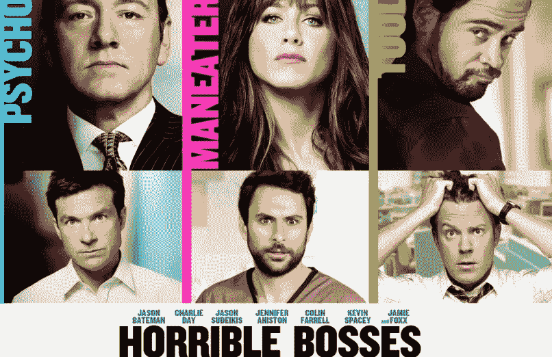
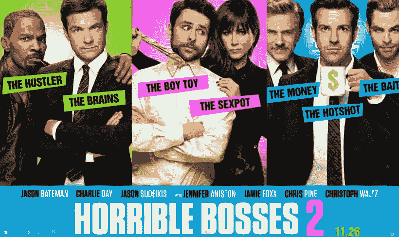

# 为什么分权公司如此酷

> 原文：<https://medium.com/hackernoon/why-decentralized-companies-are-so-f-cool-d56e7eb12294>

关于我的兔子洞之旅，最奇怪的事情之一是，六个月前，我不认为我曾经使用过分权这个词。我甚至不确定，如果别人在和我说话的时候在一个句子中使用了这个词，我会不会知道“去中心化”是什么意思。然而，我是两家分散投资公司的合伙人，[风投](https://angel.co/flight-vc-syndicate)(一家分散投资的风投公司，负责 AngelList 历史上所有投资的 10%左右)，以及[变色龙集体](https://chameleoncollective.com/)(一家分散咨询公司)。多奇怪啊。

VC 航班由[吉尔·潘奇纳](https://medium.com/u/ca7d5a12c0ef?source=post_page-----d56e7eb12294--------------------------------)发起，他是硅谷的摇滚明星天使。在被 Naval Ravikant 邀请成为 AngelList 上的第一批辛迪加之一后，Gil 很快决定成为天使投资的 Fidelity(Fidelity 有 75 个以上不同的共同基金)，Gil 认为最好的方法是与其他拥有行业专业知识的人合作。而 Flight VC 就这样诞生了。

There’s NEVER A Dull Moment With Gil (in the center of the pic aboe)

与 Gil/Flight 合作非常愉快，运营以色列创始人辛迪加，利用不同合作伙伴的集体专业知识以及 Flight 辛迪加中庞大且不断增长的投资者基础。但在很大程度上，我是一个人在外面，当我有特殊需要时，我会连接到飞行网络。我已经写了两篇关于飞行的博文，如果你感兴趣的话，可以提供一些背景信息，[2015 年 9 月飞行风投的兴起](/@loukerner/the-rise-of-flight-vc-cce8fe939f5c)；2016 年 9 月，在两只独角兽退出的帮助下,[风投的崛起还在继续。我应该发表第三篇文章，但是自从 2017 年 6 月以来，我对加密的痴迷让我没有时间吃饭，更不用说写一篇关于飞行的博客文章了。](/@loukerner/the-rise-of-flight-vc-continues-with-the-help-of-two-unicorn-exits-59379b58ab7b)

我是合伙人的第二家公司 Chameleon Collective 是一个更好的去中心化的例子，因为这里有更深层次的合作。变色龙有 40 多个合作伙伴，他们在许多领域(技术、媒体、零售……)做着出色的战略和执行工作。虽然才华横溢的弗雷迪·莱克(Freddie Laker)是变色龙的创始人，但它是一个真正分散的组织，这意味着许多很酷的事情，但有两个因素是我喜欢为分散的公司工作的核心。

首先，我们大多数人都知道，我们不想要老板，因为大多数老板都很差劲。这是一件事。他们拍了关于它的电影。

和续集..…

在变色龙工作了一段时间后，我意识到我不想要员工，就像我不想要老板一样。我不想要员工，因为我不想告诉任何人该做什么。我不想让别人为我工作。我希望人们和我一起工作。所以变色龙的第一个伟大之处就是我没有任何老板或者员工，我只有合伙人。

现在，问题是，你猜怎么着。很多伙伴也很烂。问问我前妻就知道了。

那么你是如何为众多伙伴解决吸费的呢？自然的答案是，花大量时间管理合作伙伴。变色龙花了很多时间管理合作伙伴。但是你猜怎么着。我们不擅长策划合伙人。我们之所以做得不好，是因为伴侣的质量既取决于个人的才能，也取决于该伴侣与其他伴侣相处的能力。

我不怪我前妻让我们的伙伴关系搞砸了。我认为婚姻就像把两种化学物质放在一起。如果爆炸了，是哪种化学物质的错？很明显是两种化学物质放在一起的化学反应。

很难策划合作伙伴，因为在你尝试和啮合之前，你不可能知道当放在一起时你是啮合还是爆炸。

但是分权组织的第二个令人惊奇的地方是，如果你让一个不合适的伙伴加入，那就没什么意义了。因为很快，双方都知道这不合适。很快，其他合伙人停止了与新合伙人的合作，他们离开了。没有伤害。没有犯规。当你意识到你在一家正规公司雇佣了一个糟糕的员工，你不得不与这个糟糕的员工一起工作，或者试图避开他们，或者试图解雇他们，这并不像是一种巨大的阻力。

因此，在像变色龙这样的分权合作关系中，你所剩下的就是那些能相互配合、共同完成伟大工作的优秀合作伙伴。这是多么不可思议！

去中心化……我觉得是个东西。

*如果你从这篇帖子中获得了至少*0.000000001[价值](https://hackernoon.com/tagged/bitcoin) *的比特币，或者欣赏了该视频，请点击* ***并在*** *下方“鼓掌”。*