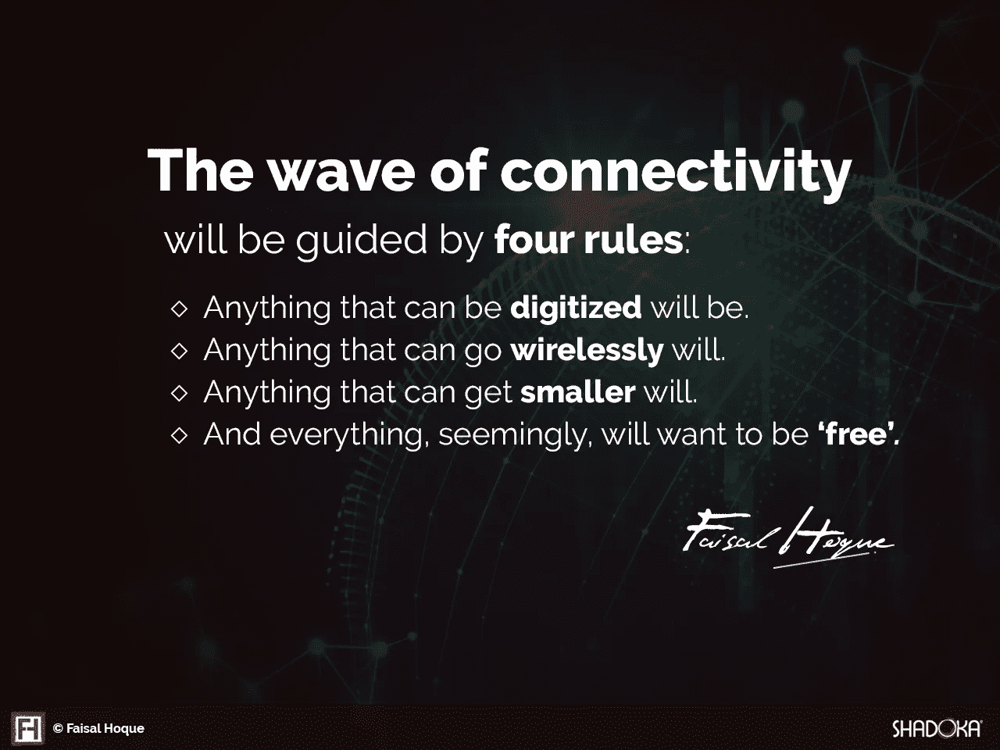

# 为什么设计思维对数字未来至关重要

> 原文：<https://medium.com/hackernoon/why-design-thinking-is-critical-for-a-digital-future-a724072e951d>

[Image: Unsplash User [Hans Vivek](https://unsplash.com/@rickyzden)]

## 不了解客户的需求，就不可能有颠覆性的创新。

在当今快速发展和日益数字化的世界中，组织面临着许多挑战。其中包括颠覆性技术、经济和政治压力，以及跟上客户行为的变化。

当企业摸索或对变化视而不见时会发生什么？以 ESPN 为例。最近的一篇 [*纽约时报*的文章](https://www.nytimes.com/2017/04/26/sports/espn-layoffs.html?_r=0)写道，

作为 [ESPN](http://topics.nytimes.com/top/news/business/companies/espn/index.html?inline=nyt-org) 的“全球体育领袖”，周三解雇了数十名记者和直播人才，表明随着越来越多的人远离有线电视，即使是最强大的媒体王国也容易受到颠覆体育广播行业的变革的影响

在过去的几年里，该电视网失去了 1000 多万观众。

ESPN 的大股东迪士尼计划通过订阅流媒体服务重振 ESPN 的增长——这是一种数字化转型战略，以跟上不断变化的消费者行为。

*纽约时报* [报道](https://www.nytimes.com/2017/04/26/sports/espn-layoffs.html?_r=0)流媒体服务将利用迪士尼对 BamTech 的收购，并将允许曲棍球、网球、板球和大学体育的流媒体播放。

> “当我们从一个更传统的分布式世界迁移到一个更非传统的分布式世界时，你必须愿意创造或体验某种分布式。有些事情我们最终会自己去做，这意味着我们知道会有干扰，但我们相信我们也必须成为干扰者。”-迪士尼首席执行官罗伯特·艾格

## 你准备好了吗？

正如我最近在《快速公司》的一篇文章中所写的，随着地球变得越来越紧密，我们被新一轮的挑战和机遇所淹没。

今天，技术有着截然不同的命运:

任何可以数字化的东西都会被数字化。

任何可以无线传输的东西都可以。

任何可以变小的东西都会变小。

信息将更加自由地流动。

技术或数字变革将继续重塑商业世界的组织方式。随着信息变得越来越丰富，越来越不集中，更多的组织也可能去中心化，以便对所有信息做出快速反应。

然而，戴尔最近进行的一项关于数字化转型的[领导力研究](https://www.delltechnologies.com/en-us/perspectives/digital-transformation-index.htm?ST=+dell%20+digital%20+transformation&dgc=ST&cid=304735&lid=5777724&acd=12309212487205612&ven1=szfHP2uR5&ven2=b&ven3=671303448524030588)显示，大多数组织都没有做好准备:

- 45%的人担心在 3-5 年内过时

- 48%的人不知道他们的行业 3 年后会是什么样子

-只有 5%被归类为数字领导者

数字化转型可以被定义为一个过程，通过这一过程，组织利用数字技术改变其业务模式、流程和组织文化，以适应不断变化的客户行为。他们适应不断变化的客户期望，并以创新的方式与消费者互动。

今天，产品和服务进入市场的速度比以往任何时候都快，产品生命周期正在缩短。现在，客户需要简单性、灵活性和速度。因此，技术已经成为满足他们需求和提供积极体验的重要工具。组织必须保持、创新和使用数字解决方案来保持和建立更牢固的客户关系，并创造新的收入来源。

## **设计思维能成为答案吗？**

> “大多数人错误地认为设计就是它看起来的样子。人们认为这是一种装饰——设计师们拿到这个盒子，然后被告知，‘把它做得好看点！’这不是我们所认为的设计。不仅仅是看起来像什么，感觉像什么。设计就是它的工作方式。”——[史蒂夫·乔布斯](http://www.nytimes.com/2003/11/30/magazine/the-guts-of-a-new-machine.html)

几十年来，分析思维是用来解决客户面临的问题的标准方法。然而，随着技术日益进步的世界带来的所有挑战和机遇，我们解决问题的方法也必须改变。这就是“设计思维”可以发挥重要作用的地方。

最近一篇 [*快公司*](https://www.fastcompany.com/919258/design-thinking-what) 的文章定义道:

“虽然设计最常用于描述一个物体或最终结果，但设计最有效的形式是一个过程，一个动作，一个动词而不是一个名词。解决问题和发现新机会的协议。技术和工具不同，它们的有效性也有争议，但流程的核心是相同的。我们花了多年时间苦读设计=高级风格，才让我们回到设计思维的简单真理。它是一个最强大的工具，如果有效使用，可以成为推动品牌或业务发展的基础。”

这些年来，这就是我对设计思维的了解，以及它如何推动任何组织向前发展。

***先*，改编一个基本框架**。与设计思维只用于新产品或服务的流行观点相反，是现有的业务流程极大地受益于设计思维，因为它们通常是最需要重新发明的。

尽管有许多模型和框架可用于应用设计思维，但让我们建立一些基本概念:

1.**研究** —进行广泛的跨行业定性和定量市场研究，以了解当前和不断变化的客户行为。

2.**定义** —定义需要解决的问题。

3.想法**——从多个角度、学科和来源考虑多种选择。设计思维需要多次反复产生想法，然后才能选出最终获胜的想法。**

4.**执行** —开发快速原型以收集利益相关者的反馈。一旦最终解决方案得到完善和批准，就会产生一个执行计划来向前推进。

设计思维不仅仅是创造力，因为复杂问题的解决需要一种协作的方法，整合组织的所有部分——从内部资源到合作伙伴和客户。

***第二个*，打造敏捷、适应性强的组织。**能够成功驾驭数字颠覆的组织需要将敏捷的思维[付诸实践](https://www.fastcompany.com/919258/design-thinking-what)。根据定义，敏捷性是企业对变化的反应——无论这些变化来自新的宏观还是微观经济环境；毕竟，有些颠覆性事件是从小处开始的，而其他时候则是来自巨大的压力。

这种组织的特点是灵活性，能够跟上动态市场中发生的变化。设计思维和敏捷且适应性强的组织之间的协同作用是显而易见的:设计思维的迭代性质允许相关信息影响最终的产品或服务设计。类似地，适应性强且敏捷的组织允许相关信息塑造他们的工作方式。当设计思维渗透到一个敏捷的组织中时，它的效率和生产力因素被放大了。因此，采用设计思维的组织必须是敏捷的和适应性强的，因为它们是相辅相成的。

***三、发现新技术*** 。设计思维始于发现过程。了解客户如何变化是数字化转型和设计思维的支柱。如今，大数据、人工智能和物联网提供了启动设计思维过程的信息。例如，物联网(IoT)现象通过分析日常活动提供了对客户思想的不可估量的洞察力。据预测，到 2020 年，物联网市场将超过[500 亿美元。技术是数字化转型的使能因素、原因和加速器，也是设计思维的起点。](http://www.digitalistmag.com/iot/2016/06/22/internet-of-things-explosion-of-life-at-periphery-04273707)

数字化转型的核心是提升客户体验。组织需要了解客户未满足的需求。如今，组织可以使用分析和人工智能将从大数据和物联网收集的信息转变为揭示客户需求的模式。它消除了理解顾客的猜测，让品牌与其顾客的价值观保持一致。

设计思维过程是一个结构化的，但创造性的方式，以促进数据驱动的快速创新。它通过快速测试想法和从客户那里快速获得反馈来测试概念的有效性。通过对想法的快速测试，更容易将好的和疯狂的以及疯狂的好分开。一旦发现一个可以实现的想法，它就可以被形式化、开发、测试和发布。客户对最终产品的反馈为进一步创新提供了新的思考素材。

所以设计思维非常适合数字化转型。它接受了数据驱动创新的需求，并认识到如果不了解客户的需求，就不可能有颠覆性的创新。

***版权所有 2017 费萨尔·霍克。保留所有权利。***

我是一名[企业家和作者](http://faisalhoque.com/speaking/)。SHADOKA 等公司创始人。Shadoka 让抱负成为领导、创新和变革的动力。Shadoka 的加速器和解决方案汇集了管理框架、数字平台和思想领导力，以实现创新、转型、创业、增长和社会影响。

《“ [*《万物互联——如何在创意、创新和可持续发展的时代进行变革和领导》*](http://www.amazon.com/Everything-Connects-Creativity-Innovation-Sustainability/dp/0071830758/ref=sr_1_1?ie=UTF8&qid=1376488798&sr=8-1&keywords=everything+connects%2Bfaisal+hoque) 》(麦格劳·希尔)和《 [*《生存并茁壮成长:弹性企业家、创新者和领导者的 27 种实践*](http://survivetothrive.pub/) 》(励志出版社)的作者。在推特上关注我。*免费使用* [*万物互联*](http://app.everythingconnectsthebook.com/login.php) *领导力 app 和* [*生存茁壮*](http://app.survivetothrive.pub/login.php) *弹性 app。*

> [黑客中午](http://bit.ly/Hackernoon)是黑客如何开始他们的下午。我们是阿美族家庭的一员。我们现在[接受投稿](http://bit.ly/hackernoonsubmission)并乐意[讨论广告&赞助](mailto:partners@amipublications.com)机会。
> 
> 如果你喜欢这个故事，我们推荐你阅读我们的[最新科技故事](http://bit.ly/hackernoonlatestt)和[趋势科技故事](https://hackernoon.com/trending)。直到下一次，不要把世界的现实想当然！

