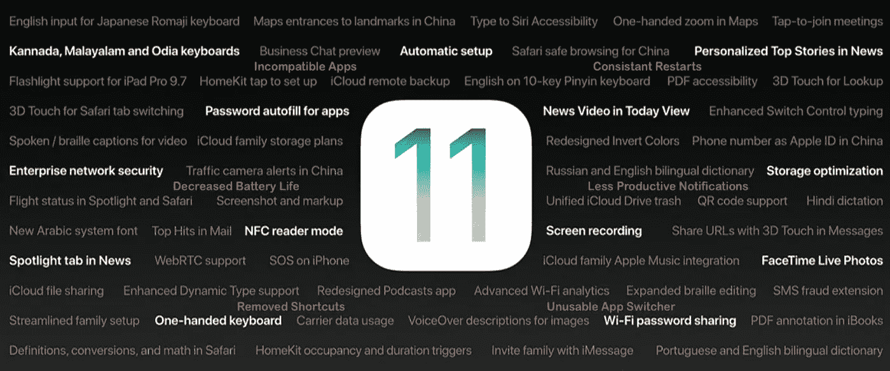
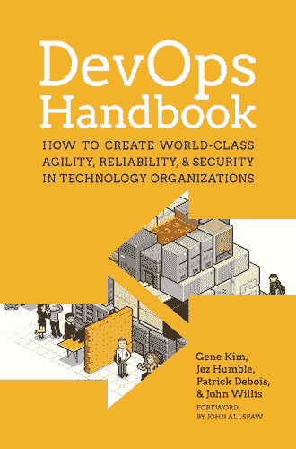
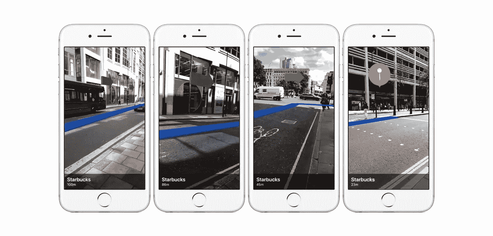

# 开发者们，苹果糟糕的测试版会让你们变得更好

> 原文：<https://medium.com/hackernoon/why-developers-should-download-apples-awful-ios-11-beta-7b1ddc6fc958>

## 我们能从苹果的“错误”中学到什么

我在测试版的一个月充满了问题。应用程序经常崩溃。手机一天重启几次。有些应用程序不工作。我认识和喜爱的捷径已经完全消失了。甚至应用程序切换都是不可用的。通知——我最大的 iOS 抱怨——变得更糟了。

但是我喜欢。原因如下。

大多数文章都会警告你不要在你的主要设备上使用 iOS 测试版。有很多关于砖头手机和花数小时恢复版本的恐怖故事。我会重复这些警告。但是如果你是任何级别的软件开发人员，我建议你冒险一试。

# 向苹果学习

发布整个操作系统是你能做的最大规模的测试之一。如果你看一下最初的测试版[发行说明](https://en.wikipedia.org/wiki/IOS_version_history#iOS_11)，有超过 100 处改动。从那以后就有很多了。

这可能与在小型移动或网络应用程序中发布新功能没有太大的可比性。尽管如此，大规模可以教会我们很多关于我们自己的发布。

## 大公司面临同样的问题

我一直在很小的团队中工作。我最近[写了一篇帖子](https://hackernoon.com/lessons-from-an-experienced-devs-first-solo-app-521bae1411f)，讲述了我创建第一个单人应用的经历。许多开发人员不知道在谷歌、脸书或苹果这样的大公司开发是什么样的。但是我交谈过的大多数开发人员都认同一个共同的神话。

许多人认为，所有这些额外的开发人员使工作变得更容易。问题会更少。每个人都只是在建立新的功能和打网球。(因为他们毕业于创业公司的乒乓球台)。

我最近一直在读 DevOps 手册。那里有一些很好的教训值得学习。但是我得到的最有价值的一个并不是作者的意图。书中的案例研究让一件事非常清楚。大公司和我的小团队面临同样的问题。有时甚至更大！

> “我在那个项目上工作了几个星期，最后找了一个主题专家来审查我的代码。这是将近 3000 行代码，评审人员花了几天的时间才完成。他告诉我，‘请不要再这样对我了。’"
> 
> *-来自* DevOps 手册的 2010 年谷歌案例研究

花几个小时进行代码审查听起来不再那么糟糕了！同样，我的 iPhone 上的大量问题也帮助我意识到了一些事情。我一直帮助发布的测试版在稳定性方面相当相似。规模小得多，但团队也小得多。我可能把错误归咎于缺少人，但那不是真正的问题。

下一次，当你因缺少人手而沮丧时，请记住，让更多的人去解决问题并不能解决问题。这会带来更多的工作。苹果不分享他们的人数。但是 LinkedIn 估计目前有超过 550 名软件开发人员在那里工作。他们也在破坏东西。

我正在进行第四个 iOS 测试版的发布。仍有核心功能被破坏。我喜欢发布新的版本来看看团队在做什么。更重要的是，他们没有经历过的。

## 反馈胜过一切

那么苹果为什么要发布这么烂的测试版呢？是不是发布的太早了，现在他们正在争夺？绝对不行。苹果公司有发布测试版的历史，这些测试版会使手机变得不可用。

iOS Feedback

毫无疑问，他们发布它是因为他们知道客户反馈有多重要。iOS 11 正式发布日期要到 9 月份。还有几个月的时间。这给了他们足够的时间来收集对新功能的反馈。

最初的测试版取消了轻松清除通知的功能。我讨厌它。许多其他人也一样。第四个测试版把它带了回来，甚至比以前更好。你能想象如果苹果向*所有* iPhone 用户发布他们讨厌的东西会引起多大的愤怒吗？

从用户子集收集反馈是至关重要的。[推出暗黑](https://launchdarkly.com/)是一个伟大的工具，帮助慢慢发布新功能。这避免了向所有有价值的用户抛出新的功能来看看它是否坚持。

每次都能看到发行说明，看到苹果对他们收到的反馈是如何反应的，这真是太棒了。这对我们所有人来说都是一个很好的教训，因为我们无疑会推出更小的功能。

# ARKit——不仅仅是厨房餐桌游戏

作为额外的奖励，能够玩 ARKit 是非常值得的门票价格。尤其是如果你的设备支持的话。如果不是这样，仍然值得摆弄代码，但增强现实在模拟器中不是很有用。

ARKit

应用商店早在 2008 年 7 月就出现了。对于应用开发者来说，这是一个前所未有的时代，因为他们开始利用“应用热潮”ARKit 是相当长一段时间以来最接近应用繁荣的美国应用开发者。

这是一项全新的技术，数百万人可以立即使用。大约[3.8 亿台设备](https://uploadvr.com/380-million-iphones-are-arkit-compatible/)接近精确。如果您是任何类型的开发人员，您应该下载一些示例应用程序。用 XCode 做一些演示。这是发展这项技术的最佳时机。

虽然游戏是 ARKit 的主要用例，但如果你不喜欢游戏，也不要把自己排除在外。看看开发者已经开发的一些应用程序。

我已经用这个[卷尺应用](https://github.com/DroidsOnRoids/MeasureARKit)做了一些房屋工程，它的精确度让我大吃一惊。将[家具](https://www.youtube.com/watch?v=DSYeN624ick)放在现实世界中相当实用。甚至还有这个 GPS 应用程序，供那些不知何故觉得 GPS 太令人困惑的人使用:

[Maps POI Demo](https://9to5mac.com/2017/07/21/arkit-augmented-reality-navigation/)

这里有大量的潜力，值得一试。

# 立即下载

如果你需要你的手机一整天都保持完美，我还是会推迟。但是，如果你是一名拥有最新 iOS 设备的开发者，这种头疼是值得的。这可能会让你成为一个更好的开发者。如果你已经[注册了测试版](https://beta.apple.com/sp/betaprogram/)，请在评论中告诉我你的想法！