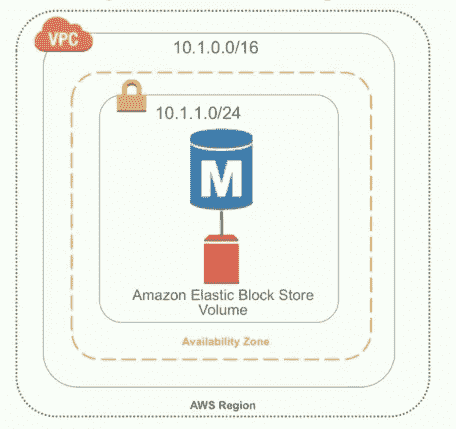
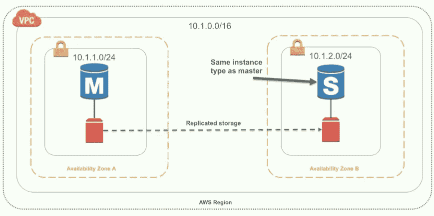
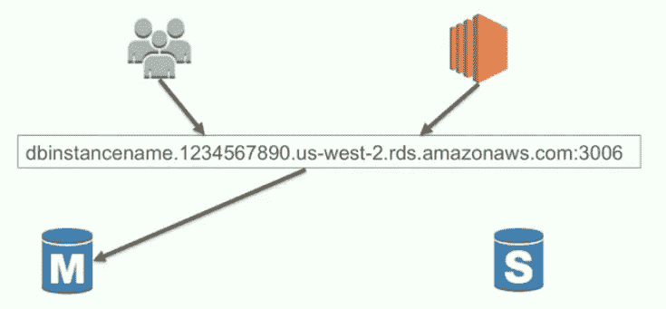
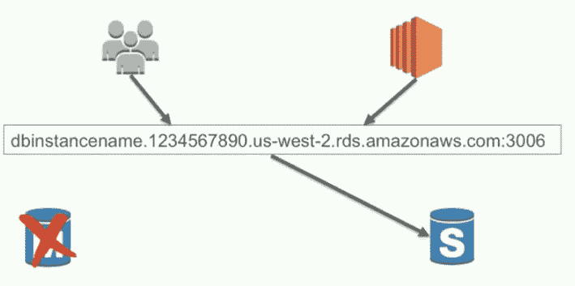
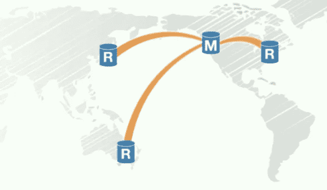
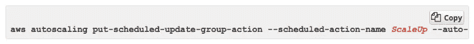
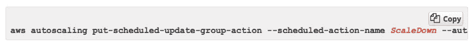
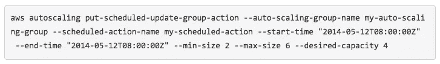

# 为什么我决定在我的项目中使用亚马逊关系数据库服务(RDS )?

> 原文：<https://medium.com/hackernoon/why-did-i-decide-to-use-amazon-relational-database-service-rds-in-my-project-14470055f4cc>

我使用 [AWS](https://hackernoon.com/tagged/aws) (亚马逊网络服务)服务已经超过 5 年，EC2 一直是我在亚马逊网络服务中使用最多的服务。到目前为止，我已经开发了许多运行在 EC2 上的基于 web 的应用程序和服务。由于 EC2 自带配置，开发人员错过了使用 RDS 的机会。我的意思是，假设您想要一个包含 IIS、SQL Server 的 windows 服务器。您可能会打开 EC2 界面，点击“启动实例”按钮并选择一个映像(AMI)，然后您有时会将服务器用作独立的[数据库](https://hackernoon.com/tagged/database)，或者同时用作 web 服务和数据库。这是它不那么受欢迎的主要原因。

由于某种原因，我需要研究 RDS，在这次研究之后，我意识到 RDS 是亚马逊提供的另一个很棒的服务。你可能会问“这怎么可能是一个很棒的服务，它只是一个关系数据库？”如果你问了，你就错了。让我们深入了解一下它的特点。

**让我们总结一下它有多棒，首先:**

*   没有基础设施管理
*   应用兼容
*   安全的
*   高可用性
*   可扩展(向上/向下)
*   易于监控
*   备份恢复能力
*   完美的 API 能力
*   成本效率

很奇怪但却是真的，**全托管主机和 OS** 。你不知道哪些操作系统在数据库下运行，也不知道它是如何运行的。因此，无法访问数据库主机操作系统。如果您只是使用数据库，并且您不是数据库方面的专家，那么可能数据库专家比您更了解操作系统应该如何配置。Amazon 专家在操作系统和数据库方面都有很高的专业水平，他们通过考虑性能、安全性和容错来配置系统配置。因此，没有依赖主机操作系统配置的功能。该系统是一个现成的解决方案。

AWS RDS 是服务名，而不是数据库名。这意味着，RDS 不仅仅是一个数据库，它支持不同类型的数据库。 [PostgreSQL](https://aws.amazon.com/rds/postgresql/) ， [MySQL](https://aws.amazon.com/rds/mysql/) ， [MariaDB](https://aws.amazon.com/rds/mariadb/) ， [Oracle](https://aws.amazon.com/rds/oracle/) ，[微软 SQL Server](https://aws.amazon.com/rds/sqlserver/) 和 [Aurora](https://aws.amazon.com/rds/aurora/) 今天都支持。你可以这么说，好吧，我知道他们，但这到底是什么极光？Aurora 是亚马逊开发的数据库。他们不仅花时间开发 RDS，还开发了自己的数据库。根据其官方网站，它提供了比 MySQL 高五倍的性能。是不是很有意思？

可以选择这 5 个数据库或 Aurora 中的任何一个。这不是这篇文章的主题，所以我不会提及数据库的细节。然而，有一件事我很感兴趣，我想和你分享一下。

**最大存储限制—**TB

*   SQL Server: 4 TB
*   PostgreSQL，MySQL，MariaDB，Oracle: 6 TB
*   极光:64 TB

你看到差距了吗？比 SQL Server 大 16 倍，比其他服务器大 11 倍左右。如果您确实用尽了存储，您应该选择一种策略，如分片策略、归档策略或删除策略来处理新数据。看来很难达到极光的 max 极限了。亚马逊再次展示了它的与众不同。

# **安全**

安全是另一个重要的话题。亚马逊正在利用其 VPN(虚拟专用网络)能力、安全组系统、KMS(密钥管理服务)和 IAM(身份和访问管理)服务来解决这一问题。

由于其模块化架构，这些服务也用于其他 AWS 服务。因为我不想展开太多的部分，所以我不打算提及它们。然而，我在 youtube 上看了一个关于安全组的视频，印象深刻。演示者说,*安全组基本上是一个防火墙，一个虚拟防火墙，控制流量协议、端口范围、流量类型、流量来源和来源的 IP 地址。*“是真的。我使用 AWS 安全组已经超过 5 年了，但是我从来没有意识到这一点。这是一个虚拟防火墙。

由于您没有参与支付项目，您可能没有意识到符合 PCI/DSS 的重要性。参加 PCI/DSS 合规认证是一个艰难、复杂且耗时的过程。然而，至少从服务器的角度来看，亚马逊让你更容易做到这一点。您可以在 PCI/DSS 符合性检查列表中将服务器问题标记为 OK。

安全或 PCI/DSS 兼容不要直接针对 RDS。AWS 公共服务提供了如此好的特性，以至于我们可以将它们与 RDS 一起使用。

让我们更多地讨论与 RDS 及其功能相关的内容。

# 高可用性

关于可用性有两种方法。首先是最小部署，称为单个 AZ。顺便说一下，当我在亚马逊 RDS 网站上看到 AZ 术语时，我花了很长时间才理解它的意思。AZ 的意思是“可用区域”。

最小部署看起来像:

Single AZ

1 个数据卷，1 个数据库实例用于数据库操作。该数据库应该随时可用。很明显，运行单一可用性区域部署可能不是最佳方法。

第二，高可用性。看起来像；

Multi AZ

看起来不是更复杂了吗？两个相同的数据库实例运行在不同的区域上。数据卷是另一个数据卷的副本。如果主区域出现网络通信问题或实际故障，您可以选择进行其他故障切换，以最大限度地减少停机时间。

当主数据库或其所在的可用性区域出现故障时，RDS 服务将会接管，因为它是一项托管服务，并且会将该 DNS 条目重新指向您的备用数据库，使该备用数据库现在成为您的主要主数据库。

好的一面是你不在乎这些过程中的任何一个。RDS 为您处理。你只需要对 RDS 说，打开多 AZ 和你想运行 DB 的区域号。

# 缩放比例

您的网站或移动应用程序变得越来越受欢迎或使用越来越广泛，您有一个主数据库，它不仅要支持“写”操作，还要支持大量“读”操作，这给它带来了很大的压力。在这种情况下，您可能希望将负载分配给不同的服务器。

一种方法是，您可以添加相同的附加副本数据库来帮助减轻一些负载。主数据库及其副本可用于“读”操作，而只有主数据库可用于“写”操作。

您可能希望扩大或缩小数据库的不同原因。显然，第一个选项是处理更高的负载，另一个选项是降低使用率。您可能会调整初始数据库的规模，以处理您预期的一定数量的事务、一定数量的用户，但您可能会发现，您没有达到这些数字，并且数据库的利用率很低。您可能希望缩小数据库的规模。

另一种选择是依赖于时间的使用。假设您有一个应用程序，其数据库在周一至周五被频繁使用，但在周末却很少使用，没人会去碰它。如果你真的能把数据库调整到一个更小的尺寸，那不是很好吗？

您可以使用 RDS web 界面来放大或缩小服务器，而 Amazon 也提供了自动缩放服务器的方法。AWS CLI(命令行)和 API。您可以准备一个 cron(unix 调度作业)。

CLI 命令看起来像:

CLI — Scale Up

CLI — Scale Down

一行代码用于放大或缩小。多牛逼的东西，哈！

详细:[http://docs . AWS . Amazon . com/auto scaling/latest/user guide/schedule _ time . html](http://docs.aws.amazon.com/autoscaling/latest/userguide/schedule_time.html)

克朗看起来像；

Cron

详细:[http://docs . AWS . Amazon . com/CLI/latest/reference/auto scaling/put-scheduled-update-group-action . html](http://docs.aws.amazon.com/cli/latest/reference/autoscaling/put-scheduled-update-group-action.html)

您可能会问，我还需要一个服务器，以便服务器可以运行这个 cron。由于 cron 服务器运行，我也将支付它。那么，成本削减在哪里呢？你是对的，但是 amazon 提供了另一个服务来运行这个 cron。Lambda，没有服务器，但仍在计划中！AWS Lambda 允许您在不提供或管理服务器的情况下运行代码。在云上写代码，在云上运行。

最后，RDS 还提供基于指标的扩展。

1.  RDS 正在向 CloudWatch 提供信息
2.  定义您的警报阈值
3.  一旦超过这些阈值，就会发出警报。
4.  它以 SNS(简单通知服务)的形式发送通知
5.  如果您觉得需要基于您定义的阈值进行扩展，您可以订阅一个 Lambda 函数，该函数可以对您的数据库采取行动。

RDS 包括许多附加功能，如备份、恢复和监控。我试着写下我最在乎的人。

毕竟奥斯卡去亚马逊，感谢亚马逊。

最好的，

多安·艾登

【我的推特:[*https://twitter.com/dgnaydin*](https://twitter.com/dgnaydin)

*我的领英:*[*https://www.linkedin.com/in/doganaydin/*](https://www.linkedin.com/in/doganaydin/)

*我的 GitHub:*[*https://github.com/trda*](https://github.com/trda)