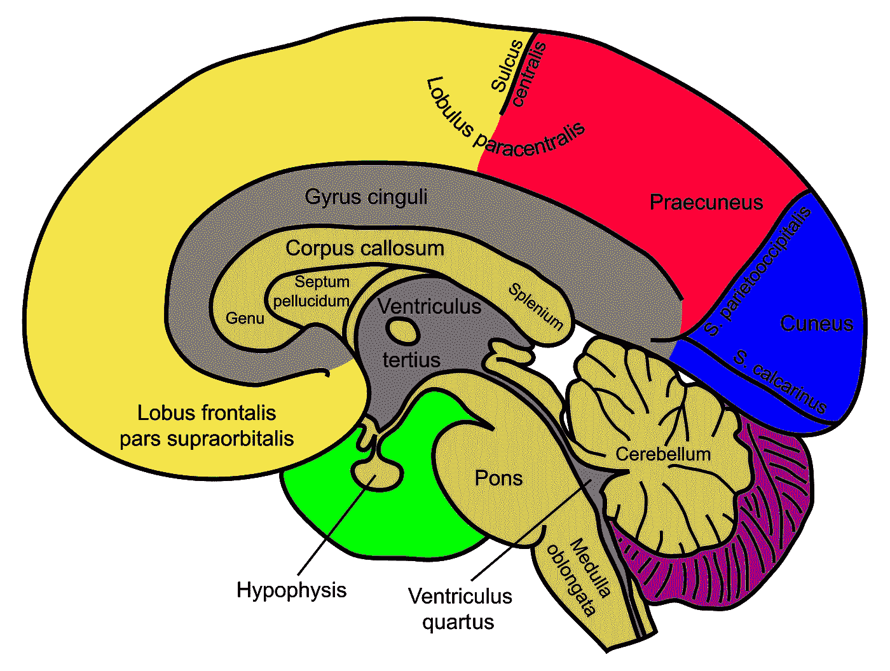

# 程序员为什么要戴耳机？就像你不能变戏法一样。

> 原文：<https://medium.com/hackernoon/why-do-programmers-where-headphones-5ca3a2f81266>

有人称之为排除杂念。有人称之为*流*。已经证明，脱离你周围的环境可以增加对内部思考过程的关注。在这篇文章中，我将深入探讨这一现象的神经学成分以及民间建议。

工作记忆是大脑生理学的一个研究很好的组成部分，通常与前额叶皮层有关。举例来说，如果你试图记住一系列随机单词，并在记忆中重复它们，那么你很可能会试图将它们放入工作记忆中。然而，这可能不会让你一次记住更多的单词。工作记忆的容量非常有限。

记忆运动员通过使用一种通常被称为*记忆宫殿*的技术来绕过这个限制。这使得他们能够将大部分的记忆需求转移到空间记忆上，而空间记忆与工作记忆密切相关。这些运动员围绕着他们内部的宫殿概念“行走”,并将某些单词或物体“放置”到一个他们会在正确的时间记住的位置。如果使用得当，这种技术可以大大增强记忆随机信息的能力。

程序员使用类似的技术来记忆和导航代码。然而，也有局限性，即工作记忆并没有完全从图片中移除。工作记忆充满了你在任何特定时间有意识地意识到的所有事情。那只四处嗅来嗅去的狗，你同桌正在听的音乐，你日程上的会议，以及其他你可能担心的事情。这些东西填满了你的工作记忆，对任何试图用你头脑中的代码工作的尝试都是一个巨大的拖累。太多同时发生的分心会有效地阻碍任何达到辉煌*心流*状态的尝试。

研究还表明，一旦一个人被击出心流状态，可能需要 20 分钟才能恢复。注意力不集中会对员工的工作效率产生重大影响。这就是耳机的用武之地:对于想要摆脱干扰、保持流畅的程序员来说，音乐是一种很好的释放和安全措施。另一方面，这个问题在高级程序员中有时不太重要，因为他们对项目或环境的理解已经从空间短期记忆转移到空间长期记忆；其效果是在不进入恍惚状态的情况下更容易回忆起这些记忆。

所以重申一下:程序员容易分心，耳机消除了一些分心，从而耳机让程序员快乐。就我个人而言，我几乎一直开着音乐，不管有没有代码。我就是喜欢音乐。

> [黑客中午](http://bit.ly/Hackernoon)是黑客如何开始他们的下午。我们是 [@AMI](http://bit.ly/atAMIatAMI) 家庭的一员。我们现在[接受投稿](http://bit.ly/hackernoonsubmission)，并乐意[讨论广告&赞助](mailto:partners@amipublications.com)机会。
> 
> 如果你喜欢这个故事，我们推荐你阅读我们的[最新科技故事](http://bit.ly/hackernoonlatestt)和[趋势科技故事](https://hackernoon.com/trending)。直到下一次，不要把世界的现实想当然！

