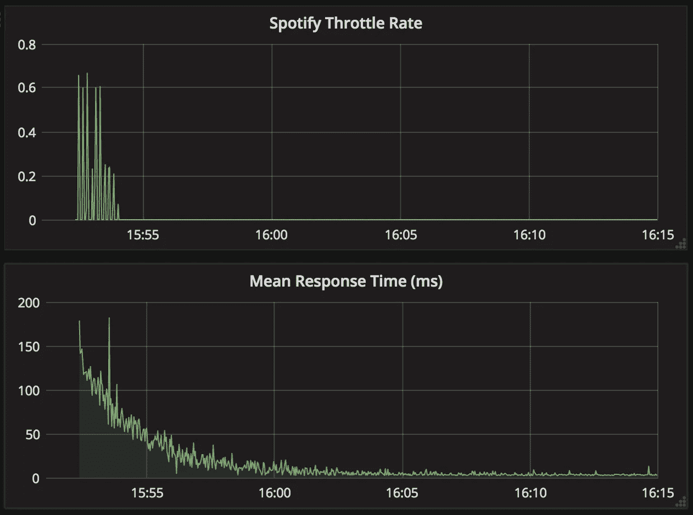

# 我们为什么要缓存？

> 原文：<https://medium.com/hackernoon/why-do-we-cache-b24920e1e903>

缓存是计算机科学中一个基本且无处不在的概念。从计算机 CPU 使用的内存[缓存](https://hackernoon.com/tagged/caches)到浏览器缓存，浏览器缓存似乎对随机网站的每个神秘“问题”负责(“你有没有尝试清理你的缓存？”)，缓存无处不在。

大多数开发人员理解基本要点:缓存使事情变得更快。当您想要获取一些查找成本很高的数据(就时间或其他资源而言)时，您可以缓存它，以便下次您想要查找相同的数据时，成本会低得多。但是这在现实世界中是什么样子的呢？

# 唾手可得的水果大获全胜

缓存是非常重要的，因为在某些情况下，不需要太多努力就可以获得显著的性能提升。想象你是 [IMDB](http://www.imdb.com/) 并且你有很多实际上不变的数据，比如电影元数据(想想摘要、演员信息、位置细节)。这些数据可能存储在某个地方，也许是一个 SQL 数据库。当用户访问特定电影的网页时，呈现给他们的是所有这些基本上是静态的信息。

因为你不希望基本的元数据改变，所以每次访问页面时都在数据库中查找是一种浪费。在缓存(web 服务器本地)中查找它比从远离 web 服务器的 SQL 数据库中获取它要高效得多——至少是另一个网络跃点。这也给数据库带来了许多额外的不必要的负载。

这很容易理解。但是在什么情况下这真的很重要呢？毕竟，现代 SQL 数据库非常强大。

# 规模越大，责任越大

想想一部非常受欢迎的电影。也许网飞刚刚在全球发行了《盗亦有道》(我们只能希望如此！).来自世界各地的许多人都在访问 IMDB 上的好家伙页面。哇，每秒钟有 10，000 次页面浏览。您的 SQL 数据库正在受到冲击。除了数据库接收各种其他 IMDB 功能(评论、图片上传、评论等)的大量常规流量之外，它现在还必须处理大量额外的读取流量。

Thankfully most people in Amazon’s upper management don’t look this scary.

为了避免整个网站崩溃，你在 web 服务器上添加了一个缓存(我个人最喜欢的是 [Redis](https://redis.io/) )。每当页面试图查找《盗亦有道》电影元数据时，它会直接从缓存中获取数据，这是一个在 web 服务器上本地运行的进程，最多在几毫秒内返回数据。您不仅极大地缩短了响应时间，节省了数据库上的网络跳数和缓慢的 CPU，还极大地减少了糟糕的、超负荷工作的数据库上的负载，避免了应用程序中的其他功能出现故障。

# 这并不像看起来那么容易

显然，我已经将构建一个健壮的缓存系统的许多基本细节过于简化了。挑战包括:

1.  **处理动态数据**。如果您希望数据经常变化，那么您不希望将它缓存太长时间，否则您的客户端会对这个世界有一个不准确/过时的看法。毕竟，缓存失效是计算机科学中仅有的两个难题之一[。](https://martinfowler.com/bliki/TwoHardThings.html)
2.  **故障**。当您的缓存关闭时会发生什么？您的后端系统能处理增加的负载吗？一种解决方案是构建多级缓存。例如，每个应用服务器的本地缓存以及所有应用服务器共享的远程缓存。
3.  **部署**。当 web 服务器被重新部署时，本地缓存可能会被清空，或者至少在新的应用服务器启动时会被清空。您如何准备缓存以避免每次部署时后端流量激增？当缓存被清空时，如何在不破坏后端系统的情况下将更新部署到您的共享缓存车队？

# 但有时确实如此

尽管有这些复杂性，我还是想从一个真实世界的例子中加入一些数据，来说明你确实可以不费吹灰之力就获得巨大的成功。在我的业余时间，我创建了一个名为 [**阵容**](https://lineupsongs.com) 的小网络应用，它可以让你从艺术家列表中创建 Spotify 播放列表。

 [## 阵容歌曲

### 根据艺术家列表创建或更新 Spotify 播放列表

lineupsongs.com](https://lineupsongs.com) 

阵容包括一个自动完成功能，可以在您键入时从 Spotify 搜索艺术家。每次它启动时，都会向 Spotify 的[搜索 API](https://developer.spotify.com/web-api/search-item/) 发出一个请求，以获取该查询的前 5 名匹配艺术家。

对 Spotify 的 API 要求太多了！想象一下几千人同时使用阵容(只在我最狂野的梦里！).如果所有的用户都试图同时搜索相同的几个流行艺术家会怎么样？例如，假设他们正试图将今年在 Coachella 演出的所有艺术家放在一起。

They heard Hans Zimmer is going to be there. Yes, THAT Hans Zimmer.

我们不认为 Spotify 的搜索结果会经常改变。我的意思是，新艺人加入的频率有多高，用户可能会搜索谁？可能每小时不到一次。许多对 Spotify API 的搜索请求将是多余的。我们应该能够至少在短时间内安全地缓存给定查询的搜索结果。

为了研究艺术家搜索缓存为阵容带来的节约，我编写了一个脚本来查询今年在 [Coachella](https://www.coachella.com/lineup/) 演出的所有艺术家的阵容。该脚本随机搜索艺术家的所有前缀(例如“B”、“Be”、“Bey”、“Beyonce”以及小写变体)，以模拟用户在阵容 web 界面中键入艺术家。该脚本总共运行了 **36，002 次**搜索，此时缓存完全满了(所有后续请求都是缓存命中)。

# 美味多汁的低挂水果

我们感兴趣的是查看有多少缓存命中，缓存命中比未命中快多少(这会导致对 Spotify API 的远程调用缓慢)，以及缓存对我们的错误率有什么影响。毕竟 Spotify 的 API 会在某些时候对我们进行速率限制，导致服务器错误为阵容，用户体验不佳。五个线程并行运行请求，结果如下:

*   **33016** 缓存命中， **2986** 缓存未命中
*   *缓存命中* 的平均响应时间为 **3.22 毫秒**。第 90 个百分位数(10%最慢的请求比这个值慢)是 **7.19 毫秒**。相比之下，*缓存未命中*(由 Spotify 的 API 提供)的平均响应时间是**146**28】毫秒。第 90 百分位是**163**ms。显然，缓存命中将更快地提供响应，但我想弄清楚，如果您认识到应用程序中可以应用缓存的位置，您可以节省多少时间。
*   从一个空缓存开始，所有请求都被发送到 Spotify 的 API，这导致了节流。正如您在下图中看到的，随着缓存的填满，服务器错误下降到 0(所有请求的平均响应时间也直线下降):

虽然 Lineup 可能是一个小众用例，但其思想是即使一个简单的缓存也可以极大地提高应用程序的性能，尤其是当它开始扩展时。

# 摘要

 [## bal2ag/cachual

### 用一个简单的装饰器缓存 Python 函数的返回值。

github.com](https://github.com/bal2ag/cachual) 

我希望大家清楚为什么缓存很重要，以及即使使用简单的缓存方案也能获得惊人的成功。我认为缓存非常重要，每个开发人员都应该能够轻松访问它。所以我为 [Python](https://hackernoon.com/tagged/python) 、[T3、Cachual](https://github.com/bal2ag/cachual)写了一个库，目的正是为了做到这一点。它允许 Python 开发人员用一个非常简单的装饰器缓存 Python 函数返回值。我的下一篇文章将会探讨我的动机和 Cachual 的细节。

> [黑客中午](http://bit.ly/Hackernoon)是黑客如何开始他们的下午。我们是 [@AMI](http://bit.ly/atAMIatAMI) 家庭的一员。我们现在[接受投稿](http://bit.ly/hackernoonsubmission)并乐意[讨论广告&赞助](mailto:partners@amipublications.com)机会。
> 
> 如果你喜欢这个故事，我们推荐你阅读我们的[最新科技故事](http://bit.ly/hackernoonlatestt)和[趋势科技故事](https://hackernoon.com/trending)。直到下一次，不要把世界的现实想当然！

