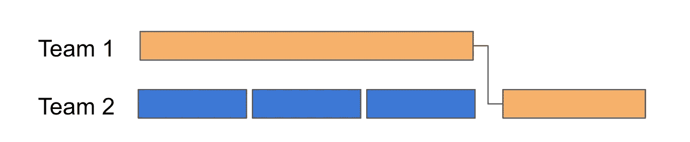

# 我们为什么要估计？

> 原文：<https://medium.com/hackernoon/why-do-we-estimate-6839ba295e9e>

我最近问了一群工程师、产品经理、UX 和质量保证人员这个问题。他们是这样回答的:

我们使用估算是为了/所以/因为 _____________________

*   强迫对每个故事进行对话…尤其是复杂的故事
*   所以我们可以用一定数量的故事点来填充我们的 sprint
*   保持我们工作的可持续性，不要承诺做太多(在冲刺阶段)
*   所以我们可以告诉某人这个项目什么时候完成
*   这样我就可以传达项目的当前状态
*   因此，我可以指出范围蔓延将如何影响项目的交付日期
*   所以我知道团队什么时候准备好接受一个新项目，我可以和项目涉众一起工作来澄清需求
*   所以我们可以衡量团队的效率
*   为了防止共享资源过载
*   因此，我们可以衡量个人贡献者的效率
*   帮助我们确定优先顺序。我们想找到小的/有价值的特征
*   因为这就是你在敏捷中所做的，对吗？
*   让人们负起责任。有了速度目标，他们会更有动力
*   把它们加起来，算出在某个日期之前什么是可能的，什么是不可能的
*   分摊各个项目的费用。时间追踪太难了，所以我们用估计的点数来代替
*   这样我们就可以衡量特定项目的投资回报率
*   计算项目风险。这完全是风险与回报的问题

其中有多少人感觉“非常适合”评估？有多少是不合适的？是否有其他方法可以达到相同的最终目标？

在阅读这个列表时，考虑这些反复出现的主题:

*   批量大小(“大”与“小”项目)
*   Scrum 方法论，以及固定的迭代长度
*   外部团队依赖和涉众需求
*   截止日期在你的商业模式中的作用
*   绩效管理实践
*   信任和安全级别
*   会计实践
*   团队如何被分配到项目。在选择/寻求解决方案方面的团队自主权

Team 1: “When will you be ready for us?” Team 2: “When will YOU be ready?”

根据您的环境，您可能会利用评估来实现多个目标。这些目标中有许多是与环境相关的。如果你能控制环境中的某些变量，你就能缩小招聘评估的“工作”范围。坦率地说，有些事情最好通过其他方法来实现。在这种情况下，评估对于这项工作来说并不是最好的(甚至是勉强可以接受的)工具。

给定上面的列表，我可以挑出 5-7 个与估计或估算无关的。

背景很重要。让我从过去五年的职业生涯中挑选一个背景(B2B SaaS):

*   在优化模式下，我们每周发布 5-10 个改进(迷你项目)
*   我们没有在固定的迭代中工作
*   工作文化重视可持续的习惯
*   团队围绕移动一个特定的度量标准达成一致。许多“项目”都失败了(我们很早就中止了实验)，而当他们移动指针时，我们加倍努力
*   我们有最小的外部依赖性
*   团队是根据产生的结果来衡量的，而不是交付的代码或完成的项目

当然，批评家会告诉我，我不生活在现实世界中，我不负责任，这不是真正的商业行为。让我躲在我想象的洞穴里畏缩。但是等等…我们还在估算。

在我的上下文中，估算的范围很窄。努力很小。我们不需要穿依赖针。没有顾客会期待在特定日期前收到东西。不需要在发布前几个月通知营销人员(提前一周通知就可以了)。只要看看团队的成本，你就可以很容易地计算出成本。SaaS 模式的本质意味着我们总是在产品中添加/删除功能。很少有明确的定论。因为我们总是在添加/删除。对于我们目前正在做的任何事情，我们会非常安全地回答“10-15 天”,我们会非常接近。

因此，退一步说，“成本”是固定的，ROI 是通过查看团队如何跟踪改进特定的度量标准(以及一些商定的移动这些度量标准的值)来衡量的。即使如此，当我们想到“小实验”时，我们还是进行了估算——尽管是含蓄的估算。

这是一个非常难得的环境(更多的是一个服务生态)。与其他领域相比，这可能是一个“极端”的环境，尽管它是一家上市公司。大项目、固定日期和大量依赖更为常见。许多团队无法将他们的工作与客户成果直接联系起来，也无法如此迅速地获得反馈。

#NoEstimates 运动的一个问题是，它(正如某些从业者所表达的那样，非常无意地)缺乏同理心。它做出了一个总括性的声明，即评估对于所有的用途都是不好的。也就是说，它们对试图在当前环境/背景下经营的人来说是有害的。他们基本上是在说…“那么，如果你的营销团队需要知道下一个版本中会包含什么呢！”或者“如果你有一个糟糕的共享服务，不得不拍卖它的容量，那又怎么样！”评估人员变成了坏人，而不是挑出他们被雇佣去做的真正不正常的事情——例如，“改善问责制”。

此外，还有一类评估工作，在这类工作中，外部环境是可以改变的(例如，依赖关系被移除，工作以更小的批量交付，更多的流程，更紧密的反馈循环，等等)。)这并没有消除评估作为一个基本概念的必要性，但是它极大地改变了评估的重点。在这里，我认为最好把重点放在杠杆上。“我们能做些什么来更小批量地工作，并更快地整合客户反馈？”“我们如何根据延迟成本更好地进行优先级排序？”我认为这是一个持续改进的努力。

最后，在一些环境中，我认为这些杠杆(例如依赖、过度利用)是一个比评估需求更大的问题。再多的评估也无法帮助公司解决其巨大的依赖性问题或臃肿的规划过程。因此，您可以安全地删除该实践，直到这些问题得到解决。这是一件你不需要担心的事情，甚至可能有助于集中讨论。在以后的某个时候，当其他问题解决后，你可以再次担心评估，并弄清楚你将雇用他们做什么。

所以 TL；博士对这一切的看法是:

*   语境语境语境。
*   你雇佣评估做什么工作？
*   它是这项工作的合适工具吗？有用吗？如果它不起作用，为什么？
*   你有什么可以影响评估工作的杠杆？
*   什么时候过程增加了价值，什么时候它成为了静重？

干杯！感谢评论。

> [黑客中午](http://bit.ly/Hackernoon)是黑客如何开始他们的下午。我们是 [@AMI](http://bit.ly/atAMIatAMI) 家庭的一员。我们现在[接受投稿](http://bit.ly/hackernoonsubmission)，并乐意[讨论广告&赞助](mailto:partners@amipublications.com)机会。
> 
> 如果你喜欢这个故事，我们推荐你阅读我们的[最新科技故事](http://bit.ly/hackernoonlatestt)和[趋势科技故事](https://hackernoon.com/trending)。直到下一次，不要把世界的现实想当然！

