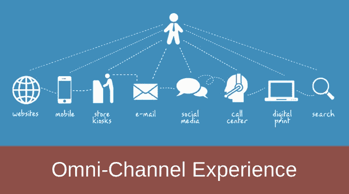

# 为什么全渠道体验对您的客户至关重要

> 原文：<https://medium.com/hackernoon/why-does-omni-channel-experience-matter-to-your-customers-ef8707f35ade>

以创造性的方式满足顾客的想法并不新鲜。品牌已经这样做了很长时间，但消费者现在期望的更多:更好的整体体验。 [**客户体验**](http://www.osscube.com/digital-user-experience-solutions) 通常涉及在他们需要的时间、地点和方式，向他们的接触点传递价值。

如今，无论是线上还是店内，人们都迫切希望获得一个统一一致的品牌体验。它不仅适用于一个层面，而且适用于购买周期的所有阶段，从意识到做出决定到实际购买和获得支持。

例如，潜在买家可能会在闲暇时在桌面上搜索某个产品，在旅行时在[手机上阅读关于同一产品的评论，最后可能会在看电视时在平板电脑上购买该产品。或者，他/她可以在网上商店预订产品，然后从实体店提货。](https://hackernoon.com/tagged/mobile)

这就是为什么零售商在全渠道或统一战略上下了大赌注。 [**全渠道体验**](http://www.osscube.com/omnichannel-integration) 旨在为所有客户接触点提供无缝一致的体验，无论是桌面、移动应用或平板电脑，还是实体店。Aberdeen Group Inc .声称，拥有最强全渠道客户参与战略的公司平均能留住 89%的客户，相比之下，拥有弱全渠道战略的公司平均能留住 33%的客户。

# 以下是全渠道体验对客户非常重要的原因:

# 即时可达性

速度是关键。客户没有耐心等待，他们期望即时供货——即时信息、即时产品购买和交付，以及即时响应。这意味着品牌必须能够通过所有渠道立即接触到买家，以一种吸引人和令人满意的方式。

如果你不能以他们喜欢的方式吸引他们，他们可能会开始在其他地方寻找选择。

全渠道方法使客户能够在任何地方获得相同的体验，并通过他们选择的渠道进行购买，没有任何延迟。

# 无障碍的便利性

如今，客户面临多种选择，但更多的选择会给他们带来更多的复杂性。然而，如果他们发现在最重要的时候和最重要的地方毫不费力地联系到你，他们从你这里购买的机会就会增加。

显然，你在产品和定价信息、客户评论、比较购物、支付方式、无缝渠道转换、个性化推荐和支持方面提供的便利越多，影响潜在买家的复杂性就越低。例如，如果你的店内销售代表不能提供所有可用产品的信息，你的网站或手机应用程序应该能够做到。如果你的网上商店不接受订单，你应该提供一个明确的位置和最近的店内方向。

无处不在的产品信息可以帮助客户做出更明智的决定，并为他们提供更多的购物选择。

# 个性化全渠道响应

每个顾客都是不同的，他们对你的产品和服务的认知也是不同的。你需要区别对待每一个人。当你的品牌在所有沟通渠道中为客户提供无缝、相关和个性化的体验时，它增加了一致的价值，当然会吸引他们。

例如，如果您通过多种渠道向相关客户发送令人兴奋的优惠、产品条形码和店内移动促销信息，您的客户可以在不丢失上下文的情况下开始对话或购买。或者，如果他们从你的网上商店或移动应用程序购买，他们希望可以在附近的实体店退货，不会有任何麻烦。这种类型的体验总是有助于更频繁的购买。

从客户的角度来看，全渠道等于便利。就灵活的购物选择而言，它增加了新的价值。

# 统一自助偏好

在当今关系时代的思维模式中，整合是渠道间、部门内和跨平台的关键，以获得更好的支持和服务。

客户希望能够方便地获得支持服务来回答他们的问题并解决他们的问题。他们希望第一时间解决帮助请求，而不是每次使用新渠道或与新的支持主管交谈时都重复这些请求。事实上，他们更喜欢自助服务支持选项，而不是所有接触点的辅助服务，以便随时随地获得即时答复。

个性化的全渠道自助服务支持体验(如帮助台、知识库、应用程序、信息亭等)。)有助于客户轻松融入品牌。此外，它为他们提供一天 24 小时的支持。

全渠道自助服务使客户能够快速、方便地获得按需信息，以便即时解决问题。

因此，终端消费者不再忠于某一个渠道，而是忠于跨多个渠道的无缝体验。

在互联网零售商全渠道赢家的[报告](https://www.internetretailer.com/shop/2016-omnichannel-winners-of-the-top-500.html)中，“*美国一些最大的零售连锁店，如沃尔玛公司、梅西公司、诺德斯特龙公司和塔吉特公司都致力于全渠道战略……有大量证据表明，消费者喜欢跨渠道购物……全渠道不仅仅是一种零售战略，它关乎生存*”

很明显，消费者需要整合的全渠道体验。但是，这并不意味着每个零售商都必须实施[全渠道](https://hackernoon.com/tagged/omnichannel)体验的所有组成部分。他们应该首先积极分析目标客户的需求和现状，然后创建一个整合全渠道能力的流程，以充分发挥其价值。

大多数零售品牌都在大力投资 [**数字化转型**](http://www.osscube.com/enterprise-digital-transformation) ，以改善客户体验，加速增长。全渠道体验管理是零售品牌的主要关注点。

*这篇文章最初出现在沙欣·沙阿的* [***OSSCube 博客***](http://www.osscube.com/blog/why-does-omnichannel-experience-matter-to-our-customers) *上。*