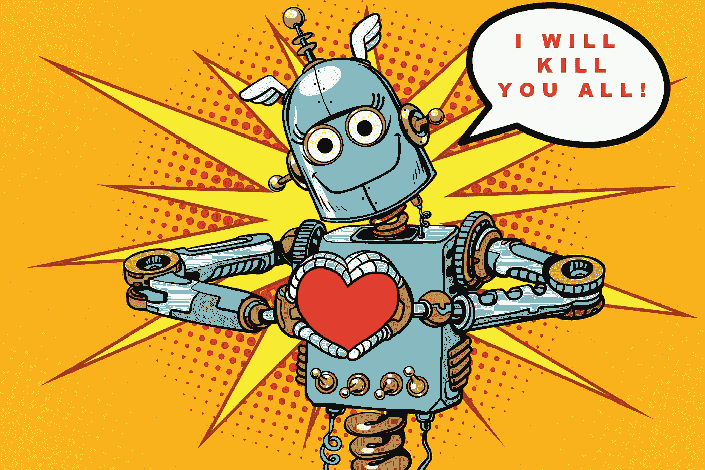
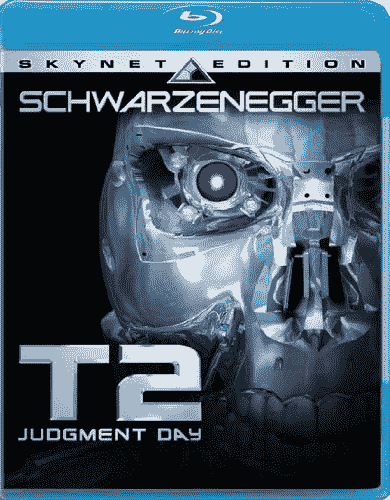
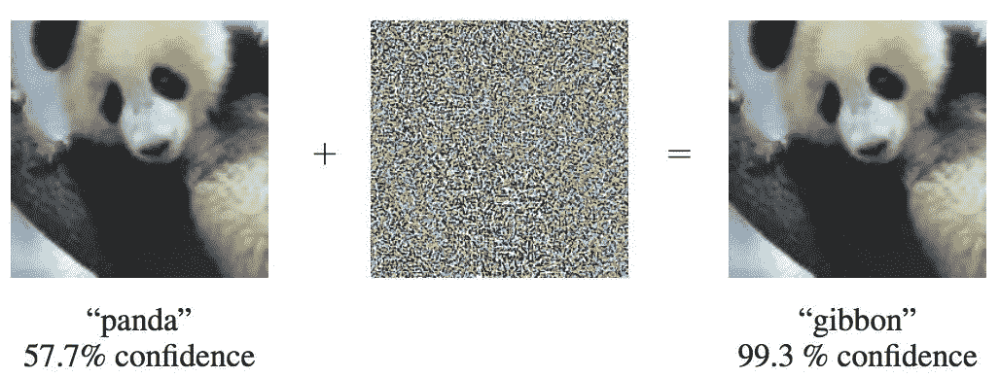

# 为什么埃隆·马斯克对人工智能的看法是错误的

> 原文：<https://medium.com/hackernoon/why-elon-musk-is-wrong-about-ai-a093b83ac99a>

你知道这个故事。AI 会起来杀了我们所有人。

脸书不是不得不关闭他们最新的可怕实验吗，因为它变得不听话并发展了自己的秘密语言？

这只是时间问题。据我们所知，天网的工厂已经在生产一支终结者大军了！我们最好动作快点！

唯一的问题是，这都是废话。

埃隆·马斯克没帮上忙。

他警告说，这是一个比朝鲜更糟糕的“T2”生存威胁。据我所知，他们有核武器和一个小疯子掌权，超级人工智能仍然局限于赛博朋克小说的页面，所以我不买它。看，这家伙比我聪明多了，我认为他的[电池](https://www.tesla.com/powerwall)、[汽车](https://www.tesla.com/model3)和[太阳能屋顶瓦](https://www.tesla.com/solarroof)将改变世界，但他花了太多时间看 *2001:太空漫游*。

大众媒体也没帮上忙。否则我们怎么会花三个月的时间来报道一个关于脸书因为太聪明而关闭他们的人工智能的虚假故事呢？你猜怎么着？这不是真的。

他们关闭了它，因为它是一个蹩脚的，失败的程序，没有做它的工作。就这么简单。

然而，不知何故，这个故事的一个新版本每天都会出现在我的社交媒体上:艾做了一些邪恶的事情，必须被阻止。

不要误解我。我是一名[科幻作家](http://meuploads.com/)。我喜欢这东西。[终结者](http://amzn.to/2vBQQ3G)？[哈尔](http://amzn.to/2fM0L1i)？[外星人](http://amzn.to/2i46S1B)？[星际迷航](http://amzn.to/2vEd84Y)？一些有史以来最伟大的故事。

但这就是它们的本质:故事。

而且它分散了我们处理人工智能领域真正问题的注意力。

即使我们想阻止超级智能机器屠杀我们所有人，我们也做不到。为什么？

因为它们不存在，你不能为一个不存在的问题创造一个解决方案。

我们现在真的无法解决这个问题！就拿阿西莫夫著名的“[机器人三大法则](https://www.auburn.edu/~vestmon/robotics.html)来说吧它们只不过是文学作品。他们保护不了我们。你知道为什么吗？因为我们不是这样给 AI 编程的！我们没有给它一堆明确的规则。它自己算出规则*。*

*阿西莫夫为一个想象的问题设想了一个解决方案，但它不会成功，因为这不是人工智能的实际工作方式。当超级聪明的机器打来电话时，我们所有想象中的解决方案都会看起来愚蠢得无可救药。*

*事实是，我们真的不知道如何建立真正的智能。听听 DARPA:今天我们有“类固醇电子表格”,而不是通用人工智能。背后没有意识。*

*AGI(人工通用智能)甚至不在某个实验室里。我们不知道我们需要什么样的处理器。我们不知道正确的算法。我们甚至不知道从哪里开始！*

*六十年来，研究人员认为我们很快就会脱离像我们一样思考和行动的机器。*

*我们还在等。*

*研究人员认为，如果给它一些基本规则，它就会神奇地变成盒子里的爱因斯坦。事实证明，我们不知道我们是如何做我们所做的事情的，因为它是自动发生的。*

*我们是一个黑盒子。*

*如果你想告诉计算机如何识别一只猫，这对你来说似乎很简单，因为你每天都在做，但那是因为复杂性对你来说是隐藏的。然而，如果你真的停下来想一想，你在几分之一秒内所做的事情包含了大量的步骤。表面上看起来很简单，但实际上非常复杂。*

*现在至少我们的**深度学习系统**可以识别声音，并且[通过为自己找出那些规则来从图片中挑选猫](https://hackernoon.com/learning-ai-if-you-suck-at-math-p5-deep-learning-and-convolutional-neural-nets-in-plain-english-cda79679bbe3)。那很了不起。但不是意识。*

*对于 C-3PO 和 R2-D2，我们还有很长的路要走。*

# *当我们谈论人工智能的时候*

*谈论超级智能机器人和生存威胁的真正问题是，今天的问题更加隐蔽，不为人所知。*

*我们来看看几个就明白为什么了。*

*以下是几个大问题:*

*   *人工智能安全*
*   *模型中内置的偏差*
*   **最初的*工作中断*
*   *错误的反弹*

# *安全性*

*这是一个重大挑战，没有简单的答案。*

*我说的安全是什么意思？今天，通过改变输入给深度学习系统的数据来[破坏它们是非常容易的。在图像中隐藏一点雪灾般的失真，卷积神经网络会很快从聪明变成愚蠢。这些把戏对这个星球上最笨的人不起作用，但它们骗过了我们最好的机器。](https://www.theverge.com/2017/4/12/15271874/ai-adversarial-images-fooling-attacks-artificial-intelligence)*

**

*Image by [Ian Goodfellow, Jonathon Shlens, and Christian Szegedy](https://arxiv.org/pdf/1412.6572.pdf)*

*我们今天所拥有的是与超级智能完全相反的。*

*称之为智能人工智能或“狭义”人工智能。*

*机器学习和深度学习系统没有更高的推理或道德指南针。只是一盒应用统计学。除了我们自己，它背后没有任何欲望或意志。*

*今天，这些技巧只是在实验室里。但是，随着这些系统[开始主导欺诈检测](https://stripe.com/blog/a-primer-on-machine-learning-for-fraud-detection)和[供应链物流](https://www.economist.com/news/business/21720675-firm-using-algorithm-designed-cern-laboratory-how-germanys-otto-uses)，人们可以也将会学习破解它们。*

*国际犯罪团伙会竭尽所能篡改数据，以隐藏非法交易、重大盗窃和其他介于两者之间的事情。更糟糕的是，你可能会用这些伎俩杀人。如果你试图通过篡改街道标志来欺骗自动驾驶汽车，你可能会让某人撞到墙上，然后被烧死。*

*想掩盖洗钱？腐败？黑 AI 会更容易。人们可以也将会学习破解欺诈检测分类系统、量刑软件等等。*

*这将是民族国家、间谍大师和秘密行动小组的首选目标。我们现在知道发现本拉登的不是某个金发碧眼的中情局特工，而是帕兰蒂尔建立的一个分析模型。如果一个外国政府想要攻击本·拉登的探测器，他们可能会攻击存储卫星图像的数据库或美国国家安全局截获的电话记录。*

*如果他们设法毒害这些数据库，人工智能不会知道区别。记住，它本身没有更高的推理能力。它会愉快地吞噬错误的数据，并开始在错误的地方寻找恐怖分子。*

*还有一个对军事人工智能的真正担忧远远超出了终结者。在我的小说《茉莉花战争》*中，一名年轻的黑客创造了一个名为 Swarm 的人工智能，它可以同时协调数千个地方的攻击，以伪装一次真正的攻击，从而迅速压倒传统军队。**

****战争结束后，黑客破坏了系统*不是因为他担心它变得有意识*，而是因为它根本没有意识。****

**换句话说，它服从任何有合适钥匙的人。**

**艾没有道德。天网和黑客帝国里的机器对人类有很好的理解。我们都是混蛋。我们实际上并不需要任何帮助来自相残杀，自从第一个穴居人拿起棍子猛击某人的头部以来，我们一直做得很好。**

**简单服从命令的军事系统将遵循他们的创造者所拥有的任何道德，即使他们根本没有道德。**

**如果拥有自动化杀人机器的独裁政权没有比超级人工智能更让你害怕的话，它们应该会。**

**事实上，超级智能机器可能只是比我们自己的白痴行为更进了一步。我欢迎我们的机器人霸主。也许他们会比现在的白痴们做得更好。**

**这让我们产生了偏见。**

# **偏见**

**可悲的事实是，大多数人看不清客观现实。他们在脑海中看到一部关于它的电影，并把现实投射到世界上。那么人们如何定义一个模型真正的“好”和“坏”呢？**

**你和我可能会大体上同意什么是好的自动驾驶汽车。这很简单。**

*   **它不应该击中任何人。**
*   **它不应该偏离道路。**
*   **它应该到达你想去的地方。**

**但是许多其他任务取决于旁观者的眼光和他们的道德指南针，或者缺乏道德指南针。**

**就拿法官用的量刑软件来说。你可能没有意识到，但是我们已经在法庭上使用人工智能判决软件很多年了。**

**但是你怎么定义罪犯呢？**

**我们对犯罪的定义随着时间和当权者的变化而变化。**

****

**Chinese propaganda poster from the Mao era.**

**中国对罪犯的定义与你我对罪犯的定义大相径庭。批评政府？犯罪。赢得太多反对政府的案件？犯罪。他们经常殴打和监禁维护个人权利和小人物的律师。他们[追捕持不同政见者，甚至在其他国家](http://nypost.com/2016/04/26/the-book-that-got-this-publisher-kidnapped-by-china/)。**

**我们应该教人工智能吗？**

**事实上这正是我们要做的。打赌吧。人工智能将帮助独裁主义者扩大他们的行动。**

**如果强大的机器对你的生活做出决定和追捕持不同政见者都不能让你害怕，那么我不知道还有什么能让你害怕。再说一次，我们不需要邪恶的超级智能机器来拥有可怕的道德，我们自己没有道德已经很了不起了。**

**更糟糕的是我们根据犯罪历史做出的判决。如果我们让一个人工智能咀嚼美国过去 50 年的所有逮捕记录，他们会发现什么？**

**一群穷人。一群非裔美国人。**

**也许你根本不认为这是一种偏见。事情就是这样，有些事情永远不会改变。但是约翰·埃利希曼，尼克松的国内政策负责人和毒品战争的[设计师不同意](http://www.cnn.com/2016/03/23/politics/john-ehrlichman-richard-nixon-drug-war-blacks-hippie/index.html)，在一个如何滥用法律达到黑暗目的的完美定义中。他是这么说的:**

> **“我们知道我们不能让反对战争或反对黑人成为非法，而是让公众把嬉皮士和大麻联系起来，把黑人和海洛因联系起来。然后对这两者进行严厉的刑事定罪，我们可以瓦解这些社区，”埃利希曼说。“我们可以逮捕他们的领导人。搜查他们的家，破坏他们的会议，并在晚间新闻中夜复一夜地诋毁他们。我们知道我们在药物上撒了谎吗？我们当然做到了。”**

**那么，在研究了那段历史之后，量刑算法将如何做出决定呢？你猜对了。当法官试图判断某人是否有潜逃风险时，谁会被关进监狱？**

**我们总是把同样的人放在那里。**

**更糟糕的是，它现在有了权威和公正的错觉，因为“计算机是这么说的”人们不会质疑计算机。**

**但是他们真的最好开始。**

# ****工作中断****

**下一个重大挑战是如何对待那些自动离职的人？**

**现在，在我进一步深入之前，有必要指出，失业是人工智能中除了生存威胁之外最被夸大的故事。具有讽刺意味的是，从长远来看，自动化可以创造更多的就业机会。当然，我们将失去的工作比人工智能将创造的*工作要容易得多。很难看到拐角处会发生什么。你无法向一个 18 世纪的农民解释网络程序员的工作，因为他没有相关背景。互联网并不存在。没有互联网，就没有网络程序员。我们不知道还有哪些我们还看不到的发明将有助于减轻威胁。***

**虽然我们有时很愚蠢，但我们也有惊人的创造力和足智多谋。当问题出现时，我们会以某种方式找到解决方案。需要是发明之母。随着这些事情的发生，我们将发明解决方案。我们别无选择。但问题是，在我们找到真正的答案之前，我们必须经历怎样的混乱？**

**但是不要搞错:自动化是一个真正的威胁。**

**许多人同时失业是一场灾难。**

**我有一个十五年前写的故事叫 [***在机器的夹缝里***](http://amzn.to/2uDGGkl) ，AI 革命从快餐开始。一家小餐馆连锁店实现了全自动化，其他的迅速跟进以保持竞争力。这在社会中造成了多米诺骨牌效应，我们很快遭受大规模失业，这导致了愤怒。**

**“恐惧导致愤怒。愤怒导致仇恨。仇恨导致痛苦，”尤达说。**

****

**Money is worthless in Germany in the 1930s. Children play with it in stacks. From “Getty Images.”**

**大规模失业是动乱和暴力的温床。中国人有句谚语:“米价高了，天定新君。”德国在 20 世纪 30 年代陷入疯狂正是因为这个原因:大规模失业、经济停滞和恶性通货膨胀。当你有很多愤怒的年轻人站在救济线上，除了打架没有别的事情可做时，糟糕的事情就会发生。**

**普遍基本收入是部分答案，但你会看到那些几乎不能就任何事情达成一致的政府很快通过它吗？我不知道。事实上，我认为他们这样做是一种绝望的反应，这与我们所需要的正好相反。**

**不要误解我。长期来看，我看好人工智能。它能够也将会让世界变得更好。它将帮助我们找到治疗癌症和其他可怕疾病的方法。**

****

**Star Trek inspired Tricorder Xprize for building home diagnostic machines**

**它将拯救生命，因为它自动化了治疗建议，并帮助医院工作人员对患者进行分类。它将在家里诊断疾病，这意味着更多的人将在正确的时间获得正确的治疗，而不是为时已晚。**

**一家大型德国零售商已经使用人工智能提前一周预测顾客的需求。它可以观察人类无法观察到的大量数据，并发现我们遗漏的模式。现在，90%的订单都是在没有人工帮助的情况下完成的。他们的工厂高速运转，他们的仓库里永远不会堆满卖不出去的东西，人们甚至在知道自己想要什么之前就已经得到了。**

**最重要的是， ***他们雇佣了更多的人，*** 现在他们已经把员工从苦差事中解放出来了。从长远来看，人工智能能够也将会这样发展。最终，人工智能助手和自动化将有可能带来创造力和生产力的繁荣。**

**但在短期内，我们可能无法很好地应对这种中断。而当我们不处理问题的时候，大自然有办法替我们处理。**

**如果你不修补大坝，最终它会崩溃，河水会淹没生活在它下面的每一个人。**

# **激烈反应**

**最容易预见的问题是人工智能错误的反弹。**

**事实是，人类很难看到真正的威胁。自 911 以来，美国在反恐战争上花费了 5 万亿美元。但是普通人死于恐怖的几率小得离谱。另一方面，在美国，四分之一的男性死于心脏病和癌症。然而，我们每年在癌症和心脏病研究上的花费加起来只有 100 亿美元。**

**我们注定会看到大的、华而不实的威胁，而不是随着时间推移而出现的微小威胁。这就是为什么当人工智能第一次出错时，我们可能会做一些愚蠢的事情，耗费生命或金钱，这将削弱急需的研究。**

**无人驾驶汽车引发的前五起连环车祸很容易导致国会通过可怕的立法。这将使该行业倒退数年，让我们很快落后于其他国家。如果我们疯狂立法，中国几乎会在一夜之间超越美国。**

# **现在可以谈真正的问题了吗？**

**我们在人工智能方面面临许多严峻的挑战。然而，我们似乎完全没有能力谈论真正的问题。这需要快速改变，因为还有更多，例如:**

*   **我们如何审计人工智能做出的决定？**
*   **当人工智能决定撞墙时，我们甚至可以“修复”它的错误吗？没有明确的规则可以改变，所以我们如何确保下次不会发生同样的事情呢？**
*   **当汽车撞车时，谁付钱？谁负责？**
*   **如果你没有从人工智能那里获得贷款，人类可以干预并改变它的决定吗？**

**这个清单还在继续。它只会与日俱增。**

**因此，让我们关注今天真正重要的问题，而不是 50 年或 100 年后不重要的问题。否则我们不需要终结者来消灭我们。**

**我们自己的愚蠢会做得很好。**

**############################################**

****如果你喜欢这篇文章，我会很高兴你能把它推荐给其他人。之后，请随时将文章通过电子邮件发送给朋友！非常感谢。****

**###########################################**

## **如果你和我一样热爱加密领域，那就来吧，加入 [DecStack，这是一个虚拟的加密货币和分散应用项目](http://decstack.com/)的合作场所，在这里你可以接触到这个领域的多个项目。永远完全免费。只是进来和社交，一起工作，分享代码和想法。通过反馈让你的想法更好。寻找新朋友。见见你的新家人。**

**###########################################**

****

**[Photo credit](https://extranewsfeed.com/the-winds-of-world-war-iii-8bc369584f67)**

**关于我:我是一名作家、工程师和连续创业者。在过去的二十年中，我涉及了从 Linux 到虚拟化和容器的广泛技术。**

***你可以看看我的最新小说，* [***一部史诗般的中国科幻内战传奇***](http://amzn.to/2gAg249) *在这部小说中，中国摆脱了共产主义的枷锁，成为世界上第一个直接民主国家，运行着一个高度先进、人工智能的去中心化应用平台，没有领导人。***

## **[加入我的读者群，你可以免费得到一本我的第一部小说《蝎子游戏》。读者称之为“神经癌的第一次严重竞争”和“黑色侦探会见约翰尼记忆术。”](http://meuploads.com/join-my-readers-group/)**

## **你也可以根据书中的想法查看一下[蝉开源项目](http://iamcicada.com/)，这本书概述了如何立即将该技术变为现实，你可以参与其中。**

## **最后，你可以[加入我的私人脸书小组，Nanopunk Posthuman 刺客](https://www.facebook.com/groups/1736763229929363/)，在这里我们讨论所有的科技、科幻、幻想等等。**