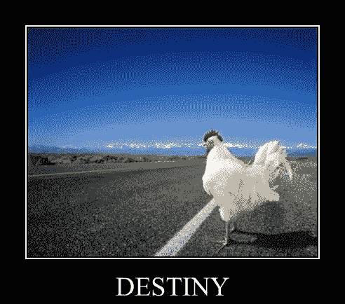

# 为什么创业就像单口喜剧

> 原文：<https://medium.com/hackernoon/why-entrepreneurship-is-like-stand-up-comedy-9227bb3d46af>

玩得开心是打造令人惊叹的东西的关键要素。

# 世界正在改变

十五年前在脸书和 T2 的标志性故事中起作用的东西在今天可能就不那么管用了。挑战是完全不同的，灵感会在奇怪的时间敲门。在这种不断变化的环境中，企业家应该做什么？正如彼得·泰尔在他的标志性著作《T4》中所说的，下一个马克·扎克伯格不会建立社交网络。下一个拉里·佩奇不会建立搜索引擎。除此之外，我还要说，人们不会嘲笑他们已经听过的笑话。

我可能会因此招致一些愤怒，但我已经开始相信创业很像单口喜剧。你必须知道你的观众真正喜欢什么，做什么，才能真正写出你的笑话，或者说你的产品。大多数成功的漫画倾向于彻底了解他们的观众。无论是拉塞尔·彼得斯(Russel Peters)的老一套让他成为偶像，还是印度的卡南·吉尔(Kanan Gill)和比斯瓦·卡尔扬·拉思(Biswa Kalyan Rath)的老一套，他们专门拿自己这样的千禧一代开玩笑。这些笑话几乎总是很有趣，因为它们是相关的。他们专注于观众已经知道或做过的事情。

> 另一方面，企业家有时会走完全相反的路，这通常会导致失败。他们设计产品，编写代码，并向每个人和他们的阿姨发送电子邮件。

An app for gardening? I don’t have a garden, bro. Why’d you sent me that?

**可以说，观众并没有在*一半的时间里得到*的笑话**。艺术家开始怀疑她的娱乐能力，并开始质疑笑话的执行，而不是笑话本身的观众。无法找到适合产品市场的模式是创业失败的主要可预防原因之一。大多数企业家筹集巨额风险投资资金，并将其注入各种广告渠道和 [*成长黑客*](https://en.wikipedia.org/wiki/Growth_hacking) *。*但他们没有意识到的是，再多的金钱和支持也无法让一个糟糕的笑话变得有趣。

# 如何讲一个很棒的笑话？

企业家精神和单口喜剧之间的相似之处，可能是决定你的产品是否会持续的有用工具。寻找产品灵感的早期企业家与寻找新笑话的雄心勃勃的喜剧演员非常相似。这位喜剧演员总是用敏锐的眼光观察人们，他想对他的笑话发笑。在笔记本上记下他们的行为和动机，然后加上他自己的幽默感和目的。产品经理在做客户开发研究时，可以借鉴这本书。

> 不是产品解决了什么问题，而是客户用了你的产品后的情感感受赋予了它价值。

Hell, yeah.

有趣的是，我们注意到产品开发与笑话开发有多么相似。虽然产品本身应该是有用的，但笑话本身应该是有趣的。但是它的表达方式对你的观众来说可能是成功的也可能是失败的。产品的交付给了用户欣赏的情感价值。这就是你最终要卖的东西。单口相声卖的不是节目里的几个笑点，卖的是快乐。脸书不卖社交网络应用，他们卖的是与整个世界相连的感觉。这种情感上的接触和对你的产品如何接触用户的抽象是一个优秀产品的关键。在设计你的产品之前，你必须问*几个问题*

*   **谁会为我的笑话发笑？**对目标受众做好调研和研究。
*   **我的笑话会让他们有什么感觉？用户的预期反应应该是可预测的。**
*   **我的表达是在开玩笑吗？再好的笑话也会因为错误的肢体语言和表达方式而失效。**
*   人们会付钱听我的笑话吗？你的笑话是否让我觉得自己很特别，以至于我愿意花钱去听？我会在晚会上和我的朋友分享你的笑话吗？

这些可以概括为产品开发的四大支柱——**市场**、**情怀**、**执行**、**机会**。

我喜欢认为优步在这方面是一个伟大的产品。任何通勤上班的人都属于他们的市场。打车或者坐在拥挤的公共汽车/火车上的麻烦被直接在家门口叫车的*解脱*所取代。该应用程序可以轻松找到出租车，并实现无现金支付。每天早上去上班的昏昏沉沉的人少了一件要担心的事情，所以肯定的是，他们会为此买单。这给了优步和其他打车应用相当大的定价权。

# 那么，鸡为什么要过马路呢？

Also VC funding, maybe.

表现良好的产品能够吸引更优秀的人才，并从希望抓住机会的金融支持者那里获得公平份额的关注。就像你在 Youtube 上疯传你在卧室里制作的喜剧小品一样，你会发现更容易找到人资助你的首次登台亮相——你制作的产品也可以吸引一些大笔现金。当人们投入时间和金钱时，他们寻求的是一种获胜能力的证明。

在当地喜剧俱乐部表演可能会给你足够的数据来验证你是否具备成为一名优秀喜剧演员的条件，但这不会让你成为下一个路易斯·CK。为此，你需要资金支持来提升你的业绩并获得广泛关注。

> 如果你有合适的产品/市场，扩大你的市场也会扩大你的视野。

# 为什么是喜剧演员呢？

你这么问很有趣。

好吧，你可以选择尽可能多的表演艺术来为你的产品开发思想做一个指导性的模拟，但是我发现单口相声是最好的。为什么？因为他们的主要目的是卖给你笑声，他们每个人都必须从竞争中脱颖而出才能生存。

老实说，我不相信那些几乎不搔痒的产品。它们是可以替换的，我可能永远不会对这样的产品产生忠诚感。让用户欣赏你的产品的整体感觉应该一直推动你的业务。职业喜剧演员非常需要成名，否则他们永远也不可能赚到足够的钱来养家糊口或满足他们心中的艺术家。成长是每个好产品的终极目标。我们都知道成长从来都不是偶然的。

这是演艺圈。

Awesome product. Right there.

最后，我想感谢你阅读这篇文章。你同意我的观点吗？我很想多谈谈，了解一下你对这个想法的看法。你可以随时 ping 我 [**这里**](https://www.linkedin.com/in/shival-gupta-8b741b72/) 。

Enjoyed that read? Click the ❤ below to recommend it to other interested readers!

> [黑客中午](http://bit.ly/Hackernoon)是黑客如何开始他们的下午。我们是 [@AMI](http://bit.ly/atAMIatAMI) 家庭的一员。我们现在[接受投稿](http://bit.ly/hackernoonsubmission)并乐意[讨论广告&赞助](mailto:partners@amipublications.com)机会。
> 
> 如果你喜欢这个故事，我们推荐你阅读我们的[最新科技故事](http://bit.ly/hackernoonlatestt)和[趋势科技故事](https://hackernoon.com/trending)。直到下一次，不要把世界的现实想当然！

