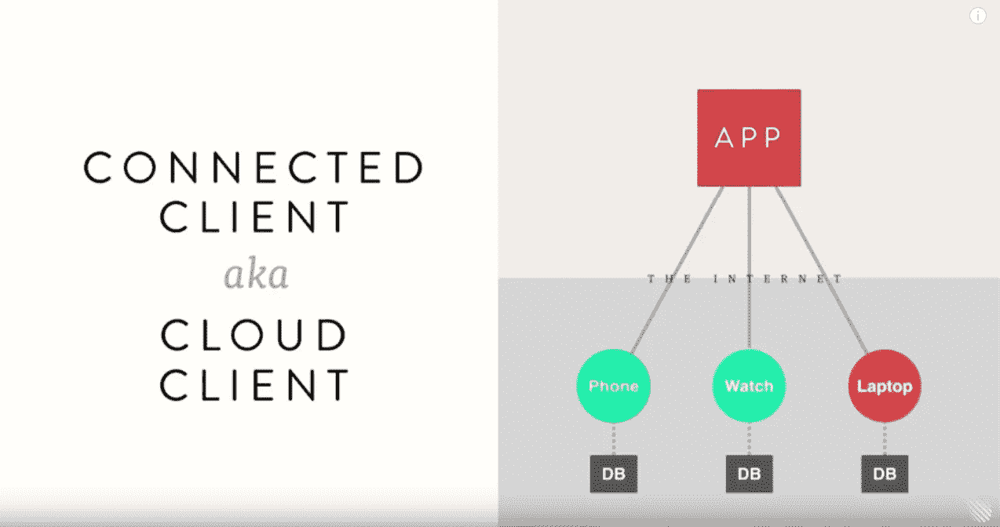
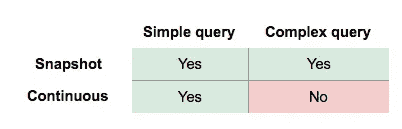
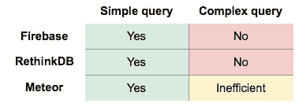
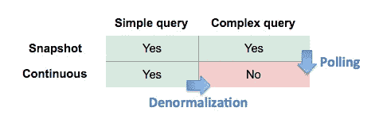
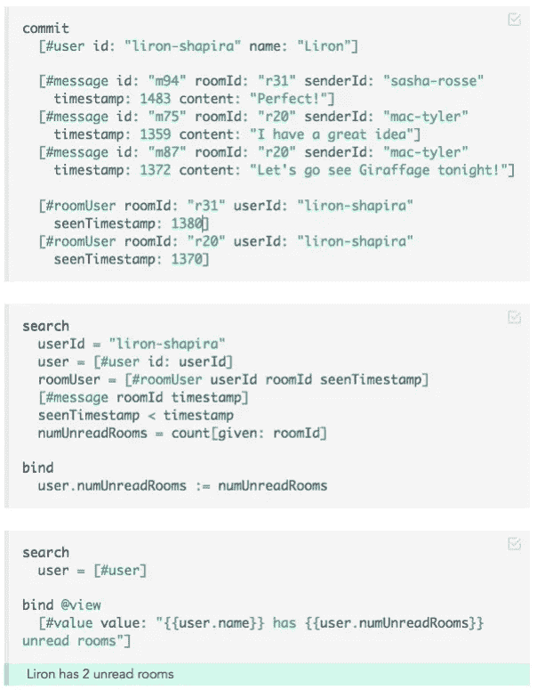

# 为什么 Eve 是实时应用的完美之选

> 原文：<https://medium.com/hackernoon/why-eve-will-be-perfect-for-realtime-apps-92b965b80ad>

欢迎来到我的关于 Eve 的系列文章的第六部分，这是一种令人兴奋和着迷的新编程语言。

*   [*I .*Eve 如何统一你的整个编程栈](https://hackernoon.com/how-eve-unifies-your-entire-programming-stack-900ca80c58a7)
*   [*二世。*当逻辑编程遇上 CQRS](https://hackernoon.com/when-logic-programming-meets-cqrs-1137ab2a5f86)
*   [*三世。*挣脱我们的镜链](https://hackernoon.com/throwing-off-our-scope-chains-7567beb2d0b6)
*   [*四世。* Smalltalk 和蛋白质编程](https://hackernoon.com/smalltalk-and-protein-programming-4da245ac93e2)
*   [*五、*夏娃远大理想的坚实基础](https://hackernoon.com/the-rock-solid-foundation-for-eves-big-vision-225b80b91e11)
*   ***六。*为什么 Eve 是实时应用的完美选择**

# 互联客户端时代

在 2015 年 8 月的 JavaScript 国情咨文演讲中，Meteor 的 Geoff Schmidt 使用了术语“**连接客户端**”来描述我们的现代应用架构:

[info.meteor.com/blog/javascript-state-of-the-union-with-meteor](http://info.meteor.com/blog/javascript-state-of-the-union-with-meteor)

连接的客户端应用程序有多个客户端，这些客户端具有不同数量的 CPU 和存储资源，所有客户端都与云中的同一个服务进行通信。

施密特指出，我们希望我们的联网客户端应用是实时的。我们曾经期望一个 web 应用的 UI 在手动刷新之前是静态的，但是现在我们期望它在默认情况下是动态的。

# 问题:今天的实时数据库是不够的

今天制作一个联网的客户端应用程序是很痛苦的，因为**没有办法持续监视复杂的查询**。我指的是这张表的右下方象限:

Today’s databases

传统的数据库查询是一个*快照*——它在您请求查询时告诉您查询的值，仅此而已。但是，如果您正在构建一个现代的实时连接客户端应用程序，快照查询不能满足您的需求。你需要一个*连续的*查询。

今天，大多数程序员都使用自主开发的解决方案来获得应用程序的实时功能。为了实时更新您的 UI，您可以让您的服务器轮询 SQL 数据库，然后使用 websockets 通过您制定的某种协议向客户端发送更新消息。

但是市场上也有一些实时数据库,这就是为什么连续的简单查询是可行的，并且左下角的框是绿色的。最流行的实时数据库有:

*   [**Firebase**](https://firebase.google.com/docs/database/)允许您监控关键字查找和简单扫描的更改
*   [**RethinkDB**](https://rethinkdb.com/)为某些 ReQL 查询提供 [changefeeds](https://www.rethinkdb.com/docs/changefeeds/)
*   [**流星**](https://www.meteor.com/)
    让你监控任意的 MongoDB 查询

这些数据库非常适合简单的查询，但不适合复杂的查询。

在我们讨论它们的局限性之前，我想感谢实时数据库的存在。他们实现了数据库级的连续查询，值得称赞。联网客户端应用迫切需要抽象层；他们不应该滚动自己的实时性。

# 查询通知计数

在“[数据非规范化被破坏](https://hackernoon.com/data-denormalization-is-broken-7b697352f405)”中，我举了一个复杂查询的例子，一个消息应用程序可能会用它来计算用户有多少通知。这就是，写在 [ReQL](https://www.rethinkdb.com/docs/introduction-to-reql/) 里的:

The query for how many messenger notifications I have

假设用户打开了我们的消息应用程序，他们有一个未读通知。然后，他们突然收到一条来自新对话的消息，这应该会使他们的通知计数增加到 2。

从概念上讲，这非常简单。我们所要做的就是不断地将 notification-count-query 的值传送到 UI 中的红色小数字中。

由于这是 RethinkDB 的查询语言，您可能认为我们可以通过在查询中添加一个`.changes()`来获得一个 changefeed。但是我们不能，因为多表查询的 change feed[不被支持](https://github.com/rethinkdb/rethinkdb/issues/3997)。

# 当前的限制

目前，RethinkDB 和 Firebase 严重限制了您可以观察的查询(类似于上面的 notification-count 示例)。Meteor 允许您查看任何 MongoDB 查询，但只有简单的查询才是快速的。

Today’s realtime databasees

在 Meteor 中，简单和复杂之间的区别取决于它是否可以使用操作日志跟踪而不是轮询区分:

*   **操作日志跟踪**:观察操作日志，推断查询结果的变化。
*   **poll-and-diff:** 每隔几秒运行一次您的查询，将其与上次运行您的查询进行比较，然后告诉您任何变化。

如果您只是通过文档的`id`来查找文档，Meteor 可以推断出只有当特定文档发生变化时，您的查询结果才会发生变化。同样，如果您的查询只是一个简单的过滤器，那么很容易推断出操作日志更改是否会导致查询记录的更改。

目前，[调整 Meteor 的可伸缩性](http://info.meteor.com/blog/tuning-meteor-mongo-livedata-for-scalability)基本上意味着避免复杂的查询。

# 当前变通办法

我们如何对消息应用的客户端进行编程，以持续监控通知数量？我们不能用一个让我们观察一个复杂查询的实时数据库来做到这一点，然而这是我们正在尝试做的事情的正确抽象。今天的技术唯一可能的解决方案是*变通方案*。

两个主要的解决方法是**轮询**和**反规范化**。轮询利用复杂快照查询的可行性，而反规范化利用简单连续查询的可行性。

轮询解决方案很容易编写。明显的缺点是资源使用与轮询间隔的精细程度成比例。100ms 轮询的开销是 1 秒轮询的 10 倍。

反规格化的解决方案可能更节省时间，但是它们需要一些额外的空间。更重要的是，他们很难编写代码。

Meteor 将轮询工作区融入到实时数据库抽象层中，值得表扬。它让我们梦想有一天，我们将拥有使连续复杂查询变得高效的技术，然后我们的应用层 Meteor 代码将根本不需要改变。

# 伊夫溶液

在第二部分中，我提到了 Eve 支持复杂的 CQRS 架构，并承诺展示一个更详细的例子。开始了…

还记得对用户通知的查询吗，我们希望能够实时监控它？

The query for how many messenger notifications I have

下面是 Eve 中的等效查询:

最酷的是绿色的“Liron 有两个未读房间”行对其逻辑依赖非常敏感。在这个视频中，你可以看到改变一条消息的时间戳是如何立即改变被认为是未读的聊天室的数量的。

如果你使用过 [MobX](http://mobxjs.github.io/mobx/) ，你可能会感到失望，因为没有什么像 MobX 一样适合你的数据层。夏娃的`bind`就是这样。

重要的是要注意:我们可以轻松地将 T2 绑定到一个特殊的数据库，Eve 将同步到客户端，而不是将它绑定到数据库进行调试。

Eve 同时也在挑战 CQRS、反规范化和实时数据库查询复杂性的极限。就我个人而言，我真的很兴奋！

# 无层查询

当您在谈论监控数据库层查询时，“实时数据”听起来像是一个美妙的东西。但是当我们对本地数据进行应用层计算时，我们当然希望使用最新的变量值。

Eve 的愿景是让应用层代码像访问本地变量值一样访问数据库外的查询值。这都是[统一你的编程栈](https://hackernoon.com/how-eve-unifies-your-entire-programming-stack-900ca80c58a7)的一部分。

一旦 Eve 模糊了这些层，也许“你的堆栈的层”的整个概念将会消失，只剩下**无层查询**。

Artist’s rendering of Quicksort as optimized by the Eve runtime

当你写一个无层查询(比如一个标准的 Eve `search`)时，Eve 的运行时可能会执行一个远程查询来及时下载数据，或者提前将数据下载到客户端。这可能取决于硬件和网络连接等因素。

无层查询不只是抽象出数据层，它们还会抽象出计算层。有时候，我们拥有服务器的唯一原因是因为它正在进行繁重的计算。使用 Eve，我们可以声明性地定义算法，并让运行时来决定它是在客户机上运行还是在客户机之外的某个地方运行。

# 结论

在整个系列中，我的目标不是详细地讲授 Eve，而是指出主流编程现状中似乎已经成熟的改进领域。我希望你同意 Eve 有希望改善这些地区的生活。

> [黑客中午](http://bit.ly/Hackernoon)是黑客如何开始他们的下午。我们是阿妹家庭的一员。我们现在[接受投稿](http://bit.ly/hackernoonsubmission)并乐意[讨论广告&赞助](mailto:partners@amipublications.com)机会。
> 
> 如果你喜欢这个故事，我们推荐你阅读我们的[最新科技故事](http://bit.ly/hackernoonlatestt)和[趋势科技故事](https://hackernoon.com/trending)。直到下一次，不要把世界的现实想当然！

