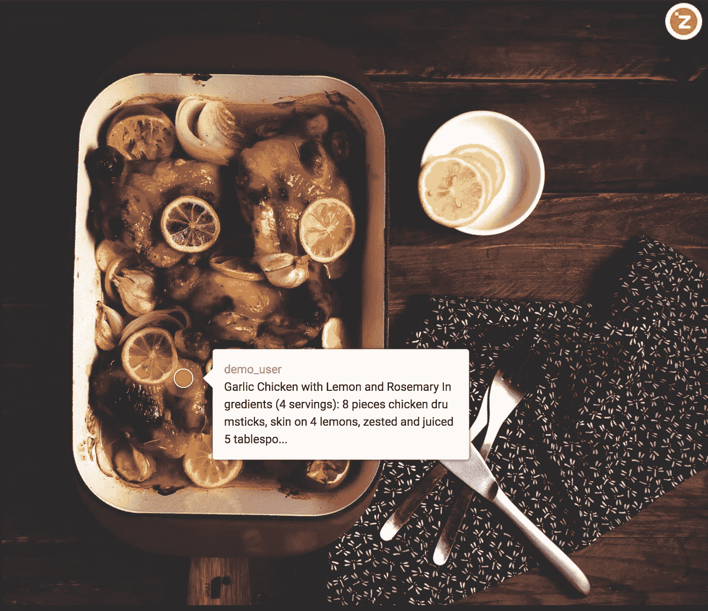
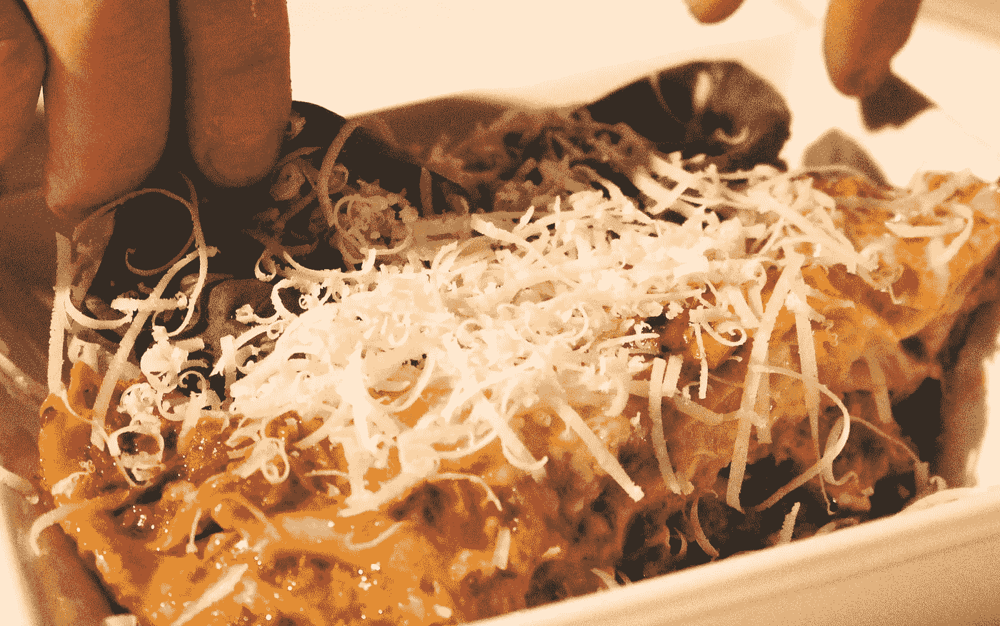

# 为什么每个企业家都应该做饭

> 原文：<https://medium.com/hackernoon/why-every-entrepreneur-should-cook-9a75826d8ce7>

你有心事。你认为会对这个世界产生巨大影响的事情；一些你认为没有人在做，也没有人能做的事情；一些你觉得你比任何人都了解的事情；最终能让你发大财的东西。所以，你跳过了人生最高的一堵墙，开了自己的公司，那家最终会让你梦想成真的公司。

然后真正的作品开始了。你一天工作 20 个小时来开发产品、会见投资者、与联合创始人进行头脑风暴、寻找客户、接听愤怒客户的电话，这些没完没了的任务可以轻易地填满你的一天，甚至不用计划。有时候你会想你的家人呢？孩子？爱好？“嗯……他们可以等。等公司起飞赚钱了，我就有时间了。”—最常见的回复。我们都想建立公司，卖掉它，赚些钱，组建家庭，然后快乐地生活，我们会优先考虑这个顺序。

其他的都可以等。

以为自己已经给了自己一个明确的答案，又把自己扔回了循环和工作中。但毕竟我们只是人，我们都会疲倦，会变得脆弱。当你坐在办公桌前编码时，看到别人在脸书上发布周末带孩子出去的照片，你可能会感到嫉妒。当你的朋友在 Instagram 上分享他去法国旅行的照片，而你的产品正在失去用户时，你可能会感到沮丧。你很清楚这就是交易。但是你不能把你所拥有的一切都留给你已经建立起来的孩子。

嗯，没关系。但是你为什么不拖延一点，开始做一些让你不用工作，满足你作为一个人的基本需求，并且让你的朋友嫉妒的事情呢？做饭怎么样？

像绘画一样，烹饪是一种本能。你永远不会成为绘画中的毕加索，所以你不需要成为艾伦·杜卡斯或若埃尔·罗布琼来烹饪。关键在于准备的过程，而不是结果。我将通过我最喜欢的**柠檬迷迭香蒜香鸡**的步骤来告诉你为什么我认为每个企业家都应该烹饪(食谱在底部)。

Garlic Chicken with Lemon and Rosemary. Super simple and delicious.

这道菜从腌制鸡肉开始，如果我在烹饪前放置 12 个小时左右，味道会更好(如果你很着急，可以腌制一个小时)。我将从制作腌泡汁开始。腌泡汁只需要加工三种成分:柠檬、大蒜和迷迭香(鸡肉已经加工过了)。我先说我最喜欢的，大蒜。在我看来，剥蒜瓣和切蒜瓣简直是远离工作的最佳活动。很香(如果你喜欢大蒜的话)。这是重复的，所以你可以通过不断移动你的刀来清空你的大脑。这有点危险，所以你要注意不要割破手指。最后，这是令人满意的，因为当你做了它，你会感觉像一个厨师(我每次都有这种感觉)。然后是时候给柠檬榨汁，把迷迭香的叶子和小枝分开。嗯，虽然没有剁蒜那么花哨，但是新鲜柠檬和迷迭香的香味会让你忘记工作中的每一个烦恼。对我来说，准备食物的新鲜气味总是比我客厅里的美国佬蜡烛好。

好的，我们就要到了。当你开始准备削皮、切割、剁碎、切块来做饭时，你是在以一种很好的方式拖延。也许你被一个 bug 卡住了。也许这个新想法没有得到任何支持。也许你需要准备一次艰难的推销。也许你只是突然失去了所有的激情。或者你只是想休息一下。不管是什么原因，烹饪都是一种很好的逃避，它会给你的头脑带来平静，给你的心灵带来满足，给你的身体带来能量(如果你没有搞砸的话)。

准备工作已经完成，现在我渴望开始真正的烹饪。我故意选择这个烤箱盘，因为对于初学者来说很难搞砸。步骤很简单:把所有东西都放在烤盘里，淋上橄榄油，用新鲜胡椒调味。然后将其放入 400 华氏度的烤箱中 30 分钟。这美好的 30 分钟是魔力所在，因为你不应该查看你的电子邮件或思考你的营销计划。你应该看着鸡肉完全变成棕色；你应该闻到大蒜、柠檬和迷迭香完美结合的香味；你应该感觉到你的不同。

也许只有 1%的人能够同时处理多项任务并很好地完成它们。所以，我们为什么不假设我们不能，只专注于一件事——烹饪。没有这种认识，你将永远享受不到烹饪的纯粹快乐，也无法为未来的挑战提神醒脑。想一想，如果你在切胡萝卜的时候在思考营销计划，你如何重新调整你的心态和压力？作为一个创业者，我总是觉得在我睁开眼睛的任何一个瞬间，我都必须在做一些事情，否则我会觉得我完全在浪费每一秒钟。这是不对的。因为有时候什么都不做会更好，甚至当你在做饭的时候，从技术上来说，你是在给你的大脑一个休息和安静的时间。很多时候，我发现我最好的想法是在我烹饪后产生的。

“It’s best to do one thing really, really well” — Google

做饭就像为[创业](https://hackernoon.com/tagged/startup)做产品一样。你在摸索着做每件事，试图让每件事都井井有条。比如说，你的第一道菜就像你的 MVP(最可行的产品)。你的顾客(你的朋友或家人)会给你反馈，比如太咸了或者完全不能吃(我以前也这么做过)。你会学习和调整，就像你为你的 MVP 所做的那样，然后再做一份千层面。这一次它应该会更好，让你脱离不可食用的类别，就像你的 MVP 从你的客户那里得到一些积极的评价一样。多试错，你就会成为千层面的专家，就像谷歌的座右铭“最好把一件事做得非常非常好”。

下次当你发现自己被困住了，试着做点什么。既然做饭和创业一样，作为一个创业者，为什么不应该做饭？

# 柠檬迷迭香蒜味鸡

## 配料(4 份):

*   8 块鸡腿，去皮
*   4 个柠檬，去皮榨汁
*   5 汤匙酱油
*   6 瓣大蒜，切碎
*   3 汤匙蜂蜜
*   2 汤匙糖
*   1 汤匙从茎上剥下的新鲜迷迭香叶
*   茶匙新鲜的胡椒粉
*   2 个西葫芦
*   洋葱
*   10 蘑菇

## 步骤:

烹饪前，混合均匀，用新鲜柠檬汁、酱油、切碎的大蒜、蜂蜜、糖、迷迭香叶和胡椒将鸡肉在冰箱中腌制至少 12 小时。

1.  把烤箱预热到 400 华氏度。
2.  将西葫芦、洋葱和蘑菇切好，均匀地放在烤盘底部。将橄榄油淋在蔬菜上，用胡椒调味。
3.  将鸡肉放在烤盘上，鸡皮朝上。在鸡肉上淋些橄榄油，然后放入烤箱。
4.  烤 30 分钟，取出烤盘。放置 5 分钟以上，以保持肉汁。
5.  尽情享受吧！

> [黑客午间](http://bit.ly/Hackernoon)是黑客们下午的开始时间。我们是 [@AMI](http://bit.ly/atAMIatAMI) 家庭的一员。我们现在[接受提交](http://bit.ly/hackernoonsubmission)并很高兴[讨论广告&赞助](mailto:partners@amipublications.com)的机会。
> 
> 如需了解更多信息，请[阅读我们的关于页面](https://goo.gl/4ofytp)、[类似/在脸书](http://bit.ly/HackernoonFB)上留言给我们，或简单地, [tweet/DM @HackerNoon。](https://goo.gl/k7XYbx)
> 
> 如果您喜欢这个故事，我们建议您阅读我们的[最新科技故事](http://bit.ly/hackernoonlatestt)和[趋势科技故事](https://hackernoon.com/trending)。直到下一次，不要把世界的现实视为理所当然！