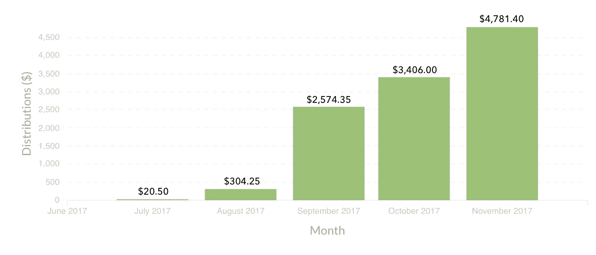
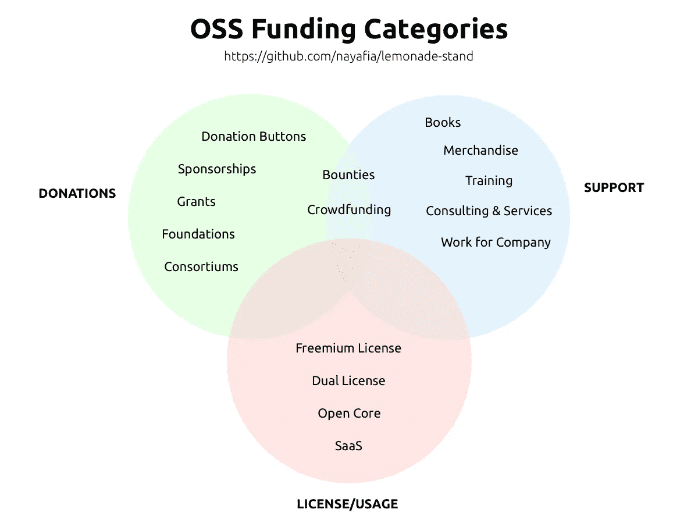
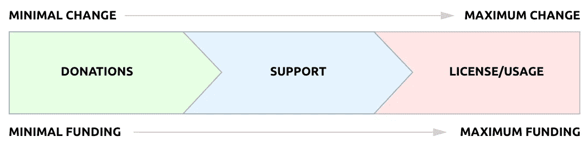
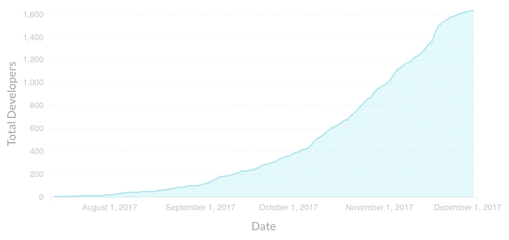
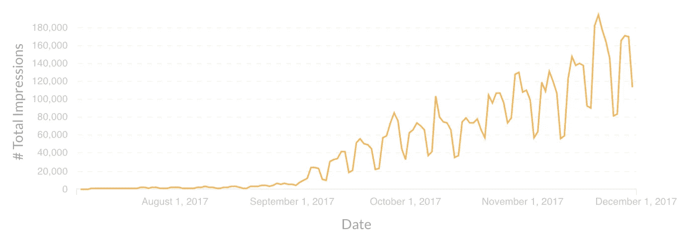
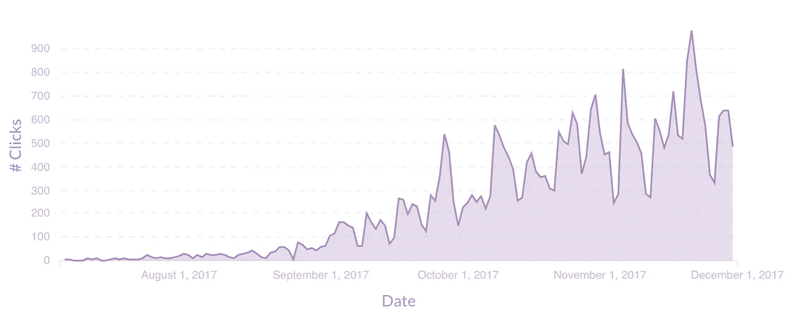
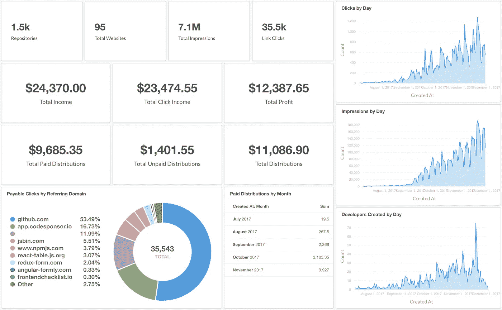
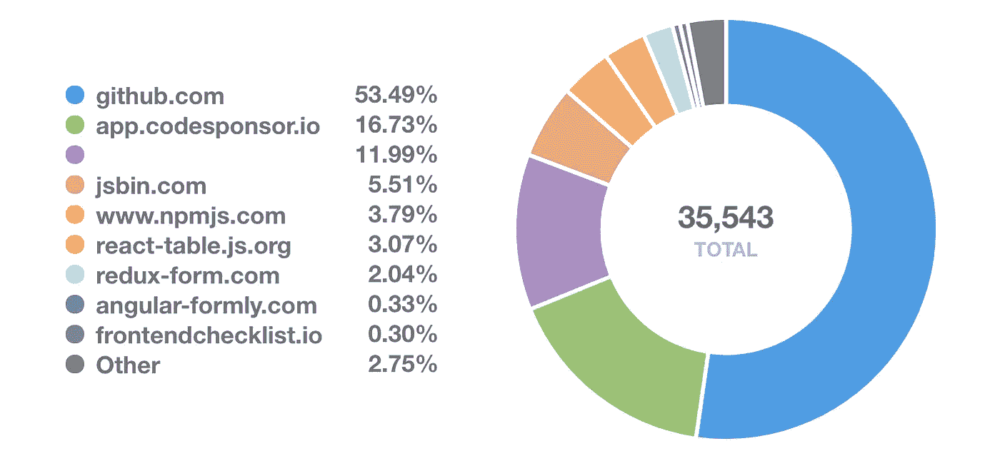

# 为什么资助开源很难

> 原文：<https://medium.com/hackernoon/why-funding-open-source-is-hard-652b7055569d>

在过去的四个月里，我有幸建立了一家专注于为开源项目提供资金的公司。代码发起人已经从一个简单的概念证明变成了一个可行的 OSS 可持续性解决方案。

Developer Earnings in USD ($) by Month

11 月 21 日，我决定关闭平台。这篇文章的目的是分享我所学到的东西，这样我们作为一个开发者社区就可以继续寻找和构建支持开源的解决方案。

# 资金类别

How do we change the developer mindset towards funding open source?

Nadia Eghbal 是开源可持续发展的大力倡导者。她维护着一个名为[柠檬水摊](https://github.com/nayafia/lemonade-stand)的开源资金选项列表。在这个列表中，你可以找到一个开发者可以为他们的开源项目找到资金的不同方法的广泛列表，以及每种方法的优缺点。

柠檬水摊上提供的几乎每种解决方案都属于一个或多个类别:

*   **捐款。向别人要钱来支持这个项目。**
*   **支持。**支持相关产品或服务的费用。
*   **许可/使用。**项目使用费。

让我们进一步分解它，了解每个分组都涉及哪些内容。

## 捐款

寻求捐赠是最简单的筹集资金的方式。它不需要开发者改变他们现有的行为。许多项目通过[开放集体](https://opencollective.com/)开放资金获得了巨大的成功。

其他项目通过利用直接支付方式取得了成功。 [Patreon](https://patreon.com) 、 [Gratipay](https://gratipay.com/) 和 [Liberapay](https://liberapay.com/) 允许开发人员将“支付我”按钮添加到他们项目的自述文件中。 [BountySource](https://www.bountysource.com/) 和 [Gitcoin](https://gitcoin.co) 专注于资助具体事宜。

***通过捐赠获得重大资助需要什么？***

通过捐赠筹集资金需要大量的资金筹集和建立意识。Sean T. Larkin 分享了他关于 [Webpack 如何达到每年 40 万美元资金](/open-collective/funding-open-source-how-webpack-reached-400k-year-dfb6d8384e19)的故事。这并不容易。这并不快。

不幸的是，仅仅通过加入 Open Collective 或在你的自述文件中添加一个 Patreon 链接，资金不会开始流入。

[肯特·c·多兹](https://medium.com/u/db72389e89d8?source=post_page-----652b7055569d--------------------------------)一年多前就在他的知识库上设置了一个捐赠按钮。他让我知道他总共赚了 0 美元。一无所获。为什么？因为那些捐赠按钮是在向其他开发者要钱，他们也在向他们的项目要钱。这就像让 100 个开发者站成一个圈，付给他们左边的人 1 美元一样荒谬。

> 我的许多项目都非常有影响力，并被广泛使用，但在我可以接受捐赠的项目中，它们相对较小，并且/或者开发基本上已经完成。制作衬衫、举办聚会，甚至在其上做进一步的开发，既不合理也没有必要。同时，我认为开发者应该为他们创造的价值得到补偿。
> 
> -肯特·c·多兹

捐款对一些项目有用，但对大多数项目来说，除非开发商成为他们项目的公众布道者，否则很少有机会筹集到任何形式的可持续资金。

## 支持

说到开源，无偿支持是理所当然的。开发人员发现他们回答问题、处理问题并提供全面的支持是出于他们内心的善良以及他们对项目获得用户采纳的渴望。

然而，随着该项目越来越受欢迎，它也需要更多的支持。一些开发者决定通过书籍、商品和付费支持来赚钱。

但是，大多数开发者并不走这条路。实际上，许多较小的开源项目不会从支持角色中受益。如果他们不够大，付费培训和书籍很少有人问津。

## 许可/使用

通过许可使用开源软件收费通常是开源软件最有利可图的方法。一个很好的例子是迈克·佩勒姆的 Sidekiq。Sidekiq 是一个免费的开源解决方案，但是通过提供一个专业版和企业版，这个项目每年可以赚超过 100 万美元。

当决定走这条融资道路时，开发人员必须问自己的首要问题是*“我想把这个项目做成一笔生意吗？”*如果答案是肯定的，并且项目有足够的吸引力，那么这种方法非常好。

然而，大多数开发人员不具备商业头脑。比起电子表格和营销，他们更喜欢建筑。

# 你愿意换角色吗？

既然我们已经将解决方案分为三个主要类别，我们可以开始看到一个模式。这种模式也解释了为什么开源的可持续性在今天仍然是一个问题。

The existing path to better funding requires developers to change their role

为了增加对开源项目的财政支持，开发者必须将他们的角色从贡献者转变为支持者，并最终成为企业所有者。变化越大，资金的潜力就越大。

我强烈认为，开发人员不应该为了给他们的开源项目找到大量资金而牺牲他们的热情。

# 开源广告

Code Sponsor 诞生于这样一个想法，即通过道德广告的方式为开发者提供可持续、可扩展的资金是可能的。它是[碳广告](https://carbonads.net/)、[开放集体](https://opencollective.com/)和[阅读文件](https://readthedocs.org/)的混搭(带有由[韦斯博斯](https://medium.com/u/86a55cd7983b?source=post_page-----652b7055569d--------------------------------)展示的草根营销的暗示)。

开源项目通过广告获得成功的两个例子是[阅读文档](http://blog.readthedocs.com/ads-on-read-the-docs/)和[帽衫](http://hood.ie/sponsoring/)。

概念很简单。

有数以千计的公司直接向软件开发者营销(见 [Heroku addon 列表](https://elements.heroku.com/addons))。每个都有营销预算。很多很多开发者几乎每天都会访问 GitHub，阅读文档，为开源做贡献。我知道，如果我能让开发商以道德广告的形式推广公司的产品或服务，公司就可以向他们付费，而不是通过谷歌等其他渠道。

这个想法有三个优点:

1.  **资金是可扩展的。只要公司看到投资回报，他们就会增加投资。**
2.  **开发者不需要改变行为。他们可以通过在自述文件中添加一行代码来获得报酬。**
3.  任何人都可以参加。因为开发者是按点击付费的，所以任何项目都可以获得资助(不管多小)。这个项目的受欢迎程度决定了他们能得到多少钱。*这是大规模融资的关键。*

我决心确保所有放在 GitHub 上的消息都是:

*   **不引人注目的**——横幅看起来像医生，但要足够不同，不要骗人
*   相关 —消息必须是开发人员感兴趣的东西(基于项目的编程语言)
*   **道德** —我不想追踪任何个人信息，也不想放置 cookies 用于再次营销。我遵循了埃里克·霍尔舍尔的道德广告指南

我拼凑了一个简单的 Rails 项目，由一名开发人员和我本人作为发起人启动。

# 快速增长

在四个月的时间里，Code Sponsor 发展相对迅速。以下是我每天看的一些图表。这个显示了系统中开发人员的总数。

Total Developers on the Code Sponsor platform

这里你可以看到 4 个月的总印象。仅在 11 月，我就看到了超过 360 万次的展示。应该指出的是，我们从未跟踪过任何人，即使是匿名的。

Total Impressions by Day

开发者以每次点击为基础获得资金。正如你所看到的，有一个稳定的增长趋势。

Link Clicks by Day (excluding bots, duplicates and fraud)

开发者发行版逐月增加。今年 11 月，Code Sponsor 为开源项目筹集了 4，781.80 美元的资金。

以下是最终数字(截至 2017 年 12 月 3 日):

*   1，471 个储存库
*   95 个网站
*   总共 7，110，890 次展示
*   总共 35，544 次点击
*   总收入 24，370 美元(尽管我退还了其中的 1，500 美元)
*   点击总收入 23，474.55 美元
*   利润总额 12，387.65 美元
*   11，086.90 美元总分配给开发商
*   给予赞助商的信用总额为 1，051.55 美元

这是我的仪表板截图。此数据适用于代码发起人的整个生命周期。

Code Sponsor Internal Dashboard

## 为开源提供可持续、可扩展的资金并不困难

我坚信代码赞助商已经展示了一种以广泛、可伸缩和可持续的方式资助开源的方法。这可以通过给公司提供一个广告渠道来实现，在那里资金直接贡献给开源。它不依赖别人的施舍。这是赞助商和开发商之间的商业交易。赞助商看到了回报，开发者得到了报酬，继续做他们喜欢的事情，而不需要改变。

Rollbar 的增长主管 Mike Smith 告诉我,“代码赞助商”(在某些月份)比任何其他营销渠道提供了更多的客户。

代码赞助是成功的。

# 是什么让资助开源变得困难？

我认为困难归结为两个关键点。

## 1.开发者不想改变角色

我相信大多数开源开发者希望继续构建开源。他们不想扮演支持者的角色，也不想围绕他们的项目开展业务。

不幸的是，如果不进行变革，筹集资金可能会徒劳无功。

## 2.GitHub 不允许也不提供动态赞助

代码发起人工作得如此好的主要原因是因为每个人都可以参与。我们的项目从 0 星一直到 70k 星。**这只有通过动态赞助才有可能。**换句话说，赞助信息可以根据预算和赞助商资格而变化。

我爱 GitHub。我认为他们是一个了不起的平台和公司。我也同情他们从平台上移除代码赞助商横幅的决定。

我真诚地希望他们能考虑 Code Sponsor 的优点，要么将它们集成到他们的平台中，要么允许 Code Sponsor 继续提供自述文件中的动态图像。

# 代码发起人正在关闭平台

我感谢所有一路上支持和帮助我的人。可持续发展是一个重要的话题&我希望我们能继续对话，一起寻找解决方案。

我在 11 月 24 日发出了一封[电子邮件](http://mailchi.mp/f9b57b5ea377/code-sponsor-is-shutting-down-on-december-8)，让每个人都知道 Code Sponsor 将会关闭。

我曾考虑过 GitHub 可能会说“够了”的时候，并为这个场景计划了下一步。对我来说，在 GitHub 上隐藏横幅并继续在阅读 README 的网站上显示它们是很容易的。

Payable Clicks by Domain

在这里，你可以看到一个导致点击量的参考网站的图表。53.49%的创收流量来自 GitHub。16.73%来自 iframe 网站小工具。11.99%来自启用广告拦截器的浏览器。

在回顾了这些数据之后，我意识到，无论我如何努力，如果没有 GitHub 的支持，帮助大规模维持开源的目标是不可能实现的。他们过去是，现在仍然是解决这个问题的关键。

# 现在怎么办？

代码赞助商是我生命中如此重要的一部分。我不想停止帮助开发者。

从一月份开始，代码赞助商将承担起赞助商和开发者之间牵线搭桥的新角色。资金将按固定的月费率提供。代码发起人将作为“代理”代表开发人员，并按月协商最高费率。目标是为开源项目提供最高金额的资助。开发商将获得 85%的赞助收入。

对我来说，我将远离企业家的生活方式。我想念我的家人。新的支点不会占用我太多时间。我已经向目前的工作递交了辞呈，希望明年一月能找到一份新工作。如果你正在招聘，我有兴趣和你谈谈。

 [## 埃里克·贝里|职业简介| LinkedIn

### 查看 Eric Berry 在全球最大的职业社区 LinkedIn 上的个人资料。埃里克有 2 份工作列在他们的…

www.linkedin.com](https://www.linkedin.com/in/ericberry/) 

如果你想联系我，最好的方式是通过 Twitter(要么是 [@coderberry](https://twitter.com/coderberry) 要么是 [@codesponsor](https://twitter.com/codesponsor) )。