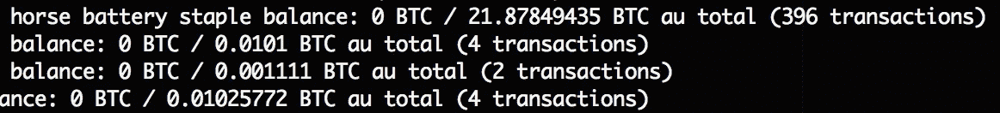
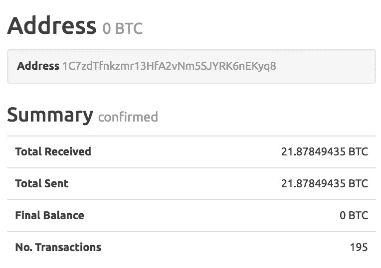
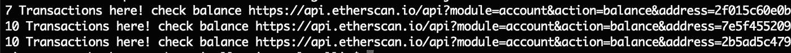
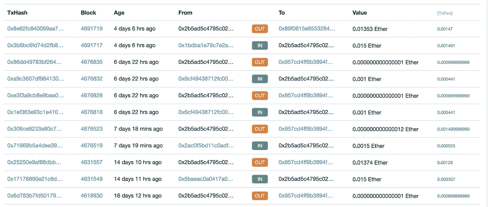

# 为什么要生成真正随机的私钥？

> 原文：<https://medium.com/hackernoon/why-generate-truly-random-private-keys-4a9d88406a96>

## [spot]21 BTC(累积)发送到一个其私钥被泄露的地址

Photo by [Alex Chambers](https://unsplash.com/photos/CyMd0vOYFfU?utm_source=unsplash&utm_medium=referral&utm_content=creditCopyText) on [Unsplash](https://unsplash.com/?utm_source=unsplash&utm_medium=referral&utm_content=creditCopyText)

为了开发我们的应用程序，我们一直在处理身份验证协议(basic、digest、oauth、…)。我们甚至使用散列函数，在 2016 年，当苹果要求所有连接都在“https”中时，我们不能再忽视对称和非对称加密的主要原则。但是…

当我在 Ethereum 上做测试时，每隔 2 分钟就生成一个帐户，我有一个印象，那就是不必要地为自己保留地址，我现在意识到这个推理从根本上来说是错误的，原因有几个。

首先，创建地址时发生冲突的概率是无限小的，数量级[是如此巨大](https://security.stackexchange.com/questions/25375/why-not-use-larger-cipher-keys/25392#25392)以至于很难表示它们。然后，即使两个人试图“暴力破解”密钥 100 年，这些地址也必须在 [Blockchain](https://hackernoon.com/tagged/blockchain) 交易中使用，这样才有意义。

Photo by [NeONBRAND](https://unsplash.com/photos/A59lWOrZVnw?utm_source=unsplash&utm_medium=referral&utm_content=creditCopyText) on [Unsplash](https://unsplash.com/?utm_source=unsplash&utm_medium=referral&utm_content=creditCopyText)

结论，如果你生成了成千上万个地址，没有理由感到内疚，而是认为它们已经存在，但是你无法控制它们。

因此，我们有一个没有存储/持久性的系统，允许从私钥生成公钥和地址。这显然是一个单向系统。

> 私钥->公钥->地址

不要试图黑它，这个系统没有缺陷，它既超安全又非常“用户友好”。没有依赖性(第三方或硬件)，我可以在 Blockchain 上签署交易，唯一的限制是知道我的秘密代码。

另一方面，如果您的私钥被泄露，黑客可以悄悄地取走您的密码，您将无法执行任何操作。如果你觉得这令人震惊，拿你的邮箱做个类比。当你给我发邮件时，我知道你的公共地址(你的电子邮件)，想象你的密码是你的出生日期(私钥)，这两个要素的知识足以让我黑掉你的账户。

最后，系统唯一的弱点(通常都是这样)来自我们。没有一个集中的提供者，我们不能强迫用户随机生成他们的密码，我们只能检查他们是否遵守某种格式。

出于好奇， [@eric](http://twitter.com/eric) 和我在周五晚上编写了一个小脚本来生成地址/私钥，这些地址/私钥是用非常弱的秘密短语(故意)生成的。

在[比特币](https://hackernoon.com/tagged/bitcoin)上，经过 30 行代码，很难相信，但是从我们的第一次测试中，我们遇到了带有交易的地址。

Code [https://github.com/ericdesa/sentinelle](https://github.com/ericdesa/sentinelle)

这个想法是如此简单，以至于我们不是第一个想到这个技术的世俗黑客。如果我们看看存款被盗的速度和窃贼地址上的 BTC 数量，这可能是一项非常有利可图的业务。

example of compromised [address](https://blockexplorer.com/address/1C7zdTfnkzmr13HfA2vNm5SJYRK6nEKyq8)

随后，我们在 Ethereum 上进行了一次小测试(没有定罪，因为密钥为 64 个字符)，甚至天真地测试了组合，我们找到了人们发送 Ethers 的钱包(可能在交易后几秒钟内被盗)。您会注意到这些钱包仍然被使用(不到 4 天)。

> 测试的密码示例:000000000000000000000000000000000000000000000000000000000000000000000001

code available here [https://github.com/vincentlg/ethSentinelle/blob/master/index.js](https://github.com/vincentlg/ethSentinelle/blob/master/index.js)

[https://etherscan.io/address/0x2b5ad5c4795c026514f8317c7a215e218dccd6cf](https://etherscan.io/address/0x2b5ad5c4795c026514f8317c7a215e218dccd6cf)

如果你很有创意，想和其他必须扫描这些地址的小偷竞争，代码可以在 Github 上找到(上面的链接)。只要有一点灵感和运气，你可能是第一个破解有 25 BTC 的钱包的人……一个虚弱的密码能证明偷窃是正当的吗？由你决定。

就我而言，我希望我让你意识到认真生成它的私钥的重要性，使用真正随机的协议，尤其是不在线的……想象一下一个恶魔般的服务，它将允许你测试你的弱秘密短语的想法，希望能破解钱包和谁回答了你

> “不幸失败，但请再试一次……”

即使成功了；)