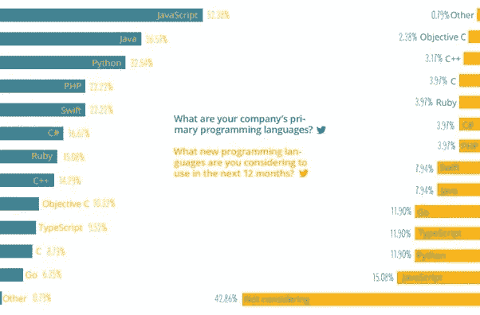

# 为什么雇佣全栈开发者成为创业公司的趋势？

> 原文：<https://medium.com/hackernoon/why-hiring-full-stack-developers-becoming-a-trend-for-startups-de73ccab1e4d>

Full stack development-Startups

近年来，初创公司雇佣全栈开发人员团队，因为他们需要在有限的资源下工作。如果团队可以同时为一个**网络应用或一个产品开发**做前端和后端工作，初创公司会得到最初的推动。

作为一家初创公司，你不能只为一项技能雇佣一个人，你需要一个能解决多项任务的人。宁愿只雇用 HTML 开发人员，为什么不雇用一个人谁可以与 HTML/CSS， **Angularjs 开发**以及能够与数据库连接。对于像 Twitter，脸书，谷歌这样的企业公司，他们寻找独立的前端开发人员-angularjs 顾问，UX 团队，服务器端团队，数据库团队等。所以他们经常雇佣在某一特定技能上有专长的专家。

在初创公司中,“万事通，无所不能”的流行习语变成了“万事通，独当一面”,因为当初创公司成长时，最终人们会变得专业化，那些花时间进行 PSD 设计、开发 Angularjs 代码、有时使用 API 的人，最终会至少在一个领域变得专业化，即[专业 Angularjs 开发人员](https://www.techuz.com/angular-js-development/)

> 超过一半的受访者(52.38%)认为 JavaScript 是他们的主要编码语言，而 Java 和 Python 分别排在第二和第三位

来源:[软件发展状况报告(2017)](http://codingsans.com/state-of-software-development-startups-2017)

“毫不奇怪， **68.50%的初创公司认为工作经验是最重要的招聘标准之一**，紧随其后的是**文化契合度(59.84%)****测试项目(31.5%)****副业项目(30.71%)** 。— [软件发展状况报告(2017)](http://codingsans.com/state-of-software-development-startups-2017)

以下是全栈 web 工程团队的各种技能或功能领域:

1.  UX 设计师

*   UX 设计师通过提供可用性、可访问性和与网络应用程序交互的乐趣，对用户对网络应用程序或产品的满意度负责。
*   他们通常从 web 应用程序的涉众那里收集需求开始，绘制用户旅程，找到用户的角色和信息架构。
*   使用 Axure、Invision 或 Balsamiq 设计**线框和原型**。他们可以在开始项目之前设计 web 应用程序的完整的可点击原型，以确保 web 应用程序或产品的每个页面上的用户体验。

2.视觉设计师

他们精通 photoshop、illustrator 和 sketch，并提供 PSD 或 slices 资产，您可以通过 Dribbble 和 Behance(设计师社区)查看他的投资组合。

3.前端开发人员

前端开发人员使用 Slices PSD，并通过 jquery/media query 将其转换为 HTML+CSS，使其具有浏览器和移动响应能力。前端开发者让 web 应用在浏览器中活起来，现在他们经常使用 Angularjs/Vue.js/react js 这样的前端框架。职位名称包括“前端开发人员”、“软件工程师”、“UI 工程师”

4.后端开发人员

*   编写 PHP、node.js 等服务器端代码，以及 Express、Laravel、CodeIgniter 等 web 框架。
*   入门级后端开发人员使用类似(MySQL/MongoDB)的数据库开发动态网页和交互
*   专家级后端开发人员使用多个数据库来存储所需的应用程序数据。他们了解数据的性能、可扩展性和高级架构，以便将来使用 MySQL、MongoDB、Redis、Neo4j 和 PostgreSQL 等数据库进行扩展。

职位名称包括:“后端工程师”、“软件工程师”

云托管工程师

如今，由于 AWS、Google cloud 和 digital oceans for server less architecture 等关键公司的流行，系统管理员的角色发生了巨大变化，向云托管专家倾斜。根据新趋势，专家级全栈开发者也采用这种云托管技术。

怎样才能让你成为一名全栈开发人员，最适合这家初创公司？

你需要掌握两件事技能和态度:

关于技能，你需要足够的知识和才能来快速采用新的平台、框架或编程语言来解决任何类型的 web 应用程序的各种问题。

就态度而言，你必须面对并克服任何挑战，才能将优秀的软件交付给客户或最终用户。在一家初创公司，你不必拘泥于特定的工作角色，你需要处理多种事情。例如，任何初创公司都可能需要如下最佳组合:

*   一个设计师，谁可以设计数字资产和 PSD 与 UX 很好地着眼于用户的旅程，线框和原型设计，用户故事。
*   前端开发人员可以将数字资产转换为 HTML/CSS，并可以使用像 Angular.js/Vue.js/React.js 等 JavaScript 浏览器生活。他们不需要开发后端，但应该知道如何使用 REST API 或类似的应用程序接口与后端进行交互。
*   全栈开发人员或后端开发人员将掌握前端 javascript 编写和后端代码使用 node.js，PHP 或 python 等。他们也是构建基于云的托管和 CI/CD 流程与 AWS 或数字海洋集成的架构的大师。熟知新的云技术，如 AWS Lambda、使用 elastic 的负载平衡、Amazon EC2 等。

结论是，除了他们的技术能力之外，我想建议其他重要的标准来评估候选人。他们应该根据文化契合度、“完成任务”的能力、解决问题的技巧、清晰的沟通来考虑，所以专注于[10 倍团队，而不是雇佣 10 倍开发人员](https://avichal.com/2011/12/16/focus-on-building-10x-teams-not-on-hiring-10x-developers/)

*原载于 2017 年 5 月 18 日*[*【www.techuz.com*](https://www.techuz.com/blog/why-hiring-full-stack-developers-becoming-a-trend-for-startups/)*。*