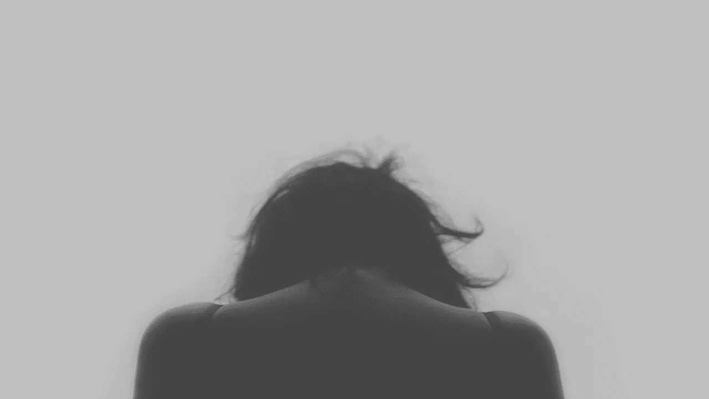
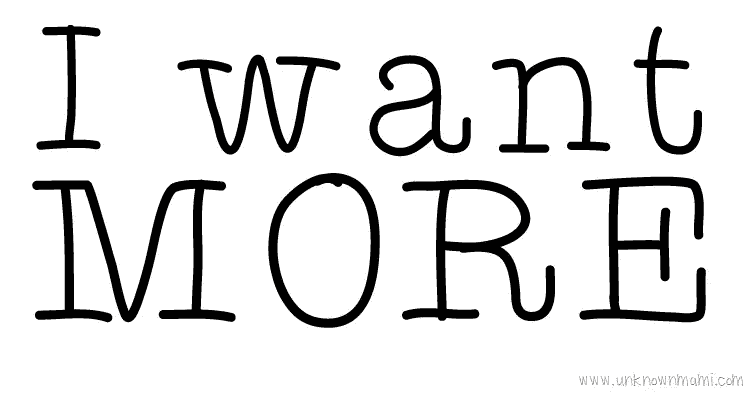
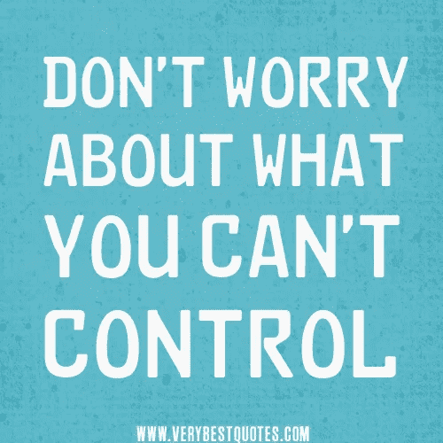

# 人类为何烦恼

> 原文：<https://medium.com/hackernoon/why-humans-fret-60298bc08a2c>

这篇文章是为了证明没有必要担心任何即将发生的事情。显然，我们需要继续做我们需要做的事情，但关键是不要对未来的预期感到焦虑。

我知道我听起来超级乐观，但我经常发现自己对未来感到深深的压力，以及我是否能够实现我的目标和此生的目的。我担心我的经济状况，我担心失去我所爱的人，尤其是我的儿子(他是一名 4 岁的拳击手)，我非常担心在做一些有影响力的事情上失败。然而，当我分析我的担忧背后的因素时，我发现:

*   我主要担心的是未来可能会发生或不会发生的事情。
*   我很担心，因为我只关注消极的结果，而完全忽略了积极的结果。
*   我很担心，因为我预计我可能无法成功，而不是专注于成功。
*   我担心我将来可能没有的东西，忽略了我已经拥有足够多的那些东西(舒适、陪伴、满足)。

这一分析使我进一步认识到以下几点:

*   人类焦虑是因为他们预料到了最坏的情况。
*   人类烦恼是因为他们总是想要更多。
*   人类烦恼是因为他们不再享受他们所拥有的。
*   人类焦虑是因为他们更关注未来而不是现在。

这一分析使我进一步认识到以下几点:

*   人类预期最坏的情况，因为他们生来就是这样做的。作为人类，我们习惯于在现在采取行动来保护我们的未来。
*   人类总是想要更多，因为他们相信多总比一个好。
*   人类不再享受他们所拥有的，因为他们相信更多的财产会带来更多的满足和快乐。
*   人类更关注未来，因为他们不再享受现在。

最后，这一分析使我得出以下结论:

*   人类需要重写代码，感谢他们所拥有的，并享受它，而不是努力获得一个没人见过的未来。
*   人类需要欣赏拥有和热爱他们所拥有的每样东西和每个人的价值。
*   人类需要认识到“更多”不是一个数字，追求无限的价值永远不会带来幸福。
*   人类需要享受该死的现在，并相信未来会和现在一样棒，如果不是更好的话。

最后，人类需要挣脱社会的枷锁，他们需要停止做被认为是正确的事情，开始做他们认为是正确的事情，他们需要学会感恩，不要加入追逐，把他们现在最珍贵的财产抛在身后。

> 无论将来会发生什么，我们都无法预见未来。