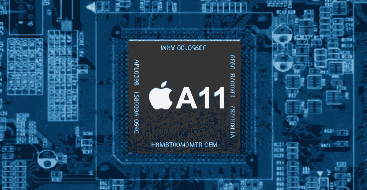

# 为什么我看好苹果

> 原文：<https://medium.com/hackernoon/why-i-am-bullish-on-apple-ce00afb21ecc>

Apple’s unique edge is to add hardware to enable new software.

就在几天前，苹果公司发布了它对未来的展望，iPhone X。包括我在内的许多人都对它的标价感到震惊，专家们再次推动了苹果公司现在已经完成的讨论。然而，对我来说，现在很明显是看好苹果的时候了。

事实上，今年春天我已经从 iPhone 换成了 Android(我现在还在用)，去探索新兴市场的世界，在一些市场，Android 占据了 99%的市场份额。

我使用安卓系统，我喜欢它。但是 Android 作为一个平台，受到自身成功的启发，遇到了一个极限。今天的 Android 制造商非常分散，他们都倾向于坚持使用现成的组件，如 GPU 和 CPU。

如今，每一款 Android 旗舰都配备了 Snapdragon 835 和 4/6/8 Gb 内存。屏幕和其他内部结构基本相同。

如果任何公司推出了一项有趣的技术，由于其自身的局限性，它自然会成为一个噱头，因为只有开发者支持它，才能发挥出全部潜力，而对于市场份额的一小部分，开发者不会感到烦恼。

任何其他技术技巧，如可挤压手机，只是简单地将相同的动作(如“开/关”或“开关”)重新组合成一种新的输入法。

相反，苹果可以做不可思议的事情。到今年年底，大约 5000 万部 iPhones 将掌握在用户手中，这种新的“仿生”芯片能够实现一系列全新的漂亮技巧——具有精确面部跟踪功能的 Snapchat 演示只是一个开始。

到 2018 年初，苹果的增强现实平台将安装在大约 5 亿台设备上，为这项技术带来开发者的资金和注意力。

> 苹果的强势来自安卓的弱势。苹果可以大规模增加硬件来实现新的软件体验。

没有其他智能手机制造商(可能除了三星，但三星没有表现出开发自己的一套新技术的兴趣)有苹果积累的广度。从定制的 AX 系列芯片开始，不仅超过了最新的高通骁龙，而且超过了桌面英特尔芯片，苹果有能力为其特殊需求创造独特的芯片组，如图形专用芯片，[安全](https://support.apple.com/en-us/HT204587)，神经网络专用芯片，等等。

新的软件将被编写，新的开发人员将加入为苹果开发，新的革命性应用程序(具有清晰的盈利路径)将被创建，因此行业将保持繁荣——帮助苹果引领重要的有用和创新的应用程序。这种转变给 Android 留下了更多遗传性的、乏味的、一刀切的应用。

*更新:* [*奥姆马利克*](https://medium.com/u/7fdfc2c95a10?source=post_page-----ce00afb21ecc--------------------------------) [*今天也写到了这个*](https://om.co/2017/09/13/18420/) *:“想象一下苹果不得不依赖高通供应其芯片——这将关系到高通提出新技术的能力”。*

叶夫根尼·切博塔列夫是拥有 1100 万摄影师的强大社区[*500 px*](https://medium.com/u/5075e6960d1?source=post_page-----ce00afb21ecc--------------------------------)*的创始人，背后有*安德森·霍洛维茨；*和目前* [*帮助其他公司解锁 10x 潜力*](http://e15v.com/) *。他通常在台湾台北工作。*

## 如果你想帮助其他人发现这样的好故事，请在读完之后鼓掌👏