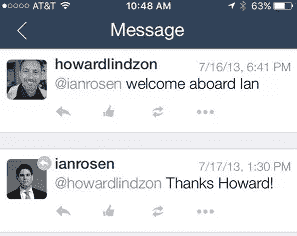
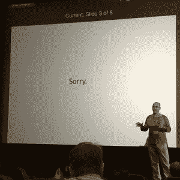

# 为什么我要加入 StockTwits

> 原文：<https://medium.com/hackernoon/why-i-am-joining-stocktwits-fadfad1e050b>

几年前，当我走进——迟到了——在科罗纳多举行的 StockTwits“stocktober fest”会议时，Howard Lindzon 停下了他在几百人面前说的话，看着我说:“嗨，Ian。”

当这一切发生时，我并不像现在这样了解霍华德。我是 MarketWatch 的新任总经理，这是一家我非常尊敬的企业，拥有非常忠诚的观众和员工，他们对彼此和品牌都充满热情。霍华德的名字具有传奇色彩，但他只是我在市场观察圈子里越来越了解的许多人之一。

不过，在那次事件中，我被他的天赋所打动，他能让一个有数百人的房间感到渺小和舒适。在第一届 Stocktoberfest 的剩余时间里，我对 StockTwits 独特的生态系统有了更多的了解，他围绕着这个活动创建了一个由交易员、金融媒体、金融科技企业家和投资者组成的生态系统。从第一次接触开始，StockTwits 团队本身总是让我想起我对 MarketWatch 团队的第一印象，这个团队变得如此成功——聪明、敏捷、不敬，对公司及其用户充满热情。这次聚会是这些社区中一些最优秀和最有趣的人的独特组合，到目前为止，我在那次活动中建立了比其他任何活动都更持久的职业和个人关系。

这是 StockTwits 品牌的承诺。从第一天开始，它似乎不太像一套产品和数据，而更像一个俱乐部，或生活方式。此后不久，我成为该公司的顾问，并会见了贾斯汀·帕特诺，他一直是并将继续作为首席运营官公司的巨大资产，是该公司持续增长和成功的关键原因。

***←霍华德欢迎我回到 2013 年的讲台。***

随着 finmedia、fintech 和 finvesting 着眼于共同的未来，它们各自的“专家”声音都在增加。所有人都在争夺注意力，声音并行，每个角度都看既困难又繁琐。

这就是 StockTwits 社区如此有趣的原因。核心平台由年轻的交易员和经验丰富的投资者组成，原始形式的流数据由机构和基金使用，活动是一群聪明有趣的初创公司、记者、风投和其他有趣的人的聚集空间。

***←菲尔·皮尔曼呈现史上最伟大的幻灯片，在***[***Stocktoberfest***](http://2016.stocktoberfest.co/)***；表白:这张 pic 是我的推特头像***

> 换言之，StockTwits 生态系统是重塑金融服务的利益相关者的天然聚集地。

虽然我最初是在金融媒体和 b2b 数据的职业生涯中深深感受到这一点的，但左转共同创立了金融科技初创公司 Even Financial，让我对如何在实践中实现颠覆性工作(很多)有了看法。

尽管我离开了 Even(与我的联合创始人 Phill 一起在一个很好的人手里),以回到更接近媒体的地方，但我从那次经历中学到的经验为我的信念奠定了更坚实的基础，即创业公司、媒体和投资者社区需要一个更好的思想分享中心——无论是在产品方面还是在个人方面，也需要一个更好的结果管理者。

这个中心是我认为斯托克城应该和将要成为的样子。它深深植根于日常活跃的市场讨论、数据和最优秀、最聪明的人的面对面聚会。在塑造金融界的人士中，有许多活跃于其轨道上的人物。但是，这些属性应该产生的清晰、统一的信息，对于那些不是每天生活在它的产品中的人来说，有时仍然很难听到。价值似乎还是太深奥了。

请继续关注，因为我们将把这个声音带给你:大众市场，超越噪音。

> [黑客中午](http://bit.ly/Hackernoon)是黑客如何开始他们的下午。我们是 [@AMI](http://bit.ly/atAMIatAMI) 家庭的一员。我们现在[接受投稿](http://bit.ly/hackernoonsubmission)并乐意[讨论广告&赞助](mailto:partners@amipublications.com)机会。
> 
> 要了解更多信息，[请阅读我们的“关于”页面](https://goo.gl/4ofytp)，[在脸书上点赞/给我们发消息](http://bit.ly/HackernoonFB)，或者简单地说， [tweet/DM @HackerNoon。](https://goo.gl/k7XYbx)
> 
> 如果你喜欢这个故事，我们推荐你阅读我们的[最新科技故事](http://bit.ly/hackernoonlatestt)和[趋势科技故事](https://hackernoon.com/trending)。直到下一次，不要把世界的现实想当然！