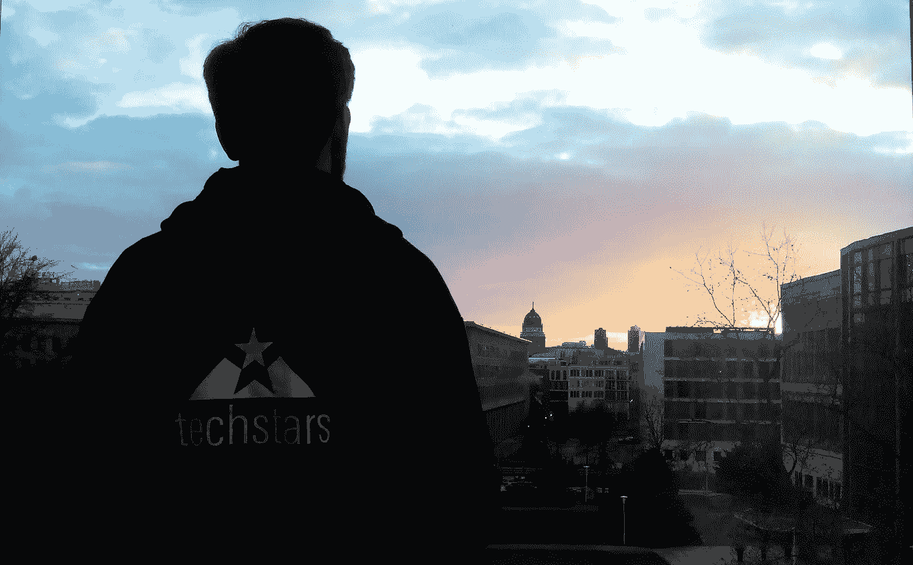

# 为什么我不难过 Techstars 结束了…

> 原文：<https://medium.com/hackernoon/why-i-am-not-sad-techstars-is-over-3a0551c2df7e>

我在柏林 2017 项目演示日的前三天写下这篇文章，我并没有想象中那么悲伤。原因如下。

**tech stars**没有前后之分。至少对我们来说不是。我不是说这个程序对我们没用。 [Techstars](http://www.techstars.com/) 在很多方面给了我们很大的帮助:数据驱动、巨大的[网络](https://hackernoon.com/tagged/network)和牵引力。但是在我们公司目前的状态下，演示日之后不会有休息。我们正在筹集资金并推出我们的新产品— [Vaultoro](https://www.vaultoro.com/) 。我知道现在不会有“前后投球”的感觉，我们仍然需要第二天起床，继续联系投资人。

**导师还在待命**。也许我不会坐在邻桌，但我知道我可以向 Rob Johnson(总经理)提问，并在几分钟内得到回复。

我不会想念我的创始人同事。至少，我不需要。我们不仅呆在办公室里度过项目结束日期，而且我们这一批人的一些公司也搬到了柏林。我们仍然可以[雇佣远程技术人才](http://www.vanhack.com/)并让我们的 [wifi 自我修复](https://cucumberwifi.io/)。更不用说我们还要去喝酒！真的吗？

还有# [FounderCon](http://events.techstars.com/foundercon-europe) 。Techstars 创始人聚会的地方。今年六月在柏林。我没有错过。

最后，就像他们在这里说的那样:**生命科技之星**。

> [黑客中午](http://bit.ly/Hackernoon)是黑客如何开始他们的下午。我们是阿美族家庭的一员。我们现在[接受投稿](http://bit.ly/hackernoonsubmission)并乐意[讨论广告&赞助](mailto:partners@amipublications.com)机会。
> 
> 如果你喜欢这个故事，我们推荐你阅读我们的[最新科技故事](http://bit.ly/hackernoonlatestt)和[趋势科技故事](https://hackernoon.com/trending)。直到下一次，不要把世界的现实想当然！

