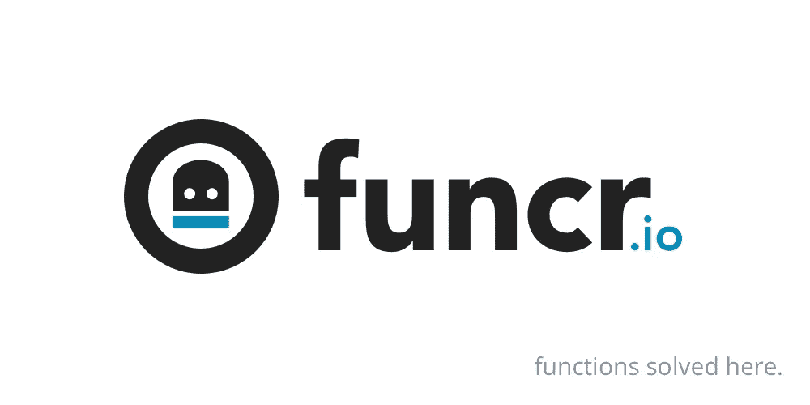

# 为什么我构建 Funcr，一个解决更难的代码问题的协作工具

> 原文：<https://medium.com/hackernoon/why-i-built-funcr-a-collaboration-tool-for-solving-harder-code-problems-21b021e653e3>

最近在 Hacker News 上发表了一些文章，试图描述在不断变化的现代环境中构建 web 应用程序的复杂性。我把它比作在暴风雨中，用腐烂的木头在海洋上建造一艘船，并且船还着火了。

所以我们同意编程是复杂的，那么程序员有什么工具可用呢？最值得注意的是堆栈溢出。

堆栈溢出(SO)真他妈的棒。几乎每一个可以想到的编程问题都有答案。Jquery 在 canvas 上遇到了鼠标事件问题？没问题，你也买了。一个快速的谷歌搜索产生的链接给人一种温暖的感觉，就像所有问题的答案都是一个鼠标点击。

SO 的力量在于它的贡献者社区。编码者帮助编码者；发展技能，扩大知识基础。尽管在处理简单问题方面做得很好。我确实相信有一个社区来处理更具挑战性和更复杂的问题。

我们去哪里解决复杂的问题？压缩任务、编码、模式识别、寻路，以及任何其他谷歌快速搜索不到的任务——这些问题不符合 SO 帖子的计划，需要的时间比慈善程序员可能提供的时间要多。

我构建 Funcr 来处理复杂的问题。Funcr 的关键是将代码组织成一个跨语言的单元，一个每个编码者都熟悉的结构——函数。函数易于定义，具有有限的信息范围，并且可以封装大量复杂的任务。

在 Funcr 上，请求者在他们的函数上贴出奖金，以激励编码者解决问题(并为所花的时间提供奖励)。如果编码者在截止日期前没有找到发布功能的解决方案，奖金将退还给请求者。难题需要激励，而慷慨就提供了这种激励。

就像这样，Funcr 上已解决的函数是公共的，并且是 SEO 优化的。任何未来遇到同样问题的编码人员都将有一个经过审查和可重复使用的解决方案，只需点击一下谷歌搜索。如果 Funcr 成功地构建了一个基于函数的社区，它将成为编程领域一笔无穷无尽的宝贵财富。

如果你是一名程序员，我希望你能帮助我建立一个基于功能的社区。让我们一起解决更难的问题。

[https://www.funcr.io/](https://www.funcr.io/)

> [黑客中午](http://bit.ly/Hackernoon)是黑客如何开始他们的下午。我们是 [@AMI](http://bit.ly/atAMIatAMI) 家庭的一员。我们现在[接受投稿](http://bit.ly/hackernoonsubmission)，并乐意[讨论广告&赞助](mailto:partners@amipublications.com)机会。
> 
> 如果你喜欢这个故事，我们推荐你阅读我们的[最新科技故事](http://bit.ly/hackernoonlatestt)和[趋势科技故事](https://hackernoon.com/trending)。直到下一次，不要把世界的现实想当然！

