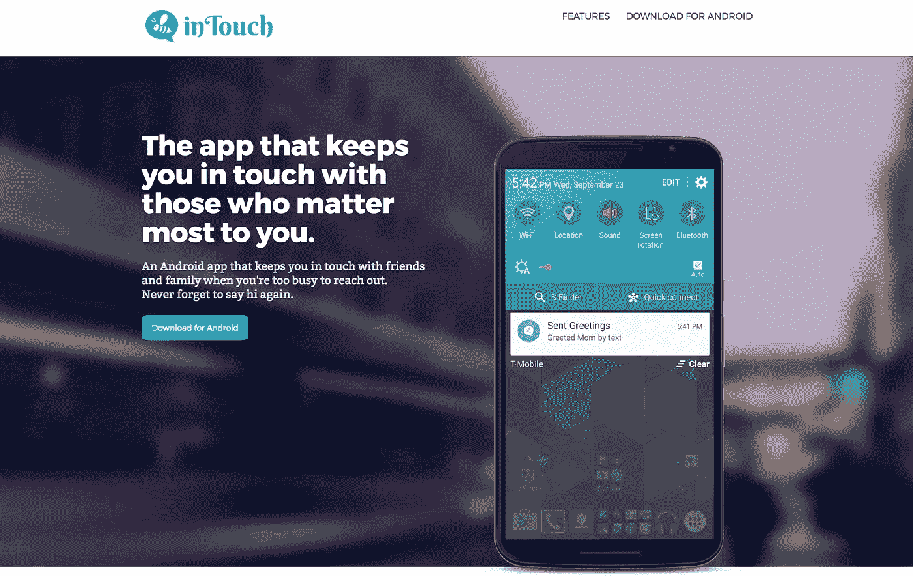
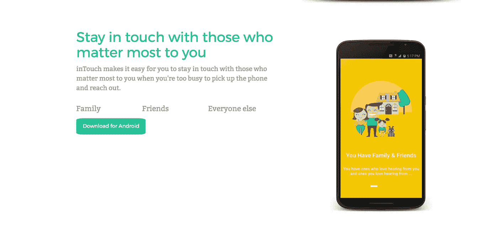
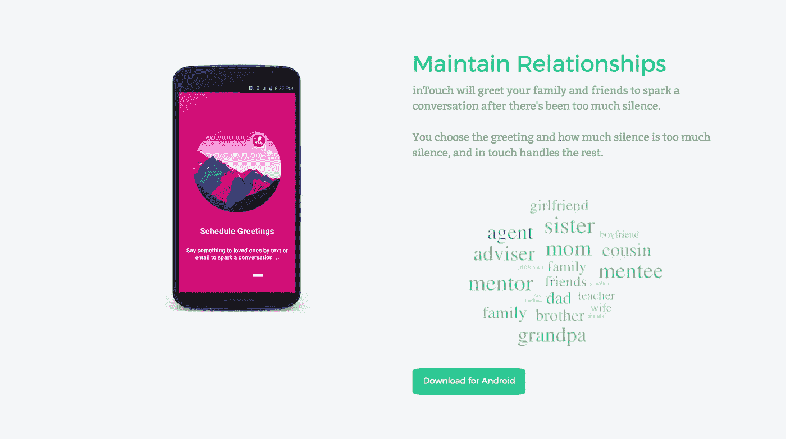
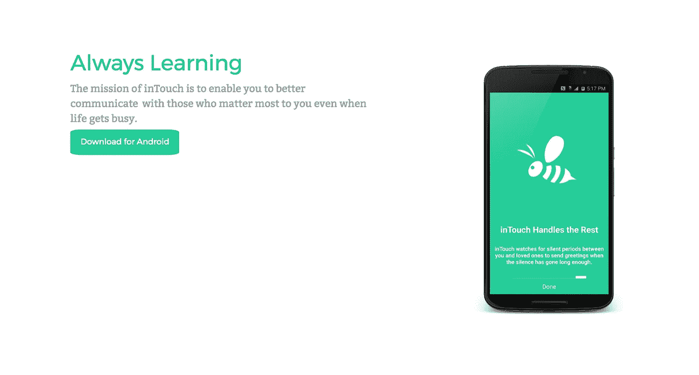

# 为什么我要开发 inTouch，为什么我要在 Flippa 上拍卖 Android 应用和商业计划

> 原文：<https://medium.com/hackernoon/why-i-built-intouch-and-why-im-auctioning-the-android-app-on-flippa-5cea2a8154a8>

inTouch 可以让您轻松做到这一点。与对你最重要的人保持联系。不幸的是，它可能在两年前就已经超前了……这就是为什么我在 Flippa 上拍卖它，而且进展很快。[下载到安卓](https://play.google.com/store/apps/details?id=com.lincolnwdaniel.intouch)上。

inTouch noticed you haven’t talked to mom in awhile, so it sent your preset greeting to her by text to spark a conversation.

# 背景故事的简短版本

## 为什么

我在大学二年级后的夏天开发了 inTouch。那时，我刚刚完成了大学里最难的必修课，老师是独一无二的 Doug Lea(Java 并发背后的工程师)，正前往 T4，这是我在 IBM 的第一次实习。我知道在学术上和职业上更艰难的日子会接踵而至，这意味着我在与朋友、家人和导师保持联系方面会变得更糟。保持联系一直是我的一个弱点，所以作为一名工程师，我决定解决这个问题，因为我已经掌握了至少开始的必要技能。

## 怎么

我每天晚上和周末都在研究 inTouch。这是一个非常难解决的问题，因为所有的变量都涉及到交流以及人们如何相互交流。我试图设计一台机器，它可以真实地代表一个人，这个人渴望足够的爱和关怀，以便与所爱的人保持联系，但却很难找到时间拿起电话或起草一封电子邮件。我把电子邮件包括在内，因为我想到了我这个有抱负的企业家的许多导师，以及网络大师们如何不断告诉我，每两个月左右给他们每个人发一封电子邮件是很重要的。我想涵盖所有的交流领域。

我用大量的数学、社会学、哲学和 Java 工程解决了这个问题。

## 发布会

到夏天结束时，我已经完成了 inTouch，并在接下来的几个月里与家人和朋友一起默默地测试它。我甚至和一些导师一起测试过。效果非常好。在 2015 年冬天，我把它发布到了 Play Store，并让它停在那里，供任何可能像我一样迫切需要它的人使用。使用它的人喜欢它。问题是我没有时间和资源来真正推广它，所以它只获得了 10-50 次下载。

## 为什么我要拍卖它？

我吸引了一位杰出的营销人员，他帮我写了商业计划(计划的一部分包括在下面)。但是，他很快就因为自己的原因逃走了。我没有时间或精力去寻找另一个合作伙伴，因为我回到了学校，与道格·李的课程的另一个艰难的工作量。

要么是 inTouch 走在了时代的前面，要么是我走在了时代的前面，但我预计，在不久的将来，它要么是每个人都喜欢并使用的工具，要么是每个人都需要但无法使用的工具，因为它不会面向大众推出。这就是为什么我要在接下来的 6 天结束时把它卖给出价最高的人。

## 加入竞标:

 [## inTouch-Flippa 上列出的 android 应用程序

### 在 Flippa marketplace 上买卖网站、域名和应用程序。

goo.gl](https://goo.gl/mNkiQ2) 

# 商业计划(截至 2015 年)

我对这项技术有很大的梦想，现在仍然如此。不幸的是，在我人生的这个阶段，我不愿意把时间花在这上面，所以我想用我的远见来装备从我这里购买它的人。如果你是买家，你这样选择遵循我的愿景，我将非常乐意为您提供进一步的建议。虽然我想启发潜在的购买者，并帮助他们想象他们可以把 inTouch 带到哪里去，但这项技术可以有很多用途，所以购买者可以把它带到他/她希望的任何地方。

以下是我在夏天完成应用程序开发时起草的商业计划的一部分。

## 问题

随着时代变得艰难，人们发现自己为了实现许多目标而更加努力，很容易与那些对他们来说最重要的人失去联系。

## 解决办法

通过使用复杂的人工智能算法，inTouch 用用户最少的努力解决了这个问题。

inTouch 了解您与谁交谈、何时交谈、多长时间一次、为什么交谈以及在什么情况下交谈。这些数据使 inTouch 能够在您很容易失去联系的时候，让您与最重要的人保持联系。

inTouch 使用人工智能来帮助您在忙得没有时间接电话或发送检查邮件时，自动与您最关心的人保持联系。

## [潜在]产品

inTouch 将在谷歌 Play 商店和 App Store 免费销售，用户可以在应用程序中购买。用户将能够购买未来的独家功能。在我们开发出我们的企业解决方案之前，这将是我们的产品。

**企业软件**

因为 inTouch 是一个人工智能应用程序，其使命是学习用户如何交流，我们将推进我们的人工智能算法，为企业服务。该解决方案将使大型企业能够更轻松地管理与客户的沟通。该解决方案将整合我们当前的移动、短消息服务(SMS)和电话通信算法以及电子邮件，为企业与客户之间的通信提供一种简化的方法。除了这个解决方案，我们还将为企业构建用于管理内部沟通的内部工具。

我们的企业工具将允许企业在内部运营，而不用担心员工之间的通信丢失，在外部也不用担心与客户失去联系。

**内容策展扩展**

inTouch 变得更加有用的地方是内容管理。由于 inTouch 将了解用户与联系人交流的时间、方式和原因，因此，随着 inTouch 的发展，它将能够了解用户及其联系人在谈论什么以及在什么上下文中谈论。inTouch 将了解用户的对话内容，以便在发送预定消息时，它可以在线获取相关的最新内容并添加到消息中。这将确保用户和他或她的联系人总是有话可谈，并且可以从他们离开的地方继续。

**网络感知工具**

这些工具将被构建为知道用户何时遇到新的人，并能够破译他们在何时何地相遇，以确保用户记得联系该人并为他们提供必要的信息。配合我们的基本算法和内容监管扩展，这些工具将有助于专业人员更高效地与他人建立联系。

## 收入模型

**企业软件**

我们的大部分收入将来自我们开发的企业软件。我们将有三(3)个企业产品:

*   内部使用的软件
*   外部使用的软件
*   内容监管扩展

**应用内购买**

虽然我们的大量用户将免费使用该应用程序，但我们希望从应用内购买中获得大量收入，尽管这是我们收入的最低形式。

## 竞争

尽管 inTouch 目前有自己的领域，但我们也有一些潜在的竞争对手。像 Hubspot 及其助手电子邮件软件和 Boomerang 电子邮件软件这样的公司都是 inTouch 的潜在竞争对手。这些公司和产品已经在他们的市场上证明了自己，并且与 inTouch 的市场非常接近，如果他们开发类似的产品或改进他们当前产品的功能，他们就能与之竞争。

从这些竞争对手那里，我们将了解到什么对像 inTouch 这样的应用程序营销有效，什么无效。我们会学习他们在邮件软件方面的不足，学习他们做得好的地方。我们还将了解适用于像我们这样的应用程序的定价和销售策略。

向一个人发送预定消息的 BroApp 也将成为 inTouch 的竞争对手。这个应用程序在媒体上获得了成功，因为它把自己标榜为关系“僚机”。然而，他们无法迭代，因此他们在谷歌 Play 商店的下载量只有 50，000 次，并且由于限制而评级很低。我们注意到他们在执行中的缺点和他们在媒体上的成功。

inTouch 的其他鲜为人知的竞争对手是 SMS 日程安排应用程序。在过去几年中，这一类别中的顶级应用程序总共获得了超过一百万次的下载。

通过保持人工智能和可用性的竞争优势以及最佳的用户体验，inTouch 将能够在竞争中保持领先地位。随着 inTouch 的发展，我们将增加更多的功能，这将进一步把我们与竞争对手区分开来。

虽然 iOS 上有像 Claralabs.com 和邦德这样的产品会提醒你完成任务，但 inTouch 是唯一一个通过帮助用户完成任务来确保用户完成目标的应用程序。

目前还没有其他人工智能 Android 或 iOS 应用程序能够让人们保持联系并鼓励更好的交流，所以 in touch 将是第一个上市的。

# 结论

如果你知道谁可能感兴趣，[他们可以加入竞标](https://goo.gl/mNkiQ2)，在起草本文的几个小时后，价格为 100 美元以上:

 [## inTouch-Flippa 上列出的 android 应用程序

### 在 Flippa marketplace 上买卖网站、域名和应用程序。

goo.gl](https://goo.gl/mNkiQ2) 

> [黑客中午](http://bit.ly/Hackernoon)是黑客如何开始他们的下午。我们是 [@AMI](http://bit.ly/atAMIatAMI) 家庭的一员。我们现在[接受投稿](http://bit.ly/hackernoonsubmission)并乐意[讨论广告&赞助](mailto:partners@amipublications.com)机会。
> 
> 如果你喜欢这个故事，我们推荐你阅读我们的[最新科技故事](http://bit.ly/hackernoonlatestt)和[趋势科技故事](https://hackernoon.com/trending)。直到下一次，不要把世界的现实想当然！

