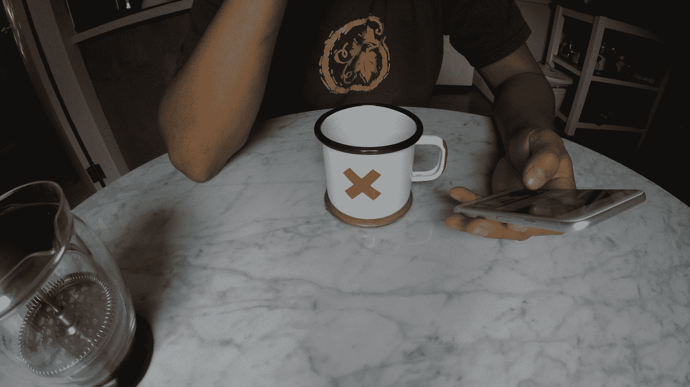
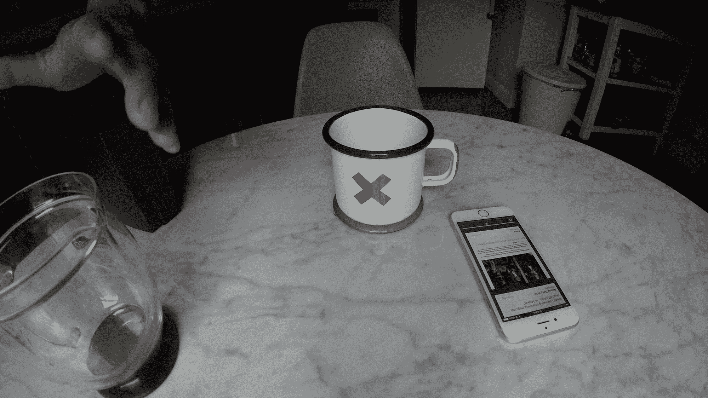
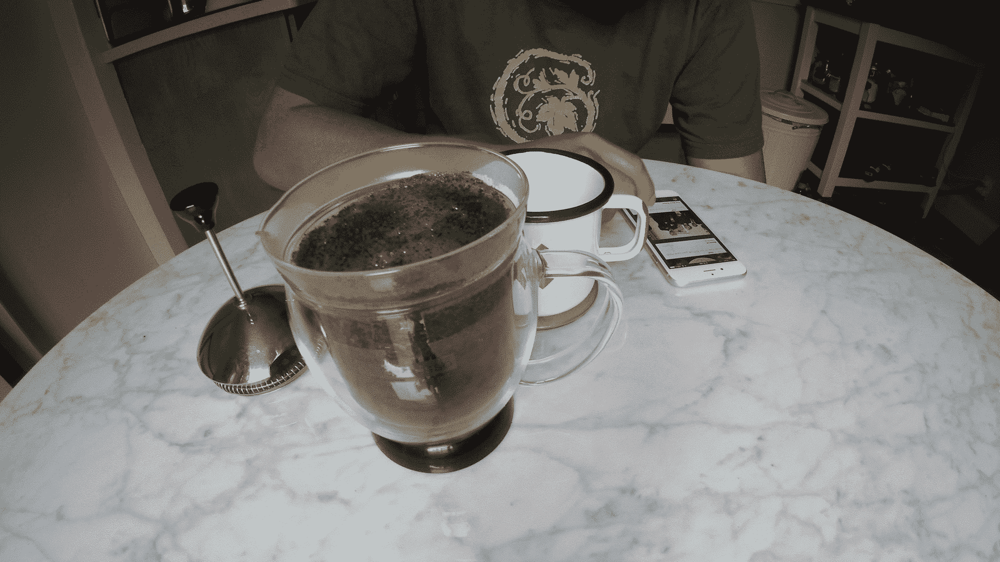
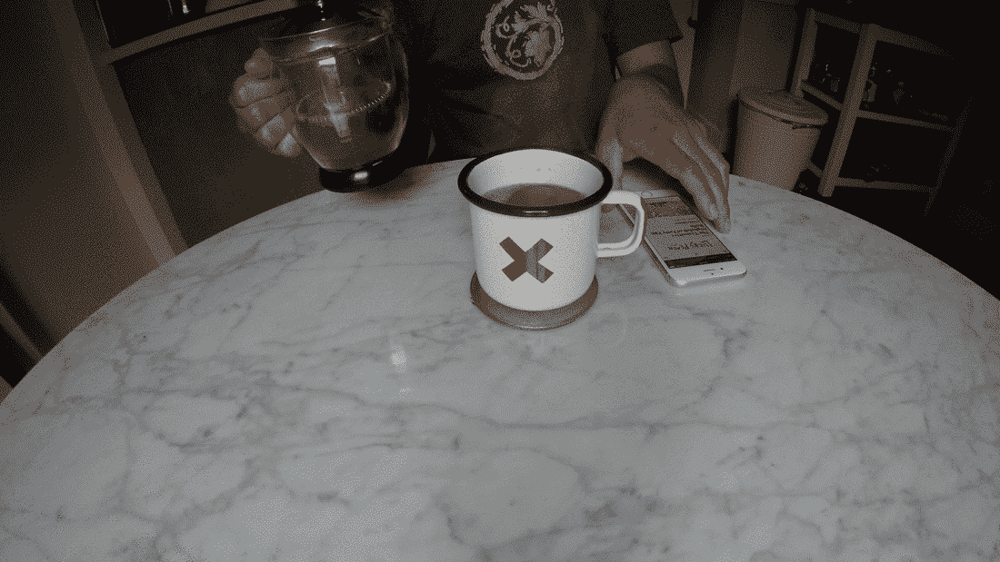

# 为什么我要开发点心(iOS 应用)…以及为什么我要转向聊天

> 原文：<https://medium.com/hackernoon/why-i-built-snack-ios-app-and-a-update-about-why-i-ve-pivoted-into-chat-66f776ee6a14>

**更新(2016 年 3 月):** *我在推出零食 app* *之前的一个多月——可能是 12 月——*[*的时候写的这个。我从来没有发表过这个故事，但重读它，它仍然引起共鸣，并在描述我喜欢建造的关键租户中得到暗示。*](https://www.producthunt.com/tech/snack-2)

*为了在聊天平台上进行实验，我们已经改变了零食的定位。我对下一个社交网络很感兴趣，从问一个简单的问题开始:如果有一种方法可以每天围绕一个话题与人联系 10-15 分钟，会怎么样？这种体验会是什么感觉？这会让我成为一个更有知识的人——一个正派的人，就像我描述的关于阅读的那样吗？*

*不知道。*

*但是如果你想参与或者跟随旅程，可以在*[*http://snackapp.co*](http://snackapp.co)报名

Me reading stories in Snack, waiting for coffee.

**现在是凌晨 5 点 45 分**。我坐在餐桌旁，等着水烧开。我可以是任何一个厨房，等着水烧开:布鲁克林的威廉斯堡；国会山，西雅图；或者蒙大拿州的大天空。但今天早上，我在这座城市里，雾是一个名人——它在 Instagram 上有 191，000 名粉丝，在 Twitter 上有 97，000 名粉丝，还有一个名字。卡尔从厨房的窗户进来。

感觉很脆。

挺好的。

三分钟后，水将会完全沸腾，可以倒在咖啡粉上。

咖啡是我开始一天的方式。接着是阵雨。然后骑自行车穿过城市。然后工作。但是在这些活动之间(有时是期间),我在手机上完成最重要的任务，为一天做好准备。我在看书。阅读通知。阅读来自家人和朋友的信息。阅读同事和出版商的邮件。

都说[真正成功的人都有早上的套路](http://www.amazon.com/Successful-People-Before-Breakfast-Mornings-ebook/dp/B007K3E2YK)。但是普通人(比如你和我)仍然会在一天中做出成千上万个计划不足的决定。工作。家庭。朋友。用什么技术？哪个设计比较好？午餐吃什么？接下来和家人去哪里旅游？所有这些决定都将基于你所学到的和你所知道的——通常是某种形式的媒体、通知或口头传播的结果。这就是保持邮件联系的时候了，即使是那些看起来不太重要的邮件，塞在你的促销标签里。

当你思考它的时候——真正思考每天早上阅读的重要性——它可以由几个想法提炼出来:与朋友保持联系；了解新闻；被某事所娱乐；去学习。我认为，后者对我开始新的一天很重要。

水壶在鸣响。

I love making coffee.

The original Philz’s 1 cup at a time ;)

今天我学会了[空白，废话，什么的]。它会影响或极大地影响我的一天吗？不。但是消息灵通一点感觉好吗？是的。

对我来说，我每天早上在喝咖啡、洗澡和骑自行车之间阅读，因为我每天醒来都想(或至少试图)成为一个更有知识的人——一个体面的人。

不需要太多时间。

— — —

## 我最喜欢的一些出版商:

## [严格 VC](http://www.strictlyvc.com/signup)

如果你身处科技初创企业的世界，想要“了解一切”，但又不喜欢铺天盖地的实时信息，那么我推荐你在早上阅读这份出版商的文章。

## [美食 52](http://food52.com)

每天都要吃饭，幸好我爱做饭。我是一个视觉厨师，有时我需要一点[的灵感](http://food52.com/recipes/9110-radish-and-pecan-grain-salad)来为晚餐做些新的东西。

## [长格式](http://longform.org)

当我有多一点时间的时候，我喜欢沉浸在一篇长文或文章中。Longform 在寻找互联网最佳方面做得很好。它可以是任何事情，从极限运动员的悲惨爱情故事到一个古老的发生在湖边小镇的谋杀案。

## [theSkimm](http://www.theskimm.com)

这家受欢迎的日报出版商总结了关于新闻、技术和时事的有趣文章。它帮助我掌控那些我甚至不知道我应该掌控的事情。

## [价格经济学](http://priceonomics.com)

这个出版商捕捉了关于奇怪事物的数据驱动的故事，如自行车失窃的经济或旧金山房租暴涨的原因。

喜欢时事通讯，但讨厌它们在你的收件箱中丢失？ [*零食*](http://snackapp.co/#/) *(iOS)帮你整理你的时事通讯&每日交易，帮助你不堪重负的收件箱。*

**下载零食(免费)*:****[https://bnc.lt/snack-medium](https://bnc.lt/snack-medium)*

*非常感谢[杰西·贝克](/@beatnomad)和[凯拉·恩斯特-阿普勒](/@kygwen)编辑最初的故事。*

***更新(2016 年 3 月):** *我在推出零食 app* *之前的一个多月——可能是 12 月——*[*的时候写的这个。我从来没有发表过这个故事，但重读它，它仍然引起共鸣，并在描述我喜欢建造的关键租户中得到暗示。*](https://www.producthunt.com/tech/snack-2)*

*为了在聊天平台上进行试验，我们已经改变了快餐的定位。我对下一个社交网络很感兴趣，从问一个简单的问题开始:如果有一种方法可以每天围绕一个话题与人联系 10-15 分钟，会怎么样？这种体验会是什么感觉？这会让我成为一个更有知识的人——一个正派的人，就像我描述的关于阅读的那样吗？*

*我不知道。*

**但是如果你想参与或者跟随旅程，可以在*[*http://snackapp.co*](http://snackapp.co)报名*

******

> *[黑客中午](http://bit.ly/Hackernoon)是黑客如何开始他们的下午。我们是 [@AMI](http://bit.ly/atAMIatAMI) 家庭的一员。我们现在[接受投稿](http://bit.ly/hackernoonsubmission)并乐意[讨论广告&赞助](mailto:partners@amipublications.com)机会。*
> 
> *如果你喜欢这个故事，我们推荐你阅读我们的[最新科技故事](http://bit.ly/hackernoonlatestt)和[趋势科技故事](https://hackernoon.com/trending)。直到下一次，不要把世界的现实想当然！*

**