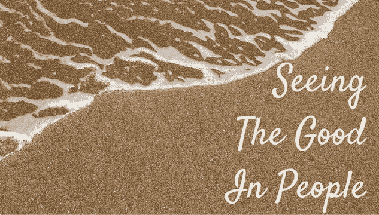

# 为什么我选择看到别人最好的一面

> 原文：<https://medium.com/hackernoon/why-i-chose-to-see-the-best-in-others-b27b901746c1>

Image via [justanotherfamily](http://justanotherfamily.com/opinions/seeing-the-good-in-people/)

因为我相信在内心深处我们是善良的，但并不完美。

因为我知道犯错误的[是](https://hackernoon.com/tagged/committing)[的人](https://hackernoon.com/tagged/human)，我们都应该得到另一次机会。

因为我所遵循的圣经教导我们要无止境地原谅彼此。

因为我逐渐了解到，我们中的许多人在过去都受过伤，他们带着伤疤。评判太不公平了。

因为刻板印象是人们犯的最严重的错误之一，因为我明白了每个人都是独一无二的，是由他的价值观而不是背景来定义的。

毕竟，这是我希望别人为我做的

> [黑客中午](http://bit.ly/Hackernoon)是黑客如何开始他们的下午。我们是阿妹家庭的一员。我们现在[接受投稿](http://bit.ly/hackernoonsubmission)并乐意[讨论广告&赞助](mailto:partners@amipublications.com)机会。
> 
> 如果你喜欢这个故事，我们推荐你阅读我们的[最新科技故事](http://bit.ly/hackernoonlatestt)和[趋势科技故事](https://hackernoon.com/trending)。直到下一次，不要把世界的现实想当然！

