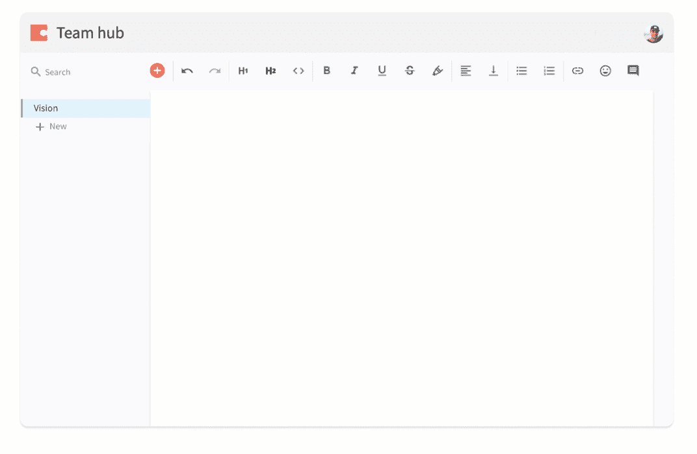
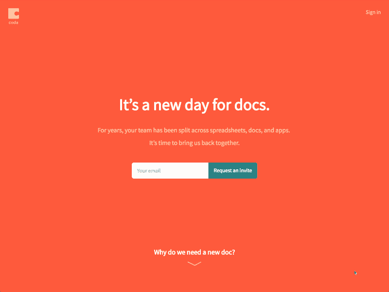
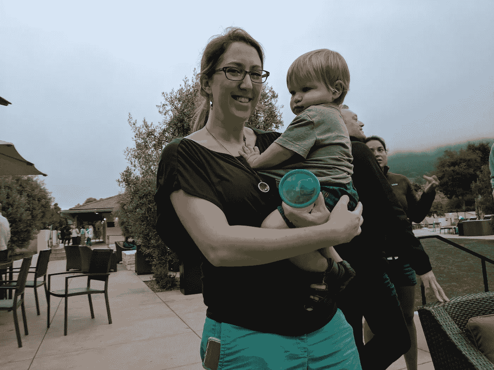
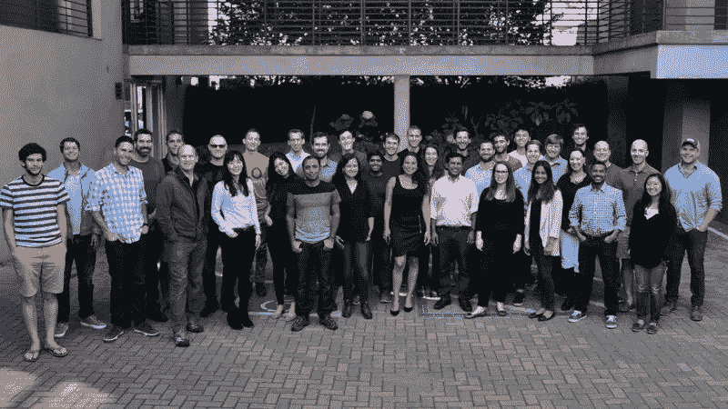

# 为什么我选择在 Coda(一家初创公司)而不是大公司工作

> 原文：<https://medium.com/hackernoon/why-i-chose-to-work-at-coda-a-startup-over-a-big-company-e948d3353aa7>

去年我写道，我要搬到硅谷去做一些新的疯狂的事情。既然我们已经脱离了秘密行动，我很兴奋终于可以谈论我正在做的工作了。

One of the many GIFs I worked on attempting to capture what Coda does

# 乐章结尾部

Coda 是一种新的文档。这个名字的字面意思是“一个医生”。转折？这些文档可以变得和应用程序一样强大，不需要 cs 学位。我认为 Coda 将会造就 T2 新一代的制片商，我非常兴奋。

关于愿景和产品有很多要说的，但我们的创始人 Shishir 写了一篇很棒的[帖子](https://blog.coda.io/its-a-new-day-for-docs-2643fb16f05a)，我在[这个登录页面](https://goo.gl/BMZejj)上花了几个星期真的很有趣，所以我会向你推荐那些。

当我决定关闭 Tapity 并搬到硅谷时，我想象着在脸书或 Square 这样的大公司工作。我已经在一家[初创企业](https://hackernoon.com/tagged/startup)(我自己的)工作了 8 年，并准备好接受新事物。在我最终选择现场采访的五家公司中，只有一家是初创公司——Coda。当我和 Shishir 谈及那个幻象时，我无法忘记它。当我亲自见到团队时，我完全被说服了。差不多一年后，我认为选择 Coda 是我职业生涯中最好的决定之一。

很多人在创业或在大公司工作时都很难承担风险。这对双方都有好处。以我的经验来看，Coda 在大多数对我来说重要的方面展现了两个世界最好的一面。我想与那些不仅对 Coda 产品，而且对 Coda 公司感兴趣的人分享我的经历。

找工作的时候，人们追求的东西不一样。因此，我不会只是抽象地说为 Coda 工作很棒，我会直接引用我一年前找工作时写的“梦想工作”清单。

# 在我梦想的工作中，我可以…

> **产生重大影响** —我想对整个团队和公司产生重大影响。我也想对这个世界产生积极的影响，这是我在 Tapity 做不到的。

Coda 是我工作过的最鼓舞人心、最雄心勃勃的想法，所以如果它成功了，对世界的影响是巨大的。基于对我们测试版的热烈反应，我更加相信这是人们需要和想要的东西，潜在市场缺乏自然边界。将近 40 个人，Coda 仍然非常小，所以我不是一个大机器中的一个齿轮——每一个贡献都很重要。当谈到我的贡献如何转化为对世界的潜在影响时，没有任何其他机会可以与之相比。

I had so much fun designing and coding our [landing page](https://goo.gl/BMZejj)

> 锻炼我多样的技能组合——我不喜欢被放进一个盒子里。给我一些自由，用代码来原型化我的一些设计想法，甚至偶尔为产品做点贡献。

多面手在 Coda 茁壮成长。我主要是一名设计师，但迄今为止，我也有机会将代码推向生产，设计和编写我们的登录页面，原型雄心勃勃的想法，并为重要的营销、品牌和信息讨论做出贡献。我是那种只做一件事就会感到无聊的人，到目前为止，这种事在 Coda 从未发生过。我从来没有觉得我不能进入我有相关技能的领域，我经常自然而然地进入这些领域。

我们所有的角色都是如此。我们有一位作家，他领导了我们的品牌推广工作，并为大量重要的设计决策做出了贡献。开发人员定期贡献产品创意。产品经理在紧要关头模仿设计。这绝对是一个“成长心态”的环境。人类有着惊人的学习新事物的能力，所以当你试图把人们束缚在固定的角色中时，你会失去很多。

> **要有企业家精神**——如果我有一个好主意，我会有一定的灵活性去追求它，并召集一群乐于和我一起追求它的人。

很多公司会用“我们有黑客马拉松”来回应这一点黑客马拉松很棒(我们一些最酷的功能就是这样开始的)，但它们转瞬即逝。更重要的是，对于一个人——任何人——来说，有一个真正好的想法，能够传播这个想法，获得建设性的反馈，并与正确的人合作来实现这个想法有多容易。

我会给 Coda 一个 B+。我绝对觉得，如果我有一个好想法，就会有一种方法去探索它，并使它成为现实(我已经有许多这样的想法成为产品的一部分)。我不给我们 A 的唯一原因是 Codans 通常有很强的观点，你必须思考并非常强烈地捍卫这些观点。这在很多情况下是好的，但我认为我们可以改善我们的反馈文化，根据想法的阶段提供适当的反馈——早期的想法是脆弱的，有时我们应该在关注弱点之前寻找金块。然而，我真正喜欢我们文化的一点是，我们非常内省，并积极地在这方面努力。

> 分享——如果能分享我学到的东西，并通过博客和演讲帮助推广我的项目，那就太好了。

直到今天我才能够分享，但在接下来的几周和几个月里，我对自己有更多的期待！

> **向业内最优秀的人学习**——不仅在技能上，而且在品格上。

我觉得这个部门能和 Coda 匹敌的公司很少。在团队方面，我们非常重视招聘，所以这里的人都是精英中的精英。我不断向我的同龄人学习。

We had a bell rigged up to chime every time someone signed up on launch day. Perfect example of the ingenuity of our team.

在性格方面，尽管每个人都大材小用，但没有人是混蛋。我总是惊讶于这里每个人的平易近人、谦逊和乐于助人。我们的首席执行官 Shishir 就是一个很好的例子。他在 YouTube 上管理产品、UX 和工程，取得了许多其他显著的成就，但我从未见过他出于自我而行动、决定或说话。我和他在很多项目上密切合作，我总是能学到新的东西，但同时也为我带来的东西感到受尊重。

除了直属团队，我还被我们接触到行业巨头的方式所震惊。开始几个星期后，我被要求在我们的董事会会议上介绍我的一些工作(我们的董事会会议总是让团队介绍他们的工作)。我当然答应了，但很快我意识到这意味着我将从雷德·霍夫曼和约翰·莉莉这样的人那里得到反馈——太疯狂了！Shishir 是我所知道的联系最紧密的人之一，所以我们会经常有像 Phil Libin 和 Dylan Field 这样的访客来提供一些知识，或者在我们身后提供反馈，好像这没什么大不了的。这不仅非常酷，而且这些人的建议改变了我对很多事情的看法，让我变得更好。我在这里学到了前所未有的东西。

> **拥有合理、灵活的工作时间**——长时间工作对我来说应该只是个例外，而不是常态。

这是那种在你在一个地方工作一段时间之前很难读懂的东西。有公司政策，可能说的是一回事，有公司文化，可能压的是完全不同的行为。我个人的哲学是，如果你有工作之外的生活，你会工作得更好。如果我没有时间和家人在一起，我的工作就会受到影响。

Mindy and Josiah having a great time at a company retreat in Carmel

我很高兴地告诉大家，Coda 对家庭非常友好。我承认，在发布前的几周里，我工作了很长时间，但这种情况对我来说非常罕见，而且完全是自愿的。我不会因为工作而错过和家人一起吃饭。周末是留给家人的，我从来没有任何压力去改变这一点。人们的工作基于对他们的情况有意义的东西，但是为了了解我们的一般文化，我提供了松弛测试。在正常时间，我们的空闲频道以惊人的速度嗡嗡作响。这说明了很多，在周末，他们往往完全安静。

我也发现“无限休假”政策不仅仅是一个噱头。人们不会滥用它，但我们肯定会使用它，这意味着当我需要时，我不会因为休假而感到难过。

一句话:以我的经验来看，Coda 提供了大公司的稳定性、家庭友好性和学习机会，但同时也提供了创业精神和个人影响力。老实说，我过得很开心，并且正在做我一生中最好的工作。

> 如果你有任何问题或有兴趣加入我们，请随时给我发一封[电子邮件](mailto:jerols@coda.io)或发一封短信到 [jobs@coda.io](mailto:jobs@coda.io)